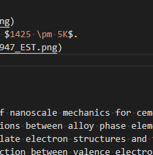

<!-- %%%%%%%% Document Metadata %%%%%%%% -->
# ${1:$TM_FILENAME_BASE}

Date Created: ${CURRENT_YEAR_SHORT}${CURRENT_MONTH_SHORT}${CURRENT_DATE_SHORT}

- [${1:$TM_FILENAME_BASE}](#1tm_filename_base)
  - [Abstract](#abstract)
  - [Conclusion](#conclusion)
  - [Figures](#figures)
  - [Notes](#notes)
    - [Source Subtitle](#source-subtitle)
<!-- %%%%%%%%%%%%%%%%%%%%%%%%%%%%%% -->

<!-- START WRITING BELOW -->

<!-- %%%%%%%%%%%%%%%%%%%%%%%%%%%%%% -->
*Reading: ${CURRENT_MONTH_NAME} ${CURRENT_DATE}, ${CURRENT_YEAR}*
## Abstract

## Conclusion
*insert text here$\dots$*

Sources of Note:
- *insert text here$\dots$*

## Figures
|  |
|:--:|
| Figure X: (x) *insert caption here$\dots$* #fig-example_fig |

## Notes
*insert text here$\dots$*
### Source Subtitle
*insert text here$\dots$*
<!-- %%%%%%%%%%%%%%%%%%%%%%%%%%%%%% -->

<!-- %%%%%%%% End Document %%%%%%%% -->