<!-- output:
  pdf_document:
    latex_engine: xelatex
    includes:
      in_header: "C:/Users/jmanthony1/Documents/GitHub/JobyAnthonyIII/LaTeX/preamble.tex"
bibliography: "biblio.bib"
link-citations: true -->

<!-- %%%%%%%% Document Metadata %%%%%%%% -->
# ENGR 704-001: Partial Differential Equations

- [ENGR 704-001: Partial Differential Equations](#engr-704-001-partial-differential-equations)
	- [Chapter 5: Initial-Value Problems for Ordinary Differential Equations](#chapter-5-initial-value-problems-for-ordinary-differential-equations)
		- [Euler Method](#euler-method)
		- [Taylor Method](#taylor-method)
		- [Runge-Kutta Method](#runge-kutta-method)
			- [RK2](#rk2)
			- [RK4](#rk4)
		- [Implicit Methods](#implicit-methods)
			- [Backward Euler](#backward-euler)
			- [Trapezoidal Method](#trapezoidal-method)
			- [Multistep Methods](#multistep-methods)
			- [Predictor-Corrector Methods](#predictor-corrector-methods)
			- [Stiff Differential Equations](#stiff-differential-equations)
				- [Summary](#summary)
	- [Boundary Value Problems in ODE](#boundary-value-problems-in-ode)
		- [Shooting Method](#shooting-method)
			- [Linear Shooting Method](#linear-shooting-method)
		- [Finite Difference Method](#finite-difference-method)
		- [FEM](#fem)
			- [Formulation of FEM](#formulation-of-fem)
	- [Partial Differential Equations](#partial-differential-equations)
		- [Physical Classifications](#physical-classifications)
			- [Equilibrium](#equilibrium)
			- [Eigenvalue](#eigenvalue)
			- [Marching](#marching)
		- [Mathematical Classifications](#mathematical-classifications)
			- [Hyperbolic PDE](#hyperbolic-pde)
			- [Parabolic PDE](#parabolic-pde)
			- [Elliptic PDE](#elliptic-pde)
		- [Well-Posed Problem](#well-posed-problem)
		- [Properties of Numerical Methods for PDE](#properties-of-numerical-methods-for-pde)
			- [Finite Difference Discretization Method](#finite-difference-discretization-method)
			- [Errors](#errors)
				- [Truncation Error (TE)](#truncation-error-te)
				- [ROE and Discretization Error](#roe-and-discretization-error)
		- [Consistency](#consistency)
		- [Stability](#stability)
		- [Convergence for Marching Problems](#convergence-for-marching-problems)
		- [Stability Analysis](#stability-analysis)
			- [von Neumann](#von-neumann)
			- [Boundedness](#boundedness)
			- [Equilibrium Problems](#equilibrium-problems)
			- [Conservation](#conservation)
		- [Application of Numerical Methods on Hyperbolic PDE](#application-of-numerical-methods-on-hyperbolic-pde)
			- [Euler Explicit](#euler-explicit)
			- [Upstream Method](#upstream-method)
				- [Exact Amplitude and Phase](#exact-amplitude-and-phase)
				- [Relative Phase Error](#relative-phase-error)
				- [Amplification Factor](#amplification-factor)
			- [Lax Method](#lax-method)
			- [Leap Frog Method](#leap-frog-method)
			- [Lax-Wendroff Method](#lax-wendroff-method)
			- [Comparing All Methods](#comparing-all-methods)
		- [Application of Numerical Methods on Parabolic PDE](#application-of-numerical-methods-on-parabolic-pde)
			- [Simple Explicit](#simple-explicit)
			- [Simple Implicit](#simple-implicit)
				- [Polar Plots for Relative Phase Error](#polar-plots-for-relative-phase-error)
				- [Crank-Nicholson Method](#crank-nicholson-method)
				- [Methods for 2D Heat Equation](#methods-for-2d-heat-equation)
			- [Elliptic PDE and Iterative Solvers](#elliptic-pde-and-iterative-solvers)
				- [Laplace Equation](#laplace-equation)
				- [Finite Difference Approximations](#finite-difference-approximations)
				- [Iterative Techniques](#iterative-techniques)
					- [Multigrid Method](#multigrid-method)
<!-- %%%%%%%%%%%%%%%%%%%%%%%%%%%%%% -->

<!-- START WRITING BELOW -->

<!-- %%%%%%%%%%%%%%%%%%%%%%%%%%%%%% -->
*Lecture: September 24, 2021*
## Chapter 5: Initial-Value Problems for Ordinary Differential Equations

### Euler Method
Solving [[Euler-Method]] in forward (using previous iteration to solve next iteration) gives lower accuracy in quicker time than solving backward (using future information to solve the future iteration), which gives great accuracy in much time.

$$\begin{equation}
\begin{split}
\frac{du}{dt} &= f'(t, u), u(t_{0}) = u_{0}, h = t_{k+1} - t_{k} \\\\
u_{k+1} &= u_{k} + hf'(t_{k}, u_{k})
\end{split}
\label{eq:forward_euler}
\end{equation}$$

| 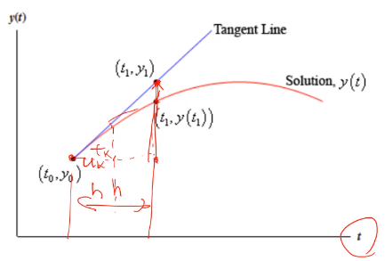 |
|:--:|
| The accuracy for curved functions can be improved with smaller $h$. $\tag{1} \label{fig:euler_method_graph_example}$ |

!!! example
	| 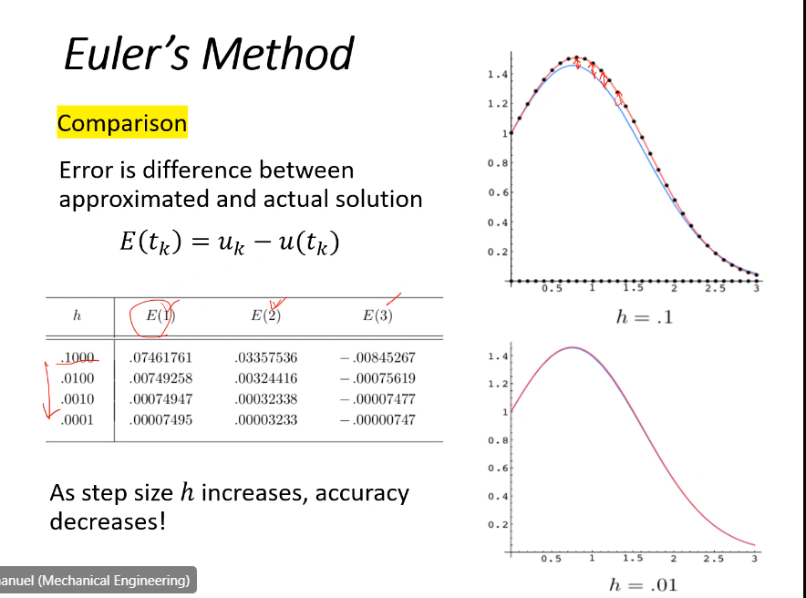 |
	|:--:|
	| First order error proportional to step size. $\tag{2} \label{fig:euler_method_example_error}$ |

### Taylor Method
[[Euler-Method]] is simple and easy to implement, but is only first-order.
Higher-orders give better accuracy; however, [[Euler-Method]] is only a first-order [[Taylor-approximation]] to solution.

$$\begin{split}
u(t_{k+1}) &= u(t_{k} + h) \\\\
 &= u(t_{k}) + h\frac{du}{dt}(t_{k}) + \frac{h^{2}}{2}\frac{d^{2}u}{dt^{2}}(t_{k}) + \frac{h^{3}}{6}\frac{d^{3}u}{dt^{3}}(t_{k}) + \dots
\end{split}$$

The last two terms are the [[truncation-error]].
Defining $\frac{du}{dt} = f'(u, t)$, the second derivative term found by differentiating wrt $t$.
$$\begin{split}\frac{d^{2}u}{dt^{2}} = \frac{d}{dt}\frac{du}{dt} = \frac{d}{dt}f'(t, u) &= \frac{\partial f'}{\partial t}(t, u) + \frac{\partial f'}{\partial t}(t, u)\frac{\partial u}{\partial t} \\\\ &= \frac{\partial f'}{\partial t}(t, u)\end{split}$$

*[wrt]: with respect to

!!! example
	Solve the #IVP $\frac{du}{dt} = (1 - \frac{4}{3}t)u, u(0) = 1$ using [[Taylor-Method]] and compare to exact solution.

*[IVP]: Initial Value Problem

**Drawbacks** [[Taylor-Method]] requires solving complex, partial derivatives.
Furthermore, the differential equation must be smooth and continuous.
Solving the partial derivatives and multiplications requires much computational power, which introduces much [[round-off-error]].

### Runge-Kutta Method
Higher-order local truncation error of [[Taylor-Method]] eliminates the need to compute derivatives.
[[Runge-Kutta-Method]] (#RKM) is also the most popular and powerful *explicit* method to integrate #ODE.

*[RKM]: Runge-Kutta Method
*[ODE]: Ordinary Differential Equations

$$\begin{equation}
u_{k+1} = u_{k} + h\sum_{i=1}^{m}c_{i}f'(t_{i, k}, u_{i, k}), f'(t, u) = \frac{du}{dt}
\label{eq:runge_kutta_method}
\end{equation}$$

Flexibility in designing the method and choosing the coefficients, and order is limited to power of h.
The selection of $0 \leq \lambda \leq 1$, choosing $\lambda = 1$, which is [[Euler-Method]], uses information at the next time step to solve the half-steps from the current step.

---

*Lecture: September 24, 2021*
#### RK2
Two Methods for [[RK2]]
1. Improved [[Euler-Method]]: $a = b = \frac{1}{2},~\lambda = 1$
2. Midpoint Method: $a = 0,~b = 1,~\lambda = \frac{1}{2}$

General form for [[RK2]]: 
$$\begin{equation}
\begin{split}
u_{k+1} &= u_{k} &+ h[af'(t_{k}, u_{k}) + bf'(t_{k,2}, u_{k,2})] \\\\
&= u_{k} &+ h[af'(t_{k}, u_{k}) + \\\\
& & bf'(t_{k} + \lambda h, u_{k} + \lambda hf'(t_{k}, u_{k}))]
\end{split}
\label{eq:rk2}
\end{equation}$$

#### RK4
$$\begin{equation}
\begin{split}
k_{1} &= hf'(t_{k}, u_{k}) \\\\
k_{2} &= hf'(t_{k} + \frac{h}{2}, u_{k} + \frac{k_{1}}{2}) \\\\
k_{3} &= hf'(t_{k} + \frac{h}{2}, u_{k} + \frac{k_{2}}{2}) \\\\
k_{4} &= hf'(t_{k} + h, u_{k} + k_{3}) \\\\
u_{k+1} &= u_{k} + \frac{1}{6}(k_{1} + 2k_{2} + 2k_{3} + k_{4})
\end{split}
\label{eq:rk4}
\end{equation}$$

| 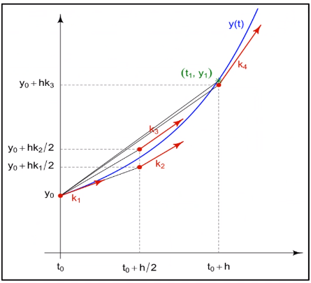 |
|:--:|
| The $\frac{1}{6}$ term for averaging out $k^{th}$ points in [[RK4]]. $\tag{3} \label{fig:rk4_graphical_example}$ |

!!! question What are the units of $k$?
	Same units as $u$, because $f`$ is only wrt to time.

!!! example If $\dot{u} = u - t^{2} + 1$, where $u(0) = 0.5$ and $h = 0.2$.
	$$\begin{split}
	k_{1} &= hf'(t_{k}, u_{k}) = 0.2f'(0, 0.5) \\\\
	&= 0.2(1.5) = 0.3 \\\\
	k_{2} &= hf'(t_{k} + \frac{h}{2}, u_{k} + \frac{k_{1}}{2}) = 0.2f'(0.1, 0.65) \\\\
	&= 0.328 \\\\
	k_{3} &= hf'(t_{k} + \frac{h}{2}, u_{k} + \frac{k_{2}}{2}) = 0.2f'(0.1, 0.664) \\\\
	&= 0.3308 \\\\
	k_{4} &= hf'(t_{k} + h, u_{k} + k_{3}) = 0.2f'(0.1, 0.8308) \\\\
	&= 0.35816 \\\\
	u_{k+1} &= u_{k} + \frac{1}{6}(k_{1} + 2k_{2} + 2k_{3} + k_{4}) \\\\
	&= 0.5 + \frac{1}{6}[0.3 + 2(0.328) + 2(0.3308) + 0.35816] \\\\
	&= 0.8292933
	\end{split}$$
	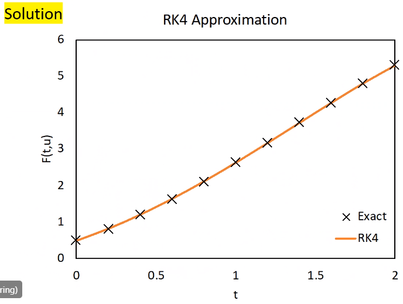
	bar $\tag{4} \label{fig:rk4_example_solution}$
	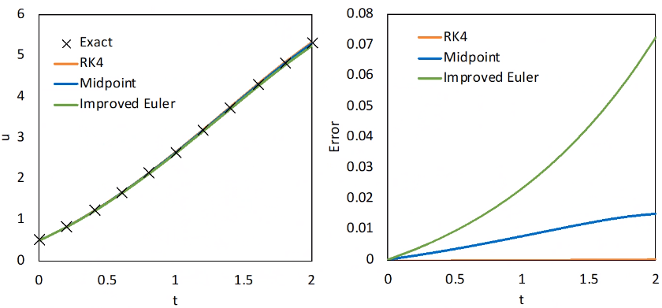
	bar $\tag{5} \label{fig:rk4_example_solution_error_comparison}$

### Implicit Methods
#### Backward Euler
Explicit methods are well suited to handle large class of #ODE.
However, these methods perform poorly for class of "stiff" equations that occur frequently in real problems: e.g. exponential functions in vibrational motion.
If there is a large difference between the most rapid and slowest changes in solution components, then the system is a [[stiff-equation]].
If [[RK4]] requires small time step for sufficient accuracy, then that problem is likely involved with a [[stiff-equation]].
Implicit methods are generally suited to a [[stiff-equation]] since they are conditionally "stable": i.e. required limitation on time stepping; otherwise, solution will diverge and crash.

> Multiple choice: Euler-method is first order O(h2). Forward and backward formulations are both first order. Backward has more error than forward, but more stable.

| 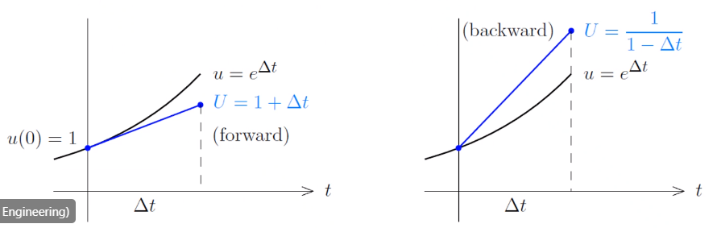 |
|:--:|
| $u_{k+1} = u_{k} + hf'(t_{k}, u_{k})$ versus $u_{k+1} = u_{k} + hf'(t_{k+1}, u_{k+1})$ $\tag{6} \label{fig:difference_between_explicit_implicit_euler_method}$ |

---

*Lecture: September 29, 2021*
We can use the #NR, [[root-finding]] method to solve the unknown, $u_{k+1}$ from the unknown, $u_{k+11}$.

*[NR]: Newton-Raphson

!!! example Solve the #IVP, $\frac{du}{dt} = e^{u},~u(0) = 1,~h = 0.1$ using backward [[Euler-Method]].

	$$\begin{split}
	u_{k+1} &= u_{k} + hf'(t_{k+1}, u_{k+1}) \\\\
	&= u_{k} + he^{u_{k+1}} \\\\
	F(u_{k+1}) &= u_{k+1} - he^{u_{k+1}} - u_{k} = 0 \\\\
	F'(u_{k+1}) &= 1 - he^{u_{k+1}} = 0 \\\\
	u_{k+1}^{n+1} &= u_{k+1}^{n} - \frac{F(u_{k+1}^{n})}{F'(u_{k+1}^{n})}
	\end{split}$$

	!!! attention
		KNOW THIS FOR EXAM!!

#### Trapezoidal Method
This is a **second-order** method and sometimes called the "[[Crank-Nicholson]]" in #PDE contexts.
This method is derived from the trapezoidal integration rule using half contributions at current and future points.
$$u_{k+1} = u_{k} + \frac{1}{2}h[f'(t_{k}, u_{k}) + f'(t_{k+1}, u_{k+1})]$$
Or a more a generalized form:

*[PDE]: Partial Differential Equations

$$\begin{equation}
u_{k+1} = u_{k} + h[(1 - \theta)f'(t_{k}, u_{k}) + \theta f'(t_{k+1}, u_{k+1})]
\label{eq:implicit_trapezoidal_method}
\end{equation}$$

where, $$\theta = \begin{cases}
1 &, \text{Backward Euler} \\\\
-1 &, \text{Forward Euler} \\\\
0.5 &, \text{Trapezoidal}
\end{cases}$$

!!! question What is the difference between *Trapezoidal* and *Improved Euler* methods? <cite> Dr. Cho
	Improved Euler is still explicit, which uses a guess for the next iteration.
	Trapezoid uses next iteration information.

!!! question What is the benefit of using *Trapezoid* compared to *Backward Euler*? <cite> Dr. Cho
	Trapezoid will be more accurate, because it is second-order.
	[[Euler-Method]] is first-order.

---

*Lecture: October 1, 2021*

!!! attention EXAM Bring one formula sheet for closed-book, in-class exam! Exam after covering the #FEM, which may likely be next week.

*[FEM]: Finite Element Method

!!! example Solve the first #NR iteration for $u_{k+1} = u_{k} + \frac{1}{2}h(e^{u_{k}} + e^{u_{k+1}}),~u_{0} = 1,~h = 0.1$.

#### Multistep Methods
We may use more accurate, previous information to approximate next grid's solution.

Multistep Methods
: Methods using more than one grid point to approximate next grid point.

[[Adam-Bashforth]] technique
: A $4^{th}$-order **explicit** method.
$$\begin{equation}
\begin{split}
u_{k+1} &= u_{k} \\\\
&+ \frac{h}{24}[55f'(t_{k}, u_{k}) - 59f'(t_{k- 1}, u_{k - 1}) + 37f'(t_{k - 2}, u_{k - 2}) - 9f'(t_{k - 3}, u_{k - 3})]
\end{split}\label{eq:adam_bashforth}
\end{equation}$$

[[Adam-Moulton technique]]
: A $4^{th}$-order **implicit** method.

In general, an implicit method has better stability and accuracy than explicit methods.
Why? Because implicit methods use more information of the data.
When linear, the equation can be algebraically solved...

!!! example Solve #IVP $\dot{u} = e^{u}$.

#### Predictor-Corrector Methods
#NR (or secant) method complicates procedure and increases computational cost.
We can use combination of explicit and implicit to predict and improve solve.

#### Stiff Differential Equations
Some diffeqs' error grows very rapidly for larger step sizes, which dominate the calculations.
Many physical problems are involved with a [[stiff-equation]].
[[stiff-equation]] equations appear when they have an **exponential (with large, negative coefficients) forms in their solutions**.

!!! note Low temperature, high strain-rate #ISV equations are very much so [[stiff-equation]]s.

*[ISV]: Internal State-Variable

!!! example Consider this linear, #IVP, $\frac{du}{dt} = -250u,~u(0) = 1$. The exact solution is $\dot{u} = e^{-250t}$ and $u(1) \approx 2.69e-109$. Comparing this against [[Euler-Method]] (either improved or not) and [[RK4]]:
	| 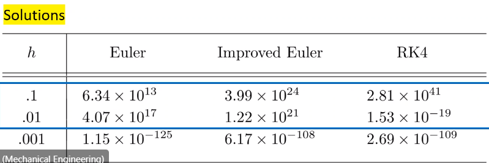 |
	|:--:|
	| Large step size, i.e. large errors, dominate final solution. $\tag{7} \label{fig:stiff_differential_equation_method_comparisons} |

!!! example Consider the #IVP, $\frac{du}{dt} = \gamma u,~u(0) = 1$ with exponential solution, $u(t) = e^{\gamma t}$.
	Using a forward [[Euler-Method]],
	$$\begin{split}
	u_{k+1} &= u_{k} + \gamma hu_{k} = (1 + \gamma h)u_{k} \\\\
	&= (1 + \gamma h)^(k + 1)u_{0} = (1 + \gamma h)^{k + 1}
	\end{split}$$
	The absolute error (exact - approximation) goes to zero:
	$$E = |u_{k}(kh) - (1 - \gamma h)^{k}| = |(e^{\gamma h})^{k} - (1 + \gamma h)^{k}|$$
	$$|1 + \gamma h| < 1 \implies -2<\gamma h < 0$$
	When $\gamma < 0$, exact solution decays to $0$.
	When large, method diverges quickly with error growing.
	When large, step-size, $h$ must be very small.
	[[Euler-Method]] is expected to be stable only if $h < \frac{2}{|\gamma|}$.
	If $h$ satisfies this, then method converges, because error goes to $0$; otherwise, solution diverges, because error grows quickly.

In general, a function, $Q$ approximated by difference methods gives, $$u_{k + 1} = Q(\gamma h)u_{k}$$, where the error grows without bound if $|Q(\gamma h)| > 1$.
$n^{th}$-order [[Taylor-Method]] has a stability condition, provided $h$ is chosen to satisfy: $$|1 + h\gamma + \frac{1}{2}\gamma^{2}h^{2} + \dots + \frac{1}{n}h^{n}\gamma^{n}| < 1$$ Stability analysis is generally very difficult to solve: heavily relies on mathematics.

Region, $R$ of absolute stability
: for a one-step method is $$R = \{h\gamma \in C:|Q(\gamma h)| < 1\}$$.

[[A-stable]] method
: The region of absolute stability contains entire, left half-plane of $\gamma h$ for $\gamma < 0$ on the complex plane, $\mathbb{Z}$.
Likely named for the absolute value property.

Forward [[Euler-Method]] is conditionally stable: $$|1 + \gamma h| < 1,~h<\frac{2}{|\gamma|},~\text{for}~\gamma < 0,~h < \frac{-2}{\gamma}$$ The region of stability...

| 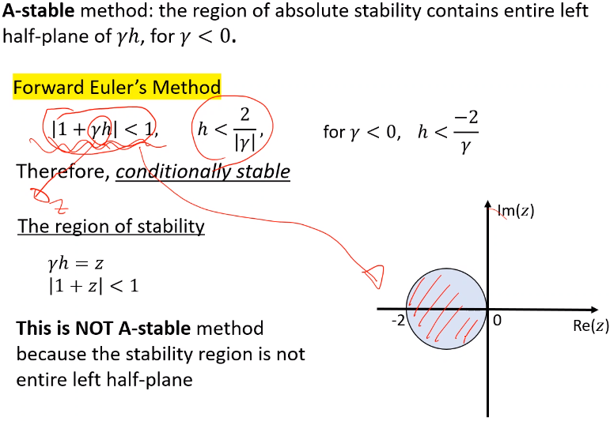 |
|:--:|
| The region of stability, $\gamma h = z,~abs(1 + z) < 1$. **This is not [[A-stable]] method**, because the stability region is not entire, left half-plane. Stability is limited by step size, $h$. $\tag{8} \label{fig:a_stable_method_example_of_forward_euler}$ |

!!! question Only called [[A-stable]] when left plane? <cite> Reid Prichard
	Correct.
	The [[Crank-Nicholson]] is implicit and [[A-stable]].

---

*Lecture: October 04, 2021*
Will discuss **Midterm Exam** Wednesday.

!!! question When do we exit the *Conjugate Gradient* methods? <cite> Bethany
	Method is a direct solver, but certainly may require more iterations to get within tolerance.
	Looking for experiment with various inputs and error handling.*

!!! note
	Implicit [[Trapezoidal-Method]] is the **only [[A-stable]], multistep method**!

$$\begin{split}
u_{k+1} &= u_{k} + \frac{1}{2}h[\gamma u_{k} + \gamma u_{k+1}] \\\\
&= \frac{1 + \frac{1}{2}h\gamma}{1 - \frac{1}{2}h\gamma}u_{k}
\end{split}$$

If $\gamma > 0$, then error exponentially grows.
If $\gamma < 0$, then error does not grow with condition, $h < \frac{-2}{\gamma}$.

| 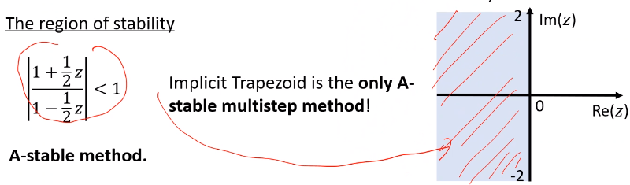 |
|:--:|
| $abs()$ $\tag{9} \label{fig:a_stable_method_example_of_implicit_trapezoidal}$ |

##### Summary
- [[A-stable]] not affected by stiffness of #ODE.
- No explicit [[Runge-Kutta-Method]] is [[A-stable]].
- Implicit [[Trapezoidal-Method]] is simplest example of [[A-stable]], multistep method.
- Although the [[Trapezoidal-Method]] does give accurate approximations for large step sizes, its error will not grow exponentially.
- Techniques commonly used for [[stiff-equation]] will likely be implicit, multi-step methods.
- In most cases, $u_{k + 1}$ is obtained from non-linear equations; therefore, #NR is typically used.

!!! quote Stability does not ensure accuracy. <cite> Dr. Cho

!!! tip Know how to solve [[RK4]] for the exam! <cite> Dr. Cho

---

*Lecture: October 06, 2021*
**Exam October 20, 2021 with review on the 18$^{th}$. HW2 assigned after that.**
## Boundary Value Problems in ODE
!!! hint A bridge that is fixed at both ends, find the height of the curvature.

Discuss approximation to #BVP with conditions imposed at different points.
First-order differential equations only require one condition.
However, physical problems that are position-dependent rather than time-dependent are often described in terms of differential equations with conditions imposed at more than one point.
Two-point #BVP involve a second-order differential equation, which is generally of the form: $$\frac{d^{2}y}{dx^{2}} = y'' = f(x, y, y'),~a \leq x \leq b$$ and $y(a) = \alpha, y(b) = \beta$.

*[BVP]: Boundary Value Problem

### Shooting Method
#### Linear Shooting Method
Let's consider a generalized, second-order diffeq: $$y'' = p(x)y' + q(x)y + r(x),~\text{for}~a \leq x \leq b$$ and $y(a) = \alpha,~y(b) = \beta$.
To approximate unique solution, consider two initial problems:

$$\begin{split}
y'' &= p(x)y' + q(x)y + r(x) &,~a \leq x \leq b &,~y(a) = \alpha &,~y'(a) = z1 \\\\
y'' &= p(x)y' + q(x)y &,~a \leq x \leq b &,~y(a) = 0 &,~y'(a) = z2
\end{split}$$

The solutions of the two problems are denoted $y_{1}(x)$ and $y_{2}(x)$, where $z1$ and $z2$ are commonly $0$ and $1$, respectively.

| 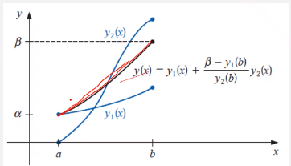 |
|:--:|
| $y(x) = y_{1}(x) + \frac{\beta - y_{1}(b)}{y_{2}(b)}y_{2}(x)$ interpolates between two #IVP, $y_{1}(x)$ and $y_{2}(x)$. $\tag{10} \label{fig:linear_shooting_method_graph_rep}$ |

If we restrict, $y_{2}(b) \neq 0$, then the solution can be written as: $y(x) = y_{1}(x) + \frac{\beta - y_{1}(b)}{y_{2}(b)}y_{2}(x)$, where the equation interpolations between $y_{1}(x)$ as solution to $y'' = p(x)y' + q(x)y + r(x)$ and $y_{2}(x)$ as solution to $y'' = p(x)y' + q(x)y$.
First and second derivatives follow as:

$$\begin{split}
y'(x) &= y_{1}'(x) + \frac{\beta - y_{1}(b)}{y_{2}(b)}y_{2}'(x) \\\\
y''(x) &= y_{1}''(x) + \frac{\beta - y_{1}(b)}{y_{2}(b)}y_{2}''(x)
\end{split}$$

!!! question Is this root-bracketed? <cite> Reid
	Next slide.

If we substitute into $y''(x)$, then:

$$\begin{split}
y''(x) &= y_{1}''(x) + \frac{\beta - y_{1}(b)}{y_{2}(b)}y_{2}''(x) \\\\
  &= p(x)y_{1}' + q(x)y_{1} + r(x) + \frac{\beta - y_{1}(b)}{y_{2}(b)}(p(x)y_{2}' + q(x)y_{2}) \\\\
  &= p(x)(y_{1}' + \frac{\beta - y_{1}(b)}{y_{2}(b)}y_{2}') + q(x)(y_{1} + \frac{\beta - y_{1}(b)}{y_{2}(b)}y_{2}) + r(x) \\\\
  &= p(x)y'(x) + q(x)y(x) + r(x)
\end{split}$$

!!! question Is this like the bisection method? <cite> DK.
	This is not an iterative, [[root-finding]] problem.
	This interpolates between two, real solutions.

The boundary conditions must satisfy:
$$\begin{split}
y(a) &= y_{1}(a) + \frac{\beta - y_{1}(b)}{y_{2}(b)}y_{2}(a) = \alpha + \frac{\beta - y_{1}(b)}{y_{2}(b)}*0 = \alpha \\\\
y(b) &= y_{1}(b) + \frac{\beta - y_{1}(b)}{y_{2}(b)}y_{2}(b) = \beta + 
\end{split}$$

!!! question Why guess at the derivatives? Does this make it easier to solve? <cite> Reid
	Certainly experiment with the guesses.

- [[Linear-Shooting-Method]] uses two #IVP
- The solutions to #IVP are $y_{1}(x)$ and $y_{2}(x)$.
- These #IVP are solved by typical #ODE solvers.

!!! example Apply [[Linear-Shooting-Method]] to #BVP: $u'' = y'' = -\frac{2}{x}y' + \frac{2}{x^{2}}y + \frac{sin(ln(x))}{x^{2}}$, for $1 \leq x \leq 2$ if $y(1) = 1$, $y(2) = 2$, and $h = 0.1$.
	First make first-order #ODE: $y_{1} = u$, $u(1) = 1$, $T(1) = 0$.
	Therefore, $u' = T$ into $y_{1}$ and $T' = -\frac{2}{x} + \frac{2}{x^{2}}u + \frac{sin(ln(x))}{x^{2}}$ into $y_{2}$, and use forward [[Euler-Method]] to solve these equations.
	$$\begin{split} u_{n + 1} &= u_{n} + hf_{1}(T_{n}) \\\\ t_{n + 1} &= T_{n} + hf_{2}(x_{n}, u_{n}, T_{n})\end{split}$$
	*Here, $h$ is spatial increment (physical spacing), not time increment.*
	At $n = 0$, set $x_{0} = 1.0$, then:
	$$\begin{split}\begin{bmatrix}u_{1} \\\\ T_{1}\end{bmatrix} &= \begin{bmatrix}u_{0} \\\\ T_{0}\end{bmatrix} + h\begin{bmatrix}f_{1}(T_{0}) \\\\ f_{2}(x_{0}, u_{0}, T_{0})\end{bmatrix} = \begin{bmatrix}u_{0} \\\\ T_{0}\end{bmatrix} + (0.1)\begin{bmatrix}T_{0} \\\\ -\frac{2}{x_{0}}T_{0} + \frac{2}{x_{0}^{2}}u_{0} + \frac{sin(ln(x_{0}))}{x_{0}^{2}}\end{bmatrix} \\\\ &= \begin{bmatrix}1 \\\\ 0\end{bmatrix} + (0.1)\begin{bmatrix}0 \\\\ -\frac{2}{1}(0) + \frac{2}{1}(1) + \frac{sin(ln(1))}{1}\end{bmatrix} = \boxed{\begin{bmatrix}1 \\\\ 0.2\end{bmatrix}} \longleftarrow \begin{bmatrix}u \\\\ T \end{bmatrix} \\\\ \begin{bmatrix}u_{2} \\\\ T_{2}\end{bmatrix} &= \begin{bmatrix}u_{1} \\\\ T_{1}\end{bmatrix} + h\begin{bmatrix}f_{1}(T_{1}) \\\\ f_{2}(x_{1}, u_{1}, T_{1})\end{bmatrix} = \begin{bmatrix}u_{1} \\\\ T_{1}\end{bmatrix} + (0.1)\begin{bmatrix}T_{1} \\\\ -\frac{2}{x_{1}}T_{1} + \frac{2}{x_{1}^{2}}u_{1} + \frac{sin(ln(x_{1}))}{x_{1}^{2}}\end{bmatrix} \\\\ &= \begin{bmatrix}1 \\\\ 0.2\end{bmatrix} + (0.1)\begin{bmatrix}1 \\\\ -\frac{2}{1.1}(0.2) + \frac{2}{1.1^{2}}(1) + \frac{sin(ln(1.1))}{1.1^{2}}\end{bmatrix} = \boxed{\begin{bmatrix}1.02 \\\\ 0.336791\end{bmatrix}} \longleftarrow \begin{bmatrix}u \\\\ T \end{bmatrix}\end{split}$$
	Repeat this process for the second #IVP.
	| 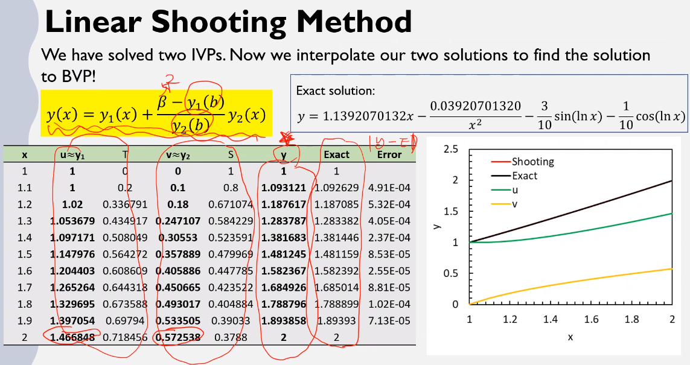 |
	|:--:|
	| Converges on $\converge{10^{-5}}$. $\tag{11} \label{fig:linear_shooting_method_solution}$ |

---

*Lecture: October 13, 2021*

!!! info
	Exam does not cover the preliminary (first 2 weeks) lecture; however, Newton-Raphson can still be on test.
	Today's lecture will be on exam.
	1 formula sheet of formulas only is allowed.
	Computer not required.
	Review session next Monday.

### Finite Difference Method
Differs from the ##FEM and #FVM.
Example of [[dirichlet-boundary-condition]].
Approximates #BVP with first-order equations requiring only one initial condition and second-order requiring two initial conditions.
Recall a linear, second-order [[BVP]]: $y'' = p(x)y' + q(x)y + r(x)~\text{for}~a \leq x \leq b$, where $y(a) = \alpha$ and $y(b) = \beta$.
Using a [[Taylor-polynomial]] about a point $x_{i}$ evaluated at $x_{i - 1}$ and $x_{i +1}$ and adding these two equations together, we find an approximation for for $y''$, $$\begin{split}y(x_{i - 1}) &= y(x_{i} + h) \approx y(x_{i}) + hy'(x_{i}) + \frac{h^{2}}{2}y''(x_{i}) + \frac{h^{3}}{3!}y'''(x_{i}) + \frac{h^{4}}{4!}y''''(x_{i}) \\\\ y(x_{i + 1}) &= y(x_{i} - h) \approx y(x_{i}) - hy'(x_{i}) + \frac{h^{2}}{2}y''(x_{i}) - \frac{h^{3}}{3!}y'''(x_{i}) + \frac{h^{4}}{4!}y''''(x_{i})\end{split}$$ When adding together and using a [[centered-difference-method]], $$\implies y''(x_{i}) \approx \frac{y(x_{i} + h) - 2y(x_{i}) + y(x_{i} - h)}{h^{2}} - 2\big(\frac{h^{2}}{4!}\big)y''''(x_{i})$$ Subtracting in the similar can approximate $y'(x_{i})$.
$$y'(x_{i}) \approx \frac{y(x_{i} + h) - y(x_{i} - h)}{2h} - \big(\frac{h^{2}}{3!}\big)y'''(x_{i})$$ These converge $\converge{h^{2}}$.

*[FVM]: Finite Volume Method

Plugging these into the general form: $$\begin{split}y'' &= p(x)y' + q(x)y + r(x) \\\\ \implies -r(x_{i}) &= -\frac{w_{i + 1} - 2w_{i} + w_{i - 1}}{h^{2}} + p(x_{i})\frac{w_{i + 1} - w_{i - 1}}{2h} + q(x_{i})w_{i}\end{split}$$ where $w_{0} = \alpha,~w_{N+1} = \beta$. Finally, these equations can be represented in $\mathbb{R}^{N}$ with $\mathbf{A}\hat{w} = \hat{b}$

| 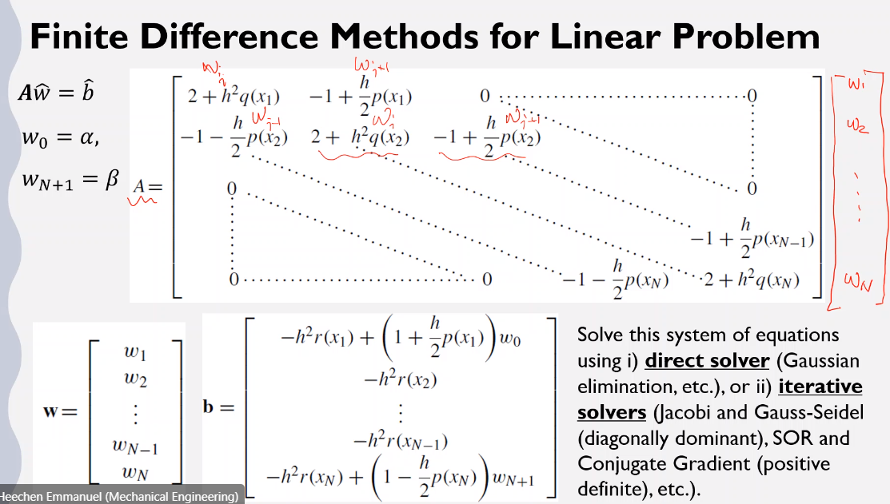 |
|:--:|
| Be careful of indeces! The first and last elements of $\hat{b} = \alpha,~\beta$, respectively. $\tag{12} \label{fig:finite_difference_algorithm_explained}$ |

[[direct-solver]] or [[iterative-solver]] can be used to solve system of equations, $\mathbf{A}\hat{w} = \hat{b}$.

### FEM
Sometimes called the [[variational-formulation]]. Often used when needing to minimize the free energy in systems. However, this method differs from what we have learned:
- [[Linear-Shooting-Method]]: uses entire domain to solve #BVP with pair of #IVP.
- #FDM: discretizes domain and finds the finite differences.

*[FDM]: Finite Difference Method

Differential Equation (two-point #BVP)
: $\begin{cases}-\frac{d}{dx}\bigg(p(x)\frac{du}{dx}\bigg) = f(x) &, 0 \leq x \leq 1 \\\\ u(0) = 0 &, u(1) = 0\end{cases}$

Linear Space
: $\require{amssymb} V = \{\mathcal{v} \colon \mathcal{v} \in \mathcal{C}^{0}[0, 1]\}$ , $\mathcal{v}'$ is piecewise continuous on $[0,1],~\text{and}~\mathcal{v}(0) = \mathcal{v}(1) = 0$.

This space can be solved by multiplying both sides by $\mathcal{v}$ and [[integration-by-parts]] over the domain $(0 \leq x \leq 1)$,

$$\begin{split}
\int_{0}^{1}-(pu')'\mathcal{v}dx &= \int_{0}^{1}f\mathcal{v}dx \\\\
 &= \require{cancel}\cancelto{0}{-pu'\mathcal{v}\big\rvert_{x = 0}^{x = 1}} + \int_{0}^{1}pu'\mathcal{v}'dx = \int_{0}^{1}pu'\mathcal{v}'dx \\\\
\int_{0}^{1}pu'\mathcal{v}'dx &= \int_{0}^{1}f\mathcal{v}dx
\end{split}$$

---

*Lecture: October 18, 2021*
*[FFT]: Fast-Fourier Transform
*[DFT]: Discrete Fourier Transform
!!! summary EXAM REVIEW
	Know the concepts of each method and the pros and cons of those methods. You are allowed 1 page for a formula sheet: the formula only. *No calculator for inverse matrices!!* The exam material will come from slides for only that material covered. The exam tests your knowledge to apply what you have learned, assuming you have learned the material. 5-6 questions, where 3 may require solution.
	- #FFT
		- Theory: Inverse transform to find coefficients in frequency domain and then convert to real domain.
		- #DFT: uses discretized domain in Inverse transform; however, is very slow.
		- #FFT: algorithm to speed up solution of #DFT with symmetry in frequency domain. Use $W_{n/2}$ formula to find coefficients and convert back to original index (butterfly diagram).
	- Eigenvalues and Eigenvectors
		- $n~x~n$ matrix has characteristic polynomial of $n^{th}$ degree.
		- Computing this directly is expensive and may be difficult to solve quickly.
		- *Power Method* finds the dominant eigenvalue of the matrix. $\mu_{k}$ goes to the largest $\lambda$ and $\vec{x}$ goes to corresponding eigenvector.
		- *Inverse Power Method* does similar to *Power*, but this method finds the $\lambda$ closest to the target value.
		- *QR Method* assumes a **symmetric, diagonal matrix** has a similar, non-singular (invertible) matrix exists: i.e. some matrix with equivalent eigenvalues exists. **This method can find all the eigenvalues at once.** These eigenvalues are the long diagonal of $\mathbf{A}$. If asked to find the *rotation matrix*, then find it: do not use Gram-Schmidt method unless allowed or *$\mathbf{P}$* not given.
		- *Steepest Descent Method* solves the linear system of equations, $\mathbf{A}\vec{x} = \vec{b}$, *where $\mathbf{A}$ is a symmetric, positive-definite, square matrix*. This does not work well with sparse matrix (these are best solved with direct methods). Searches in the *negative gradient* direction to find optimal solution where the error converges rapidly toward the (max/min)imum of the "bowl", which is also the residual vector, $\vec{r_{k}} = -\nabla f(\vec{x_{k + 1}}) = \vec{b} - \mathbf{A}\vec{x}$.
		- ==*Conjugate Gradient Method*: extension of *Steepest Descent*; however, this solution search direction is *not* perpendicular to residual vector, which is negative gradient. The search direction is *A-orthogonal* (conjugate) to residual vector, and the two vectors are mutually orthogonal.== **This converges in maximum, $n$ iterations; however, this is not direct solution because of round-off error.**
		- *Pre-conditioned Conjugate Gradient Method* reduces round-off error and can solve *ill-conditioned (singular)* matrices whose condition number is high, which makes finding the inverse difficult and expensive. **By reducing the condition number, the matrix is easier to solve in $\sqrt{n}$ iterations.**

	Know how to apply and solve the following:
	- #IVP
		- Explicit
			- Forward Euler (first-order)
			- Higher-order Taylor (higher order), but very expensive to calculate higher order derivatives: round-off error increases.
			- #RKM is most popular and has the advantage of not needing derivatives: is a second-order method.
			- Improved/Midpoint Euler
			- [[RK4]] finds averages of slopes at varies substep points with better accuracy than [[RK2]] because it is higher order.
		- Implicit: preferred for its stability and higher-order accuracy.
			- Backward Euler (first-order): relies on root-finding method to solve.
			- Trapezoidal (Crank-Nicholson): second-order
		- Predictor/Corrector Equations
		- Stiffness and A-stability.
	- #BVP
		- Linear Shooting method with two IVP by typical solution method.
		- #FDM: centered-difference formula to solve matrix.

---

*Lecture: October 22, 2021*

!!! info Group Project will be to develop #FDM because only half the semester remains. All groups will solve the same equation:
	$$\begin{equation}
	\frac{\partial T}{\partial t} = \alpha\nabla^{2}T
	\label{eq:thermal_diffusion}
	\end{equation}$$
	where $\alpha$ is the thermal diffusivity, $T$ is temperature ($K$), and $t$ is time. However, this is where the semester moves from #ODE to #PDE with a #BVP. Make the grid spacing, $h$ uniform for the whole domain.
	Dr. Cho will provide instruction on how to build discretized domain. For team assignments, Dr. Cho asks that we list our name and top two preferences of which project configuration where the first number is the most preferred: wrt [Project Description](C:\Users\jmanthony1\Liberty University\Group-Numerical Methods for ODE PDE-Fall2021 - Class Materials\Project\Group_Project_Plans.pdf). *I picked 2 and 3.*

#FEM is better for [[Lagrangian]] problems: solid mechanic where the domain changes with deformation. Fluids likes #FDM for fixed volume and nodal spacing: [[Eulerian]].

Minimization Problem
: The function $u$ is the unique solution to the differential equation iff $u$ is the unique function that minimizes the following integral:

$$\begin{equation}
I(\mathcal{v}) = \int_{0}^{1}\big[p(x)(\mathcal{v}'(x))^{2} - 2f(x)\mathcal{v}(x)\big]dx
\label{eq:minimization_problem}
\end{equation}$$

Equation \eqref{eq:minimization_problem} formed by substituting $\mathcal{v}$ for $u$: $\int_{0}^{1} pu'\mathcal{v}'dx = \int_{0}^{1}f\mathcal{v}dx$ wherein the [[basis-function]] is $\mathcal{v}$. The function is $C^{n}$.

#### Formulation of FEM
- Partitioning: domain is partitioned into a collection of elements of the mesh size, $h$.
- Sub-space and [[basis-function]] ($\phi_{j}$): A finite-dimensional sub-space ($u_{h}$) is set to represent the numerical solution as a linear combination of [[basis-function]]: $$\begin{equation}u_{h}(x) = \sum_{j = 1}^{n}c_{j}\phi_{j}(x)\label{eq:basis_function}\end{equation}$$ Common use of [[basis-function]] are polynomials: linear, quadratic, cubic, [[Lagrangian-Polynomial]].
- Application of variational principles: Different #FEM are formulated with various variational principles: e.g. minimization principle for [[Rayleigh-Ritz]], weighted residual for [[Galerkin]], [[least-squares]], collocation evaluation, etcetera.

---

*Lecture: October 25, 2021*

!!! note Final Project
	I picked 2 and 3: Backward Euler with Conjugate Gradient and Crank-Nicholson with SOR.
	Various deliverables:
	1. Draft
	2. Presentation
	3. Journal Article

Linear FEM (k = 1)
: The nodal points coincide with the grid points $\{x_{j}\}$. The [[basis-function]] associated with $x_{j}$ is defined as:
$$\begin{equation}
\phi_{j}(x) = \begin{cases}
0 &, x < x_{j - 1} \\\\
\frac{1}{h_{j}}(x - x_{j - 1}) &, x \in [x_{j - 1}, x_{j}] \\\\
\frac{1}{h_{j + 1}}(x_{j + 1} - x) &, x \in [x_{j}, x_{j + 1}] \\\\
0 &, x_{j + 1} < x
\end{cases}
\label{eq:linear_fem}
\end{equation}$$

| 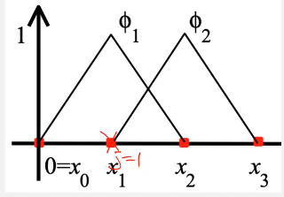 |
|:--:|
| Piecewise continuous within grid points. $\phi$ is only valid at node points to left and right of that examined. All other nodes are set to $0$. \\(\tag{13} \label{fig:linear_fem_example}\\) |

Quadratic #FEM (k = 2)
: On each sub-interval, the [[basis-function]] is a quadratic polynomial, which requires to determine three coefficients: three points must be set on each sub-interval. The two endpoints are nodal points, and the middle point is an extra point. Higher [[basis-function]] are more precise but require more calculations.

| 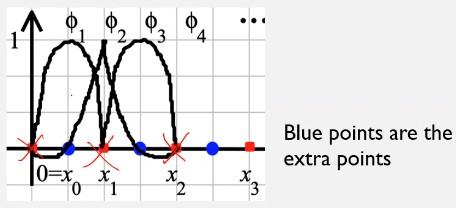 |
|:--:|
| Recall [[Lagrangian-Polynomials]], which are most common [[basis-function]]. \\(\tag{14} \label{fig:quadratic_fem_example}\\) |

[[Rayleigh-Ritz]]
: The solution $u$ is approximated by minimizing the integral not over all the functions, but over the piecewise set of functions ([[basis-function]]). The [[basis-function]] are linearly independent and satisfy $\phi_{i}(0) = \phi{i}(1) = 0$.
$$\begin{equation}
\begin{split}
\mathcal{v}(x) &= \sum_{j = 1}^{n}c_{j}\phi_{j}(x) \\\\
I(\mathcal{v}) &= \int_{0}^{1}[p(x)(\mathcal{v}'(x))^{2} - 2f(x)\mathcal{v}(x)]dx \\\\
\frac{dI}{dc_{i}} &= \int_{0}^{1}2p(x)\big(\sum_{j = 1}^{n}c_{j}\phi_{j}'\big)\phi_{j}'dx - \int_{0}^{1}2f(x)\phi_{j}(x)dx = 0
\end{split}
\label{eq:rayleigh_ritz_method}
\end{equation}$$

For a minimum to occur, it is necessary when considering $I$ as a function of $c_{j}$ to have $\frac{dI}{dc_{j}} = 0$, where $c_{j}$ is the coefficient to the [[basis-function]].

$$\begin{equation}
\sum_{j = 1}^{n}\bigg[\int_{0}^{1}p(x)\phi_{j}'(x)\phi_{i}'(x)dx\bigg]c_{j} = \int_{0}^{1}f(x)\phi_{i}(x)dx, \\\\ \text{for each } i \in [1, n]
\label{eq:rayleigh_ritz_method_coefficient}
\end{equation}$$

If $a_{ij} = \int_{0}^{1}p(x)\phi_{j}'(x)\phi_{i}'(x)dx$ and $b_{i} = \int_{0}^{1}f(x)\phi_{i}(x)dx$, then Eq. \eqref{eq:rayleigh_ritz_method} can be expressed as $\mathbf{A}\vec{c} = \vec{b}$ which is an $n \text{ x } n$, linear system of equations.

Now we assemble all pieces into one matrix, $\mathbf{A}$, which is [[positive-definite]], and $\vec{b}$. Recall [[numerical-quadrature]] to solve the integrals. Let us first consider the simplest case for linear #FEM:

$$\begin{split}
\phi_{j}(x) &= \begin{cases}\frac{1}{h_{j}}(x - x_{j - 1}) &, x \in [x_{j - 1}, x_{j}] \\\\ \frac{1}{h_{j + 1}}(x_{j + 1} - x) &, x \in[x_{j}, x_{j +1}] \\\\ 0 &, \text{elsewhere}\end{cases} \\\\
\phi_{j}'(x) &= \begin{cases}\frac{1}{h_{j}} &, x \in [x_{j - 1}, x_{j}] \\\\ -\frac{1}{h_{j + 1}} &, x \in[x_{j}, x_{j +1}] \\\\ 0 &, \text{elsewhere}\end{cases}
\end{split}$$

$\\{x \in (x_{j - 1}, x_{j + 1}) | \phi_{j}(x) \neq 0 \text{ and } \phi_{j}'(x) \neq 0\\}$.

---

*Lecture: October 27, 2021*

!!! summary Review from Exam 2
	- Do not share formula sheets.
	- If you did the homework, then you know how to double-check your answers and to use certain keywords in the explanation of that answer.
	- ==**Final Exam** will be similar to this exam.==

Recall Eq. \eqref{eq:rayleigh_ritz_method}: $$\sum_{j = 1}^{n}\bigg[\int_{0}^{1}p(x)\phi_{j}'(x)\phi_{i}'(x)dx\bigg]c_{j} = \int_{0}^{1}f(x)\phi_{i}(x)dx, \\\\ \text{for each } i \in [1, n]$$ which is the definition of the [[Rayleigh-Ritz]], and the substitutions, $a_{ij} = \int_{0}^{1}p(x)\phi_{j}'(x)\phi_{i}'(x)dx$ and $b_{i} = \int_{0}^{1}f(x)\phi_{i}(x)dx$. Non-zero entries in $i$-th row of $\mathbf{A}$ are $a_{i, i-1}$, $a_{i, i}$, and $a_{i, i + 1}$. $$a_{i,i} = \int_{0}^{1}p(x)\phi'(x)\phi'(x)dx = \bigg(\frac{1}{h_{i}}\bigg)^{2}\int_{x_{i - 1}}^{x_{i}}p(x)dx + \bigg(-\frac{1}{h_{i + 1}}\bigg)^{2}\int_{x_{i}}^{x_{i + 1}}p(x)dx$$ For the integration, we will use the [[Trapezoidal-Rule]] (Eq. \eqref{eq:trapezoidal_quadrature}).

| 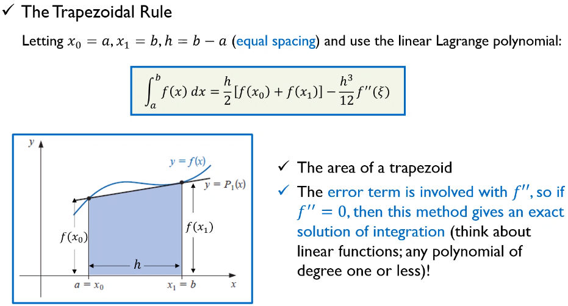 |
|:--:|
| Use the [[Trapezoidal-Rule]] to approximate the area under the curve of some function. **Assumes equal spacing for $x$.** \\(\tag{15} \label{fig:trapezoidal_rule}\\) |

$$\begin{equation}
\int_{a}^{b}f(x)dx = \frac{h}{2}[f(x_{0}) + f(x_{1})] - \frac{h^{3}}{12}f''(\xi)
\label{eq:trapezoidal_quadrature}
\end{equation}$$

Following the form of Eq. \eqref{eq:trapezoidal_quadrature} with $$\phi_{j}'(x) = \begin{cases}\frac{1}{h_{j}} &, x \in [x_{j - 1}, x_{j}] \\\\ -\frac{1}{h_{j + 1}} &, x \in[x_{j}, x_{j +1}] \\\\ 0 &, \text{elsewhere}\end{cases}$$ yields:

$$\begin{split}
a_{i, i} &= \int_{0}^{1}p(x)\phi_{i}'\phi_{i}'dx \\\\
 &= \bigg(\frac{1}{h_{i}}\bigg)^{2}\int_{x_{i - 1}}^{x_{i}}p(x)dx + \bigg(-\frac{1}{h_{i + 1}}\bigg)^{2}\int_{x_{i}}^{x_{i + 1}}p(x)dx \\\\
 &= \bigg(-\frac{1}{h_{i}}\bigg)\bigg(\frac{1}{h_{i}}\bigg)(p(x_{i - 1}) + p(x_{i})) + \bigg(-\frac{1}{h_{i + 1}}\bigg)^{2}\frac{h_{i + 1}}{2}(p(x_{i}) + p(x_{i + 1})) \\\\
a_{i, i} &\approx \frac{p(x_{i - 1}) + p(x_{i})}{2h_{i}} + \frac{p(x_{i}) + p(x_{i + 1})}{2h_{i + 1}} \\\\
a_{i, i - 1} &= \int_{0}^{1}p(x)\phi_{i - 1}'\phi_{i}'dx \\\\
 &= \int_{x_{i - 2}}^{x_{i - 1}}p(x)\phi_{i - 1}'\phi_{i}'dx + \int_{x_{i - 1}}^{x_{i}}p(x)\phi_{i - 1}'\phi_{i}'dx \\\\
 &= \bigg(-\frac{1}{h_{i}}\bigg)\bigg(\frac{1}{h_{i}}\bigg)\int_{x_{i - 1}}^{x_{i}}p(x)dx \\\\
a_{i, i - 1} &\approx -\frac{1}{h_{i}^{2}}\frac{h_{i}}{2}(p(x_{i - 1}) + p(x_{i})) = -\frac{p(x_{i - 1}) + p(x_{i})}{2h_{i}} \\\\
a_{i, i + 1} &= \int_{0}^{1}p(x)\phi_{i + 1}'\phi_{i}'dx \\\\
 &= \int_{x_{i}}^{x_{i + 1}}p(x)\phi_{i + 1}'\phi_{i}'dx + \int_{x_{i + 1}}^{x_{i + 2}}p(x)\phi_{i + 1}'\phi_{i}'dx \\\\
 &= \bigg(-\frac{1}{h_{i + 1}}\bigg)\bigg(\frac{1}{h_{i + 1}}\bigg)\int_{x_{i}}^{x_{i + 1}}p(x)dx \\\\
a_{i, i + 1} &\approx -\frac{1}{h_{i + 1}^{2}}\frac{h_{i + 1}}{2}(p(x_{i}) + p(x_{i + 1})) = -\frac{p(x_{i}) + p(x_{i + 1})}{2h_{i + 1}}
\end{split}$$

Similarly, we can find $b_{i}$:

$$\begin{split}
b_{i} &= \int_{0}^{1}f(x)\phi_{i}dx \\\\
 &= \int_{x_{i - 1}}^{x_{i}}f(x)\phi_{i}dx + \int_{x_{i}}^{x_{i + 1}}f(x)\phi_{i}dx \\\\
 &= \bigg(\frac{1}{h_{i}}\bigg)\int_{x_{i - 1}}^{x_{i}}f(x)(x - x_{i - 1})dx + \bigg(\frac{1}{h_{i + 1}}\bigg)\int_{x_{i}}^{x_{i + 1}}f(x)(x_{i + 1} - x)dx \\\\
b_{i} &\approx \frac{1}{h_{i}}\frac{h_{i}}{2}(f(x_{i - 1})0 + f(x_{i})(x_{i} - x_{i - 1})) + \frac{1}{h_{i + 1}}\frac{h_{i + 1}}{2}(f(x_{i + 1} - x_{i}) + f(x_{i + 1})0) \\\\
b_{i} &\approx \frac{h_{i}}{2}f(x_{i}) + \frac{h_{i + 1}}{x}f(x_{i}) = \frac{1}{2}f(x_{i})(h_{i} + h_{i + 1})
\end{split}$$

Finally, assemble $\mathbf{A}\vec{x} = \vec{b}$ with $b_{i} = a_{i, i - 1}c_{i - 1} + a_{i, i}c_{i} + a_{i, i + 1}c_{i + 1}$.

!!! hint
	$\vec{c} \equiv \vec{x}$, which is the solution vector requiring an initial guess.

---

*Lecture: October 29, 2021*

!!! summary Group 2 Project Teams
	- Adam Rutherford
	- Joby M. Anthony III
	- Reid Prichard
	- Adriel Lau

	!!! info Project Expectations
		Dr. Cho will upload a #FDM tutorial later this afternoon. Make square domain with four, [[dirichlet-boundary-condition]] temperature boundary conditions and solve temperature distribution in domain. Pick a metal more relevant to research. Play with initializing temperatures locally and see effects over time.

!!! example Use the linear [[Rayleigh-Ritz]] to approximate the solution to the following #BVP: $$-\frac{d}{dx}\bigg((x + 1)\frac{du}{dx}\bigg) + 6u = -12x^{4} + 44x^{3} - 2x + 1 \text{, where } 0 \leq x \leq 1 \text{ and } u(0) = u(1) = 0$$ using $x_{0} = 0$, $x_{1} = 0.3$, $x_{2} = 0.7$, and $x_{3} = 1$ Compare to exact solution: $u(x) = \dots.
	| 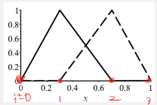 |
	|:--:|
	| Determine $\phi$, which is the [[basis-function]], at each nodal point from the left and right sides.. \\(\tag{16} \label{fig:rayleigh_ritz_method_example}\\) |

	Recalling $h_{j} = x_{j} - x_{j - 1}$, $u_{h} = \sum_{j = 1}^{2}c_{j}\phi_{j}$ implies $u_{1} = c_{1}\phi_{1} + c_{2}\phi_{2}$ ($u(x_{0}) = 0; u(x_{3}) = 0$). Recall the [[basis-function]] (Eq. \eqref{eq:basis_function}).

	By definition: $\phi_{1} = \frac{x - x_{2}}{x_{1} - x_{2}}$ and $\phi_{2} = \frac{x - x_{1}}{x_{2} - x_{1}}$ which are linear [[Lagrangian-Polynomial]]. This follows that $\phi_{1, left}' = \frac{1}{h_{1}}$ and $\phi_{1, right}' = -\frac{1}{h_{2}}$. To find $a_{i, j}$ and $b_{i}$: $$\begin{split}a_{i, j} &= \int_{0}^{1}(x + 1)\phi_{j}'\phi_{i}' + 6\phi_{j}\phi_{i}dx \\\\ b_{i} &= \int_{0}^{1}(-12x^{4} + 44x^{3} - 2x + 1)\phi_{i}dx\end{split}$$ Non-zero entries in $i$-th row of $\mathbf{A}$ are $a_{i, i - 1}$ and $a_{i, i + 1}$.

	- $i = 1$:
		- $$\begin{split}a_{i, i} &= a_{1, 1} \\\\ &= \int_{0}^{1}(x + 1)\phi_{1}'\phi_{1}' + 6\phi_{1}\phi_{1}dx \\\\ &= \bigg(\frac{1}{h_{1}}\bigg)^{2}\int_{0}^{0.3}(x + 1)dx + \frac{6}{h_{1}^{2}}\int_{0}^{0.3}x^{2}dx + \bigg(-\frac{1}{h_{2}}\bigg)^{2}\int_{0.3}^{0.7}(x + 1)dx + \frac{6}{h_{2}^{2}}\int_{0.3}^{0.7}(x - 0.7)^{2}dx \\\\ &= \frac{2.3}{2h_{1}} - \frac{6(0.09)}{2h_{1}} + \frac{3}{2h_{2}} + \frac{6(0.16)}{2h_{2}} \\\\ &= -3.833\end{split}$$ and $$\begin{split}b_{i} &= b_{1} \\\\ &= \int_{0}^{1}(-12x^{4} + 44x^{3} - 2x + 1)\phi_{1}dx \\\\ &= \frac{1}{h_{1}}\int_{0}^{0.3}(-12x^{5} + 44x^{4} - 2x^{2} + x)dx + \bigg(-\frac{1}{h_{2}}\bigg)\int_{0.3}^{0.7}(-12x^{4} + 44x^{3} - 2x + 1)(x - 0.7)dx\end{split}$$
		- Furthermore, we must find $a_{i, i - 1}$ and $a_{i, i + 1}$: $$\begin{split}a_{i, i - 1} &= a_{1, 0} \\\\ &= \int_{0}^{1}(x + 1)\phi_{0}'\phi_{1}' + 6\phi_{0}\phi_{1}dx \\\\ &= -\bigg(\frac{1}{h_{1}}\bigg)^{2}\int_{0}^{0.3}(x + 1)dx - \frac{6}{h_{1}^{2}}\int_{0}^{0.3}(x - 0.3)xdx \\\\ &= -\frac{2.3}{h_{1}}\end{split}$$ and $$\begin{split}a_{i, i + 1} &= a_{1, 2} \\\\ &= \int_{2}^{1}(x + 1)\phi_{0}'\phi_{1}' + 6\phi_{2}\phi_{1}dx \\\\ &= -\bigg(\frac{1}{h_{2}}\bigg)^{2}\int_{0.3}^{0.7}(x + 1)dx - \frac{6}{h_{2}^{2}}\int_{0.3}^{0.7}(x - 0.3)(x - 0.7)dx \\\\ &= -\frac{3}{2h_{2}}\end{split}$$

---

*Lecture: November 01, 2021*

Weigthed-Residual Approach ([[Galerkin]])
: This starts with residual of the differential equations. Approximate the solution with piecewise continuous [[basis-function]].
$$\begin{split}
-\frac{d}{dx}\bigg(p(x)\frac{du}{dx}\bigg) &= f(x) \\\\
-\frac{d}{dx}\bigg(p(x)\frac{du}{dx}\bigg) &= P(u) \\\\
R(u) &= P(u) - f \\\\
u_{h}(x) &= \sum_{j = 1}^{n}c_{j}\phi_{j}(x) \\\\
R(u_{h}) &= P(u_{h}) - f \neq 0
\end{split}$$

[[Galerkin]] approach seeks an approximate solution, $u_{h} = \sum_{j = 1}^{n}c_{j}\phi_{j}(x)$ (Eq. \eqref{eq:basis_function}) that satisfies $\int_{0}^{1}R(u_{h})w(x)dx = 0$ for a sequence of weighted functions, $w(x)$ which are also called [[trial-functions]].

!!! attention Know these weighting functions for exam!
	- [[Galerkin]] uses [[basis-function]], $\phi_{i}$ as [[trial-functions]].
	- [[least-squares]] method uses $w(x) = \frac{\partial}{\partial c_{i}}R(u_{h}) = P(\phi_{i})$ as the [[trial-functions]].
	- [[Collocation]] method uses $w(x) = \delta(x - x_{i})$ (displaced Dirac delta function) as the [[trial-functions]], where $$\delta(x - x_{i}) = \begin{cases}\infty &, \text{ if } x = x_{i} \\\\ 0 &, \text{ else}\end{cases}$$.

To solve the [[Galerkin]] method:
$$\begin{split}
R(u_{h}) &= -\frac{d}{dx}\bigg(p(x)\frac{d}{dx}u_{h}(x)\bigg) - f(x) \\
 &= -\frac{d}{dx}\bigg(p(x)\frac{d}{dx}\sum_{j = 1}^{n}c_{j}\phi_{j}(x)\bigg) - f(x) \\\\
\int_{0}^{1}R(u_{h})w(x)dx &= \int_{0}^{1}R(u_{h})\phi_{i}(x)dx = 0
\end{split}$$

!!! note
	Eventually this will equal the [[Rayleigh-Ritz]] method if linear system of equations.

## Partial Differential Equations
- Many physical processes processes in nature are governed by partial differential equations (#PDE)
- Knowledge of the mathematical properties and solution of the governing equations as needed.
- #PDE is distinguishable by its derivatives: e.g. $$\begin{cases}\phi_{x} + \phi_{y}y\phi = 0 &, \text{First Order Linear} \\\\ \phi_{xx}^{2} + \phi_{xy} + \phi\phi_{yy} = 0 &, \text{Second Order Non-Linear} \\\\ \phi\phi_{xx} + \phi\phi_{x} + x\phi_{y} = 0 &, \text{Second Order Non-Linear}\end{cases}$$
- The highest order derivative prescribes the order of #PDE.

Non-linear
: Wen the coefficient of the highet-order derivatives containt depende variables or its derviatives.

!!! attention Know these categories for exam!
	3 Physical Categories:
	1. Equilibrium
	2. [[eigenvalues]]
	3. Marching (propagation)

	3 Mathematical Classifications
	- Elliptic
	- Parabolic
	- Hyperbolic

### Physical Classifications
#### Equilibrium
A solution of given #PDE is desired in a closed domain that is subject to prescribed set of boundary conditions. Typically is a #BVP. E.g. [[steady-state]] temperature distributions, incompressible inviscid flows, [[residual-stress-distribution]] in solids, atomic diffusions, etcetera.

!!! example Laplace Equation
	$\nabla^{2}\phi = \Delta\phi = \frac{\partial^{2}\phi}{\partial x^{2}} + \frac{\partial^{2}\phi}{\partial y^{2}} = 0$, where $\tau$ is the boundary and $\Omega$ is the domain.

#### Eigenvalue
Extension of equilibrium problems. The solution exists only fro some discrete value of a parameter, $\lambda_{i}$. E.g. buckling and stability of structures, resonance in electric circuits, and natural frequencies in vibration, etcetera.

#### Marching
Sometimes called "propagation," these are [[transient]] problems.

### Mathematical Classifications
Information in physical problems:
- Equations (single or system) that admit wave-like solutions: hyperbolic.
- Equations that admit damped wave-like solutions: parabolic.
- Solution(s) are not wave-like: elliptic.

[[characteristic-path]]
: A line in 2D or surface in 3D that transfers the trajectory of a particle ("information") to physical problems governed by #PDE.
	- On this path, certain quantities remain constant or **certain derivatives may be discontinuous**.
	- E.g. shockwave in a fluid.

Throughout this chapter, each Second Order #PDE will be of the following form:

$$\begin{equation}
\begin{split}
a\phi_{xx} + b\phi_{xy} + c\phi_{yy} + d\phi_{x} + e\phi_{y} + f\phi &= g(x, y) \\\\
a\phi_{xx} + b\phi_{xy} + c\phi_{yy} &= -(d\phi_{x} + e\phi_{y} + f\phi - g(x, y)) = H
\label{eq:pde_general_form}
\end{equation}$$

If the characeristics of this equation exists (real curves within the solution domain), then that means there are **some locations where the second derivatives may be discontinuous** (shockwave in supersonic flow). We solve this by substituting $u = \phi_{xx}$, $\mathcal{v} = \phi_{xy}$, and $w = \phi_{yy}$ along this [[characteristic-path]] and modifying the equation:

$$\begin{split}
\begin{bmatrix}a & b & c \\\\ \frac{dx}{d\tau} & \frac{dy}{d\tau} & 0 \\\\ 0 & \frac{dx}{d\tau} & \frac{dy}{d\tau}\end{bmatrix}\begin{bmatrix}u \\\\ \mathcal{v} \\\\ w\end{bmatrix} &= \begin{bmatrix}H \\\\ \frac{dp}{d\tau} \\\\ \frac{dq}{d\tau}\end{bmatrix} \\\\
au + b\mathcal{v} + cw &= H \\\\
\frac{dp}{d\tau} &= \frac{dx}{d\tau}u + \frac{dy}{d\tau}\mathcal{v} \\\\
\frac{dq}{d\tau} &= \frac{dx}{d\tau}\mathcal{v} + \frac{dy}{d\tau}w
\end{split}$$

When the [[characteristic-path]] is discontinuous, then no unique solution for the second derivatives exist because the determinant of the coefficient matrix is zero.

---

*Lecture: November 03, 2021*

!!!  summary Project Introduction
	$$\begin{equation}
	\frac{\partial T}{\partial t} = \partial\bigg(\frac{\partial^{2}T}{\partial x^{2}} + \frac{\partial^{2}T}{\partial y^{2}}\bigg)
	\end{equation}$$

	- [[dirichlet-boundary-condition]] problem.
	- *Uploaded to Teams.*
	- Each method handles the LHS differently, and the different equations handle the RHS differently.

	**1D Definition**

	- Multiple ways to implement #FDM codes. Refer to Eqs. (9)- in PDF for each nodal point, $j$ in $n$ nodes. These create a [[tridiagonal]] system of equations.
	- This system of equations is solved by the prescribed method.
	- The matrix should be [[positive-definite]] and [[symmetric]].
	- Attempt to solve directly and make sure that solution can be found. Then apply some method to find solution faster.

	**2D Definition**

	- Refer to Eqs. (26)-
	- Sometimes referred to as the *5-Point Stencil*.
	- Each term on the RHS is the derivative of $U$ wrt to $x$ and $y$, respectively.
	- The $\vec{U}$ is a flattened version of $U$ in the nodal space matrix.
	- Matrix will be [[pentadiagonal]].

*[LHS]: Left-Hand Side
*[RHS]: Right-Hand Side

$$\begin{split}
a\big(\frac{dy}{d\tau}\big)^{2} - b\big(\frac{dy}{d\tau}\big)\big(\frac{dx}{d\tau}\big) + c\big(\frac{dx}{d\tau}\big^{2}) &= 0 \\\\
a\big(\frac{dy}{dx}\big)^{2} - b\big(\frac{dy}{dx}\big) + c &= 0 \\\\
\implies h &= \frac{b \pm \sqrt{b^{2} - 4ac}}{2a}
\end{split}$$

#### Hyperbolic PDE
For $b^{2} - 4ac > 0$.

[[domain-of-dependence]]
: That portion of the problem domain that influences the value of the solution at a given point of a #PDE.

Limited [[domain-of-dependence]] in solution. Bound by two [[characteristic-path]] and dependent on initial and boundary conditions. Generally involved with the second time derivative wrt time: e.g. oscillations and wave-like behavior, convection, vibration, etcetera.

#### Parabolic PDE
For $b^{2} - 4ac = 0$. Associated with [[diffusion]] and involved with first derivative wrt time. Starts with some initial domain to march forward in time or in a time-like direction. Does not show a limitation of [[domain-of-dependence]]. The solution at a certain time depends on the entire physical domain and any side boundary conditions: e.g. heat equations.

#### Elliptic PDE
For $b^{2} - 4ac < 0$. Steady-state (no time involved) and dependent on boundary conditions: Laplace equation, Poisson equation, etcetera.

### Well-Posed Problem
1. Solution to the problem must exist: [[existence]].
2. Solution to the problem must be unique: [[uniqueness]].
3. Solution to the problem must depend continuously on the initial or boundary data (small changes in the initial or boundary conditions result in small changes in the solution): [[stability]].

!!! example Laplace Equation
	$u_{xx} + u{yy} = 0$ for $-\infty < x \infty$ and $y \geq 0$. For a boundary condition at $y = 0$: $u(x, y) = 0$, the analytical solution may be found by using separation of variables: $u = \frac{1}{n^{2}}\sin(nx)\sinh(ny)$

	As $n$ increases, $u$ approaches $\frac{e^{ny}}{n^{2}}$ and grows rapidly even for small $y$. So the solution is NOT continuous with the boundary condition, and the problem is not [[well-posed]]. Laplace equation requires boundary condition for closed domain. In this problem, only one side boundary condition is given at $y = 0$ and treated like an open domain.

---

*Lecture: November 05, 2021*
### Properties of Numerical Methods for PDE
Learn how to discretize a continuous problem into a discrete problem with some finite grid sizes (spacings); therefore, it is approximated. #FDM will be introduced as a discretization method for #PDE. Several considerations determine whether the solution so obtained will be a good approximation to the exact solution of the original problem (some error will exist). #TE, [[consistency]], [[stability]], [[convergence]], [[boundedness]], and [[conservation]].

*[TE]: Truncation Error

#### Finite Difference Discretization Method
Replace a continuous #PDE problem with a discrete problem on a grid or mesh. Suppose we have a square domain having grids with equal spacing on each axis. For [[marching-problem]], a superscript is often used for time sequence: $u_{j}^{n + 1}$. A finite difference representation for a derivative: $$\frac{\partial u}{\partial x} = \underset{\Delta x \rightarrow \infty}{\lim}\frac{u(x_{0} + \Delta x, y_{0}) - u(x_{0}, y_{0})}{\Delta x} \approx \frac{u_{i + 1, j} - u_{i, j}}{\Delta x} + error$$.

($u_{i, j} = u(x_{0}, y_{0})$)

| 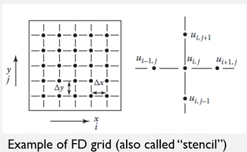 |
|:--:|
| Starting from the top and moving clockwise, these points are sometimes referred to as Center ($u_{i, j} = u(x_{0}, y_{0})$), North ($u_{i, j + 1} = u(x_{0}, y_{0} + \Delta y)$), East ($u_{i + 1, j} = u(x_{0} + \Delta x, y_{0})$), South ($u_{i, j - 1} = u(x_{0}, y_{0} - \Delta y)$), and West ($u_{i -1 , j} = u(x_{0} - \Delta x, y_{0})$). \\(\tag{18} \label{fig:stencil_example}\\) |

If $u$ is continuous, then approximation will be close to $\frac{\partial u}{\partial x}$ for a "sufficiently" small but finite $\Delta x$. The #MVT assures that the difference representation is exact for some point within the $\Delta x$ interval. We use a [[Taylor-Expansion]]:

$$\begin{split}
u(x_{0} + \Delta x, y_{0}) &= u(x_{0}, y_{0}) + \frac{\partial u}{\partial x}\Delta x + \frac{\partial^{2}u}{\partial x^{2}}\frac{(\Delta x)^{2}}{2!} + \cdots + \frac{\partial^{n}u}{\partial x^{n}}\frac{(\Delta x)^{n}}{n!} \\\\
\frac{\partial u}{\partial x} &= \frac{u(x_{0} + \Delta x, y_{0}) - u(x_{0}, y_{0})}{\Delta x} - \frac{\partial^{2}u}{\partial x^{2}}\frac{\Delta x}{2!} - \cdots - \frac{\partial^{n}u}{\partial x^{n}}\frac{(\Delta x)^{n - 1}}{n!} \\\\
 &= \frac{u_{i + 1, j} - u_{i, j}}{\Delta x} + T.E.
\end{split}$$

#TE is the truncation error, which is the difference between the actual partial derivative and its numerical approximation. We may use "big-O" notation with order of spacings: $\frac{\partial u}{\partial x} = \frac{u_{i + 1, j} - u_{i, j}}{\Delta x} + \converge{\Delta x}$. $\converge{\Delta x}$ does not tell the exact size of the #TE, but rather how it behaves as $\Delta x$ tends toward zero.

!!! attention
	Forward-difference representation ($1^{st}$ derivative)
	: $$\frac{\partial u}{\partial x} = \frac{u_{i + 1, j} - u_{i, j}}{\Delta x} + \converge{\Delta x}$$

	Backward-difference representation ($1^{st}$ derivative)
	: $$\begin{split}\frac{\partial u}{\partial x} &= \frac{u_{i, j} - u_{i - 1, j}}{\Delta x} + \converge{\Delta x} \\\\ \implies u(x_{0}, y_{0}) &= u(x_{0} + \Delta x, y_{0}) - \frac{\partial u}{\partial x}\Delta x + \frac{\partial^{2}u}{\partial x^{2}}\frac{(\Delta x)^{2}}{2!} - \frac{\partial^{3}u}{\partial x^{3}}\frac{(\Delta x)^{3}}{3!} + \cdots\end{split}$$

	Central-difference representation ($1^{st}$ derivative)
	: $$\frac{\partial u}{\partial x} = \frac{u_{i + 1, j} - u_{i - 1, j}}{\Delta x} + \converge{(\Delta x)^{2}}$$

	$2^{nd}$ derivative approximation
	: $$\frac{\partial^{2}u}{\partial x^{2}} = \frac{u_{i + 1, j} - 2u_{i, j} + u_{i - 1, j}}{(\Delta x)^{2}} + \converge{(\Delta x)^{2}}$$

	==These apply in other coordinate directions as well. Simply change the index assignments.==

!!! summary Some frequently used #FD approximations:
	- $1^{st}$ derivative approximation (2 or 3 grid points)
		- $\frac{\partial u}{\partial x} = \frac{u_{i + 1, j} - u_{i, j}}{h} + \converge{h}$
		- $\frac{\partial u}{\partial x} = \frac{u_{i, j} - u_{i - 1, j}}{h} + \converge{h}$
		- $\frac{\partial u}{\partial x} = \frac{u_{i + 1, j} - u_{i - 1, j}}{2h} + \converge{h^{2}}$
		- $\frac{\partial u}{\partial x} = \frac{-3u_{i, j} + 4u_{i + 1, j} - u_{i + 2, j}}{2h} + \converge{h^{2}}$
		- $\frac{\partial u}{\partial x} = \frac{3u_{i, j} - 4u_{i - 1, j} + u_{i - 2, j}}{2h} + \converge{h^{2}}$
	- $2^{nd}$ derivative approximation (3 grid points)
		- $\frac{\partial^{2} u}{\partial x^{2}} = \frac{u_{i, j} - 2u_{i + 1, j} + u_{i + 2, j}}{h^{2}} + \converge{h}$
		- $\frac{\partial^{2} u}{\partial x^{2}} = \frac{u_{i, j} - 2u_{i - 1, j} + u_{i - 2, j}}{h^{2}} + \converge{h}$
		- $\frac{\partial^{2} u}{\partial x^{2}} = \frac{u_{i + 1, j} - 2u_{i, j} + u_{i - 1, j}}{h^{2}} + \converge{h}$

	These may represent a decent library of formulations. The book contains more for higher-order approximations.

	| 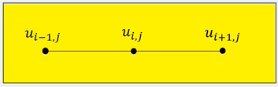 |
	|:--:|
	| Simple domain to demonstrate formulation of #FD approximations. \\(\tag{19} \label{fig:finite_difference_discretization_method_formulation_example}\\) |
	| 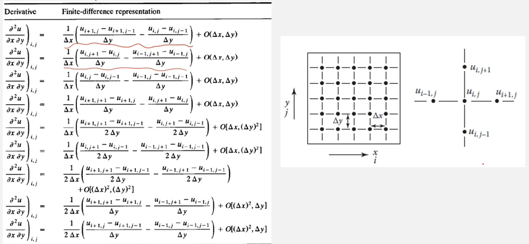 |
	|:--:|
	| So far, our derivatives have dealt only with a single variable, but derivatives can be mixed. \\(\tag{20} \label{fig:five_point_stencil_of_mixed_derivatives_example}\\) |

*[FD]: Finite Difference

#### Errors
- #TE
- #ROE and discretization error
- [[consistency]]
- [[stability]]
- [[convergence]] for propagation problems

*[ROE]: Round-Off Error

##### Truncation Error (TE)
The #TE associated with all derivatives in any single #PDE should be obtained by expanding about the same point (time and grid points). Let us consider a [[parabolic]], 1D heat equation.

The #FD approximation using forward and central differences lead to the #FDE minues the #TE.

*[FDE]: Finite Difference Equation

This given #FDE is an [[explicit]] scheme: to find a solution at time step $n + 1$, only one unknown exists. [[explicit]] scheme uses all knowns to find one unknown. An [[implicit]] form could be used as well: e.g. if the solution, $u$ is evaluated at time step, $n + 1$ (in #RHS, $u_{j + 1}^{n + 1} - 2u_{j}^{n + 1} + u_{j - 1}^{n + 1}$). We only know $u_{j}^{n}$. In this [[implicit]] case, we need #SOE to simultaneously solve three unknowns.

*[SOE]: System of Equations

We solve the heat equation using #FDE with hope that #TE is sufficiently small. But how do we know that the difference representation is acceptable and that a [[marching-solution]] technique will work in the sense of giving an approximate solution to the #PDE? ==For the solution to be acceptable, the difference approximation must be [[consistent]] and [[stable]].==

##### ROE and Discretization Error
#ROE are attributable to digital computers representing numbers with a finite number of digits. In #FDE, the large number of dependent, repetitive operations are usually involved. In some calculations, the magnitude of the #ROE is proportional to number of grid points. In these cases, increasing grid resolution may decrease #TE but increase #ROE. [[discretization-error]] is round-off free error in the solution of the #PDE that is caused by replacing the continuous #PDE with a discrete approximation. [[discretization-error]] is caused by #TE and any errors introduced by the #BC. The difference between the exact solution of #PDE and the computer solution to #FDE would be close to the sum of the [[discretization-error]] and the #ROE involved with the #FD calculations (there could be other errors coming from various aspects).

!!! example Mantle Convection Problem
	Earth is broken into three substructures. Calculating grain size and growth with subsequent mechanical properties (which require different material definitions in these 3 groups) there exists very low values at interface boundaries. It turns out, this visualization problem automatically interpolates between grid points, which are not necessarily the same spacing or size. This made a bad transition between layers. Nothing wrong with code, just a bad visualization.

---

*Lecture: November 08, 2021*
### Consistency
An FDE is said to be [[consistent]] if, in the limit of vanishing mesh and time spacing size, $h$, the FDE approaches the #PDE: $$\underset{h \rightarrow 0}{\lim}(pde - fde) = \underset{h \rightarrow 0}{\lim}(T.E.) = 0$$ Generally, it is true for most of problems; however, thare may be some cases where it isn't.

!!! example [[DuFort-Frankel-Method]] for [[parabolic]] heat equation:
	$$\require{cancel} \frac{u_{j}^{n + 1} - u_{j}^{n - 1}}{2\Delta t} = \frac{\alpha}{(\Delta x)^{2}}\bigg(u_{j + 1}^{n} - u_{j}^{n + 1} - u_{j}^{n - 1} + u_{j - 1}^{n}\bigg) + \frac{\alpha}{12}\frac{\partial^{4}u}{\partial x^{4}}(\Delta x)^{2} - \frac{\partial^{2}u}{\partial t^{2}}\cancelto{r^{2}}{\bigg(\frac{\Delta t}{\Delta x}\bigg)^{2}} - \frac{1}{6}\frac{\partial^{3}u}{\partial t^{3}}(\Delta t)^{2}$$ This method will be consistent if $\underset{\Delta x, \Delta t \rightarrow 0}{\lim}(\frac{\Delta t}{\Delta x}) = 0$ (strange...). But, what if $\Delta x$ and $\Delta t$ approach zero at an equal rate: $\frac{\Delta t}{\Delta x} = \gamma$. Then this method becomes consistent with the following [[hyperbolic]] equation: $$\frac{\partial u}{\partial t} + \alpha\gamma^{2}\frac{\partial^{2}u}{\partial t^{2}} = \alpha\frac{\partial^{2}u}{\partial x^{2}}$$

### Stability
For a consistent numerical scheme to be convergent, a required property is [[stability]]. A stable numerical scheme is one for which errors from any source (#ROE, #TE, mistakes, etcetera) are not permitted to grow as the computation proceeds from one marching step to the next.

- Strictly only applicable for marching problems.
- [[Fourier-Stability-Analysis]] (a.k.a. [[von-Neumann-Stability-Analysis]])

Can use the central-time difference scheme for heat equation: $$\frac{u_{j}^{n + 1} - u_{j}^{n - 1}}{2\Delta t} = \frac{\alpha}{(\Delta x)^{2}}\bigg(i_{j + 1}^{n} - 2u_{j}^{n} + u_{j - 1}^{n}\bigg) + \converge{\Delta t^{2}, \Delta x^{2}}$$ This method is [[unconditionally-unstable]] even though the error term has higher orders: will not converge. Sometimes an [[unstable]] method can be identified with physical implausibility because [[unstable]] numerical procedures cause unacceptable modeling of the problem.

!!! attention
	Perform this stability analysis in project.

A simple, explicit scheme would be [[stable]] only if $r = \bigg[\frac{\alpha\Delta t}{(\Delta x)^{2}}\bigg] \leq \frac{1}{2}$. Let's consider an explicit method for the heat equation: $$\frac{u_{j}^{n + 1} - u_{j}^{n}}{\Delta t} = \frac{\alpha}{(\Delta x)^{2}}\bigg(u_{j + 1}^{n} - 2u_{j}^{n} + u_{j - 1}^{n}\bigg) \rightarrow u_{j}^{n + 1} = r(u_{j + 1}^{n} + u_{j - 1}^{n}) + (1 - 2r)u_{j}^{n}$$ If $r = 1$ (i.e. [[unstable]]), then the temperature on grid point, $j$ will be $200\degreeC$ which is physically impossible because the temperatures of surrounding grid points are $100\degreeC$.

| 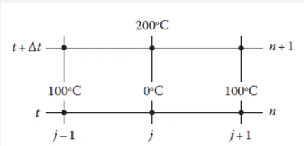 |
|:--:|
| Neighboring grid points cannot be spontaneously different in temperature. \\(\tag{21} \label{fig:stability_example}\\) |

### Convergence for Marching Problems
Such #PDE may be [[parabolic]] or [[hyperbolic]] problems because [[elliptic]] does not pertain to time. *Generally, a [[consistent]] and [[stable]] scheme is convergent.* Convergence means that the solution to the #FDE approaches the solution of the #PDE with the same #IC and #BC as the mesh is refined.

!!! note [[Lax-Equivalence-Theorem]]
	Given a [[well-posed]] #IVP and #FDM to it that satisfies the [[consistency]] condition, [[stability]] is the **necessary and sufficient condition for convergence**.

**Most of the time, we assume that the [[Lax-Equivalence-Theorem]] is satisfied even though it has never been proved for non-linear equations.**

### Stability Analysis
Let us consider a simple, [[explicit]] approximation to the heat equation: $$u_{j}^{n + 1} = \alpha\frac{\Delta t}{(\Delta x)^{2}}\bigg(u_{j + 1}^{n} - 2u_{j}^{n} + u_{j - 1}^{n}\bigg) + u_{j}^{n}$$

- $D$: the exact solution of the #FDE.
- $N$: the numerical solution of the #FDE using a computer having finite digits.
- $A$: the analytical solution of the #PDE
- ==*Discretization Error = $A - D$*==
- ==*Round-Off Error (#ROE) = $N - D$*==

Determining [[stability]] for a certain numerical scheme is easier rather than showing [[convergence]]. Based on [[Lax-Equivalence-Theorem]], we focus on the [[stability]] instead of directly analyzing the [[convergence]].

#### von Neumann
!!! note Theorem
	An #FD scheme $Pu^{\*} = 0$, where $u^{\*}$ is an approximated solution to the true solution, $u$ is [[stable]] if $$||{u^{\*}}^{n + 1}|| \leq (1 + c\Delta t)||u^{n}||\text{,}$$ for some $c \geq 0$ independent of $\Delta t$, and $n$ is the time step.

The exact solution, $D$ and the error, $\epsilon$ must both satisfy the same difference equation, which means that the *the #ROE and the exact, numerical solution both have the same growth property in time and either could be used to examine [[stability]]*. Any perturbation of the input values at the $n^{th}$-time leve will either be prevented from growing without bound for a [[stable]] system or will grow larger for an [[unstable]] system.

==*Numerical Solution: $N = D + \epsilon$*==

We use the [[Fourier-Transform]] that transfers a time-spatial domain to a frequency domain. Suppose $u_{j}$ is a function on grid points and $\hat{u}(\xi)$ the corresponding function on the frequency domain. The [[Fourier-Transform]] of this function:...

We apply the function on the frequency domain: $$u_{j} = \frac{1}{\sqrt{2\pi}}\int_{-\infty}^{+\infty}\boxed{e^{ij\Delta x\xi}\hat{u}(\xi)}d\xi$$

!!! example Heat equation with Forward-Euler.
	$$\begin{split}
	\frac{(u_{j}^{n + 1} - u_{j}^{n})}{\Delta t} &= \frac{\alpha}{(\Delta x)^{2}}\bigg(u_{j + 1}^{n} - 2u_{j}^{n} + u_{j - 1}^{n}\bigg) \text{, } \mu = \frac{\alpha\Delta t}{(\Delta x)^{2}} \\\\
	u_{j}^{n + 1} &= \mu u_{j + 1}^{n} + (1 - 2\mu)u_{j}^{n} + \mu u_{j - 1}^{n} \\\\
	 &= \frac{1}{\sqrt{2\pi}}\int_{-\infty}^{+\infty}\boxed{e^{ij\Delta x\xi}\hat{u}^{n + 1}(\xi)}d\xi = \frac{1}{\sqrt{2\pi}}\int_{-\infty}^{+\infty}\mathscr{F}(\xi)d\xi \\\\
	\mathscr{F}(\xi) &= (\mu e^{i(j + 1)\Delta x}\hat{u}^{n}(\xi) + (1 - 2\mu)e^{i(j)\Delta x\xi}\hat{u}^{n}(\xi) + \mu e^{i(j - 1)\Delta x\xi}\hat{u}^{n}(\xi)) \\\\
	 &= \boxed{e^{ij\Delta x\xi}\hat{u}^{n}(\xi)\big(\mu e^{i\Delta x\xi} + (1 - 2\mu) + \mu e^{-i\Delta x\xi}\big)} \\\\
	\hat{u}^{n + 1} &= \big(\mu e^{i\Delta x\xi} + (1 - 2\mu) + \mu e^{-i\Delta x\xi}\big)\hat{u}^{n}
	\end{split}$$

	!!! question Is $i$ an indexing number? <cite> DK
		No. $i$ is the imaginary component for the [[Fourier-Transform]]! **Only $j$ is the index here!**

	Subsituting $\nu = \Delta x\xi$,

	$$\begin{split}
	\hat{u}^{n + 1} &= \big(\mu e^{i\nu} + (1 - 2\mu) + \mu e^{-	i\nu}\big)\hat{u}^{n} \\\\
	 &= G\hat{u}^{n}
	\end{split}$$

	G is called the [[amplification-factor]]. We would like to have $|G| \leq 1$ for [[stability]]!

	$$\begin{split}
	G &= \mu e^{i\nu} + (1 - 2\mu) + \mu e^{-i\nu} \\\\
	 &= (1 - 2\mu) + 2\mu\cos(\nu) = 1 - 4\mu\sin^{2}(\frac{\nu}{2}) \\\\
	|G| &= \bigg|1 - 4\mu\sin^{2}(\frac{\nu}{2})\bigg| \leq 1
	\end{split}$$

	!!! info
		Recall that:
		$$\begin{split}
		e^{i\beta} &= \cos(\beta) + i\sin(\beta) \\\\
		\cos(\beta) &= \frac{e^{i\beta} + e^{-i\beta}}{2} \\\\
		\sin(\beta) &= \frac{e^{i\beta} - e^{-i\beta}}{2} \\\\
		\sin^{2}(x) &= \frac{1}{2}(1 - \cos(2x)
		\end{split}$$

	!!! attention
		This scheme is only stable **if and only if** $0 \leq \mu \leq \frac{1}{2}$

---

*Lecture: November 10, 2021*

The [[amplification-factor]], $G$ is a function of the frequency (recalling that $\nu = \Delta x\xi$). IF we think of the solution being represented by a [[Fourier-Series]], we see that the [[damping]] of a given term in that series depends on the $\nu$ associated with that term: potential distortion of the relationships between the terms in the series...

*insert image*

Simpler Steps:
1. Replace $u_{j}^{n}$ with $\hat{u}^{n}e^{ij\nu}$ for each $j$ and $n$.
2. Find the condition for the [[stability]].

!!! example Heat equation with *Forward-Euler*:
	!!! attention
		**This will be in the exam!!!**

	$$\begin{split}
	u_{j}^{n + 1} &= \mu u_{j + 1}^{n} + (1 - 2\mu)u_{j}^{n} + \mu u_{j - 1}^{n} \\\\
	e^{i(j)\nu}\hat{u}^{n + 1} &= \mu e^{i(j + 1)\nu}\hat{u}^{n} + (1 - 2\mu)e^{i(j)\nu}\hat{u}^{n} + \mu e^{i(j - 1)\nu}\hat{u}^{n} \\\\
	e^{i(j)\nu}\hat{u}^{n + 1} &= \mu e^{i(j)\nu}\big(\mu e^{i\nu} + (1 - 2\mu) + \mu e^{-i\nu}\hat{u}^{n}\big)\hat{u}^{n}
	\end{split}$$

!!! example Heat equation with the simple implicit: $$\frac{(u_{j}^{n + 1} - u_{j}^{n})}{\Delta t} = \frac{\alpha}{(\Delta x)^{2}}\big(u_{j + 1}^{n + 1} - 2u_{j}^{n + 1} + u_{j - 1}^{n + 1}\big)$$

	1. Replace $u_{j}^{n}$ with $\hat{u}^{n}e^{i(j)\nu}$ for each $j$ and $n$.

	$$\begin{split}
	u_{j}^{n + 1} &= \mu u_{j + 1}^{n + 1} - 2\mu u_{j}^{n + 1} + u_{j - 1}^{n + 1} + u_{j}^{n} \text{, } \mu = \frac{\alpha\Delta t}{(\Delta x)^{2}} \\\\
	\hat{u}^{n + 1}e^{i(j)\nu} &= \mu\hat{u}^{n + 1}e^{i(j + 1)\nu} - 2\mu\hat{u}^{n + 1}e^{i(j)\nu} + \mu\hat{u}^{n + 1}e^{i(j - 1)\nu} + \hat{u}^{n}e^{i(j)\nu} \\\\
	\hat{u}^{n + 1}e^{i(j)\nu} &= e^{i(j)\nu}\big(\mu e^{i(j)\nu} - 2\mu + \mu e^{-i\nu}\big)\hat{u}^{n + 1} + \hat{u}^{n}e^{i(j)\nu} \\\\
	\hat{u}^{n + 1} &= \frac{1}{-(\mu e^{i\nu} - 2\mu - 1 + \mu e^{-i\nu})}\hat{u}^{n} = \frac{1}{2\mu  + 1 - 2\mu\cos(\nu)}\hat{u}^{n} = \frac{1}{1 + 4\mu\sin^{2}(\frac{\nu}{2})}\hat{u}^{n} \\\\
	\Bigg|\frac{1}{1 + 4\mu\sin^{2}(\frac{\nu}{2})}\Bigg| &\leq 1 \\\\
	1 + 4\mu\sin^{2}(\frac{\nu}{2}) &\leq -1 \\\\
	1 + 4\mu\sin^{2}(\frac{\nu}{2}) &\geq 1 \\\\
	\therefore \mu &\geq 0
	\end{split}$$

	**This is unconditionally stable!**

---

*Lecture: November 12, 2021*

!!! example Heat equation with the Crank-Nicholson: $$\frac{(u_{j}^{n + 1} - u_{j}^{n})}{\Delta t} = \frac{\alpha}{(\Delta x)^{2}}\bigg(\frac{\big(u_{j + 1}^{n + 1} - 2u_{j}^{n + 1} + u_{j - 1}^{n + 1}\big)}{(\Delta x)^{2}} + \frac{\big(u_{j + 1}^{n} - 2u_{j}^{n} + u_{j - 1}^{n}\big)}{(\Delta x)^{2}}\bigg)$$

	1. Replace $u_{j}^{n}$ with $\hat{u}^{n}e^{i(j)\nu}$ for each $j$ and $n$.

	$$\begin{split}
	u_{j}^{n + 1} &= \frac{1}{2}\bigg(\mu u_{j + 1}^{n + 1} - 2\mu u_{j}^{n + 1} + \mu u_{j - 1}^{n + 1} + \mu u_{j + 1}^{n} - 2\mu u_{j}^{n} + \mu u_{j - 1}^{n}\bigg) + u_{j}^{n} \text{, } \mu = \frac{\alpha\Delta t}{(\Delta x)^{2}} \\\\
	\hat{u}^{n + 1}e^{i(j)\nu} &= \frac{1}{2}\bigg(\mu\hat{u}^{n + 1}...e^{i(j + 1)\nu} - 2e^{i(j)\nu} + e^{i(j - 1)\nu}\big) + \mu\hat{u}^{n}\big(e^{i(j + 1)\nu} - 2e^{i(j)\nu} + e^{i(j - 1)\nu}\big) + \hat{u}_{j}^{n}e^{i(j + 1)\nu} \\\\
	\hat{u}^{n + 1}e^{i(j)\nu} &= e^{i(j)\nu}\big(\mu e^{i(j)\nu} - 2\mu + \mu e^{-i\nu}\big)\hat{u}^{n + 1} + \hat{u}^{n}e^{i(j)\nu} \\\\
	\hat{u}^{n + 1} &= \frac{1}{-(\mu e^{i\nu} - 2\mu - 1 + \mu e^{-i\nu})}\hat{u}^{n} = \frac{1}{2\mu  + 1 - 2\mu\cos(\nu)}\hat{u}^{n} = \frac{1}{1 + 4\mu\sin^{2}(\frac{\nu}{2})}\hat{u}^{n}
	\end{split}$$

	2. Find the condition for [[stability]].

	$$\begin{split}
	G = \Bigg|\frac{1 + \mu(\cos(\nu) - 1)}{1 - \mu(\cos(\nu) - 1)}\Bigg| &\leq 1 \\\\
	 = \Bigg|\frac{1... + \mu(\cos(\nu) - 1)}{1 - \mu(\cos(\nu) - 1)}\Bigg| &\leq 1 \\\\
	1 + 4\mu\sin^{2}(\frac{\nu}{2}) &\geq 1 \\\\
	\therefore \mu &\geq 0
	\end{split}$$

!!! example 2D heat equation with *Forward-Euler*: $$\frac{(u_{i, j}^{n + 1} - u_{i, j}^{n})}{\Delta t} = \alpha\bigg(\frac{\big(u_{i + 1, j}^{n} - 2u_{i, j}^{n} + u_{i - 1, j}^{n}\big)}{(\Delta x)^{2}} + \frac{\big(u_{i, j + 1}^{n} - 2u_{i, j}^{n} + u_{i, j - 1}^{n}\big)}{(\Delta y)^{2}}\bigg)$$
	
	1. Replace $u_{k, l}^{n}$ with $\hat{u}^{n}e^{i((k)\nu + (l)w)}$ for each $k$, $l$, and $n$.

	$$\begin{split}
	u_{k, l} &= \frac{1}{\sqrt{2\pi}}\int\int_{-\infty}^{+\infty}\big(e^{i(k\Delta\xi_{x} + l\Delta y\xi_{y})}\big)\hat{u}(\xi)d\xi_{x}d\xi_{y} \\\\
	\implies \frac{(u_{i, j}^{n + 1} - u_{i, j}^{n})}{\Delta t} &= \alpha\bigg(\frac{\big(u_{i + 1, j}^{n} - 2u_{i, j}^{n} + u_{i - 1, j}^{n}\big)}{(\Delta x)^{2}} + \frac{\big(u_{i, j + 1}^{n} - 2u_{i, j}^{n} + u_{i, j - 1}^{n}\big)}{(\Delta y)^{2}}\bigg) \\\\
	u_{i, j}^{n + 1} &= \alpha\Delta t\bigg(\frac{\big(u_{i + 1, j}^{n} - 2u_{i, j}^{n} + u_{i - 1, j}^{n}\big)}{(\Delta x)^{2}} + \frac{\big(u_{i, j + 1}^{n} - 2u_{i, j}^{n} + u_{i, j - 1}^{n}\big)}{(\Delta y)^{2}}\bigg) + u_{i, j}^{n}
	\hat{u}^{n + n}e^{i((k)\nu + (l)w)} &= \mu\big(\hat{u}^{n}e^{i((k + 1)\nu + (l)w)} - 2\hat{u}^{n}e^{i((k)\nu + (l)w)} + \hat{u}^{n}e^{i((k - 1)\nu + (l)w}\big) + \rho\big(\hat{u}^{n}e^{i((k)\nu + (l + 1)w)} - 2\hat{u}^{n}e^{i((k)\nu + (l)w)} + \hat{u}^{n}e^{i((k)\nu + (l - 1)w)}\big) + \hat{u}^{n}e^{i((k)\nu + (l)w)} \text{, } \mu = \frac{alpha\Delta t}{(\Delta x)^{2}} \text{, } \rho = \frac{\alpha\Delta t}{(\Delta y)^{2}} \\\\
	\hat{u}^{n + n}e^{i((k)\nu + (l)w)} &= e^{i((k)\nu + (l)w)}\bigg(\mu\big(e^{i\nu} - 2 + e^{-i\nu}\big) + \rho\big(\dots\hat{u}^{n}e^{i((k)\nu + (l + 1)w)} - 2\hat{u}^{n}e^{i((k)\nu + (l)w)} + \hat{u}^{n}e^{i((k)\nu + (l - 1)w)}\big)\bigg)\hat{u}^{n} + \hat{u}^{n}e^{i((k)\nu + (l)w)} \text{, } \mu = \frac{alpha\Delta t}{(\Delta x)^{2}} \text{, } \rho = \frac{\alpha\Delta t}{(\Delta y)^{2}} \\\\
	\end{split}$$

	2. Find the condition for [[stability]].

!!! example Lax scheme for linear, convection equation: $$u_{j}^{n + 1} = \frac{u_{j + 1}^{n} + u_{j - 1}^{n}}{2} - c\frac{\Delta t}{\Delta x}\bigg(\frac{u_{j + 1}^{n} - u_{j - 1}^{n}}{2}\bigg) \text{, } c = \text{ wave speed}$$
	
	1. Replace $u_{j}^{n}$ with $\hat{u}^{n}e^{i(j)\nu}$ for each $j$ and $n$.

	2. Find the condition for [[stability]].

	$$\begin{equation}
	C = c\frac{\Delta t}{\Delta x}
	\label{eq:courant_number}
	\end{equation}$$

	| 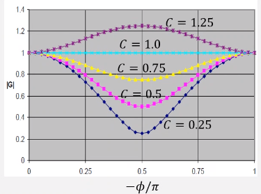 |
	|:--:|
	| [[Courant-Number]] (Eq. \eqref{eq:courant_number}) phase diagram. \\(\tag{22} \label{fig:lax_scheme_linear_convection_stability_example}\\) |

	$$\begin{split}
	\hat{u}^{n + 1} &= (\cos(\nu) - iC\sin(\nu))\hat{u}^{n} \\\\
	\big|G\big| &= \big|(\cos(\nu) - iC\sin(\nu))\big| \leq 1 \\\\
	1 + (C^{2} - 1)\sin^{2}(\nu) &\leq 1
	\end{split}$$

	We have a *complex* [[amplification-factor]]. ==This scheme is [[stable]] if $|G| \leq 1$!== This is also called the [[Courant-Friedrichs-Lewy-Condition]].

	*[CFL]: Courant-Friedrichs-Lewy Condition

	$$\begin{split}
	G &= \cos(\nu) - iC\sin(\nu) = \sqrt{\cos^{2}(\nu) + C^{2}\sin^{2}(\nu)} = |G|e^{i\phi} \\\\
	 &= \sqrt{\cos^{2}(\nu) + C^{2}\sin^{2}(\nu)}\big(e^{i\tan^{-1}(-C\tan(\nu))}) \\\\
	\phi &= \tan^{-1}\bigg(\frac{-C\tan(\nu)}{\cos(\nu)}\bigg) = \boxed{\tan^{-1}(-C\tan(\nu))} \text{, } \phi = \text{ phase angle}
	\end{split}$$

	The imaginary part of $G$ represents the [[phase-shift]]: a potential distortion of the relationships between the terms in a series that represents the solution. At $C = 1$, all frequency components are propagated without [[attenuation]]. For $C < 1$, the midrange frequency components have severe [[attenuation]].

	| 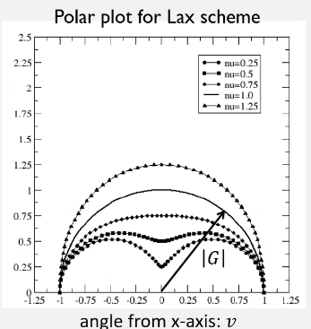 |
	|:--:|
	| The radius is $|G|$, where each data set is a different $\nu$. \\(\tag{23} \label{fig:polar_plot_for_lax_scheme}\\) |

	Physical interpretation of the #CFL: information cannot propagate more than one grid spacing during a time step.

	$$\begin{split}
	|C| &= \bigg|c\frac{\Delta t}{\Delta x} \leq 1 \\\\
	c\Delta t &\leq \Delta x \\\\
	\bigg(\frac{\Delta t}{\Delta x}\bigg)^{2} &\leq \frac{1}{c^{2}}
	\end{split}$$

	#CFL requires that the analytic domain of influence lie within the numerical domain of influence. The slope of propagation must be smaller than (within) the [[characteristic-path]]: $\frac{dt}{dx} = \pm \frac{1}{c}$.

	!!! attention Exam Hint
		Content pertaining the definitions and differences of parabolic, elliptic, and hyperbolic equations will be included.

---

*Lecture: November 15, 2021*
#### Boundedness
Numerical solutions should lie within proper bounds. E.g. physical quantities such as density and kinetic energy of turbulence must be positive, while concentration should be between $0$ and $1$. In the absence of sources and sinks, some variables are required to have maximum and minimum values on the boundary of the domain. This property is also called the [[maximum-principle]].

#### Equilibrium Problems
Many of the ideas for [[marching-problems]] are applicable to equilibrium problems excepting the [[stability]]. [[convergence]] for equilibrium problems is a different concept:

- Algebraic system of equations that needs to be solved only once rather than marching ([[stability]] not applicable).
- We need to control the error in solving the equations as the mesh is refined for "truncation convergence".
- Many common schemes are iterative: e.g. [[Gauss-Seidel]].
- Iteration convergence implies that the changes between successive iterations can be made as small as we wish for every gird point ($|u_{i, j}^{n + 1} - u_{i, j}^{n+1}| < \epsilon$).
- Direct solvers can also be used without iterations.

!!! hint
	After sufficient time, project becomes steady-state. Compare this to elliptic solution!

---

*Lecture: November 17, 2021*

!!! attention Homework 3
	This will be the last one! Dr. Cho will send it today or tomorrow, and this will be due the Friday after Thanksgiving Week.

!!! note Final Project
	Presentation due and given Dec. XX. Write-up article will be due by exam.

!!! attention Final Exam
	Cummulative!!!

#### Conservation
When the equations to be solved are from conservation laws, the numerical scheme should respect these laws both locally and globally. This means that the amount of a conserved quantity leaving a control volume is equal to the amount entering to adjacent control volumes. If divergence form of equations, $\nabla\dot{u}$, and a finite volume method is used, this is readily guaranteed for each, individual control volume and for the whole solution domain. Non-conservative schemes may produce some artificial sources or sinks, changing the balance locally or globally. However, non-conservative schemes can be consistent and stable, and may therefore elad to correct solutions in the limit of mesh refinement; error due to non-conservation is appreciable in most cases only when the mesh is not fine enough. *The problem is that it is difficult to know on which mesh the non-conservation error is small enough.* Conservative schemes are thus preferred.

This idea of [[conservation]] may be more applicable to #CFD people using a control volume. Under limited conditions

*[CFD]: Computational Fluid Dynamics

[[conservation]] is a property of #FDE. #PDE of interest are based on physical conservation statements and are valid for the local region around a point as well as globally. A #FD scheme that maintains a discrete version of the conservation statement exactly for any mesh size over an arbitrary, finite region has the conservative property. In essence, we check to see if the discretized version of the divergence theorem is satisfied: all internal points cancel and only boundary points representing boundary fluxes remain:

$$\begin{equation}
\nabla\cdot\rho\mathbf{V} = 0
\label{eq:steady_flow_continuity}
\end{equation}$$

$$\begin{equation}
\iiint\nabla\cdot\rho\mathbf{V}dR = \oiint\rho\mathbf{V}\cdot\mathbf{n}dS
\label{eq:application_of_divergence_theorem}
\end{equation}$$

### Application of Numerical Methods on Hyperbolic PDE
This is involved with the second-derivative to time of equations: often referred to as a wave-equation. This may also be called "linear convection equation". We begin with the #IVP:

$$\begin{equation}
\begin{split*}
\frac{\partial u}{\partial t} + c\frac{\partial u}{\partial x} &= 0 \text{, } -\infty < x < \infty \text{, } t > 0 \text{, } c > 0 \\\\
u(x, 0) &= F(x) \text{, } -\infty < x < \infty \text{, } F(x) \text{: IC function} \\\\
\implies u(x, t) &= F(x - ct) \text{(Exact solution)}
\end{split*}
\label{eq:linear_convection}
\end{equation}$$

The solution represents a wave moving from left to right as speed, $c$. This requires specification of periodic, #IC and "reentrant" boundaries.

!!! question Is this not a parabolic form because this is a first-derivative wrt time? <cite> Daniel K.
	This still shows behavior seen in second-derivative wrt time equations, but not equivalent.

#### Euler Explicit
Two methods that do not work:
1. $\frac{u_{j}^{n + 1} - u_{j}^{n}}{\Delta t} + c\frac{u_{j + 1}^{n} - u_{j - 1}^{n}}{2\Delta x} = 0$
2. $\frac{u_{j}^{n + 1} - u_{j}^{n}}{\Delta t} + c\frac{u_{j + 1}^{n} - u_{j - 1}^{n}}{2\Delta x} = 0$

This is **unconditionally unstable**.

#### Upstream Method
Using a forward time difference and backward space difference make the solution [[stable]].

$$\begin{split}
\frac{u_{j}^{n + 1} - u_{j}^{n}}{\Delta t} + c\frac{u_{j}^{n} - u_{j - 1}^{n}}{\Delta x} &= 0 \\\\
u_{j}^{n + 1} &= u_{j}^{n} - \mathscr{v}(u_{j}^{n} - u_{j - 1}^{n}) = (1 - \mathscr{v})u_{j}^{n} + \mathscr{v}u_{j - 1}^{n} \text{, where } \mathscr{v} = \frac{c\Delta t}{\Delta x} \\\\
\boxed{\frac{\partial u}{\partial t} + c\frac{\partial u}{\partial x}} &= \boxed{-\frac{\Delta t}{2}\frac{\partial^{2}u}{\partial t^{2}} + \frac{c\Delta x}{2}\frac{\partial^{2}u}{\partial t^{2}} - \frac{(\Delta t)^{2}}{6}\frac{\partial^{3}u}{\partial t^{3}} - \frac{(c\Delta x)^{2}}{6}\frac{\partial^{3}u}{\partial x^{3}}}
\end{split}$$

The LHS represents the #PDE and the RHS is the #TE. Recall that $\mathscr{v}$ here is actually the (Eq. \eqref{eq:courant_number}).

For the stability analysis, the [[Courant-Number]], $0 \leq C \leq 1$.

$\dots$

This can be modified by replacing higher-order, temporal derivatives with spatial derivatives. The solution to the #PDE, in general, does not satisfy the difference equation, so must use #PDE+#TE to define the derivatives (which can be painful).

$$\begin{equation}
\begin{split}
\frac{\partial u}{\partial t} &= -c\frac{\partial u}{\partial t} + \converge{\Delta^{2}} \\\\
\implies\boxed{\frac{\partial u}{\partial t} + c\frac{\partial u}{\partial x} &= \frac{c\Delta x}{2}(1 - v)\frac{\partial^{2}u}{\partial x^{2}} - \frac{(c\Delta x)^{2}}{6}(2v^{3}\dots)}
\end{split}
\label{eq:modified_upstream}
\end{equation}$$

The shift condition, $u_{j}^{n + 1} = u_{j - 1}^{n}$ (recalling: $u_{j}^{n + 1} = (1 - v)u_{j}^{n} + vu_{j - 1}^{n}) allows the #FDE to becomes the exact solution to the #PDE when $v = 1$. Artificial viscosity (numerical viscosity or numerical diffusion) is viscous like: $$\frac{c\Delta x}{2}(1 - v)\frac{\partial^{2}u}{\partial x^{2}},$$ when $v \neq 1$. This is typical of first-order methods. Dissipative effect is a result of even-order derivatives in #TE. Effect of odd-ordered derivatives is that phase relations between the various waves are distorted (dispersion): $$-\frac{(c\Delta x)^{2}}{\dots}$$

| 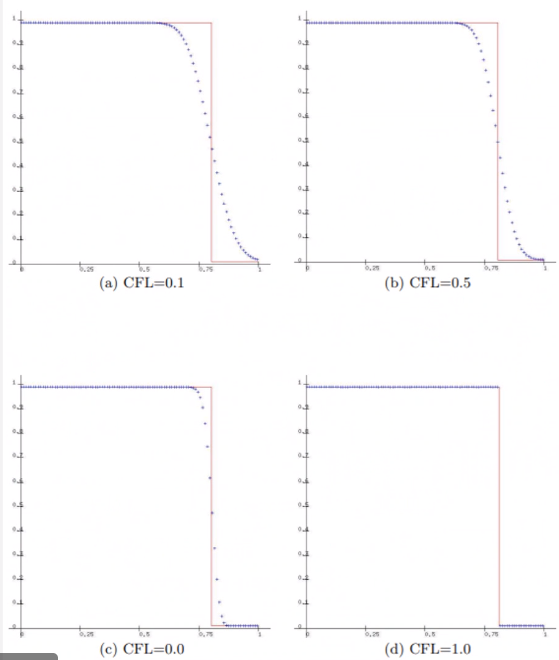 |
|:--:|
| Example of upwind scheme for linear advection equation becomes the exact solution. \\(\tag{25} \label{fig:example_of_upstream}\\) |

| 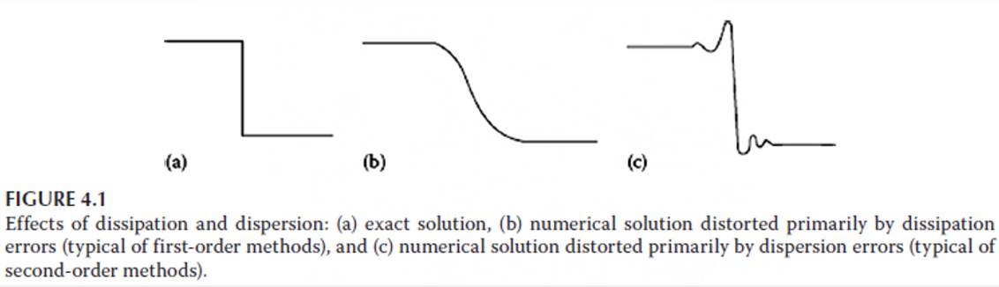 |
|:--:|
| Effects of numerical diffusion near a sharp gradient (discontinuity). \\(\tag{26} \label{fig:effects_of_numerical_diffusion_example}\\) |

In general, if the lowest-order term in the #TE contains an **even derivative**, then the resulting solution will **predominantly exhibit dissipative errors**.

---

*Lecture: November 19, 2021*

!!! attention Closing Thoughts for Class
	- Prepare for a 10 min. presentation.
	- We will finish hyperbolic today.
	- We may get to multi-grid solver.
	- Dr. Cho wanted to get to Finite Element and Volume Methods.
	- However, there is a dedicated Finite Element class. The purpose of this #PDE course was give mathematical understanding to these solvers.

##### Exact Amplitude and Phase
Assume solution of the $u = e^{at}e^{ik_{m}}x$ and substitute into #PDE and solve for $a$: $$u = e^{ik_{m}(x - ct)}$$

##### Relative Phase Error
- Leading (wave travels too fast compared to exact solution)
- Lagging (wave travels slower than exact solution)
- Notice that amplitude and phase are dependent upon the frequency of the specific component through $\beta$.

##### Amplification Factor
$$\begin{equation}
G = (1 - v + v\cos(\beta) - iv\sin(\beta))
\label{eq:upstream_amplification_factor}
\end{equation}$$

| 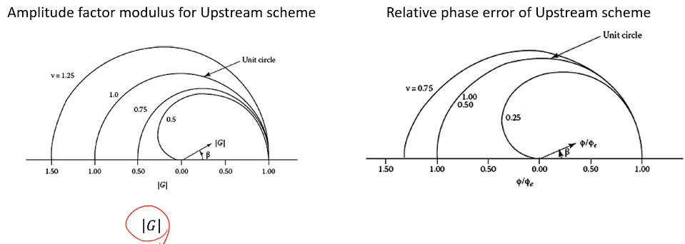 |
|:--:|
| Recall amplitude is related to [[dissipative-error]], and phase is related to [[dispersive-error]]. \\(\tag{25} \label{fig:upstream_amplification_factor}\\) |

#### Lax Method
The Euler method can be changed to a stable form by replacing $u_{j}^{n}$ with the spatial, average value $\frac{u_{j + 1}^{n} + u_{j - 1}^{n}}{2}$ in time difference (explicit).

$$\begin{equation}
\begin{split}
\frac{u_{j}^{n + 1} - \frac{1}{2}(u_{j + 1}^{n} + u_{j - 1}^{n})}{\Delta t} + c\frac{(u_{j + 1}^{n} - u_{j - 1}^{n})}{2\Delta x} &= 0 \text{, where T.E.: } \converge{\Delta t, \frac{(\Delta x)^{2}}{\Delta t}} \\\\
u_{j}^{n + 1} &= \frac{1}{2}(u_{j + 1}^{n} + u_{j - 1}^{n}) - \frac{v}{2}(u_{j + 1}^{n} + u_{j - 1}^{n}) = \frac{1 - v}{2}u_{j + 1}^{n} + \frac{1 + v}{2}u_{j - 1}^{n} \text{, } v = \frac{c\Delta t}{\Delta x} \dots
\end{split}
\label{eq:lax_method}
\end{equation}$$

This method is **not guaranteed to be consistent** because $\frac{(\Delta x)^{2}}{\Delta t}$ may not go to zero in the limit to zero of $\Delta x$ and $\Delta t$. If $v$ is held constant, the method becomes [[consistent]]. When $v \neq 1$, the [[Lax-Method]] has a large [[dissipation-error]] (because #TE #RHS has even derivative).

| 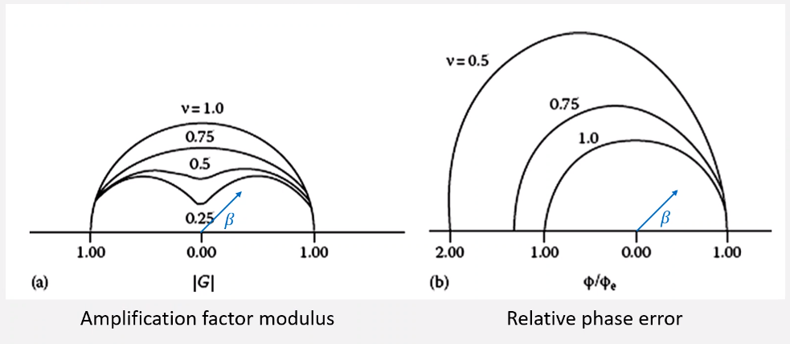 |
|:--:|
| This can be observed in the [[amplification-factor]], $G = \cos(\beta) - iv\sin(\beta)$ and the [[relative-phase-error]], $\frac{\phi}{\phi_{e}} = \frac{\tan^{-1}(-v\tan(\beta))}{-\beta v}$. \\(\tag{26} \label{fig:lax_method_amplification_factor_and_relative_phase_error}\\) |

#### Leap Frog Method
Thus far, we have studied **first-order** methods accurate for the linear wave equation. [[Leap-Frog-Method]] is the simplest, **second-order** accurate method. An explicit, one-step, three-time-level scheme for the first-order wave equation:

$$\begin{equation}
\frac{u_{j}^{n + 1} - u_{j}^{n - 1}}{2\Delta t} + c\frac{u_{j + 1}^{n} - u_{j - 1}^{n}}{2\Delta x} = 0 \text{, T.E.: } \converge{(\Delta t)^{2}, (\Delta x)^{2}}
\label{eq:leap_frog_method}
\end{equation}$$

$u$ must be known at time step, $n$ and $n - 1$ to find $u$ at time step, $n + 1$ (explicit). ==Stability condition $|v| \leq 1$.== The [[Modified-Leap-Frog-Method]]:

\eqlabe

The leading term in the #TE term has the odd derivative, hence it would have predominantly [[dispersive-error]], which is typical for second-order methods. No even in #TE, hence no [[dissipative-error]].

| 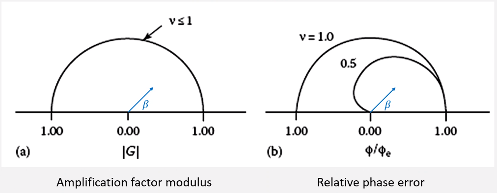 |
|:--:|
| The [[amplification-factor]], $G = \frac{}{}$ is always $1$ because of no [[dissipative-error]]. Therefore, the [[relative-phase-angle]], $\frac{\phi}{\phi_{e}} = \frac{\tan^{-1}\bigg(\frac{-\nu\sin(\beta)}{\pm\sqrt{1 - \nu^{2}\sin^{2}(\beta)}}\bigg)}{asdf}$. \\(\tag{27} \label{fig:leap_frog_amplification_factor_and_relative_phase_angle}\\) |

#### Lax-Wendroff Method
Derived form a [[Taylor-Series]] expansion:

\eqlabel

Substituting wave equations:

Substituting the $foo$ and $bar$ with central differences, we find well-known [[Lax-Wendroff-Method]]...

#### Comparing All Methods
| 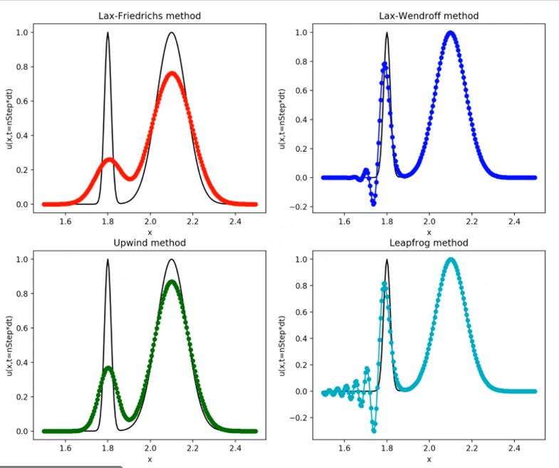 |
|:--:|
| Note that the [[Leap-Frog-Method]] is predominantly [[lagging]], [[dispersive-error]]; therefore, the [[dispersive-error]] occurs earlier because the wave speed is slower than the exact solution. \\(\tag{28} \label{fig:comparing_upstream_methods}\\) |

---

*Lecture: November 29, 2021*

!!! note Homework 3
	Only a single problem similar to that seen for the Final Project.
	Dr. Cho gave us the modified equation rather than us formulating it ourselves to see the dissipative/dispersive error.

	- [[dispersive-error]]: oscillates
	- [[dissipative-error]]: leans

	**For this problem, the CFL number can go up to 2.**
	The _[[Beam-Warming-Method]]_ scheme should be flipped vertically wrt _[[Lax-Wendroff-Method]]_.
	==Somethings that we can do is plot the phase error.==

### Application of Numerical Methods on Parabolic PDE
#### Simple Explicit
No odd derivative in #TE; thereofre, there exists [[dissipative-error]] and no [[dispersive-error]].
Amplification factor, $G = 1 + 2\mu\big(\cos(\beta) - 1\big)$.

| 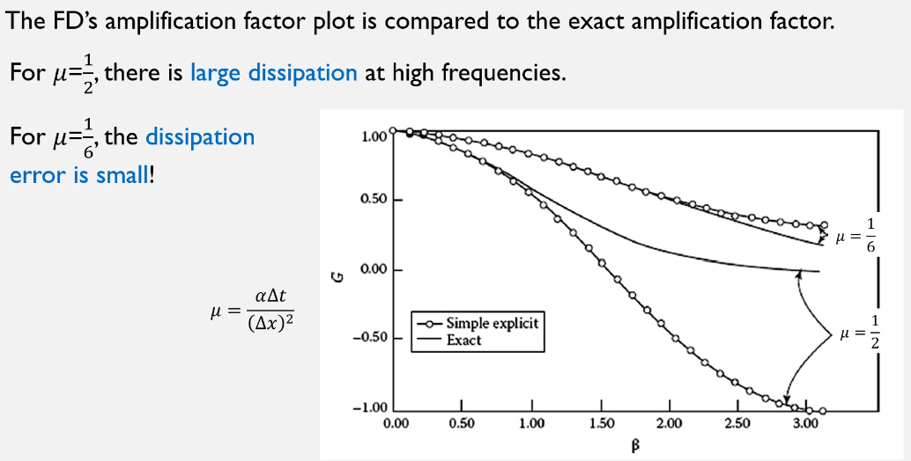 |
|:--:|
|  \\(\tag{29} \label{fig:simple_explicit_method_for_parabolic}\\) |

#### Simple Implicit
| 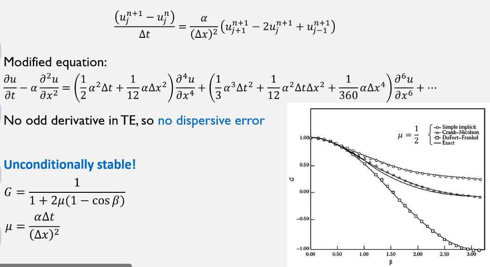 |
|:--:|
| This is actual _Backward-Euler_ Method. \\(\tag{30} \label{fig:simple_implicit_for_parabolic}\\) |

---

*Lecture: December 01, 2021*

!!! info Closing Class Remarks
	This Friday will be the last lecture because Final Project presentations will be next Monday.
	Our Final Exam is 12-09.
	The Final Project paper deadline pushed to 12-15.

##### Polar Plots for Relative Phase Error
Relative Phase Error
: $\frac{\phi}{\phi_{e}} \text{, } \phi = \tan^{-1}\bigg(\frac{\text{Im}(G)}{\text{Re}(G)}\bigg) \text{, } \phi_{e} = \beta v$ for $1d$ wave equation where $G$ is the [[amplification-factor]].
!!! note
This is equal to those definitions with negative terms.

In a polar plot, $\beta$ is the angle, and $\frac{\phi}{\phi_{e}}$ is the magnitude (radius).

| 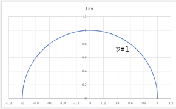 |
|:--:|
| Example for Lax Scheme: $G = \cos(\beta) - iv\sin(\beta)$, $\frac{\phi}{\phi_{e}} = \frac{\tan^{-1}(-v\tan(\beta))}{-\beta v} = \frac{\frac{\pi}{2} - \tan^{-1}\big[\frac{1}{v\tan(\beta)}\big]}{\beta v}$ \\(\tag{31} \label{fig:polar_plot_of_relative_phase_error}\\) |

##### Crank-Nicholson Method
No odd derivative in #TE: no [[dispersive-error]]. **Unconditionally stable**: $G = \frac{1 - \mu(\cos(\beta))}{1 + \mu(\cos(\beta))}$...

##### Methods for 2D Heat Equation
Crank-Nicholson requires pentadiagonal inversion which is computationally expensive.

Alternating-Direction Implicit (#ADI)
: Method for 2D heat equation and recommended for 2D or 3D heat equations.
Developed by Douglas and Gunn in 1964.
Start from Crank-Nicholson by substituting $\Delta u_{i, j} = u_{i, j}^{n + 1} - u_{i, j}^{n}$.
$$\begin{equation}
\begin{split}
\bigg(1 - \frac{\mu_{x}}{2}\delta_{x}^{2}\bigg)\bigg(1 - \frac{\mu_{y}}{2}\delta_{y}^{2}\bigg)\Delta u_{i, j} &= (\mu_{x}\delta_{x}^{2} + \mu_{y}\delta_{y}^{2})u_{i, j}^{n} \\
\bigg(1 - \frac{\mu_{x}}{2}\delta_{x}^{2}\bigg)\Delta u_{i, j}^{\*} &= (\mu_{x}\delta_{x}^{2} + \mu_{y}\delta_{y}^{2})u_{i, j}^{n} \text{ Step 1} \\
\bigg(1 - \frac{\mu_{y}}{2}\delta_{y}^{2}\bigg)\Delta u_{i, j} &= \Delta u_{i, j}^{\*} \text{ Step 2} \\
\boxed{u_{i, j}^{n + 1}} &= \boxed{u_{i, j}^{n} + \Delta u_{i, j}} \text{ Step 4}
\end{split}
\label{eq:adi}
\end{equation}$$
This require tridiagonal inversion.
The factorization error increases the #TE, but the resulting scheme is still **second-order**.

*[ADI]: Alternating-Direction Implici

!!! attention Professor Objectives
Dr. Cho only wants us to be familiar with the names and concepts of these scheme.
He will not ask us to solve a #PDE with these schemes.

#### Elliptic PDE and Iterative Solvers
##### Laplace Equation
From the heat equation, the **Laplace equation** sets the LHS to $0$: $$\require{cancel}\cancelto{\frac{\partial T}{\partial t}}{0} = \alpha\nabla^{2}T$$

- Every point incluences every other point.
- Solution of #PDE is desired in a closed domain subject to a prescribed set of boundary conditions (#BVP).
- #SS temperature distributions, incompressible inviscid flos, and equilibrium stress distributions in solids.

Laplace Equation
: $\nabla^{2}u = \frac{\partial^{2}u}{\partial x^{2}} + \frac{\partial^{2}u}{\partial y^{2}} = 0$

Poisson Equation
: $\nabla^{2}u = \frac{\partial^	{2}u}{\partial x^{2}} + \frac{\partial^{2}u}{\partial y^{2}} = f(x, y)$. _This is similar to our Final Project._

##### Finite Difference Approximations
Like the heat equation, the variations in methods for solving Laplace's equation have to do with how the system of equation is solved, not the differencing.

Five-point Formula($h = \Delta x$, $k = \Delta y$)
: $\frac{u_{i + 1, j} - 2u_{i, j} + u_{i - 1, j}}{h^{2}} + \frac{u_{i, j + 1} - 2u_{i, j} + u_{i, j - 1}}{h^{2}} = 0$

We apply our difference equation at each mesh point in the interior of the domain (assuming dirichlet BC) and end up with a system of linear equations, A (nxn matrix).
To solve the system of liner equations, we may use either direct or iterative methods.
Direct solvers give the solution (exactly if no #ROE; there is still #FD discretization error) in a finite...

##### Iterative Techniques
Rpeated application of an algorithm that produces an exact result only as the limit of a sequence. Iterative methods are also known as "**residual relaxation**" methods.

- Point iterative methods in which the same, simple algorithm is applied to each point where the unknown function is to be determined in successive iterative sweeps: Jacobi, Gauss-Seidel, SOR, Coloring Scheme, Conjugate Gradient, etcetera.
- Block iterative methods in which subgroups of points are singled out for solution by elimination schemes in an overall iterative procedure (unknown in subgroups are set up so that the matrix of coefficients will be tridiagonal form to allow the Thomas algorithm to be used: e.g. SOR by lines).

---

*Lecture: December 03, 2021*

!!! info Important Dates
  1. Final Exam: 12/9 (Thursday) from 3:30 to 5:30 PM
  2. Project Presentation: 12/6 (Monday) for 10 min presentations
  3. Deadlines
    1. HW3: 12/5
    2. Project Report: 12/15
    3. Vision Statement: 12/15

###### Multigrid Method
Gauss-Seidel Method with(out) SOR provides excellent smoothing of the local error.
Since difference stencil is compact, a very large number of iterations are often required in fine grids.
**Low-frequency components of the error thta usually slows convergence of iterative schemes on a fixed grid.**
_However, the low-frequency error becomes a high-frequency on the coarser grids._

| 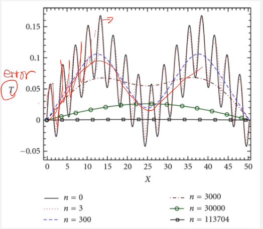 |
|:--:|
| High frequency function is smoothed by Guass-Seidel iterations (Harimi & Saghafian, 2012). \\(\tag{32} \label{fig:multigrid_method}\\) |

!!! attention
	The strategy of the multigrid method is to _use coarse grids to remove the low-frequency erros_ and _propagate boundary information throughout the domain in combination with fine grids_ to improve accuracy (Brand, 1977).
	This works best to increase frequency at coarser meshes before solving those higher frequencies with Gauss-Seidel or SOR, which are optimal for high-frequency problems.
	E.g. Cr. Cho can solve his Earth-sized mantle problem on his laptop with this method.

Multigrid method is one of the efficient "general" iterative methods known today.
More efficient methods can be found for certain problems or choices of grids, but it is difficult to find a method more efficient than multigrid for the general case.
The multigrid method is applied using any of the iterative schemes ("smoother").
The objective of the multigrid method technique is to accelerate convergence of an iterative scheme.

!!! note The following relation for residual of Laplace equation.
	Let $L$ be the operator for Laplace equation:
	$$
	\begin{split}
	Lu_{i, j} &= \frac{u_{i + 1, j} - 2u_{i, j} + u_{i - 1, j}}{(\Delta x)^{2}} + \frac{u_{i, j + 1} - 2u_{i, j} + u_{i, j - 1}}{(\Delta y)^{2}} + T.E. = 0 \\
	Lu_{i, j} &= R_{i, j} \text{, which is the residual}
	\end{split}
	$$
	Let, $u_{i, j}$ be the converged solution...
	Performing the above for each iteration:
	$$
	\begin{split}
	Lu_{i, j} &= Lu_{i, j}^{(k)} + L\Delta u_{i, j} \\
	Lu_{i, j}^{(k)} &= R_{i, j} \\
	Lu_{i, j} &= L\Delta u_{i, j} + R_{i, j} = 0 \\
	\boxed{L\Delta u_{i, j}} &= \boxed{-R_{i, j}}
	\end{split}
	$$
	We solve for the correction, $\Delta u_{i, j}$, iteratively, and update the solution, $u_{i, j}$.
	We just use the fixed value of $-R_{i, j}$ and find $\Delta u_{i, j}$, iteratively, then finally find a final solution, $u_{i, j}$.

The *key idea in multigrid is to improve the fine-grid solution*.
We just use coarser grid to obtain corrections, $\Delta u$ to the fine-grid (original grid) solution.
_We "transfer the problem" to a coarser grid by interpolating the fine-grid residual, $R_{i, j}$ to the coarser grid and then solve $L\Delta u_{i, j} = -R_{i, j}$ for the correction, $\Delta u_{i, j}$._
We use *smoothing techniques* (e.g. Gauss-Seidel or SOR) to solve for $\Delta u_{i, j}$.
The easiest case is to use *2 grid levels* (for our understanding).
In practical applications, *multiple grid levels* are used with multiple cycles: e.g. V (1 cycle), W (2 cycles), etcetera...

| 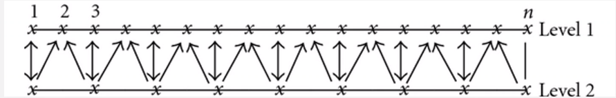 |
|:--:|
| *2 Grid Levels Multigrid Method Steps*: 1) _Pre-Smoothing_: do $n$ iterations on the fine (original) grid solving Laplace equation, $Lu_{i, j}$; 2) _Restriction_: ; 3) _Prolongation (Interpolation)_: ; 4) _Update the solution on fine grid_: bar. If convergence is not indicated, run more cycles until convergence is observed on the fine grid. \\(\tag{33} \label{fig:multigrid_method_2d}\\) |

| 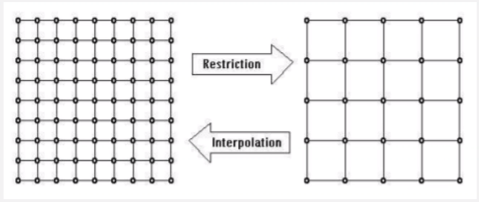 |
|:--:|
|   \\(\tag{34} \label{fig:multigrid_method_2d_outlined}\\) |

| 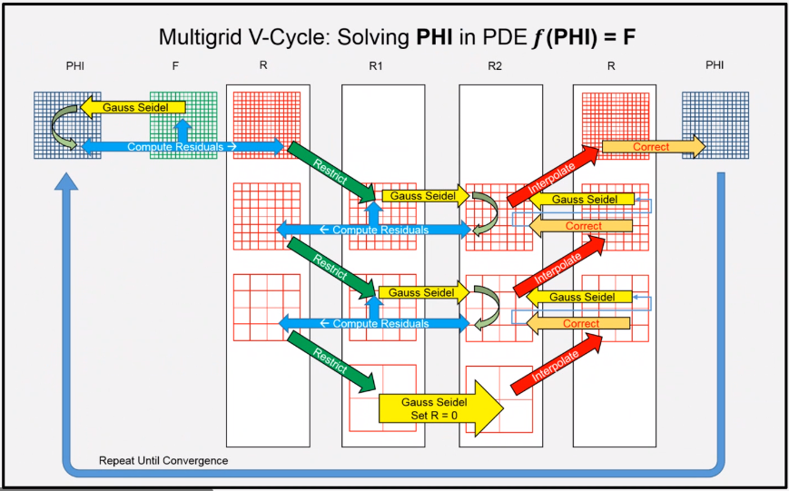 |
|:--:|
|   \\(\tag{35} \label{fig:multigrid_method_2d_explained}\\) |

| 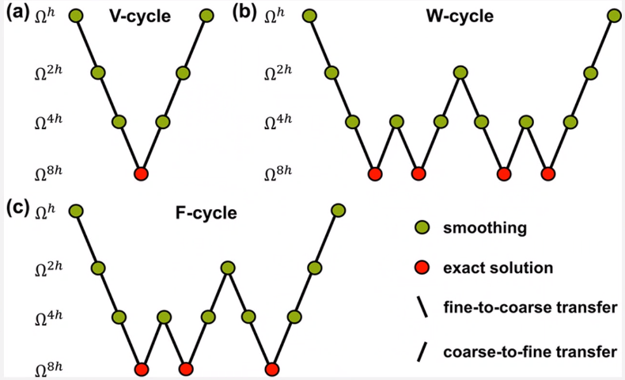 |
|:--:|
| Examples of V, W, and F cycles \\(\tag{36} \label{fig:multigrid_method_cycles}\\) |

