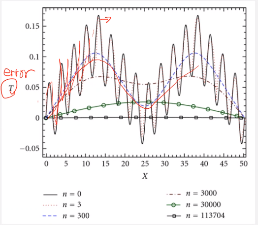
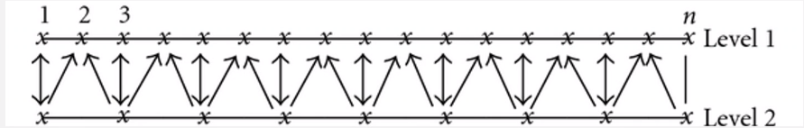
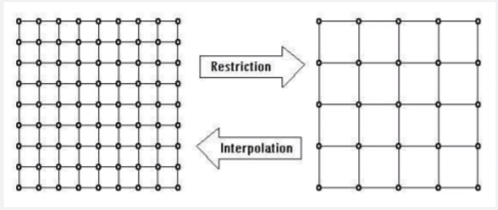
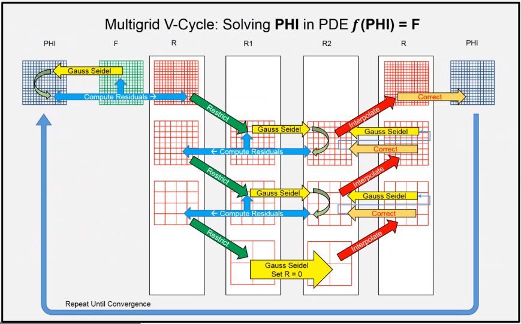

# Application of Numerical Methods on Elliptic PDE

Tags:
- #elliptic

## Laplace Equation
From the heat equation, the **Laplace equation** sets the LHS to $0$: $$\require{cancel}\cancelto{\frac{\partial T}{\partial t}}{0} = \alpha\nabla^{2}T$$

- Every point influences every other point.
- Solution of #PDE is desired in a closed domain subject to a prescribed set of boundary conditions (#BVP).
- #SS temperature distributions, incompressible inviscid flows, and equilibrium stress distributions in solids.

Laplace Equation
: $\nabla^{2}u = \frac{\partial^{2}u}{\partial x^{2}} + \frac{\partial^{2}u}{\partial y^{2}} = 0$

Poisson Equation
: $\nabla^{2}u = \frac{\partial^{2}u}{\partial x^{2}} + \frac{\partial^{2}u}{\partial y^{2}} = f(x, y)$. _This is similar to our Final Project._

## Finite Difference Approximations
Like the heat equation, the variations in methods for solving Laplace's equation have to do with how the system of equation is solved, not the differencing.

Five-point Formula ($h = \Delta x$, $k = \Delta y$)
: $\frac{u_{i + 1, j} - 2u_{i, j} + u_{i - 1, j}}{h^{2}} + \frac{u_{i, j + 1} - 2u_{i, j} + u_{i, j - 1}}{h^{2}} = 0$

We apply our difference equation at each mesh point in the interior of the domain (assuming dirichlet BC) and end up with a system of linear equations, A ($n \times n$ matrix).
To solve the system of liner equations, we may use either direct or iterative methods.
Direct solvers give the solution (exactly if no #ROE; there is still #FD discretization error) in a finite...

## Iterative Techniques
Repeated application of an algorithm that produces an exact result only as the limit of a sequence. Iterative methods are also known as "**residual relaxation**" methods.

- Point iterative methods in which the same, simple algorithm is applied to each point where the unknown function is to be determined in successive iterative sweeps: Jacobi, Gauss-Seidel, SOR, Coloring Scheme, Conjugate Gradient, etcetera.
- Block iterative methods in which subgroups of points are singled out for solution by elimination schemes in an overall iterative procedure (unknown in subgroups are set up so that the matrix of coefficients will be tridiagonal form to allow the Thomas algorithm to be used: e.g. SOR by lines).

### Multigrid Method
Gauss-Seidel Method with(out) SOR provides excellent smoothing of the local error.
Since difference stencil is compact, a very large number of iterations are often required in fine grids.
**Low-frequency components of the error that usually slows convergence of iterative schemes on a fixed grid.**
_However, the low-frequency error becomes a high-frequency on the coarser grids._

|  |
|:--:|
| High frequency function is smoothed by Gauss-Seidel iterations (Harimi & Saghafian, 2012). |

!!! attention
    The strategy of the multigrid method is to _use coarse grids to remove the low-frequency errors_ and _propagate boundary information throughout the domain in combination with fine grids_ to improve accuracy (Brand, 1977).
    This works best to increase frequency at coarser meshes before solving those higher frequencies with Gauss-Seidel or SOR, which are optimal for high-frequency problems.
    E.g. Cr. Cho can solve his Earth-sized mantle problem on his laptop with this method.

Multigrid method is one of the efficient "general" iterative methods known today.
More efficient methods can be found for certain problems or choices of grids, but it is difficult to find a method more efficient than multigrid for the general case.
The multigrid method is applied using any of the iterative schemes ("smoother").
The objective of the multigrid method technique is to accelerate convergence of an iterative scheme.

!!! note The following relation for residual of Laplace equation.
    Let $L$ be the operator for Laplace equation:
    $$\begin{split}
    Lu_{i, j} &= \frac{u_{i + 1, j} - 2u_{i, j} + u_{i - 1, j}}{(\Delta x)^{2}} + \frac{u_{i, j + 1} - 2u_{i, j} + u_{i, j - 1}}{(\Delta y)^{2}} + T.E. = 0 \\
    Lu_{i, j} &= R_{i, j} \text{, which is the residual}
    \end{split}$$
    Let, $u_{i, j}$ be the converged solution...
    Performing the above for each iteration:
    $$\begin{split}
    Lu_{i, j} &= Lu_{i, j}^{(k)} + L\Delta u_{i, j} \\
    Lu_{i, j}^{(k)} &= R_{i, j} \\
    Lu_{i, j} &= L\Delta u_{i, j} + R_{i, j} = 0 \\
    \boxed{L\Delta u_{i, j}} &= \boxed{-R_{i, j}}
    \end{split}$$
    We solve for the correction, $\Delta u_{i, j}$, iteratively, and update the solution, $u_{i, j}$.
    We just use the fixed value of $-R_{i, j}$ and find $\Delta u_{i, j}$, iteratively, then finally find a final solution, $u_{i, j}$.

The *key idea in multigrid is to improve the fine-grid solution*.
We just use coarser grid to obtain corrections, $\Delta u$ to the fine-grid (original grid) solution.
_We "transfer the problem" to a coarser grid by interpolating the fine-grid residual, $R_{i, j}$ to the coarser grid and then solve $L\Delta u_{i, j} = -R_{i, j}$ for the correction, $\Delta u_{i, j}$._
We use *smoothing techniques* (e.g. Gauss-Seidel or SOR) to solve for $\Delta u_{i, j}$.
The easiest case is to use *2 grid levels* (for our understanding).
In practical applications, *multiple grid levels* are used with multiple cycles: e.g. V (1 cycle), W (2 cycles), etcetera...

|  |
|:--:|
| *2 Grid Levels Multigrid Method Steps*: 1) _Pre-Smoothing_: do $n$ iterations on the fine (original) grid solving Laplace equation, $Lu_{i, j}$; 2) _Restriction_: ; 3) _Prolongation (Interpolation)_: ; 4) _Update the solution on fine grid_: bar. If convergence is not indicated, run more cycles until convergence is observed on the fine grid. |

|  |
|:--:|
| Examples of V, W, and F cycles |