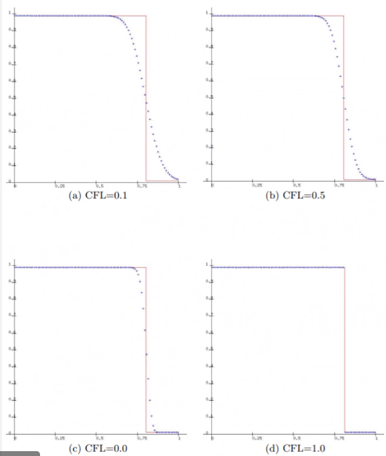

# Application of Numerical Methods on Hyperbolic PDE

*[IVP]: Initial Value Problem

This is involved with the second-derivative to time of equations: often referred to as a wave-equation.
This may also be called "linear convection equation".
We begin with the #IVP: [Linear Convection](linear-convection.md).
The solution represents a wave moving from left to right as speed, $c$.
This requires specification of periodic, #initial-conditions and "reentrant" boundaries.

!!! question Is this not a #parabolic form because this is a first-derivative wrt time? <cite>#Daniel-Kenney
	This still shows behavior seen in second-derivative wrt time equations, but not equivalent.

## Euler Explicit
Two methods that do not work:
1. $\frac{u_{j}^{n + 1} - u_{j}^{n}}{\Delta t} + c\frac{u_{j + 1}^{n} - u_{j - 1}^{n}}{2\Delta x} = 0$
2. $\frac{u_{j}^{n + 1} - u_{j}^{n}}{\Delta t} + c\frac{u_{j + 1}^{n} - u_{j - 1}^{n}}{2\Delta x} = 0$

This is **unconditionally unstable**.

## Upstream Method
Using a forward time difference and backward space difference make the solution #stable.

$$\begin{split}
\frac{u_{j}^{n + 1} - u_{j}^{n}}{\Delta t} + c\frac{u_{j}^{n} - u_{j - 1}^{n}}{\Delta x} &= 0 \\
u_{j}^{n + 1} &= u_{j}^{n} - \mathscr{v}(u_{j}^{n} - u_{j - 1}^{n}) = (1 - \mathscr{v})u_{j}^{n} + \mathscr{v}u_{j - 1}^{n} \text{, where } \mathscr{v} = \frac{c\Delta t}{\Delta x} \\
\boxed{\frac{\partial u}{\partial t} + c\frac{\partial u}{\partial x}} &= \boxed{-\frac{\Delta t}{2}\frac{\partial^{2}u}{\partial t^{2}} + \frac{c\Delta x}{2}\frac{\partial^{2}u}{\partial t^{2}} - \frac{(\Delta t)^{2}}{6}\frac{\partial^{3}u}{\partial t^{3}} - \frac{(c\Delta x)^{2}}{6}\frac{\partial^{3}u}{\partial x^{3}}}
\end{split}$$

The LHS represents the #PDE and the RHS is the #truncation-error.
Recall that $\mathscr{v}$ here is actually the [Courant Number](courant-number.md).

For the stability analysis, the [Courant Number](courant-number.md), $0 \leq C \leq 1$.

$\dots$

This can be modified by replacing higher-order, temporal derivatives with spatial derivatives.
The solution to the #PDE, in general, does not satisfy the difference equation, so must use #PDE+#truncation-error to define the derivatives (which can be painful) according to [Modified Upstream](modified-upstream.md).

The shift condition, $u_{j}^{n + 1} = u_{j - 1}^{n}$ (recalling: $u_{j}^{n + 1} = (1 - v)u_{j}^{n} + vu_{j - 1}^{n}$) allows the FDE to becomes the exact solution to the #PDE when $v = 1$.
Artificial viscosity (numerical viscosity or numerical diffusion) is viscous like: $$\frac{c\Delta x}{2}(1 - v)\frac{\partial^{2}u}{\partial x^{2}},$$ when $v \neq 1$.
This is typical of first-order methods.
#dissipative-error is a result of even-order derivatives in #truncation-error.
Effect of odd-ordered derivatives is that phase relations between the various waves are distorted ( #dispersive-error ):
$$-\frac{(c\Delta x)^{2}}{\dots}$$

|  |
|:--:|
| Example of upwind scheme for linear advection equation becomes the exact solution. |

|  |
|:--:|
| Effects of numerical diffusion near a sharp gradient (discontinuity). |

In general, if the lowest-order term in the #truncation-error contains an **even derivative**, then the resulting solution will **predominantly exhibit dissipative errors**.

### Exact Amplitude and Phase
Assume solution of the $u = e^{at}e^{ik_{m}}x$ and substitute into #PDE and solve for $a$: $$u = e^{ik_{m}(x - ct)}$$

### Relative Phase Error
- Leading (wave travels too fast compared to exact solution)
- Lagging (wave travels slower than exact solution)
- Notice that amplitude and phase are dependent upon the frequency of the specific component through $\beta$.

### Amplification Factor
[Upstream Amplification Factor](upstream-amplification-factor.md)

|  |
|:--:|
| Recall amplitude is related to #dissipative-error, and phase is related to #dispersive-error. |

## [Lax Method](lax-method.md)

## [Leap Frog Method](leap-frog-method.md)

## Lax-Wendroff Method
Derived form a #Taylor-Series expansion:

\eqlabel

Substituting wave equations:

Substituting the $foo$ and $bar$ with central differences, we find well-known #Lax-Wendroff-Method...

## Comparing All Methods
|  |
|:--:|
| Note that the [Leap Frog Method](leap-frog-method.md) is predominantly #lagging, #dispersive-error; therefore, the #dispersive-error occurs earlier because the wave speed is slower than the exact solution. |