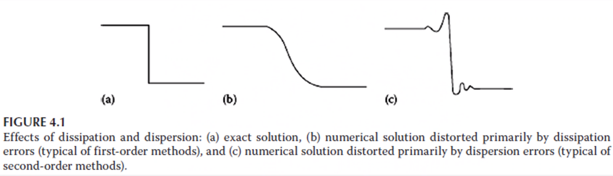
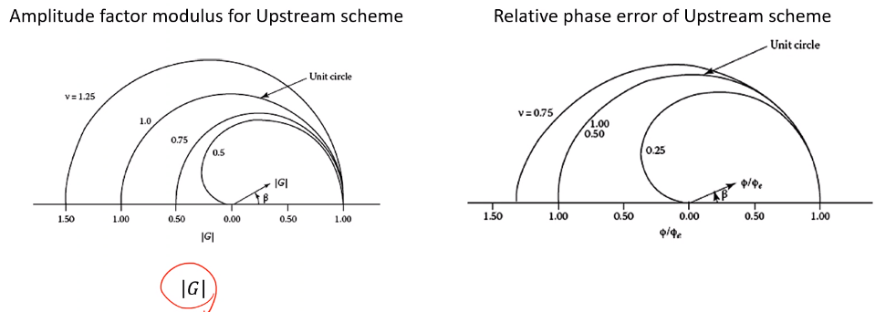
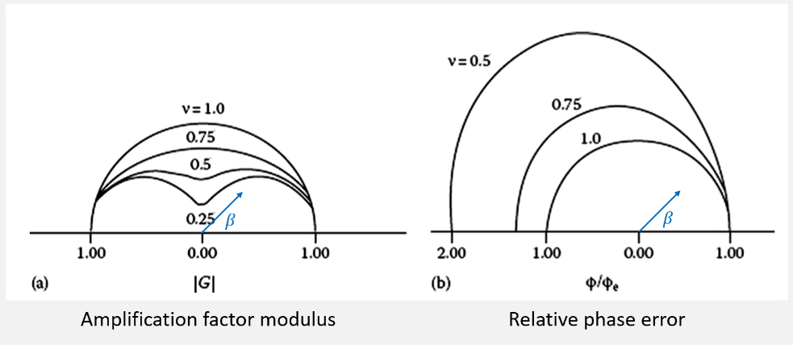
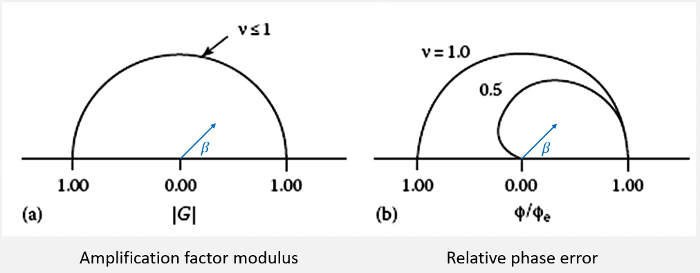

# Application of Numerical Methods on Hyperbolic PDE

Tags:
- #hypberolic

*[IVP]: Initial Value Problem

This is involved with the second-derivative to time of equations: often referred to as a wave-equation. This may also be called "linear convection equation". We begin with the #IVP: [[linear-convection]]. The solution represents a wave moving from left to right as speed, $c$. This requires specification of periodic, #IC and "reentrant" boundaries.

!!! question Is this not a parabolic form because this is a first-derivative wrt time? <cite> Daniel K.
	This still shows behavior seen in second-derivative wrt time equations, but not equivalent.

## Euler Explicit
Two methods that do not work:
1. $\frac{u_{j}^{n + 1} - u_{j}^{n}}{\Delta t} + c\frac{u_{j + 1}^{n} - u_{j - 1}^{n}}{2\Delta x} = 0$
2. $\frac{u_{j}^{n + 1} - u_{j}^{n}}{\Delta t} + c\frac{u_{j + 1}^{n} - u_{j - 1}^{n}}{2\Delta x} = 0$

This is **unconditionally unstable**.

## Upstream Method
Using a forward time difference and backward space difference make the solution #stable.

$$\begin{split}
\frac{u_{j}^{n + 1} - u_{j}^{n}}{\Delta t} + c\frac{u_{j}^{n} - u_{j - 1}^{n}}{\Delta x} &= 0 \\
u_{j}^{n + 1} &= u_{j}^{n} - \mathscr{v}(u_{j}^{n} - u_{j - 1}^{n}) = (1 - \mathscr{v})u_{j}^{n} + \mathscr{v}u_{j - 1}^{n} \text{, where } \mathscr{v} = \frac{c\Delta t}{\Delta x} \\
\boxed{\frac{\partial u}{\partial t} + c\frac{\partial u}{\partial x}} &= \boxed{-\frac{\Delta t}{2}\frac{\partial^{2}u}{\partial t^{2}} + \frac{c\Delta x}{2}\frac{\partial^{2}u}{\partial t^{2}} - \frac{(\Delta t)^{2}}{6}\frac{\partial^{3}u}{\partial t^{3}} - \frac{(c\Delta x)^{2}}{6}\frac{\partial^{3}u}{\partial x^{3}}}
\end{split}$$

The LHS represents the #PDE and the RHS is the #TE. Recall that $\mathscr{v}$ here is actually the [[courant-number]].

For the stability analysis, the [[courant-number]], $0 \leq C \leq 1$.

$\dots$

This can be modified by replacing higher-order, temporal derivatives with spatial derivatives. The solution to the #PDE, in general, does not satisfy the difference equation, so must use #PDE+#TE to define the derivatives (which can be painful) according to [[modified-upstream]].

The shift condition, $u_{j}^{n + 1} = u_{j - 1}^{n}$ (recalling: $u_{j}^{n + 1} = (1 - v)u_{j}^{n} + vu_{j - 1}^{n}$) allows the #FDE to becomes the exact solution to the #PDE when $v = 1$. Artificial viscosity (numerical viscosity or numerical diffusion) is viscous like: $$\frac{c\Delta x}{2}(1 - v)\frac{\partial^{2}u}{\partial x^{2}},$$ when $v \neq 1$. This is typical of first-order methods. Dissipative effect is a result of even-order derivatives in #TE. Effect of odd-ordered derivatives is that phase relations between the various waves are distorted (dispersion): $$-\frac{(c\Delta x)^{2}}{\dots}$$

|  |
|:--:|
| Example of upwind scheme for linear advection equation becomes the exact solution. |

|  |
|:--:|
| Effects of numerical diffusion near a sharp gradient (discontinuity). |

In general, if the lowest-order term in the #TE contains an **even derivative**, then the resulting solution will **predominantly exhibit dissipative errors**.

### Exact Amplitude and Phase
Assume solution of the $u = e^{at}e^{ik_{m}}x$ and substitute into #PDE and solve for $a$: $$u = e^{ik_{m}(x - ct)}$$

### Relative Phase Error
- Leading (wave travels too fast compared to exact solution)
- Lagging (wave travels slower than exact solution)
- Notice that amplitude and phase are dependent upon the frequency of the specific component through $\beta$.

### Amplification Factor
[[upstream-amplification-factor]]

|  |
|:--:|
| Recall amplitude is related to #dissipative-error, and phase is related to #dispersive-error. |

## Lax Method
The Euler method can be changed to a stable form by replacing $u_{j}^{n}$ with the spatial, average value $\frac{u_{j + 1}^{n} + u_{j - 1}^{n}}{2}$ in time difference (explicit).

This [[lax-method]] is **not guaranteed to be consistent** because $\frac{(\Delta x)^{2}}{\Delta t}$ may not go to zero in the limit to zero of $\Delta x$ and $\Delta t$. If $v$ is held constant, the method becomes #consistent. When $v \neq 1$, the #Lax-Method has a large #dissipation-error (because #TE #RHS has even derivative).

|  |
|:--:|
| This can be observed in the #amplification-factor, $G = \cos(\beta) - iv\sin(\beta)$ and the #relative-phase-error, $\frac{\phi}{\phi_{e}} = \frac{\tan^{-1}(-v\tan(\beta))}{-\beta v}$. |

## Leap Frog Method
Thus far, we have studied **first-order** methods accurate for the linear wave equation. #Leap-Frog-Method is the simplest, **second-order** accurate method. An explicit, one-step, three-time-level scheme for the first-order wave equation: [[leap-frog-method]]

$u$ must be known at time step, $n$ and $n - 1$ to find $u$ at time step, $n + 1$ (explicit). ==Stability condition $|v| \leq 1$.== The #Modified-Leap-Frog-Method:

\eqlabe

The leading term in the #TE term has the odd derivative, hence it would have predominantly #dispersive-error, which is typical for second-order methods. No even in #TE, hence no #dissipative-error.

|  |
|:--:|
| The #amplification-factor, $G = \frac{}{}$ is always $1$ because of no #dissipative-error. Therefore, the #relative-phase-angle, $\frac{\phi}{\phi_{e}} = \frac{\tan^{-1}\bigg(\frac{-\nu\sin(\beta)}{\pm\sqrt{1 - \nu^{2}\sin^{2}(\beta)}}\bigg)}{asdf}$. |

## Lax-Wendroff Method
Derived form a #Taylor-Series expansion:

\eqlabel

Substituting wave equations:

Substituting the $foo$ and $bar$ with central differences, we find well-known #Lax-Wendroff-Method...

## Comparing All Methods
|  |
|:--:|
| Note that the #Leap-Frog-Method is predominantly #lagging, #dispersive-error; therefore, the #dispersive-error occurs earlier because the wave speed is slower than the exact solution. |