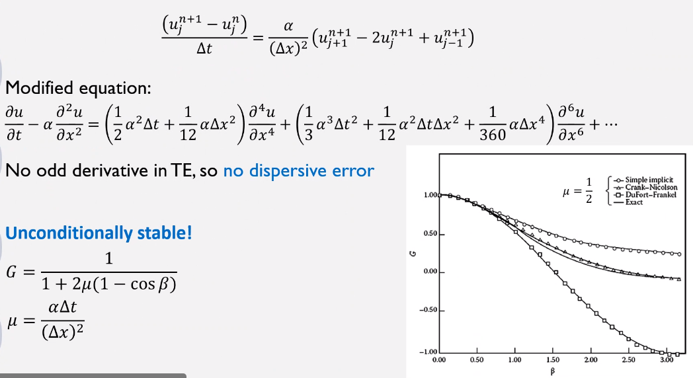

# Application of Numerical Methods on Parabolic PDE

## Simple Explicit
No odd derivative in #TE; therefore, there exists #dissipative-error and no #dispersive-error.
Amplification factor, $G = 1 + 2\mu\big(\cos(\beta) - 1\big)$.

## Simple Implicit
|  |
|:--:|
| This is actual _Backward-Euler_ Method. |

### Polar Plots for Relative Phase Error
Relative Phase Error
: $\frac{\phi}{\phi_{e}} \text{, } \phi = \tan^{-1}\bigg(\frac{\text{Im}(G)}{\text{Re}(G)}\bigg) \text{, } \phi_{e} = \beta v$ for $1d$ wave equation where $G$ is the #amplification-factor.
: !!! note
        This is equal to those definitions with negative terms.

In a polar plot, $\beta$ is the angle, and $\frac{\phi}{\phi_{e}}$ is the magnitude (radius).

|  |
|:--:|
| Example for Lax Scheme: $G = \cos(\beta) - iv\sin(\beta)$, $\frac{\phi}{\phi_{e}} = \frac{\tan^{-1}(-v\tan(\beta))}{-\beta v} = \frac{\frac{\pi}{2} - \tan^{-1}\big[\frac{1}{v\tan(\beta)}\big]}{\beta v}$ |

### Crank-Nicholson Method
No odd derivative in #TE: no #dispersive-error. **Unconditionally stable**: $G = \frac{1 - \mu(\cos(\beta))}{1 + \mu(\cos(\beta))}$...

### Methods for 2D Heat Equation
Crank-Nicholson requires pentadiagonal inversion which is computationally expensive.

Alternating-Direction Implicit (#ADI)
: Method for 2D heat equation and recommended for 2D or 3D heat equations.
Developed by Douglas and Gunn in 1964.
Start from Crank-Nicholson by substituting $\Delta u_{i, j} = u_{i, j}^{n + 1} - u_{i, j}^{n}$.
[[alternating-direction-implicit]] requires tridiagonal inversion.
The factorization error increases the #TE, but the resulting scheme is still **second-order**.

*[ADI]: Alternating-Direction Implicit