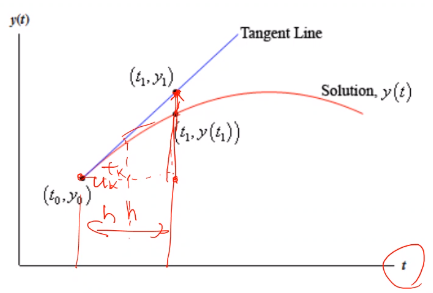

# Euler Method

Solving #Euler-Method in forward (using previous iteration to solve next iteration) gives lower accuracy in quicker time than solving backward (using future information to solve the future iteration), which gives great accuracy in much time.

[[forward-euler]]

|  |
|:--:|
| The accuracy for curved functions can be improved with smaller $h$. |

!!! example
    |  |
    |:--:|
    | First order error proportional to step size. |