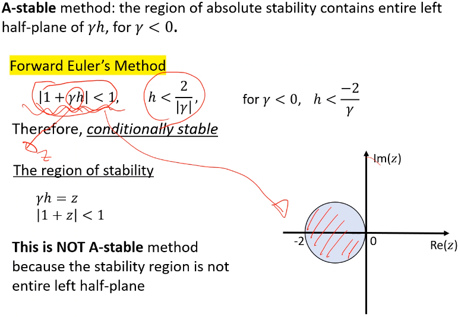

# Implicit Methods

## Backward Euler
Explicit methods are well suited to handle large class of #ODE.
However, these methods perform poorly for class of "stiff" equations that occur frequently in real problems: e.g. exponential functions in vibrational motion.
If there is a large difference between the most rapid and slowest changes in solution components, then the system is a #stiff-equation.
If #RK4 requires small time step for sufficient accuracy, then that problem is likely involved with a #stiff-equation.
Implicit methods are generally suited to a #stiff-equation since they are conditionally "stable": i.e. required limitation on time stepping; otherwise, solution will diverge and crash.

> Multiple choice: Euler-method is first order O(h2).
Forward and backward formulations are both first order.
Backward has more error than forward, but more stable.

|  |
|:--:|
| $u_{k+1} = u_{k} + hf'(t_{k}, u_{k})$ versus $u_{k+1} = u_{k} + hf'(t_{k+1}, u_{k+1})$ |

We can use the #NR, #root-finding method to solve the unknown, $u_{k+1}$ from the unknown, $u_{k+11}$.

*[NR]: Newton-Raphson

## Trapezoidal Method
This is a **second-order** method and sometimes called the "#Crank-Nicholson" in #PDE contexts.
This method is derived from the trapezoidal integration rule using half contributions at current and future points.
$$u_{k+1} = u_{k} + \frac{1}{2}h[f'(t_{k}, u_{k}) + f'(t_{k+1}, u_{k+1})]$$
Or a more a generalized form:

*[PDE]: Partial Differential Equations

$$\begin{equation}
u_{k+1} = u_{k} + h[(1 - \theta)f'(t_{k}, u_{k}) + \theta f'(t_{k+1}, u_{k+1})]
\label{eq:implicit_trapezoidal_method}
\end{equation}$$

where, $$\theta = \begin{cases}
1 &, \text{Backward Euler} \\
-1 &, \text{Forward Euler} \\
0.5 &, \text{Trapezoidal}
\end{cases}$$

!!! question What is the difference between *Trapezoidal* and *Improved Euler* methods? <cite> Dr. Cho
    Improved Euler is still explicit, which uses a guess for the next iteration.
    Trapezoid uses next iteration information.

!!! question What is the benefit of using *Trapezoid* compared to *Backward Euler*? <cite> Dr. Cho
    Trapezoid will be more accurate, because it is second-order.
    [[Euler-Method]] is first-order.

## Multistep Methods
We may use more accurate, previous information to approximate next grid's solution.

Multistep Methods
: Methods using more than one grid point to approximate next grid point.

[[adam-bashforth-technique]]
: A $4^{th}$-order **explicit** method.
$$\begin{equation}
\begin{split}
u_{k+1} &= u_{k} \\
&+ \frac{h}{24}[55f'(t_{k}, u_{k}) - 59f'(t_{k- 1}, u_{k - 1}) + 37f'(t_{k - 2}, u_{k - 2}) - 9f'(t_{k - 3}, u_{k - 3})]
\end{split}
\end{equation}$$

[[adam-moulton-technique]]
: A $4^{th}$-order **implicit** method.

In general, an implicit method has better stability and accuracy than explicit methods.
Why? Because implicit methods use more information of the data.
When linear, the equation can be algebraically solved...

!!! example Solve #IVP $\dot{u} = e^{u}$.

## Predictor-Corrector Methods
#NR (or secant) method complicates procedure and increases computational cost.
We can use combination of explicit and implicit to predict and improve solve.

## Stiff Differential Equations
Some diffeqs' error grows very rapidly for larger step sizes, which dominate the calculations.
Many physical problems are involved with a #stiff-equation.
#stiff-equation equations appear when they have an **exponential (with large, negative coefficients) forms in their solutions**.

!!! note Low temperature, high strain-rate #ISV equations are very much so #stiff-equations.

*[ISV]: Internal State-Variable

!!! example Consider this linear, #IVP, $\frac{du}{dt} = -250u,~u(0) = 1$. The exact solution is $\dot{u} = e^{-250t}$ and $u(1) \approx 2.69e-109$. Comparing this against [[Euler-Method]] (either improved or not) and #RK4:
    |  |
    |:--:|
    | Large step size, i.e. large errors, dominate final solution. |

!!! example Consider the #IVP, $\frac{du}{dt} = \gamma u,~u(0) = 1$ with exponential solution, $u(t) = e^{\gamma t}$.
    Using a forward [[Euler-Method]],
    $$\begin{split}
    u_{k+1} &= u_{k} + \gamma hu_{k} = (1 + \gamma h)u_{k} \\\\
    &= (1 + \gamma h)^(k + 1)u_{0} = (1 + \gamma h)^{k + 1}
    \end{split}$$
    The absolute error (exact - approximation) goes to zero:
    $$E = |u_{k}(kh) - (1 - \gamma h)^{k}| = |(e^{\gamma h})^{k} - (1 + \gamma h)^{k}|$$
    $$|1 + \gamma h| < 1 \implies -2<\gamma h < 0$$
    When $\gamma < 0$, exact solution decays to $0$.
    When large, method diverges quickly with error growing.
    When large, step-size, $h$ must be very small.
    [[Euler-Method]] is expected to be stable only if $h < \frac{2}{|\gamma|}$.
    If $h$ satisfies this, then method converges, because error goes to $0$; otherwise, solution diverges, because error grows quickly.

In general, a function, $Q$ approximated by difference methods gives, $$u_{k + 1} = Q(\gamma h)u_{k}$$, where the error grows without bound if $|Q(\gamma h)| > 1$.
$n^{th}$-order [[Taylor-Method]] has a stability condition, provided $h$ is chosen to satisfy: $$|1 + h\gamma + \frac{1}{2}\gamma^{2}h^{2} + \dots + \frac{1}{n}h^{n}\gamma^{n}| < 1$$ Stability analysis is generally very difficult to solve: heavily relies on mathematics.

Region, $R$ of absolute stability
: for a one-step method is $$R = \{h\gamma \in C:|Q(\gamma h)| < 1\}$$.

#A-stable method
: The region of absolute stability contains entire, left half-plane of $\gamma h$ for $\gamma < 0$ on the complex plane, $\mathbb{Z}$.
Likely named for the absolute value property.

#Forward-Euler is conditionally stable: $$|1 + \gamma h| < 1,~h<\frac{2}{|\gamma|},~\text{for}~\gamma < 0,~h < \frac{-2}{\gamma}$$ The region of stability...

|  |
|:--:|
| The region of stability, $\gamma h = z,~abs(1 + z) < 1$. **This is not #A-stable method**, because the stability region is not entire, left half-plane. Stability is limited by step size, $h$. |

!!! question Only called #A-stable when left plane? <cite> Reid Prichard
    Correct.
    The #Crank-Nicholson is implicit and #A-stable.

!!! note
    Implicit #Trapezoidal-Method is the **only #A-stable, multistep method**!

$$\begin{split}
u_{k+1} &= u_{k} + \frac{1}{2}h[\gamma u_{k} + \gamma u_{k+1}] \\\\
&= \frac{1 + \frac{1}{2}h\gamma}{1 - \frac{1}{2}h\gamma}u_{k}
\end{split}$$

If $\gamma > 0$, then error exponentially grows.
If $\gamma < 0$, then error does not grow with condition, $h < \frac{-2}{\gamma}$.

|  |
|:--:|
| $abs()$ |