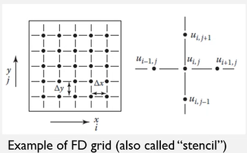
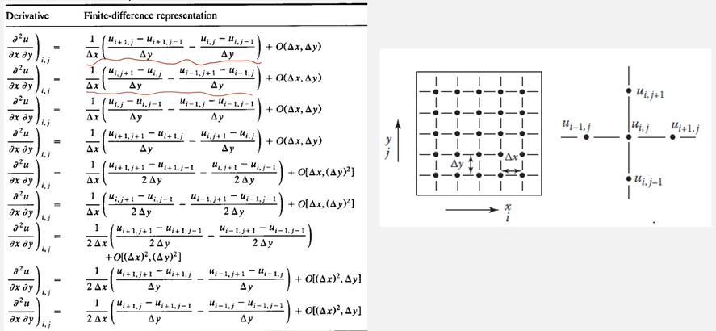

# Properties of Numerical Methods for PDE

Learn how to discretize a continuous problem into a discrete problem with some finite grid sizes (spacings); therefore, it is approximated. #FDM will be introduced as a discretization method for #PDE. Several considerations determine whether the solution so obtained will be a good approximation to the exact solution of the original problem (some error will exist). #TE, #consistency, #stability, #convergence, #boundedness, and #conservation.

*[TE]: Truncation Error

## Finite Difference Discretization Method
Replace a continuous #PDE problem with a discrete problem on a grid or mesh. Suppose we have a square domain having grids with equal spacing on each axis. For #marching-problem, a superscript is often used for time sequence: $u_{j}^{n + 1}$. A finite difference representation for a derivative: $$\frac{\partial u}{\partial x} = \underset{\Delta x \rightarrow \infty}{\lim}\frac{u(x_{0} + \Delta x, y_{0}) - u(x_{0}, y_{0})}{\Delta x} \approx \frac{u_{i + 1, j} - u_{i, j}}{\Delta x} + error$$.

($u_{i, j} = u(x_{0}, y_{0})$)

|  |
|:--:|
| Starting from the top and moving clockwise, these points are sometimes referred to as Center ($u_{i, j} = u(x_{0}, y_{0})$), North ($u_{i, j + 1} = u(x_{0}, y_{0} + \Delta y)$), East ($u_{i + 1, j} = u(x_{0} + \Delta x, y_{0})$), South ($u_{i, j - 1} = u(x_{0}, y_{0} - \Delta y)$), and West ($u_{i -1 , j} = u(x_{0} - \Delta x, y_{0})$). |

If $u$ is continuous, then approximation will be close to $\frac{\partial u}{\partial x}$ for a "sufficiently" small but finite $\Delta x$. The #MVT assures that the difference representation is exact for some point within the $\Delta x$ interval. We use a #Taylor-Expansion:

$$\begin{split}
u(x_{0} + \Delta x, y_{0}) &= u(x_{0}, y_{0}) + \frac{\partial u}{\partial x}\Delta x + \frac{\partial^{2}u}{\partial x^{2}}\frac{(\Delta x)^{2}}{2!} + \cdots + \frac{\partial^{n}u}{\partial x^{n}}\frac{(\Delta x)^{n}}{n!} \\
\frac{\partial u}{\partial x} &= \frac{u(x_{0} + \Delta x, y_{0}) - u(x_{0}, y_{0})}{\Delta x} - \frac{\partial^{2}u}{\partial x^{2}}\frac{\Delta x}{2!} - \cdots - \frac{\partial^{n}u}{\partial x^{n}}\frac{(\Delta x)^{n - 1}}{n!} \\
 &= \frac{u_{i + 1, j} - u_{i, j}}{\Delta x} + T.E.
\end{split}$$

#TE is the truncation error, which is the difference between the actual partial derivative and its numerical approximation. We may use "big-O" notation with order of spacings: $\frac{\partial u}{\partial x} = \frac{u_{i + 1, j} - u_{i, j}}{\Delta x} + \mathscr{O}(\Delta x)$. $\mathscr{O}(\Delta x)$ does not tell the exact size of the #TE, but rather how it behaves as $\Delta x$ tends toward zero.

!!! attention
    Forward-difference representation ($1^{st}$ derivative)
    : $$\frac{\partial u}{\partial x} = \frac{u_{i + 1, j} - u_{i, j}}{\Delta x} + \mathscr{O}(\Delta x)$$

    Backward-difference representation ($1^{st}$ derivative)
    : $$\begin{split}\frac{\partial u}{\partial x} &= \frac{u_{i, j} - u_{i - 1, j}}{\Delta x} + \mathscr{O}(\Delta x) \\ \implies u(x_{0}, y_{0}) &= u(x_{0} + \Delta x, y_{0}) - \frac{\partial u}{\partial x}\Delta x + \frac{\partial^{2}u}{\partial x^{2}}\frac{(\Delta x)^{2}}{2!} - \frac{\partial^{3}u}{\partial x^{3}}\frac{(\Delta x)^{3}}{3!} + \cdots\end{split}$$

    Central-difference representation ($1^{st}$ derivative)
    : $$\frac{\partial u}{\partial x} = \frac{u_{i + 1, j} - u_{i - 1, j}}{\Delta x} + \mathscr{O}((\Delta x)^{2})$$

    $2^{nd}$ derivative approximation
    : $$\frac{\partial^{2}u}{\partial x^{2}} = \frac{u_{i + 1, j} - 2u_{i, j} + u_{i - 1, j}}{(\Delta x)^{2}} + \mathscr{O}((\Delta x)^{2})$$

    ==These apply in other coordinate directions as well. Simply change the index assignments.==

!!! summary Some frequently used #FD approximations:
    - $1^{st}$ derivative approximation (2 or 3 grid points)
        - $\frac{\partial u}{\partial x} = \frac{u_{i + 1, j} - u_{i, j}}{h} + \mathscr{O}(h)$
        - $\frac{\partial u}{\partial x} = \frac{u_{i, j} - u_{i - 1, j}}{h} + \mathscr{O}(h)$
        - $\frac{\partial u}{\partial x} = \frac{u_{i + 1, j} - u_{i - 1, j}}{2h} + \mathscr{O}(h^{2})$
        - $\frac{\partial u}{\partial x} = \frac{-3u_{i, j} + 4u_{i + 1, j} - u_{i + 2, j}}{2h} + \mathscr{O}(h^{2})$
        - $\frac{\partial u}{\partial x} = \frac{3u_{i, j} - 4u_{i - 1, j} + u_{i - 2, j}}{2h} + \mathscr{O}(h^{2})$
    - $2^{nd}$ derivative approximation (3 grid points)
        - $\frac{\partial^{2} u}{\partial x^{2}} = \frac{u_{i, j} - 2u_{i + 1, j} + u_{i + 2, j}}{h^{2}} + \mathscr{O}(h)$
        - $\frac{\partial^{2} u}{\partial x^{2}} = \frac{u_{i, j} - 2u_{i - 1, j} + u_{i - 2, j}}{h^{2}} + \mathscr{O}(h)$
        - $\frac{\partial^{2} u}{\partial x^{2}} = \frac{u_{i + 1, j} - 2u_{i, j} + u_{i - 1, j}}{h^{2}} + \mathscr{O}(h)$

    These may represent a decent library of formulations. The book contains more for higher-order approximations.

    |  |
    |:--:|
    | Simple domain to demonstrate formulation of #FD approximations. |

    |  |
    |:--:|
    | So far, our derivatives have dealt only with a single variable, but derivatives can be mixed. |

*[FD]: Finite Difference

## Errors
- #TE
- #ROE and discretization error
- #consistency
- #stability
- #convergence for propagation problems

*[ROE]: Round-Off Error

### Truncation Error (TE)
The #TE associated with all derivatives in any single #PDE should be obtained by expanding about the same point (time and grid points). Let us consider a #parabolic, 1D heat equation.

The #FD approximation using forward and central differences lead to the #FDE minues the #TE.

*[FDE]: Finite Difference Equation

This given #FDE is an #explicit scheme: to find a solution at time step $n + 1$, only one unknown exists. #explicit scheme uses all knowns to find one unknown. An #implicit form could be used as well: e.g. if the solution, $u$ is evaluated at time step, $n + 1$ (in #RHS, $u_{j + 1}^{n + 1} - 2u_{j}^{n + 1} + u_{j - 1}^{n + 1}$). We only know $u_{j}^{n}$. In this #implicit case, we need #SOE to simultaneously solve three unknowns.

*[SOE]: System of Equations

We solve the heat equation using #FDE with hope that #TE is sufficiently small. But how do we know that the difference representation is acceptable and that a #marching-solution technique will work in the sense of giving an approximate solution to the #PDE? ==For the solution to be acceptable, the difference approximation must be #consistent and #stable.==

### ROE and Discretization Error
#ROE are attributable to digital computers representing numbers with a finite number of digits. In #FDE, the large number of dependent, repetitive operations are usually involved. In some calculations, the magnitude of the #ROE is proportional to number of grid points. In these cases, increasing grid resolution may decrease #TE but increase #ROE. #discretization-error is round-off free error in the solution of the #PDE that is caused by replacing the continuous #PDE with a discrete approximation. #discretization-error is caused by #TE and any errors introduced by the #BC. The difference between the exact solution of #PDE and the computer solution to #FDE would be close to the sum of the #discretization-error and the #ROE involved with the #FD calculations (there could be other errors coming from various aspects).

### Consistency
An FDE is said to be #consistent if, in the limit of vanishing mesh and time spacing size, $h$, the FDE approaches the #PDE: $$\underset{h \rightarrow 0}{\lim}(pde - fde) = \underset{h \rightarrow 0}{\lim}(T.E.) = 0$$ Generally, it is true for most of problems; however, thare may be some cases where it isn't.

!!! example #DuFort-Frankel-Method for #parabolic heat equation:
    $$\require{cancel} \frac{u_{j}^{n + 1} - u_{j}^{n - 1}}{2\Delta t} = \frac{\alpha}{(\Delta x)^{2}}\bigg(u_{j + 1}^{n} - u_{j}^{n + 1} - u_{j}^{n - 1} + u_{j - 1}^{n}\bigg) + \frac{\alpha}{12}\frac{\partial^{4}u}{\partial x^{4}}(\Delta x)^{2} - \frac{\partial^{2}u}{\partial t^{2}}\cancelto{r^{2}}{\bigg(\frac{\Delta t}{\Delta x}\bigg)^{2}} - \frac{1}{6}\frac{\partial^{3}u}{\partial t^{3}}(\Delta t)^{2}$$ This method will be consistent if $\underset{\Delta x, \Delta t \rightarrow 0}{\lim}(\frac{\Delta t}{\Delta x}) = 0$ (strange...). But, what if $\Delta x$ and $\Delta t$ approach zero at an equal rate: $\frac{\Delta t}{\Delta x} = \gamma$. Then this method becomes consistent with the following #hyperbolic equation: $$\frac{\partial u}{\partial t} + \alpha\gamma^{2}\frac{\partial^{2}u}{\partial t^{2}} = \alpha\frac{\partial^{2}u}{\partial x^{2}}$$

### Stability
For a consistent numerical scheme to be convergent, a required property is #stability. A stable numerical scheme is one for which errors from any source (#ROE, #TE, mistakes, etcetera) are not permitted to grow as the computation proceeds from one marching step to the next.

- Strictly only applicable for marching problems.
- #Fourier-Stability-Analysis (a.k.a. #von-Neumann-Stability-Analysis)

Can use the central-time difference scheme for heat equation: $$\frac{u_{j}^{n + 1} - u_{j}^{n - 1}}{2\Delta t} = \frac{\alpha}{(\Delta x)^{2}}\bigg(i_{j + 1}^{n} - 2u_{j}^{n} + u_{j - 1}^{n}\bigg) + \mathscr{O}(\Delta t^{2}, \Delta x^{2})$$ This method is #unconditionally-unstable even though the error term has higher orders: will not converge. Sometimes an #unstable method can be identified with physical implausibility because #unstable numerical procedures cause unacceptable modeling of the problem.

!!! attention
    Perform this stability analysis in project.

A simple, explicit scheme would be #stable only if $r = \bigg[\frac{\alpha\Delta t}{(\Delta x)^{2}}\bigg] \leq \frac{1}{2}$. Let's consider an explicit method for the heat equation: $$\frac{u_{j}^{n + 1} - u_{j}^{n}}{\Delta t} = \frac{\alpha}{(\Delta x)^{2}}\bigg(u_{j + 1}^{n} - 2u_{j}^{n} + u_{j - 1}^{n}\bigg) \rightarrow u_{j}^{n + 1} = r(u_{j + 1}^{n} + u_{j - 1}^{n}) + (1 - 2r)u_{j}^{n}$$ If $r = 1$ (i.e. #unstable), then the temperature on grid point, $j$ will be $200^{\circ}C$ which is physically impossible because the temperatures of surrounding grid points are $100^{\circ}C$.

|  |
|:--:|
| Neighboring grid points cannot be spontaneously different in temperature. |

### Convergence for Marching Problems
Such #PDE may be #parabolic or #hyperbolic problems because #elliptic does not pertain to time. *Generally, a #consistent and #stable scheme is convergent.* Convergence means that the solution to the #FDE approaches the solution of the #PDE with the same #IC and #BC as the mesh is refined.

!!! note #Lax-Equivalence-Theorem
    Given a #well-posed #IVP and #FDM to it that satisfies the #consistency condition, #stability is the **necessary and sufficient condition for convergence**.

**Most of the time, we assume that the #Lax-Equivalence-Theorem is satisfied even though it has never been proved for non-linear equations.**