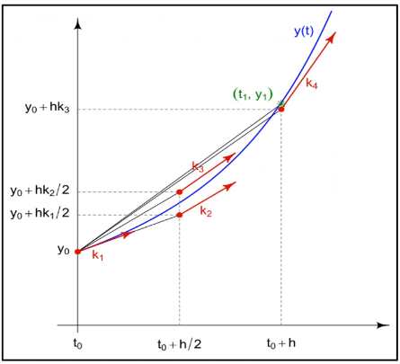

# Runge-Kutta Method

Higher-order local truncation error of [[taylor-method]] eliminates the need to compute derivatives.
#Runge-Kutta-Method (#RKM) is also the most popular and powerful *explicit* method to integrate #ODE.

*[RKM]: Runge-Kutta Method
*[ODE]: Ordinary Differential Equations

$$\begin{equation}
u_{k+1} = u_{k} + h\sum_{i=1}^{m}c_{i}f'(t_{i, k}, u_{i, k}), f'(t, u) = \frac{du}{dt}
\label{eq:runge_kutta_method}
\end{equation}$$

Flexibility in designing the method and choosing the coefficients, and order is limited to power of h.
The selection of $0 \leq \lambda \leq 1$, choosing $\lambda = 1$, which is [[euler-method]], uses information at the next time step to solve the half-steps from the current step.

## RK2
Two Methods for #RK2
1. Improved [[Euler-Method]]: $a = b = \frac{1}{2},~\lambda = 1$
2. Midpoint Method: $a = 0,~b = 1,~\lambda = \frac{1}{2}$

General form for #RK2: 
$$\begin{equation}
\begin{split}
u_{k+1} &= u_{k} &+ h[af'(t_{k}, u_{k}) + bf'(t_{k,2}, u_{k,2})] \\\\
&= u_{k} &+ h[af'(t_{k}, u_{k}) + \\\\
& & bf'(t_{k} + \lambda h, u_{k} + \lambda hf'(t_{k}, u_{k}))]
\end{split}
\label{eq:rk2}
\end{equation}$$

## RK4
$$\begin{equation}
\begin{split}
k_{1} &= hf'(t_{k}, u_{k}) \\\\
k_{2} &= hf'(t_{k} + \frac{h}{2}, u_{k} + \frac{k_{1}}{2}) \\\\
k_{3} &= hf'(t_{k} + \frac{h}{2}, u_{k} + \frac{k_{2}}{2}) \\\\
k_{4} &= hf'(t_{k} + h, u_{k} + k_{3}) \\\\
u_{k+1} &= u_{k} + \frac{1}{6}(k_{1} + 2k_{2} + 2k_{3} + k_{4})
\end{split}
\label{eq:rk4}
\end{equation}$$

|  |
|:--:|
| The $\frac{1}{6}$ term for averaging out $k^{th}$ points in #RK4. |

!!! question What are the units of $k$?
    Same units as $u$, because $f`$ is only wrt to time.

!!! example If $\dot{u} = u - t^{2} + 1$, where $u(0) = 0.5$ and $h = 0.2$.
    $$\begin{split}
    k_{1} &= hf'(t_{k}, u_{k}) = 0.2f'(0, 0.5) \\\\
    &= 0.2(1.5) = 0.3 \\\\
    k_{2} &= hf'(t_{k} + \frac{h}{2}, u_{k} + \frac{k_{1}}{2}) = 0.2f'(0.1, 0.65) \\\\
    &= 0.328 \\\\
    k_{3} &= hf'(t_{k} + \frac{h}{2}, u_{k} + \frac{k_{2}}{2}) = 0.2f'(0.1, 0.664) \\\\
    &= 0.3308 \\\\
    k_{4} &= hf'(t_{k} + h, u_{k} + k_{3}) = 0.2f'(0.1, 0.8308) \\\\
    &= 0.35816 \\\\
    u_{k+1} &= u_{k} + \frac{1}{6}(k_{1} + 2k_{2} + 2k_{3} + k_{4}) \\\\
    &= 0.5 + \frac{1}{6}[0.3 + 2(0.328) + 2(0.3308) + 0.35816] \\\\
    &= 0.8292933
    \end{split}$$
    
    bar
    
    bar