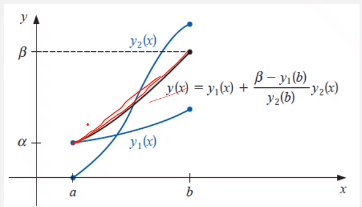

# Shooting Method

## Linear Shooting Method
Let's consider a generalized, second-order diffeq: $$y'' = p(x)y' + q(x)y + r(x),~\text{for}~a \leq x \leq b$$ and $y(a) = \alpha,~y(b) = \beta$.
To approximate unique solution, consider two #IVP:

$$\begin{align*}
y'' &= p(x)y' + q(x)y + r(x) &,~a \leq x \leq b &,~y(a) = \alpha &,~y'(a) = z1 \\
y'' &= p(x)y' + q(x)y &,~a \leq x \leq b &,~y(a) = 0 &,~y'(a) = z2
\end{align*}$$

The solutions of the two problems are denoted $y_{1}(x)$ and $y_{2}(x)$, where $z1$ and $z2$ are commonly $0$ and $1$, respectively.

|  |
|:--:|
| $y(x) = y_{1}(x) + \frac{\beta - y_{1}(b)}{y_{2}(b)}y_{2}(x)$ interpolates between two #IVP, $y_{1}(x)$ and $y_{2}(x)$. |

If we restrict, $y_{2}(b) \neq 0$, then the solution can be written as: $y(x) = y_{1}(x) + \frac{\beta - y_{1}(b)}{y_{2}(b)}y_{2}(x)$, where the equation interpolations between $y_{1}(x)$ as solution to $y'' = p(x)y' + q(x)y + r(x)$ and $y_{2}(x)$ as solution to $y'' = p(x)y' + q(x)y$.
First and second derivatives follow as:
$$\begin{split}
y'(x) &= y_{1}'(x) + \frac{\beta - y_{1}(b)}{y_{2}(b)}y_{2}'(x) \\
y''(x) &= y_{1}''(x) + \frac{\beta - y_{1}(b)}{y_{2}(b)}y_{2}''(x)
\end{split}$$

!!! question Is this root-bracketed? <cite>#Reid-Prichard
    Next slide.

If we substitute into $y''(x)$, then:
$$\begin{split}
y''(x) &= y_{1}''(x) + \frac{\beta - y_{1}(b)}{y_{2}(b)}y_{2}''(x) \\
  &= p(x)y_{1}' + q(x)y_{1} + r(x) + \frac{\beta - y_{1}(b)}{y_{2}(b)}(p(x)y_{2}' + q(x)y_{2}) \\
  &= p(x)(y_{1}' + \frac{\beta - y_{1}(b)}{y_{2}(b)}y_{2}') + q(x)(y_{1} + \frac{\beta - y_{1}(b)}{y_{2}(b)}y_{2}) + r(x) \\
  &= p(x)y'(x) + q(x)y(x) + r(x)
\end{split}$$

!!! question Is this like the #Bisection-Method? <cite>#Daniel-Kenney.
    This is not an iterative, #root-finding problem.
    This interpolates between two, real solutions.

The boundary conditions must satisfy:
$$\begin{split}
y(a) &= y_{1}(a) + \frac{\beta - y_{1}(b)}{y_{2}(b)}y_{2}(a) = \alpha + \frac{\beta - y_{1}(b)}{y_{2}(b)}*0 = \alpha \\
y(b) &= y_{1}(b) + \frac{\beta - y_{1}(b)}{y_{2}(b)}y_{2}(b) = \beta + 
\end{split}$$

!!! question Why guess at the derivatives? Does this make it easier to solve? <cite>#Reid-Prichard
    Certainly experiment with the guesses.

- Linear Shooting Method uses two #IVP
- The solutions to #IVP are $y_{1}(x)$ and $y_{2}(x)$.
- These #IVP are solved by typical #ODE solvers.

!!! example Apply Linear Shooting Method to #BVP: $u'' = y'' = -\frac{2}{x}y' + \frac{2}{x^{2}}y + \frac{sin(ln(x))}{x^{2}}$, for $1 \leq x \leq 2$ if $y(1) = 1$, $y(2) = 2$, and $h = 0.1$.
    First make first-order #ODE: $y_{1} = u$, $u(1) = 1$, $T(1) = 0$.
    Therefore, $u' = T$ into $y_{1}$ and $T' = -\frac{2}{x} + \frac{2}{x^{2}}u + \frac{sin(ln(x))}{x^{2}}$ into $y_{2}$, and use [Forward Euler Method](euler-method.md#forward) to solve these equations.
    $$\begin{split} u_{n + 1} &= u_{n} + hf_{1}(T_{n}) \\ t_{n + 1} &= T_{n} + hf_{2}(x_{n}, u_{n}, T_{n})\end{split}$$
    *Here, $h$ is spatial increment (physical spacing), not time increment.*
    At $n = 0$, set $x_{0} = 1.0$, then:
    $$\begin{split}\begin{bmatrix}u_{1} \\ T_{1}\end{bmatrix} &= \begin{bmatrix}u_{0} \\ T_{0}\end{bmatrix} + h\begin{bmatrix}f_{1}(T_{0}) \\ f_{2}(x_{0}, u_{0}, T_{0})\end{bmatrix} = \begin{bmatrix}u_{0} \\ T_{0}\end{bmatrix} + (0.1)\begin{bmatrix}T_{0} \\ -\frac{2}{x_{0}}T_{0} + \frac{2}{x_{0}^{2}}u_{0} + \frac{sin(ln(x_{0}))}{x_{0}^{2}}\end{bmatrix} \\ &= \begin{bmatrix}1 \\ 0\end{bmatrix} + (0.1)\begin{bmatrix}0 \\ -\frac{2}{1}(0) + \frac{2}{1}(1) + \frac{sin(ln(1))}{1}\end{bmatrix} = \boxed{\begin{bmatrix}1 \\ 0.2\end{bmatrix}} \longleftarrow \begin{bmatrix}u \\ T \end{bmatrix} \\ \begin{bmatrix}u_{2} \\ T_{2}\end{bmatrix} &= \begin{bmatrix}u_{1} \\ T_{1}\end{bmatrix} + h\begin{bmatrix}f_{1}(T_{1}) \\ f_{2}(x_{1}, u_{1}, T_{1})\end{bmatrix} = \begin{bmatrix}u_{1} \\ T_{1}\end{bmatrix} + (0.1)\begin{bmatrix}T_{1} \\ -\frac{2}{x_{1}}T_{1} + \frac{2}{x_{1}^{2}}u_{1} + \frac{sin(ln(x_{1}))}{x_{1}^{2}}\end{bmatrix} \\ &= \begin{bmatrix}1 \\ 0.2\end{bmatrix} + (0.1)\begin{bmatrix}1 \\ -\frac{2}{1.1}(0.2) + \frac{2}{1.1^{2}}(1) + \frac{sin(ln(1.1))}{1.1^{2}}\end{bmatrix} = \boxed{\begin{bmatrix}1.02 \\ 0.336791\end{bmatrix}} \longleftarrow \begin{bmatrix}u \\ T \end{bmatrix}\end{split}$$
    Repeat this process for the second #IVP.
    |  |
    |:--:|
    | Converges on $\mathscr{O}(10^{-5})$. |