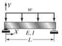
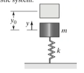
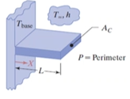

<!-- 20230117T08:16 -->
# Lecture 1: Introduction to Finite Element Analysis
## Introduction
Engineering problems are mathematical models of physical situations.
In general, mathematical models of many engineering problems are differential equations with a set of corresponding boundary and/or initial conditions.

!!! example Governing Equations
    |  |
    |:--:|
    | $EI\frac{d^{2}Y}{dX^{2}} = \frac{wX(L - X)}{2}$ |

    |  |
    |:--:|
    | $\frac{d^{y}}{dt^{2}} + \omega_{n}^{2}y = 0$ |

    |  |
    |:--:|
    | $\frac{d^{2}T}{dX^{2}} - \frac{hp}{kA_{c}}(T - T_{0}) = 0$ |

    Analytical solutions are usually rather limited in application whether because of complex geometries or boundary conditions.

[Finite Element Method](../engr-704-001-partial-differential-equations/finite-element-method.md)
:   1. A numerical method for solving problems of engineering and mathematical physics.
    2. A numerical procedure that can be used to obtain solutions to a large class of engineering problems involving stress analysis, heat transfer, electromagnetism, and fluid flow.
    3. A numerical procedure for solving the differential equations problems of engineering and mathematical physics.
    4. A method for predicting and simulating the physical behavior of complex engineering system.

## What is #FEM?
Typical fields of application:
- Structural Analysis
- Heat Transfer
- Fluid Flow
- Mass Transport
- Electromagnetic Potential

## How does #FEM work?
Divide a body into an equivalent system of small bodies of units (finite elements) and interconnect them at points common to two or more elements, boundary lines, or surfaces.
- This process is known as _discretization_.
- In #FEM, the problem for the entire body is solved by formulating the equations for each finite element and combining them to obtain the whole solution.

The underlying theory is the [Difference Method](../engr-704-001-partial-differential-equations/finite-difference-method.md) wherein there exists an differential equation for each element and each element acts as the boundary condition to its neighbors.

## Fundamental Concept
Any continuous function (quantity), such as stress, pressure, displacement, temperature, etcetera, is approximated by a model composed of a set of piecewise functions.
#shape-functions are those that interpolate solutions between nodes: most common are linear interpolations.
It is the responsibility of the analyst to detect whether the analysis shown by a software is reasonable because values are generally an approximation from neighbors.

## Finite Elements
The domain is divided into a finite number of sub-domains called elements (finite elements).

## Brief History of #FEM
- 1940s: Modern development of #FEM began in the field of structural engineering.
- 1950s: The development of high-speed digital computers made possible #FEM equations to be expressed in matrix notation.
- Early 1960s: #FEM was extended to three-dimensional problems.
- Late 1960s: #FEM had been applied to non-structural applications such as torsion of a shaft, fluid flow, and heat conduction.
- Modern #FEM: A relatively new field of application is that of bio-engineering.

The first [FEM software](https://github.com/nasa/NASTRAN-95) was developed for #NASA.

## Role of the computer
With the development of computers in the 1950s, #FEM became a practical tool of analysis.
With modern computers computational programs with millions of unknowns can be solved.
To use the computer, the analyst, having defined the finite element model, inputs the information for calculation.
The information may include the position of the element nodal coordinates, material properties, the applied load, boundary conditions, or constraints.
The computer then generates and solves the equations and outputs results for interpretation.

## Primary methods used to derive finite element equations.
1. The direct methods or direct equilibrium methods.
2. The variation methods.
3. The weighted residual methods.

## General Steps of the #FEM
1. Discretize and select the element types.
2. Select a displacement function.
3. Define the element relationships.
4. Derive the element stiffness matrix and equations.
5. Assemble the element equations to obtain the global equations and introduce boundary conditions.
6. Solve for the unknown degrees of freedom.
7. Solve for the element strains and stress (structural stress-analysis problems).
8. Interpret the results.

## Advantages of #FEM
The ability to:
1. Model irregularly shaped bodies quite easily.
2. Handle general load conditions without difficulty.
3. Model bodies composed of several different materials.
4. Handle virtually unlimited numbers and kinds of boundary conditions.
5. Vary the size of the elements.
6. Alter the finite element model relatively easily and cheaply.
7. Include dynamic effects.
8. Handle non-linear behavior.

<!-- 20230119T08:13 -->

Because #FEA softwares are essentially solving a system of equations constructed of matrices, a critical point of understanding is the matrix manipulation the software is performing that one better understands the results.