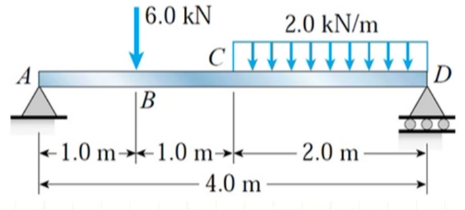
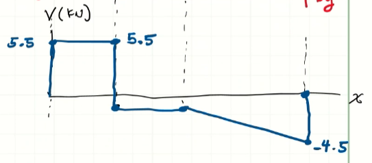

<!-- 20230221T08:21 -->
# Lecture 11: Shear Force and Bending Moment Equations for Beams
## Example Problem Set 5-1
### 2
#### Problem Statement

#### Solution
Reaction Forces
$$\begin{split}
\circlearrowleft \sum M_{A} &= -6(1) - 4(3) + D_{y}(4) \\
\implies D_{y} &= 4.5~kN \\
\uparrow \sum F_{y} = 0 &:= A_{y} - 6 - 4 + D_{y} = 0 \\
\implies A_{y} &= 5.5~kN
\end{split}$$

Shear Force Diagram
$$\begin{split}
V_{A} &= 5.5~kN \\
V_{B}^{-} &= V_{A} + \cancel{\Delta V} = 5.5~kN \\
V_{B}^{+} &= 5.5 - 6 = -0.5~kN \\
V_{C} &= V_{B}^{+} + \cancel{\Delta V} = -0.5~kN \\
V_{D} &= V_{C} + \Delta V = -0.5 - 2(2) = -4.5~kN
\end{split}$$

|  |
|:--:|
| Usually, the shear forces at the end are the reaction forces. |

Bending Moment Diagram
$$\begin{split}
M_{A} &= 0 \\
M_{B} &= M_{A} + \Delta M = 0 + 5.5(1) = 5.5~kN-m \\
M_{C} &= M_{B} + \Delta M = 5.5 + (-0.5)(1) = 5.0~kN-m \\
M_{D} &= M_{C} + \Delta M = 5.0 - \frac{1}{2}(0.5 + 4.5)(2) = 0
\end{split}$$