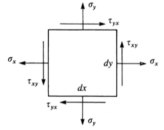
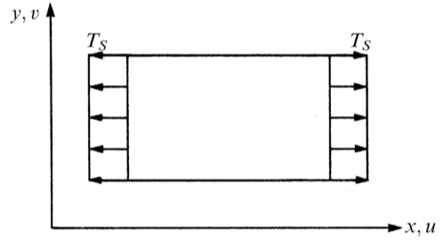
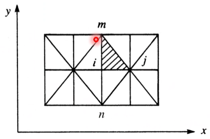
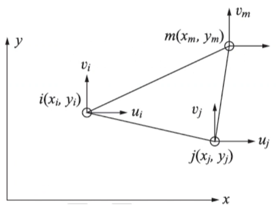

<!-- 20230321T08:26 -->
# Lecture 12: Two Dimensional Finite Element Equations: Fundamental Concepts and Plane Strain
## Introduction
Finite element method if very helpful for the solution of trusses, beams, and frames.
Nonetheless, the real power of the method is the application to 2D and 3D solid analysis.
There are very few closed form solutions to 2D problems, and they are only available for simple geometries and loading conditions.
The Finite Element Method, if correctly applied, can provide the solution to most any 2D problems.

## Plane Stress
Plane Stress
: A state of stress in which the normal and shear stresses directed perpendicular to the plane are assumed to be zero.
Additionally, the plane thickness is very thin compared to the other two dimensions.

## Plane Strain
Plane Strain
: A state of strain in which the strain normal to the x-y plane and other strain directions are zero.
Additionally, the plane thickness is infinitely thick compared to the other directions.

## Two-Dimensional State of Stress
|  |
|:--:|
| Consider a 2D state of stress. |

## Stress-Strain Relationships for Plane Stress
The main constitutive relationship in solid mechanics is Hooke's Law: $\sigma = D\epsilon$.
$$\mathbf{D} = \frac{E}{1 - \nu^{2}}\begin{bmatrix}
1 & \nu & 0 \\
\nu & 1 & 0 \\
0 & 0 & \frac{1 - \nu}{2}
\end{bmatrix}$$
Where $E$ is the elastic modulus and $\nu$ is Poisson's Ratio.

## Stress-Strain Relationships for Plane Strain
The main constitutive relationship in solid mechanics is Hooke's Law: $\sigma = D\epsilon$.
$$\mathbf{D} = \frac{E}{(1 + \nu)(1 - 2\nu)}\begin{bmatrix}
1 - \nu & \nu & 0 \\
\nu & 1 - \nu & 0 \\
0 & 0 & \frac{1 - 2\nu}{2}
\end{bmatrix}$$
Where $E$ is the elastic modulus and $\nu$ is Poisson's Ratio.

## Linear Triangular Element
|  |
|:--:|
| Consider the thin plate subjected to tensile surface traction loads, $T_{s}$. |

### Discretize
The first step for the finite element formulation is to divide the domain into elements.

|  |
|:--:|
| Different types of elements can be used, the simplest type is the linear triangular element. |

Irregularly...

### Nodal Coordinates
|  |
|:--:|
| By convention, the nodes are labeled $i$, $j$, and $m$ in a counter-clockwise fashion starting from the lower left-most node. |

We do not use $k$ (as might be instinctive) to minimize confusion with the stiffness matrix.

### Displacement Function
A linear displacement function for each element is selected: $$\begin{split}
u(x, y) &= a_{1} + a_{2}x + a_{3}y \\
v(x, y) &= a_{4} + a_{5}x + a_{6}y
\end{split}$$
This function automatically enforces **compatibility** between nodes.

### Evaluating at Nodal Coordinates
!!! attention
    The area of the triangle defined between nodes is half the determinant of the inverse matrix for displacement of the nodes.

### Shape Function
$$\begin{split}
u(x, y) &= N_{i}u_{i} + N_{j}u_{j} + N_{m}u_{m} \\
v(x, y) &= N_{i}v_{i} + N_{j}v_{j} + N_{m}v_{m}
\end{split}$$

### Strain/Displacement Relationships
The strains for 2D elements are defined as: $$\vec{\epsilon} = \left\{\begin{matrix}
\epsilon_{x} \\
\epsilon_{y} \\
\gamma_{xy}
\end{matrix}\right\} = \left\{\begin{matrix}
\frac{\partial u}{\partial x} \\
\frac{\partial v}{\partial y} \\
\frac{\partial u}{\partial y} + \frac{\partial v}{\partial x}
\end{matrix}\right\}$$
This further enforces compatibility because the strain in each element are constant.

## Minimum Potential Energy Principle
## First Variation of the Potential Energy Functional