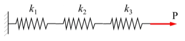

<!-- 20230124T08:14 -->
# Lecture 3: The Stiffness (Displacement) Method
## Direct Method
This has its roots in Matrix Structural Analysis.
Matrix methods can be used to analyze framed structures only.
#FEA, which originated as an extension of matrix analysis, has now developed to the extent that it can be applied to structures and solids of practically any shape or form.
There are two general, direct approaches:
1. The force of flexibiliity method which uses internal forces as the unknowns to the problems.
2. The displacement or stiffness method which assumes that displacement of the nodes as the unknowns of the problem.

For computational purposes, the displacement method is more...

|  |
|:--:|
| Steel columns are commonly used to support loads from various floors of multistory buildings. |

The column shown may be divided into four elements and five nodes to generate a finite element model.
(Refer to the [General Steps of FEM](lecture-1-introduction-to-finite-element-analysis.md#general-steps-of-the).)

### Step 1, 2, and 3: Discretization and Element Selection and Shape Function
|  |
|:--:|
| To illustrate the method, the mechanical system shown will be used. |

#### Step 1: Select the element type and Discretize
|  |
|:--:|
| The system will be divided in several, linear spring elements. |

#### Step 2 and 3: Select a Displacement Function and Define the stress-strain-displacement relationships
|  |
|:--:|
| The force and deflection in a linear spring are related by [Hooke's Law](../engr-727-001-advanced-mechanics-of-materials/hookes-law.md). |

### Step 4: Derivation of Stiffness Matrix for each Element

For any linear spring element:
- $f_{1x}$ and $f_{2x}$ are the _local nodal forces_ on the $x$-axis.
- $u_{1}$ and $u_{2}$ are the _local nodal displacements_.
- $k$ is the _spring constant_ or _stiffness of the spring_.
- $L$ is the distance between the nodes.
- The force at each node: $$\begin{split}
\delta &= u_{1} - u_{2} \\
f &= k\delta
\end{split}$$ where $\delta$ is the total deformation and $f$ is the tensile force.
- Combining, $f = k(u_{1} - u_{2})$.

Properties of the Stiffness Matrix
- The matrix is singular and symmetric.
- This is the basic process of deriving the stiffness matrix for any element.

!!! hint Test for a Singular Matrix
    A matrix will be singular if its determinant is 0.

### Step 5: Establish the Global Stiffness Matrix
The global stiffness matrix and global force matrix are assembled using nodal force and equilibrium equations.
- The nodal force equilibrium equations.
- Force/Deformation compatibility equations.
    - Node 1 is fixed and an axial force is applied at Node 4.
    - The x-axis is the global axis of the assembly.
    - For element 1: $$\left\{\begin{matrix}
    f_{1x}^{(1)} \\
    f_{2x}^{(1)}
    \end{matrix}\right\} = \begin{bmatrix}
    k_{1} & -k_{1} \\
    -k_{1} & k_{1}
    \end{bmatrix}\left\{\begin{matrix}
    u_{1x} \\
    u_{2x}
    \end{matrix}\right\}$$

From the free-body diagram...

!!! question Is the local matrix always 2x2? If so, is the global matrix always tridiagonal? <cite> JMA3
    The local stiffness matrix is always $2 \times 2$, but the global stiffness matrix is not necessarily tridiagonal (depending on the order of constructed).
    However, the matrix can be re-ordered into a symmetric form (which is probably tridiagaonl) that is certainly singular (its determinant is zero).

### Step 6: Boundary Conditions
We must specify the boundary (support) conditions for structure models, else $[K]$ will be singular.
...
_Homogeneous Boundary Conditions_
- Most common type
- Occur at locations completely prevented from moving
- Zero degrees of freedom
_Non-Homogeneous Boundary Conditions_
- ...

##### Homogeneous Boundary Conditions
Where is the homogeneous boundary condition for the spring assemblage?
At Node 1, because the location is fixed; therefore, $u_{1} = 0$.
The system relation, then, can remove a row.
This elimination could occur for each row/column where there is no displacement.
Row/columns cannot be simply removed if the displacement is known and non-zero.
Further reduction requires adding the boundary condition of the eliminated row to another.

## Problem Set 2
### Problem 1
For the mechanical system shown:
1. Obtain the global stiffness matrix.
2. asdf
foobar

$u = \{5, 7.5, 17.5\}$

### Problem 2
$u = \{0.53125, 0.59375, 0.71875\}$

### Problem 4
$u_{3} = 0.002 m$