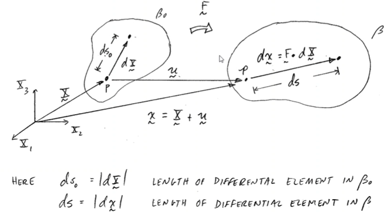

# ENGR 725-001: Continuum Mechanics
!!! abstract Course Description
    An introduction to the general theory of continuous media and its application to the theories of elasticity and fluid mechanics.

Table of Contents
- [ENGR 725-001: Continuum Mechanics](#engr-725-001-continuum-mechanics)
  - [Continuum Mechanics](#continuum-mechanics)
  - [Fundamentals of Cartesian Tensors](#fundamentals-of-cartesian-tensors)
    - [Inidical (Index) Notation: Shorthand for Tensors](#inidical-index-notation-shorthand-for-tensors)
  - [Scalar Product](#scalar-product)
  - [Tensor Symmetry](#tensor-symmetry)
  - [Eigenvalues and Eigenvectors of a Symmetric 2nd Rank Tensor](#eigenvalues-and-eigenvectors-of-a-symmetric-2nd-rank-tensor)
  - [Tensor Calculus](#tensor-calculus)
    - [Directional Derivative, $\\frac{\\partial \\phi}{\\partial n}$](#directional-derivative-fracpartial-phipartial-n)
    - [Divergence Theorem of Gauss](#divergence-theorem-of-gauss)
  - [Mechanics](#mechanics)
    - [Analysis of Stress](#analysis-of-stress)
    - [Define the "Traction Vector" ("Stress Vector")](#define-the-traction-vector-stress-vector)
    - [Differential Equations of Equilibrium](#differential-equations-of-equilibrium)
      - [Force Equilibrium](#force-equilibrium)
      - [Moment Equilibrium](#moment-equilibrium)
    - [Principal Stresses](#principal-stresses)
      - [Determination of prinicpal stresses and principal directions](#determination-of-prinicpal-stresses-and-principal-directions)
      - [Maximum of in-plane shear stresses](#maximum-of-in-plane-shear-stresses)
    - [Special States of Stress](#special-states-of-stress)
    - [Planar Stress Transofmrations](#planar-stress-transofmrations)
  - [Kinematics of Deformation and Motion](#kinematics-of-deformation-and-motion)
    - [Lagrangian Description](#lagrangian-description)
    - [Eulerian Description](#eulerian-description)
    - [Summary](#summary)
    - [Material Time Derivative](#material-time-derivative)
    - [Deformation Gradient and Finite Strain Tensors](#deformation-gradient-and-finite-strain-tensors)
  - [Strain](#strain)
  - [Infinitesimal Strains and Rotations](#infinitesimal-strains-and-rotations)
  - [Physical Interpretation of Components](#physical-interpretation-of-components)
  - [Stretch Ratios and Stretch Tensors](#stretch-ratios-and-stretch-tensors)
  - [Fundamental Theorem of Polar Decomposition](#fundamental-theorem-of-polar-decomposition)
  - [Eulerian Rate of Deformation and Vorticity](#eulerian-rate-of-deformation-and-vorticity)
  - [General Principles: Fundamental Laws and Equations](#general-principles-fundamental-laws-and-equations)
    - [Material Time Derivative of a Volume Integral](#material-time-derivative-of-a-volume-integral)
    - [Conservation of Mass (Continuity Equation)](#conservation-of-mass-continuity-equation)
    - [Conservation of Linear Momentum](#conservation-of-linear-momentum)
  - [Nominal or Piola Kirchhoff Stresses (Lagrangian)](#nominal-or-piola-kirchhoff-stresses-lagrangian)
  - [Conservation of Energy](#conservation-of-energy)
  - [Method of Local State](#method-of-local-state)
  - [Constitutive Equations](#constitutive-equations)
  - [Fundamental Restrictions on the Formulations of Constitituive Equations](#fundamental-restrictions-on-the-formulations-of-constitituive-equations)
  - [Classical Fluid Mechanics](#classical-fluid-mechanics)
  - [Final Exam Review](#final-exam-review)

---

*Lecture (1): August 22, 2022*

**Introduction**
This course will have a **Comprehensive Final Exam!** Homeworks will be word problems, mostly.

#constitutive
: Governing equation of state: e.g. defining relationship between stress and strain as in #ISV Theory

*[ISV]: Internal State Variable

## Continuum Mechanics
Based on the concept that there exists space between atoms at lower length scales, but this is summarized by some measurement of density wherein there are no gaps between atoms at the *continuum* length scale.
This assumptions works well at this length scale, and not necessarily for lower length scales [^ContinuumReview].

[^ContinuumReview]: For a short review, see the summary [Lecture 1](engr-741-001-inelasticity.md#lecture-1-a-review-of-continuum-mechanics) in *ENGR 741: Inelasticity*.

Continuum Mechanics
: A mathematical approach for describing the behavior of continuously distributed matter, subject to certain density requirements.
It includes the concepts of stress, deformation, and thermal behavior common to all "dense" media: the observation scale of interest often defines the applicability of continuum mechanics.

[[knudsen-number]]

==Continuum mechanics cannot be applied if this ratio is close to unity.==
If the length scale of observation, $\lambda$ is much smaller than the specimen, then continuum can be applied.
If the *[[knudsen-number]]* is too large, then the theory cannot be applied.
The theory primarily relies on the assumption that matter is uniformly distributed throughout the material: i.e.
#FEM softwares rely on this assumption.
The $20^{\text{th}}$ century has seen the greatest advances in continuum mechanics.
In this course, we will focus on continuum processes characterized in terms of a right-handed Cartesian coordinate system.

---

*Lecture (2): August 24, 2022*
## Fundamentals of Cartesian Tensors
There exists many types of coordinate systems, but we typically think of *#Cartesian* coordinates.

Basis Vector
: A unit vector in the direction of an axis.

Tensor
: A mathematical representation of a physical quantity (more than a simple matrix):
  - Independent of chosen coordinate system
  - Must obey certain linear transformation laws

$\underset{\sim}{D}$ denotes tensor quantity.
Tensors also have a rank or order.
- 0: scalar
- 1: vector
- 2: 2nd order tensor (e.g. stress, strain)
- 4: 4th order tensor (e.g. elastic stiffness)

Tensor quantities may be expressed in a variety of equivalent fashions.
Consider a vector, $\underset{\sim}{P}$ ($1^{\text{st}}$order tensor, three independent components):
|  |
|:--:|
| $\underset{\sim}{P} = P_{x}\hat{i} + P_{y}\hat{j} + P_{z}\hat{k} = P_{1}\underset{\sim}{e_{1}} + P_{2}\underset{\sim}{e_{2}} + P_{3}\underset{\sim}{e_{3}} \equiv \{\underset{\sim}{P}\} = [P_{x}, P_{y}, P_{z}]^{(T)} = [P_{1}, P_{2}, P_{3}]^{(T)}$ |
Or simply, $P_{i} \rightarrow i^{\text{th}}$ component of vector $\underset{\sim}{P}$ where $\underbrace{i = 1, 2, 3}_{\text{range} = 3}$.

### Inidical (Index) Notation: Shorthand for Tensors
- Vector ($1^{\text{st}}$-order, $\text{rank} = 1$): $\underset{\sim}{P} = P_{1}\underset{\sim}{e_{1}} + P_{2}\underset{\sim}{e_{2}} + P_{3}\underset{\sim}{e_{3}} = \sum_{i = 3}^{3}P_{i}\underset{\sim}{e_{i}}$, where range is $3$.
- $2^{\text{nd}}$-Order Tensor ($\text{rank} = 2$): $[\underset{\sim}{\sigma}] = \begin{bmatrix}
\sigma_{11} & \sigma_{12} & \sigma_{13} \\
\sigma_{21} & \sigma_{22} & \sigma_{23} \\
\sigma_{31} & \sigma_{32} & \sigma_{33}
\end{bmatrix}$, matrix representation where $\sigma_{ij} \in \left.\begin{cases}
i = 1, 2, 3 \\
j = 1, 2, 3
\end{cases}\right\}$, where range is $3$.
- Similarly, for a $4^{\text{th}}$-order tensor, $\underset{\sim}{c}$ (tougher to visualize): $c_{ijkl} = \left.\begin{cases}
i = 1, 2, 3 \\
j = 1, 2, 3 \\
k = 1, 2, 3 \\
l = 1, 2, 3
\end{cases}\right\}$, where range is $3$.

Indices denotes that component of vector or component of certain vector within a matrix.
The range of the indices is length of the vector or number of columns in a matrix.
A tensor has $$\text{number of independent components} = \text{range}^{\text{rank}}$$
For a range of 3 (most of the time for this course), then:

| Tensor | Rank | Quantity | # independent components |
|--- | --- | --- | --- |
| $A$ | $0$ | scalar | $3^{0} = 1$ |
| $A_{i}$ | $1$ | vector | $3^{1} = 3$ |
| $A_{ij}$ | $2$ | $2^{\text{nd}}$-order | $3^{2} = 9$ |
| $A_{ijkl}$ | $4$ | $4^{\text{th}}$-order | $3^{4} = 81$ |

Einstein Summation Convention
: Repeated/Dummy indices (on a single term) represents summation over the entire range of the indices.
!!! example Example
    Vector, $\underset{\sim}{B} = B_{1}\tens

!!! example Examples
    - Scaling a tensor: $B_{k}\underset{\sim}{e_{k}} = B_{1}\underset{\sim}{e_{1}} + B_{2}\underset{\sim}{e_{2}} + B_{3}\underset{\sim}{e_{3}}$
    - Multiplying Tensor by Tensor: $a_{i}b_{i}$ is simply the **Dot Product.**
    - A 2nd rank tensor: $[\underset{\sim}{B}] = [B_{ij}]$ is the sum along the trace of the tensor.

!!! question What is the rank of $B_{ij}n_{j}$? What type of tensor is it? <cite> lecture
    It starts as a second-rank tensor, because there are two free indices. This is matrix multiplication between matrix and vector that comes out to a vector which is rank 1.

!!! question What if the equation were $n_{j}B_{ij}$? <cite> #Maria-Lee
    This works out to the same matrix, but is transpose of $B_{ij}n_{j}$.

---

*Lecture (3): August 26, 2022*

!!! question What if the equation were $a_{i}b_{j}$? <cite> Joby
    Then the result is a second-rank tensor.

!!! example Example
    $$\begin{split}
    B_{ij}n_{j} &= \begin{bmatrix}
    B_{11} & B_{12} & B_{13} \\
    B_{21} & B_{22} & B_{23} \\
    B_{31} & B_{32} & B_{33}
    \end{bmatrix} \times \begin{bmatrix}
    n_{1} \\
    n_{2} \\
    n_{3}
    \end{bmatrix} \\
    &= \begin{bmatrix}
    B_{11}n_{1} + B_{12}n_{2} + B_{13}n_{3} \\
    B_{21}n_{1} + B_{22}n_{2} + B_{23}n_{3} \\
    B_{31}n_{1} + B_{32}n_{2} + B_{33}n_{3}
    \end{bmatrix}
    \end{split}$$

!!! example Example
    Being that there are no free indices, the result should be a scalar.
    $$\begin{split}
    T_{ij}p_{i}q_{j} &= (T_{11}p_{1}q_{1} + T_{12}p_{1}q_{2} + T_{13}p_{1}q_{3}) \\
    &\qquad+ (T_{11}p_{2}q_{1} + T_{12}p_{2}q_{2} + T_{13}p_{2}q_{3}) \\
    &\qquad+ (T_{11}p_{3}q_{1} + T_{12}p_{3}q_{2} + T_{13}p_{3}q_{3})
    \end{split}$$

[[kroneckers-delta]]

[[permutation-tensor]]

---

*Lecture (4): August 29, 2022*

$a_{i}b_{j}\delta_{ij} \equiv a_{i}\underset{\sim}{e_{i}}b_{j}\underset{\sim}{e_{j}}\underset{\sim}{e_{i}}\cdot\underset{\sim}{e_{j}} \implies a_{i}b_{j}\underset{\sim}{e_{i}}\underset{\sim}{e_{j}}\underset{\sim}{e_{i}}\cdot\underset{\sim}{e_{j}}$, where $\underset{\sim}{e_{j}}\underset{\sim}{e_{j}} = 1$ but the index will switch axes. This further implies $a_{i}b_{j}\underset{\sim}{e_{i}}\underset{\sim}{e_{i}} = a_{i}b_{i}$.

!!! attention Know this for exams!
    Remember how to substitute [[kroneckers-delta]].

!!! info Some useful identities
    See also Schaum’s
    * $\epsilon_{ijk} = -\epsilon_{kji} = \epsilon_{kij} = -\epsilon_{ikj}$
    * sign change property of $\underset{\sim}{\epsilon}$
    * $\epsilon_{miq}\epsilon_{jkq} = \delta_{mj}\delta_{ik} - \delta_{mk}\delta_{ij}$
    * $\underset{\sim}{\epsilon} - \underset{\sim}{\delta}$ identity can be proven by expansion.

    !!! attention
        **THESE ARE SUPER IMPORTANT!!!**

Also, from the sign change property of $\epsilon_{ijk}$:
$$\epsilon_{miq}\epsilon_{jkq} = \epsilon_{miq}\epsilon_{qjk} = \epsilon_{qmi}\epsilon_{qjk} = \epsilon_{qmi}\epsilon_{jkq}$$
In addition, it is easy to show from the $\epsilon_{ijk} - \delta_{pq}$ identity that:
$$\begin{split}
\epsilon_{jkq}\epsilon_{mkq} &= 2\delta_{jm} \quad\because \delta_{jm}\delta_{kk} - \delta_{jk}\delta_{km} \\
\epsilon_{jkq}\epsilon_{jkq} &= 6
\end{split}$$

***Transformation Laws for Tensors***

Let $a_{11}$ equal the direction cosine between the $x’$ and $x$ coordinate axes.
In general,
$$a_{ij} = \cos(\theta_{ij}) = \cos<x’, x>$$
The base vectors $\underset{\sim}{e_{i}’}$ and $\underset{\sim}{e_{i}}$ and coordinates of points defined in each coordinate system.

!!! warning
    ORDER MATTERS WHEN WRITING INDICES!!

This transformation matrix is not necessarily symmetric, but is “#proper-orthogonal”: $\det(a_{ij}) = 1$ which means the magnitude is equal and must be orthogonal:
$$\begin{split}
a_{ij}a_{kj} &= \delta_{ik} \\
a_{ji}a_{jk} &= \delta_{ik}
\end{split}$$
which reduces to $AA^{T} = I \equiv A^{T} = A^{-1}$.

---

*Lecture (5): August 31, 2022*

Transformation Law for 2nd-Order Tensor
: $B_{ij}' = a_{ik}a_{jl}B_{kl}$

: Note order of subscripts! Also, in matrix notation, $[\underset{\sim}{B'}] = [\underset{\sim}{a}][\underset{\sim}{B}][\underset{\sim}{a}]^{T}$.

!!! hint
    $a_{ij}B_{kl}a_{lj} = B_{ij}'$ is incorrect because of $a_{lj}$ which must be $a_{jl}$ to make this a correct statement!

!!! info
    Since the stress tensor is a 2nd-rank tensor, the preceding expression may be used to derive the [Mohr's Circle](engr-727-001-advanced-mechanics-of-materials/mohrs-circle.md) equations corresponding to a state of generalized [plane stress](engr-727-001-advanced-mechanics-of-materials/plane-stress.md).

!!! example Vector Coordinate Transformation
    |  |
    |:--:|
    | Consider a pair of coordinate axes $x_{i}$ and $x_{i}'$ that share a common origin. Here, the $x_{3}$ and $x_{3}'$-axes are coincident and the remaining $x_{i}'$ axes are rotated $30\degree$ about the $x_{3}$-axis, as shown. |
    Given: $\underset{\sim}{P} = 2e_{1} + 2e_{2} + 2e_{3}$ in $(x_{1}, x_{2}, x_{3})$, find $P_{i}'$ components of $\underset{\sim}{P}$ in $(x_{1}', x_{2}, x_{3},)$.

    !!! hint
        Must determine transformation tensor, $a_{ij} = \cos<x_{i}', x_{i}>$.

    $$\begin{split}
    a_{11} &= \cos<x_{1}', x_{1}> = \cos(30) = \frac{\sqrt{3}}{2} \\
    a_{12} &= \cos<x_{1}', x_{2}> = \cos(60) = \frac{1}{2} \\
    \dots
    \end{split}$$

    Ultimately, $[\underset{\sim}{a}] = \begin{bmatrix}
    \frac{\sqrt{3}}{2} & \frac{1}{2} & 0 \\
    -\frac{1}{2} & \frac{\sqrt{3}}{2} & 0 \\
    0 & 0 & 1
    \end{bmatrix}$ and we apply the vector transformation law: $P_{i}' = a_{ij}P_{j}$.

!!! attention Important for Exam
    Look at example for "Coordinate Transformation for a 2nd-rank Tensor".

!!! hint Rank in Tensor Multiplication
    Inner (dot) product reduces rank by 1, and dyadic (outer) product increases rank by 1.

    !!! example Outer Product of two vectors is a 2nd-Rank tensor.
        $a_{i} \otimes b_{j} = B_{ij}$

***Inner Product***

Suggests a _contraction_ of indices with the #Dot-Product between relevant base vectors.

!!! example For vectors $\underset{\sim}{a}$ and $\underset{\sim}{b}$
    $$\underbrace{\underset{\sim}{a} \cdot \underset{\sim}{b}}_{\text{Denotes Inner Product}} = a_{i}\underset{\sim}{e_{i}} \cdot b_{j}\underset{\sim}{e_{j}} = a_{i}b_{j}\overbrace{\underset{\sim}{e_{i}} \cdot \underset{\sim}{e_{j}}}^{\equiv \delta_{ij}} = a_{i}b_{j}\delta_{ij} = \underbrace{a_{i}b_{i}}_{\text{Scalar!}}$$

!!! tip
    When taking the #Dot-Product between two tensors and writing in standard notation, the dot product **always** goes between $\underset{\sim}{e_{i}}$ and $\underset{\sim}{e_{j}}$!

Properties of Inner Products
- Associate: $(\underset{\sim}{A} \cdot \underset{\sim}{B}) \cdot \underset{\sim}{C} = \underset{\sim}{A} \cdot (\underset{\sim}{B} \cdot \underset{\sim}{C})$
- Distributive
- Not commutative!!

---

*Lecture (6): September 02, 2022*

!!! note Homework 1
    Refer to recorded lecture. If possible, solve problems using indicial notation and not traditional matrix notation.

    Dr. Cho suggests making a study group for these homeworks, but to submit them separately.

    !!! todo Picking Groups
        Make your groups by next class.

## Scalar Product
Suggests a contraction of al indices associated with the product of two tensors of the same rank, resulting in a simple scalar value.

!!! hint
    The scalar product has important energy connotations.

!!! attention The scalar product of a tensor with _itself_ is the square of its norm (magnitude) in homogenous cartesian coordinates.
    $$
    \underbrace{\underset{\sim}{A}:\underset{\sim}{A}}_{\text{Denotes Scalar Product}} = \begin{cases}
    A_{i}A_{i} &, \text{ for vector } \underset{\sim}{A} \\
    A_{ij}A_{ij} &, \text{ for 2nd-rank tensor } \underset{\sim}{A} \\
    \vdots
    \end{cases}
    $$

    !!! example
        $$A:B = A_{ij}:B_{kl} = A_{ij}e_{i}e_{j}:B_{kl}e_{k}e_{l} = A_{ij}B_{kl}\underbrace{e_{i}e_{j}:e_{k}e_{l}}_{\underbrace{(e_{i} \cdot e_{k})}_{\delta_{ik}}\underbrace{(e_{j} \cdot e_{l})}_{\delta_{jl}}} = A_{ij}B_{ij}$$
        Because the final form has two dummy indices, the result is 0 rank which is a scalar.

        !!! attention Exam

==Sometimes, this is called the "Double Dot Product".
However, the definition of "Double Dot Product" only contracts the tensor two times which is not equivalent to a scalar products for tensors of rank greater than 2.==
Scalar product is a scalar for the number of dots!

!!! attention Scalar Product for 4th-rank Tensor
    $A::B$ contracts four times to a 0-rank tensor.
    $A:B$ would only contract two times.

Here, $\underset{\sim}{A}:\underset{\sim}{A} = ||\underset{\sim}{A}||_{2}$ and the result is a positive definite scalar $\geq 0$.
We may also...

!!! attention Exam
    $$\underset{\sim}{A}:\underset{\sim}{B}...$$

The scalar product is routinely used in energy-based formulations.
Example: strain energy density, $\frac{1}{2}\sigma_{ij}\epsilon_{ij} = \frac{1}{2}\sigma:\epsilon$, where $[\underset{\sim}{\sigma}]$ is the Cauchy Stress tensor and $[\underset{\sim}{\epsilon}]$ is the small strain tensor.

!!! question Is this only for the linear, elastic regime? <cite> Sam Scott
    Yes. Generally, we exclude the one half.

!!! note Energy Equation
    $\rho\dot{u} = \underset{\sim}{\sigma}:\underset{\sim}{\epsilon} - \nabla \cdot q + \rho r$. (LHS: kinetic energy) = (RHS: internal energy = mechanical, internal energy - thermal vibration energy + supplied heat)

One may define a second type of scalar product, but differs by a transpose when compared to the first scalar product.
If either A or B is symmetric, these are equivalent.
Originally, $e_{i}e_{j}:e_{k}e_{l} = (eiek ejel)$ but now $eij \cdot\cdot ekl = eilejk$

## Tensor Symmetry
Symmetry may exist between subsets of tensor indices: $A_{ijkl} = A_{ijlk}$ which is symmtric wrt $kl$.
Any 2nd-rank tensor can be decomponsed into symmetric and anti-symmetric (skew-symmetric) parts.

!!! attention Exam
    !!! quote <cite> Dr. Cho
        To me, this is the most important definition in Continuum Mechanics.
    Refer to recorded lecture.

    !!! tip
        $\underset{\sim}{A}:\underset{\sim}{B} = 0$ if $\underset{\sim}{A}$ is symmetric and $\underset{\sim}{B}$ is anti-symmetric.
        !!! question What if the first is anti-symmetric and the second is symmetric? <cite> #Maria-Lee
            Yes because scalar product is commutative.

---

*Lecture (7): September 05, 2022*

!!! todo Student Groups
    Make groups of 3 students and have one email Dr. Cho of the groups but submit homeworks individually.

## Eigenvalues and Eigenvectors of a Symmetric 2nd Rank Tensor
For any symmetric, 2nd rank tensor, $[\underset{\sim}{A}]$, defined relative to an arbitrary cartesion coordinate system, $\underset{\sim}{x}$, it is possible to define a special set of axes, $\underset{\sim}{x^{p}}$, such that the off-diagonal terms of $[\underset{\sim}{A}]$--i.e. $(A_{12}, A_{21}, A_{31}, \dots)$ vanish when the tensor components are referred to this special coordinate system.

!!! hint Mohr's Circle
    This is similar to Mohr's Circle, where the principal stresses occur where there exists no shear stresses, to find the set of coordinates such that the deviatoric of the $\underset{\sim}{A}$ goes to $0$.

The eigenvectors are mutually orthogonal.
The eigenvalues of $\underset{\sim}{A}$ are the principal values, and the corresponding eigenvectors are the principal vector directions those eigenvalues express themselves.
Eventually, this comes down a classic eigenvalue problem: $(A - \lambda I) \cdot \underset{\sim}{n} = 0$.
To keep a non-trivial solution, the $|A - \lambda I|$ must be zero to find the eigenvector, $\underset{\sim}{n}$.
This works itself down to the characteristic equation to find the invariants of the matrix: $$\lambda^{3} - I_{1}\lambda^{2} + I_{2}\lambda - I_{3} = 0$$ whose values do not change, even in different coordinate systems.

---

*Lecture (8): September 07, 2022*

!!! help Homework 1: Problem 3
    Show some available conditions for all possible values for [[kroneckers-delta]] on the RHS.

In the principal space, the off-diagonal components go to $0$.

## Tensor Calculus
Some tensors can be thought of as a "field" which can vary either spatially or temporally.
Because tensors represent physical, measurable things, certain operators have very different, physical ramifications.
Partial derivatives are denoted by a comma between dependent and independent variables.
If a subscript repeats, then take the derivative that many repetitions.

!!! example Partial Derivatives
    $\frac{\partial}{\partial x_{i}}() = \partial_{i}() = ()_{,i}$

    !!! example Examples
        $$\begin{split}
        \phi &=  \\
         &= 
        \end{split}$$

---

*Lecture (9): September 09, 2022*

When taking the gradient, there is an index added to the notation; therefore, the resultant tensor will increase a rank from the tensor the gradient is applied onto.

_Divergence_ of $\underset{\sim}{v}$
: $\text{div}(\underset{\sim}{v}) \equiv \underset{\sim}{\nabla}\underset{\sim}{v} = \underset{\sim}{e_{i}}\frac{\partial}{\partial x_{i}}\cdot v_{k}\underset{\sim}{e_{k}} = \frac{\partial v_{k}}{\partial x_{i}} \delta_{ik} = \frac{\partial v_{k}}{\partial x_{k}} \equiv v_{k, k}$.
The physical meaning of this might be seen in a source or sink pushing/pulling material in/out of a system.
Reduces rank of operated tensor by one.

Curl of $\underset{\sim}{v}$
: $\text{curl}(\underset{\sim}{v}) \equiv \underset{\sim}{\nabla}\times \underset{\sim}{v} = (\underset{\sim}{e_{i}}\frac{\partial}{\partial x_{i}}) \times (v_{j}\underset{\sim}{e_{j}}) = \frac{\partial v_{j}}{\partial x_{i}}\underbrace{\underset{\sim}{e_{i}} \times \underset{\sim}{e_{j}}}_{\epsilon_{ijk}\underset{\sim}{e_{k}}}$ wherein the $\epsilon_{ijk}$ is the [[permutation-tensor]].
The physical meaning of this might be the turbulence of a fluid.
This keeps the same rank as the tensor operated on.

!!! attention Dr. Cho's Stars
    Dr. Cho starred the definitions for divergence, curl, and the Laplacian operator.

!!! example Laplacian Operator
    Might be seen in heat equations....(go back to recording).

!!! hint Laplace Equation
    $$\Delta\phi = 0 = \nabla^{2}\phi$$
    which is the *divergence of the gradient of a tensor*.

### Directional Derivative, $\frac{\partial \phi}{\partial n}$
|  |
|:--:|
| Related to the flux of $\phi = \phi(\underset{\sim}{x}, x)$ (which is a scalar field) through a surface in 3D space. |

Consider the projection of the gradient of $\phi$ onto unit outward normal, $\underset{\sim}{n}$:
$$\underset{\sim}{n}\cdot\underset{\sim}{\nabla}\phi = (n_{i}\underset{\sim}{e_{i}}) \cdot (\underset{\sim}{e_{j}}\frac{\partial \phi}{\partial x_{j}}) = \phi_{, j}\delta_{ij}n_{i} = \phi_{, j}n_{i}$$
Ultimately, the directional derivative of $\phi$ can be expressed as:
$$\frac{\partial \phi}{\partial n} \equiv \phi_{, i}n_{i} = n_{i}\frac{\partial \phi}{\partial x_{i}}$$
In general, the directional derivative operator has the following form:
$$\frac{\partial}{\partial b}() = n_{i}\frac{\partial}{\partial x_{i}}()$$

### Divergence Theorem of Gauss
!!! attention Dr. Cho's Stars
    Memorize this!

Consider the tensor field $\underset{\sim}{A}(\underset{\sim}{x}, t)$ defined in the volume, $V$ (which is simply connected with no holes) bounded by surface, $S$.
This works by cancelling out internal surfaces since mass flow occurs at the boundary which represents the net change for the system.

---

*Lecture (10): September 12, 2022*

The divergence in a volume integral is equivalent to a surface integral with a normal vector which is the Divergence Theorem.

## Mechanics
|  |
|:--:|
| In this section, consider that we are looking at a potato with the displayed notation. |

Surface forces
: those forces

Body forces
: those forces

In this class, we will assume that continuous media naturally satsify relevant concesrtation laws:
- conservation of mass
- conservation of linear and angular momentum
- conservation of energy (1st law of thermo)
- 2nd law of thermodynamics

The combination of the 1st and second law is the [Clausius-Duhem Inequality](https://en.wikipedia.org/wiki/Clausius%E2%80%93Duhem_inequality).

!!! info Quantum Mechanics
    The above list does not hold in quantum mechanics because mass can switch to energy and vice versa: $E = mc^{2}$.
    The above assumptions are length-scale dependent!

### Analysis of Stress
This will focus on the deformation component (and not rigid body motion) of static cases.
We learn about rigid body motion in Dynamics and deformation in MoM.

Stress
: Resistance to deformation.
Mathematically, a pressure which is a force per area.

This is an undergraduate definition.
We will show the graduate level definition today.

!!! quote <cite> Dr. Cho
    Stress comes from traction.
    This comes from Cauchy thinking about surface tractions and representing this as a tensor.

|  |
|:--:|
| Consider an arbitrary body in space defined by cartesion coordinate system. |

|  |
|:--:|
| A cross-section of the potato will have a unit area and normal vector describing the cross-section. |

|  |
|:--:|
| Internal forces act on the cross-section which are necessary for equilibrium conditions. |

### Define the "Traction Vector" ("Stress Vector")

*insert this definition later*

|  |
|:--:|
| Consider the special case of a differential cub of material with side orthogonal to coordinate axes. |

The internal forces acting at each face can be decomposed into the coordinate directions which act on the corresponding face of the cube.

$$\begin{rcases}
\underset{\sim}{\Delta F_{1}} = \Delta F_{11}\underset{\sim}{e_{1}} + \Delta F_{12}\underset{\sim}{e_{2}} + \Delta F_{13}\underset{\sim}{e_{3}} \\\
\underset{\sim}{\Delta F_{2}} = \Delta F_{21}\underset{\sim}{e_{1}} + \Delta F_{22}\underset{\sim}{e_{2}} + \Delta F_{23}\underset{\sim}{e_{3}} \\\
\underset{\sim}{\Delta F_{3}} = \Delta F_{31}\underset{\sim}{e_{1}} + \Delta F_{32}\underset{\sim}{e_{2}} + \Delta F_{33}\underset{\sim}{e_{3}}
\end{rcases} = \underset{\sim}{\Delta}F_{i} = \Delta F_{ij}\underset{\sim}{e_{j}}$$

However, we need to denote these internal forces as stresses because these are forces per unit area which scales to any size body.

---

*Lecture (11): September 14, 2022*

!!! hint Homework 2
    |  |
    |:--:|
    | Visual aid for what Problem (6) is asking for. |

!!! example Stress Tensor
    |  |
    |:--:|
    | Consider a solid circular shaft with applied tensile force, $P$ and torque, $T$ as shown. |

    Take a cross-sectional cut perpendicular to $x_{1}$-axis and examine the internal stresses.
    Only two non-zero stresses arise (based upon #MoM).

    

The stress tensor was determined from the#Cartesian components of the traction vectors acting on three mutually orthogonal planes that are also perpendicular to coordinate axes.
Suppose that one wants to determine $\underset{\sim}{T}(\underset{\sim}{n})$ for the case where $\underset{\sim}{n}$ is not parallel to coordinate axes, consider the " #Cauchy-Tetrahedron ".

!!! attention Dr. Cho's Stars
    Cauchy Formula works with a symmetric tensor.

---

*Lecture (12): September 16, 2022*

!!! info
    Decomposing the traction vector is useful for BVP.

To find the scalar #normal-stress of the traction vector:
$$\begin{split}
\sigma &= \underset{\sim}{T}\cdot\underset{\sim}{n} = T_{1}n_{1} + T_{2}n_{2} + T_{3}n_{3} \\
 &= \sigma_{ji}n_{j}n_{i}
\end{split}$$

!!! example Rod Under Uniaxial Tension
    |  |
    |:--:|
    | Given a stress tensor, determine the traction vectors acting on surfaces $AB$, $BC$, and $EF$. |

    Remember that the direction will flip when examining the other side of an internal surface because body is in static equilibrium.

### Differential Equations of Equilibrium
Assume that the stress tensor $[\underset{\sim}{\sigma}]$ is a smooth, varying, and continuous function of spatial position: $[\underset{\sim}{\sigma}] = [\underset{\sim}{\sigma}(\underset{\sim}{x})]$.

!!! hint Recall Taylor Series Expansion
    |  |
    |:--:|
    | $f(x_{2}) = f(x_{1}) + \frac{\partial f(x_{1})}{\partial x}\Delta x \underbrace{+ \frac{1}{2}\frac{\partial^{2}f(x_{1})}{\partial x^{2}}\Delta x^{2} + \dots}_{\text{ignore if } \Delta x \text{ is small}}$ |

    !!! info
        Ignoring the higher-order terms is Euler Method.

#### Force Equilibrium
|  |
|:--:|
| Consider another loaded body (potato). |
- Look at an infinitesimal unit of dimensions $\Delta x_{1}$, $\Delta x_{2}$, and $\Delta x_{3}$
- Use a two-term Taylor Series Expansion to characterize the stress field.

|  |
|:--:|
| Consider the forces/stresses acting in the $x_{1}$-direction: remember the sign convention on $[\underset{\sim}{\sigma}]$. |

Perform a force equilibrium analysis in the $x_{1}$-direction.
There will by many common terms to simplify the equations.

!!! attention Dr. Cho's Stars
    Boxed Differential Equations of Equilibrium.

!!! note Navier-Stokes versus Stokes
    Navier-Stokes includes the inertial forces of the fluid.
    Stokes ignores these effects (such as low viscosity cases: Earth mantle).
    This chapter formulates the Stokes Equation.

#### Moment Equilibrium
|  |
|:--:|
| Consider the 2D case. |

!!! note
    The only surface forces or body forces that create a moment about point P are associated with shear stresses.

    !!! question Why does the stress tensor maintain conservation of angular mommentum? <cite> Dr. Cho
        ==**The stress tensor is always symmetric which conserves angular moementum!**==

        !!! example Simple Shear (Torsion)
            $\begin{bmatrix}
            0 & 1 & 0 \\
            0 & 0 & 0 \\
            0 & 0 & 0
            \end{bmatrix}$ which is not symmetric.

        !!! example Pure Shear
            $\begin{bmatrix}
            0 & 1 & 0 \\
            1 & 0 & 0 \\
            0 & 0 & 0
            \end{bmatrix}$ is symmetric.

!!! todo Formulating Stress Tensor
    Derive the flexure formula yourself from the loaded cantilever.

---

*Lecture (13): September 19, 2022*

!!! info Looking at Homework 2
    1. Expand these with indicial notation.

### Principal Stresses
This is an #eigenvalue problem.
Regardless of the state of stresa t apoint in deformable boddy (provided that $[\underset{\sim}{\sigma}] = [\underset{\sim}{\sigma}]^{T}), it is possible to choose a special set of coordinate axes passing through the point such that the shear stresses vanish when the stress components are referred to this system of axes.
These special axes are cllaed "princpial axes of stress" and seac defines a prinicpal directino.

#### Determination of prinicpal stresses and principal directions
Consider the special case where the traction vector Tsquiqqle is parallel to the unit normal vector to the surface upon which it acts.
IF Tsuiggle is colinear with n, then we can express trh traction vector as a scalar multiple of n which is embedeed in Cauhchy Formula.s

!!! hint Second Stress Invariant
    Aka distortion energy.
    Is von Mises yeild critetion (effective/equilibrium stress) if over deviatoric stress: $J_{2} = \sqrt{\frac{3}{2}\tau:\tau}$.

    !!! attention Dr. Cho's Stars
        Memorize the stress invariants.

!!! note Each principal stress (eigenvalue) has an associated unit vecotr (eiegevctor) that defines the line of action of the pinricpla stress.
    Recall that these eigenvectors are each row of the transofrmation matrix.

#### Maximum of in-plane shear stresses
principal stresses given the extemum normal stresses at a point in a deformationable body.
I tis also desirable to determine those planes where the in-plane shear stresses assume extremum values.
|  |
|:--:|
| Therefore, consider a differential volume element defined relative to principal coordinates. This is similar to moving, angularlly, in ohr's circle. |

---

*Lecture (14): September 21, 2022*
### Special States of Stress
1. Generalized Plane Stress: All components of #shear-stress acting on a plane orthogonal to a givven coordinate axis are zero.

|  |
|:--:|
| We assume that the third direction is principal stress which means there is no #shear-stress on that face of the unit element. |

2. Plane Stress: All components of stress acting on a plane orthogonal to a given coordinate axis are zero.

3. Uniaxial stress: one non-zero #normal-stress; other stress componetsa are zero.

### Planar Stress Transofmrations
the omoponents of the stress tensor defined relative to some $\underset{\sim}{x}$-coordinate may be re-expressed in terms of any other coordinate system, $\underset{\sim}{x}'$, with common origin using the transformation law for 2nd-rank tensors.

#Stress-Transformation-Law
$$\begin{equation}
\begin{split}
\sigma_{ij}' &= a_{ik} \\
 &= dots
\end{split}
\end{equation}$$

Consider a point $P$ in a continuum subjected to a state of *generalized plane stress*:

*insert image*

Look down the $x_{3}$-axis and suppose the differitnail element is rotated by some arbtirary angle $\theta$ about the $x_{3}$-axis.
Both elements are in a state of generalized plane stress: $\sigma_{33} = \sigma_{33}' = \sigma_{3}$ which is principal stress.
Since the $x_{3}$- and $x_{3}'$-axes are concident, the transofmration tensor, $a_{ij} = \cos<x_{i}', x_{j}>$, necessary to map the tensor quantities from $\underset{\sim}{x}$- to $\underset{\sim}{x}'$-coordinates may be expressed as:
$$[\underset{\sim}{a}] = \begin{bmatrix}
\cos(\theta) & \cos(90 - \theta) & 0 \\
\cos(90 + \theta) & \cos(\theta) & 0 \\
0 & 0 & 1
\end{bmatrix} = \begin{bmatrix}
\cos(\theta) & \sin(\theta) & 0 \\
-\sin(\theta) & \cos(\theta) & 0 \\
0 & 0 & 1
\end{bmatrix}$$

## Kinematics of Deformation and Motion
[Kinematics](kinematics.md)
: That branch of mechanics that deals with motion or deformation (change of shape) without regard to the forces or other influences that produce it.

When a medium deforms or flows, small volumetric eoelemts (particles) change position by moving along space curves.
The positions of each particle as a funciton of time can be specified useding either a lagrangiun or eulerian description.

Consider a differential volume of material, $P$ whose initial position at time, $t = 0$ is given by the position vector $\underset{\sim}{\mathcal{X}}^{P}$ defined relative to a carteisan coordinate system as shown.
LEt xp by the position vecotr of the sam particle of at some later time.

---

*Lecture (15): September 23, 2022*
### Lagrangian Description
The motion of each particle is tracked in terms of its intial position ($\underset{\sim}{\mathcal{X}}$) and time: i.e. in terms of the reference/material/undeformed configuration, $\beta_{0}$.

### Eulerian Description
The motion of a continuum is described in terms of the instantaneous position, $\underset{\sim}{x}$, in space currently occupied by a differneital material volume ("particle") at time, $t$: i.e. wrt the current/spatial/deformed configuration, $\beta$.

### Summary
All physical quantities of interest (displacement, velocity, acceerlation, stress, temperature, density, etc) may be expressed useing ieeither a lagranatgi(referential, material) or eulerian (spatial) description.

!!! example Mass Density, $\rho$
    1. Lagrangian: the variation of $\rho$ throughout the body is described wrt the intial (reference) coordinate, $\underset{\sim}{X}$ used to identify a specific material particle in the continuum at time, $t = 0$.

    |  |
    |:--:|
    | A change in time $t$ implies the same material particle has a different density. |

    2. Eulerian: $\rho$ is described wrt a position in space, $\underset{\sim}{x}$ currently occupied by a material particle at time, $t$.

    |  |
    |:--:|
    | A change in time $t$ implies that a different density is observed at the same spatial position, $\underset{\sim}{x}$, now probably occupied by a different particle! |

---

*Lecture (16): September 26, 2022*
### Material Time Derivative
AKA: comoving, substatntial, convective, or particle derivative.
Consider an arbritrary cartesian tensor of any order (rank), $P_{ij...}$, that describes any physical or kinematica property of a continuum body:
$$P_{ij...} = \begin{cases}
P_{ij...}(X_{1}, X_{2}, X_{3}, t) &, \text{ Lagrangian} \\
P_{ij}(x_{1}, x_{2}, x_{3}, t) &, \text{ Eulerian}
\end{cases}$$

!!! question What is the main difference between Lagrangian and Eulerian? <cite> Dr. Cho
    Eulerian has more numerical diffusion. (Rob)

    !!! quote <cite> Dr. Cho
        Lagrangian does not need the advection term for the rate change because the local changes are embedded to the next time step from the previous time steps.

---

*Lecture (17): September 28, 2022*

Pathlines and streamlines are not equal.
The former is a position vector, and the latter is a velocity vector.
They are equal if there is no local change on the particle because it simply moves from the convective term.

### Deformation Gradient and Finite Strain Tensors
As a continuum moves from one configuration to another, the matter in the neighborhood of each point is translated as a rigid body and strained.

Strain
: That part of the relative motion between neighboring points in an elemental volume that is not due to rigid body motion.
Scaled, non-dimensional measure of deformation (change of shape).
There are an infinite number of definitions of strain.

---

*Lecture (18): September 30, 2022*

!!! attention Mid-Term Exam
    Problems will not be from the homeworks!
    25 problems (a mix of definitions and solving) will be rather comprehensive.
    No proofs.
    Will be allowed a formula sheet (one letter-sized page, front and back).
    Will need a calculator.

---

*Lecture (19): October 10, 2022*
## Strain
A measure of relative deformation in the vicinity of a particle of interest: i.e. non-dimensionalized "stretch".
Consider two infinitesimally separated particles in $\beta_{0}$ mapped into the deformed configuration $\beta$.

!!! quote <cite> Dr. Cho
    Deformation gradient tensor is langragian because it converts reference to instantineosu configuration.

Cauchy-Green tensor is lagrangian for this reason.
This is not directly the strain tensor, but includes the strain information in it.
A strain tensor (Green Strain Tensor) is $\frac{1}{2}(\underset{\sim}{c} - \underset{\sim}{I})$.

go back to Rob's question at 3:01.

---

*Lecture (20): October 12, 2022*

Difficult to know entire path in time for an Eulerian framework; therefore, rate change is of more interest.
This is why fluids people use Eulerian description.

## Infinitesimal Strains and Rotations
Because the deformation gradient contains information for the translation and rotation, this could be decomposed into these two parts for small strains.

!!! attention Mid-Term
    Next Wednesday (10/19) and include material up through this Friday's lecture.

---

*Lecture (21): October 14, 2022*
## Physical Interpretation of Components
!!! note Mid-Term
    1 letter-sized paper front and back allowed as formula sheet.
    Any font size of your choice (provided you can read it).

The symmetric part of the deformation gradient is the strain and the anti-symmetric is rotation.
It is important that strain be compatible.

!!! question What is strain compatibility? <cite> Dr. Cho
    The degree of strain in one body will be correctly transferred to neighboring bodies that disallows deformations which are impossible.
    Given a displacement function or vector, we can find the strain but not vice versa being an over-determined SOE (because the strain tensor has 6 components being anti-symmetric).

---

*Lecture (22): October 17, 2022*

!!! example Mid-Term Review Session
    Some True/False, some short answer, and some calculations (3).
    Dr. Cho will bring scratch paper.
    Bring your double-sided 1-page formula sheet and your calculator.
    - HW
        1. Minor feedback
        2. Looking at 1.C:
    Cannot use same indices.
    If not specified in the rule, must be use general case indices.
    $$\begin{split}
    \nabla \cdot (\underset{\sim}{u} \times \underset{\sim}{v}) &\stackrel{?}{=} (\nabla \times \underset{\sim}{u}) \cdot \underset{\sim}{v} - \underset{\sim}{u} \cdot (\nabla \times \underset{\sim}{v}) \\
    \frac{\partial }{\partial x_{i}}\underset{\sim}{e}_{i} \cdot (\underbrace{u_{j}\underset{\sim}{e}_{j} \times v_{k}\underset{\sim}{e}_{k}}_{\epsilon_{ijk}u_{j}v_{k}\underset{\sim}{e}_{i} \because \nabla \cdot s = \frac{\partial }{\partial x_{i}}e_{i}s_{i}\underset{\sim}{e}}) &=  \\
    \frac{\partial }{\partial x_{i}}\underset{\sim}{e}_{i} \cdot (u_{j}v_{k}\epsilon_{ijk}\underset{\sim}{e}_{l}) &= \\
    \frac{\partial }{\partial x_{i}}(u_{j}v_{k}\epsilon_{jkl}\partial_{il}\epsilon_{jki}) &= \\
    \frac{\partial u_{j}}{\partial x_{i}}v_{k}\epsilon_{jkl} + \underbrace{\frac{\partial v_{k}}{\partial x_{i}}u_{j}\epsilon_{jki}}_{- \frac{\partial v_{k}}{\partial x_{i}}u_{j}\epsilon_{kji}} &= \\
    \end{split}$$
    The order of indices matters, but the values of the indices themselves (if applied onto tensors independent of each other) do not matter: e.g. $a_{ijk} \equiv a_{jkl}$.
    - Class content

    **Tensor Notation**
    We assume materials are solid contiguous bodies without imperfection.
    The rank of a tensor denotes what kind of physical quantity the tensor represents: e.g. 0-rank is a scalar.
    A tensor has as many components as the range of any index to the power of rank for the tensor.
    Indices can be repeated but only twice.
    Kronecker's Delta is essentially an identity tensor but modifies the index on the operated tensor.
    Permutation tensor is similar to a cross-product.
    In a transformation tensor, $a_{ij}$ coordinate $j$ is transformed to $i$ that is proper orthogonal which must be satisfied in two properties:
    1. $\det() = +1$
    2. $\underset{\sim}{a} \cdot \underset{\sim}{a}^{(T)} = \underset{\sim}{I}$

    For a first-rank tensor, $P_{i}' = a_{ij}P_{j}$, and for a second-rank...
    The outer product, $\otimes$ denotes no interaction between basis vectors.
    Inner product suggests a contraction of indices because $\underset{\sim}{e}_{i} \cdot \underset{\sim}{e}_{j} \equiv \delta_{ij}$.
    Scalar product performs as many dot products as rank of tensors to finally yield a scalar value.
    Know how to decompose a tensor to its symmetric and anti-symmetric parts.

    **Eigenvalues**
    We assume to understand this well.
    Remember to use the interactions between basis vectors to create another function to circumvent redundant functions.

    **Tensor Calculus**
    Remember the del operator, $\nabla$.
    Know how to represent gradient, dot, and curl in indicial notation.
    Directional derivative relies on unit normal vectors.
    *Divergence Theorem*: know what it is and to convert between surface and volume integrals.

    **Body Forces**
    Know how to find the traction vector from a stress state and unit normal vector: *Cauchy Formula*. which can be decomposed into hydrostatic (average) and deviatoric stresses.
    Traction vector can lead to scalar, normal stress which can further yield the scalar shear stress at that point on the surface.
    Stokes equilibrium equation for balancing forces.
    Can reduce stress-state to in-plane state if other row-column elements are zero which means one can use the transformation equations from Mohr's Circle to find the other principal stresses and maxmimum shear stress.

    **Kinematics**
    Conceptual difference between Eulerian and Lagrangian descriptions.
    Express Eulerian/Lagrangian displacement vector and other time derivatives to velocity and acceleration.
    Explain the difference between (stream/path)lines: same at steady flow.
    Deformation gradient tensor which is Lagrangian.
    Inverse of this is Eulerian.
    Right Cauchy-Green Deformation Tensor (Lagrangian), $E$ to get Green strain and Left (Eulerian) $B$ to get Almansi strain.
    Symmetric part is strain tensor and anti-symmetric is spin tensor.
    Rotation/Spin vector can be found from second-rank.

    **Compatibility of Strain Equations**
    Explain the concept: what it is for and why it is important.
    Up to p. 160.

---

*Lecture (23): October 21, 2022*
## Stretch Ratios and Stretch Tensors
The Right Cauchy-Green Deformation tensor can be used to derive the stretch ratio, $\Lambda_{(\underset{\sim}{N})} = \sqrt{\underset{\sim}{N} \cdot \underset{\sim}{C} \cdot \underset{\sim}{N}}$.
Conversely, the Left Cauchy-Green deformation tensor can be used to find the inverse stretch ratio, $1/\lambda_{(\underset{\sim}{n})} = \sqrt{\underset{\sim}{n} \cdot \underset{\sim}{B}^{-1} \cdot \underset{\sim}{n}}$.
If there are shear components, then there are changes in angle between basis vectors in the current configuration (which is inherrently a Langraigna descriotipn):
$$\begin{split}
\cos(\theta) &= \frac{\underset{\sim}{N}^{(1)} \cdot \underset{\sim}{C} \cdot \underset{\sim}{N}^{(2)}}{\sqrt{\underset{\sim}{N}^{(1)} \cdot \underset{\sim}{C} \cdot \underset{\sim}{N}^{(1)}}\sqrt{\underset{\sim}{N}^{(2)} \cdot \underset{\sim}{C} \cdot \underset{\sim}{N}^{(2)}}} \\
 &= \frac{\underset{\sim}{N}^{(1)} \cdot \underset{\sim}{C} \cdot \underset{\sim}{N}^{(2)}}{\Lambda_{(\underset{\sim}{N}^{(1)})} \cdot \Lambda_{(\underset{\sim}{N}^{(2)})}} \\
\end{split}$$
For an Eulerian description:
$$\begin{split}
\cos(\theta_{0}) &= \frac{\underset{\sim}{n}^{(1)} \cdot \underset{\sim}{B}^{-1} \cdot \underset{\sim}{n}^{(2)}}{\sqrt{\underset{\sim}{n}^{(1)} \cdot \underset{\sim}{B}^{-1} \cdot \underset{\sim}{n}^{(1)}}\sqrt{\underset{\sim}{n}^{(2)} \cdot \underset{\sim}{B}^{-1} \cdot \underset{\sim}{n}^{(2)}}} \\
 &= \lambda_{(\underset{\sim}{n}^{(1)})}\lambda_{(\underset{\sim}{n}^{(2)})}\underset{\sim}{n}^{(1)} \cdot \underset{\sim}{B}^{-1} \cdot \underset{\sim}{n}^{(2)}
\end{split}$$

---

*Lecture (24): October 24, 2022*

!!! note Looking at Homework 4
    This homework focuses on small stress-strain cases, in-plane deformation, and the deformation, stretch, rotation, etcetera of a Lagrangian position equation.

The eigenvalues of the Right Cauchy-Green Deformation tensor, $\underset{\sim}{C}$ corresponds to the squares of the principal stretch ratios: $\Lambda_{1}^{2}$, $\Lambda_{2}^{2}$, $\Lambda_{3}^{2}$.
The eigenvectors of $\underset{\sim}{C}$ give the directions of extremum stretching defined relative to the undeformed configuration, $\beta_{0}$.
The Right Stretch Tensor is the square root of $\underset{\sim}{C}$, and the eigenvectors of $\underset{\sim}{C}$ correspond to directions of $\underset{\sim}{U}$ wrt $\beta_{0}$.
Similar formulations can be made with the Left Cauchy-Green tensor, $\underset{\sim}{B}$ wrt $\lambda_{1}^{2}$, $\lambda_{2}^{2}$, and $\lambda_{3}^{2}$ such that the Left Stretch Tensor, $\underset{\sim}{V} = \underset{\sim}{B}^{1/2}$.

## Fundamental Theorem of Polar Decomposition
Now we talk about *finite strain* which includes large deformation effects.
During deformation, the eigenvalues and directions of eigenvectors of the stretch tensors change, but the eigenvectors remain mutually orthogonal.
The Rotation Tensor, $\underset{\sim}{R}$ takes the change in direction into account; whereas, the stretch tensors measure the change in magnitude of principal values.
$$\underset{\sim}{F} = \begin{cases}
\underset{\sim}{R} \cdot \underset{\sim}{U} & \text{, Right} \\
\underset{\sim}{V} \cdot \underset{\sim}{R} & \text{, Left}
\end{cases}$$
This takes into account stretch and rotation: not translation!

---

*Lecture (25): October 28, 2022*
## Eulerian Rate of Deformation and Vorticity
In general, the state of strain at a point in a continuum is defined in terms of the components of the displacement gradient.
The displacement vector, $\underset{\sim}{u}$...

In _Elasticity Theory_, the actual process by which a continuum goes from one configuration to another is generally considered irrelevant; the _initial_ and _final_ states are sufficient to define the strain: the deformation process is path independent.
However, if viscous effects are important, then a new definition is needed for the displacement pathline.
In describing the effects of viscosity in a fluid or the deformation of a plastic solid, however, it is necessary to specify the process and follow the history of deformation: the deformation process is path dependent.

In the displacement gradient, the symmetric part relates to strain and the anti-symmetric part was rotation.
For the velocity gradient, the same analogy applies for strain rate and vorticity (spin) from the symmetric and anti-symmetric parts, respectively.

---

*Lecture (26): October 31, 2022*
## General Principles: Fundamental Laws and Equations
A number of the "fundamental laws" of continuum mechanics can be expressed in terms of conservation or balance equations:
1. Conservation of Mass
2. Conservation of Linear Momentum (Newton's 2nd Law)
3. Conservation of Angular Momentum
4. Conservation of Energy (1st Law of Thermodynamics)

Of course, the Clausis-Duhem inequality (2nd Law of Thermodynamics) places restrictions on the direction of the flow of heat and energy.

### Material Time Derivative of a Volume Integral
Important for an Eulerian description employing a control volume.
Consider a volume, $V$ in the current (deformed) configuration that contains a collection of particles.
Consider an arbitrary tensor, $\underset{\sim}{M}$ that is associated with a physical property of interest.
Then $$\frac{d}{dt}\int_{V}\underset{\sim}{M}dV = \int_{V}\frac{d}{dt}(\underset{\sim}{M}dV) = \int_{V}\Bigg[ \frac{d\underset{\sim}{M}}{dt} \cdot dV + \underset{\sim}{M}\frac{d}{dt}(dV) \Bigg]$$ but $d/dt(dV) = d\dot{V} = \underset{\sim}{\nabla} \cdot \underset{\sim}{v}dV = v_{i, i}dV = D_{kk}dV$ where $V$ is the Eulerian volume and $\underset{\sim}{v}$ is the Eulerian velocity.

### Conservation of Mass (Continuity Equation)
Recall the definition of the mass density: $$\rho = \underset{\Delta V \rightarrow 0}{\lim}\frac{\Delta m}{\Delta V} = \frac{dm}{dv}$$
Then the total...

Conservation of Mass
: The mass of a body, or any portion of the body, remains constant in every configuration: i.e. mass is invariant under motion.

Using an Eulerian description, this suggests that $dm/dt = 0$.
$$\frac{dm}{dt} = \frac{d}{dt}\int_{V}\rho dV = \int_{V}\Bigg[ \frac{d\rho}{dt}dV + \rho\frac{d}{dt}(dV) \Bigg] = \int_{v}\Bigg[ \frac{d\rho}{dt} + \rho\underset{\sim}{\nabla} \cdot \underset{\sim}{v} \Bigg]dv = 0$$

Continuity Equation: Eulerian Statement of Conservation of Mass
$$\begin{equation}
\begin{split}
\frac{d\rho}{dt} + \rho\underset{\sim}{\nabla} \cdot \underset{\sim}{v} &= 0 \\
\frac{d\rho}{dt} + \rho v_{i, i} &= 0
\end{split}
\end{equation}$$
Alternatively, $\underbrace{\frac{\partial \rho}{\partial t} + \underset{\sim}{v} \cdot \underset{\sim}{\nabla}\rho}_{d\rho/dt} + \rho\underset{\sim}{\nabla} \cdot \underset{\sim}{v} = 0$.
If the density of individual particles is constant, then the flow/motion is incompressible and $\dot{\rho} = 0$.
Most materials are compressible, but we assume that most fluids are incompressible.

---

*Lecture (27): November 01, 2022*
### Conservation of Linear Momentum
The time rate of change of linear momentum for a body is equal to the resultant force acting on the body.
Consider the resultant forces acting on a finite volume instantaneously enclosing a fixed set of particles under consideration (Eulerian).

The Cauchy stress tensor, $\underset{\sim}{\sigma}$ defines the actual force per actual area in the deformed configuration, $\beta$.
$\underset{\sim}{\sim}$ is an Eulerian quantity (true stress).

## Nominal or Piola Kirchhoff Stresses (Lagrangian)
The Cauchy stress tensor, $\underset{\sim}{\sigma}$ was defined in terms of the components of traction (actual force per unit actual area in $\beta$) acting on three, mutually orthogonal planes in the _deformed configuration_, where the planes are perpendicular to coordinate axes.
In Elasticity theory, a Lagrangian (or material) formulation is generally preferred since it is often assumed that there exists a natural state (i.e. reference configuration) to which the body returns when unloaded.

---

*Lecture (28): November 04, 2022*

Pure shear does not involve rotation tensor; however, simple shear does include rotation plus effects of pure shear.
The stress tensor is symmetric in both cases of simple and pure shear.
The deformation and velocity gradients will be different whether simple or pure: i.e. the velocity gradient will not be symmetric for simple shear but is symmetric for pure shear.
Therefore, simple shear does conserve angular momentum, though it may not look like it.

---

*Lecture (29): November 07, 2022*
## Conservation of Energy
First Law of Thermodynamics states that energy can neither be created nor destroyed.
For a continuum body of volume, $V$ the total energy of the system of particles may be expressed: $$E_{\text{total}} = K + U$$
where $K = 1/2\int_{V}\rho\underset{\sim}{v} \cdot \underset{\sim}{v}dV$ is the kinetic energy of a deformable body.
$K$ is the macroscopic kinetic energy associated with the macroscopically measurable velocity: $\rho$ is mass density and $\underset{\sim}{v}$ is Eulerian velocity.
$U$ is a measure of the average energy state.
The internal energy includes the _stored elastic energy, unrecoverable energy_ due to dissipation and possible other forms of energy not explicitly specified.
The kinetic energy of random thermal motions of molecules, associated with temperature changes, are included in $U$.
$u$ is internal energy per unit mass or "specific" internal energy.

Consider the _rate of work_ of the body forces in $V$ and surface tractions on $\mathcal{S}$.
Define _mechanical work rate_ or _mechanical power_, $P$: $$P = \int_{V}\rho\underset{\sim}{b} \cdot \underset{\sim}{v}dV + \int_{S}\underset{\sim}{T} \cdot \underset{\sim}{v}dS$$ which is the rate of work done on the body by body force and surface traction and the rate of mechanical energy supplied to the body.

---

*Lecture (30): November 09, 2022*

Now consider the rate of thermal energy added to the body.
For a thermomechanical continuum, this can be expressed in terms of the heat input rate:
$$\begin{split}
Q &= \int_{V}\rho \\
 &= 
\end{split}$$

The 2nd law of thermodyanmics limits the directino ofenergy transofmration.
The 2nd law postulates the existence of a state funciton called entropy that expresses the ratio of the heat input during a reversible process to the termperature.

!!! question Can entropy be negative? <cite> Dr. Cho
    Locally, yes.

The CD inequality may be rewritten to decompose the entropy production into a local, intrnsic production term and a heat conduction production term.

---

*Lecture (31): November 11, 2022*

---

*Lecture (32): November 14, 2022*

---

*Lecture (33): November 16, 2022*
!!! example Homework 5
    Only 2 problems relying on First and Second Laws of Thermodynamics.
    Dr. Cho gave us the velocity vector to make the homework shorter for us.

## Method of Local State
The thermodynamic state of a material medium at a given point and instant is completely defined by the values of a certain number of state variables at that instant, which depends only on the point considered.

!!! example Example
    $$u = \hat{u}\underbrace{(\theta, \nu_{i})}_{\text{STATE VARIABLES}} = \hat{u}\underbrace{(\theta, \underset{\sim}{F}, \underset{\sim}{\xi_{1}}, \underset{\sim}{\xi_{2}})}_{\text{OBSERVABLE}}$$

Consider the governing equations of thermomechanics (Eulerian)
1. Conservation of Mass (continuity) [1 equation, 4 unknowns]: $\partial\rho/\partial t + (\rho v_{i})_{, i} = 0$
2. Conservatino of Linear Momentum [3 equations, 6 unknowns]: $\sigma_{ji, j} + \rho b_{i} = \rho\dot{v_{i}}$
3. Conservatino of Energy (First law) [1 equation, 4 unknowns]: $\rho\dot{u} = \sigma_{ij}D_{ij} + \rho r - q_{i, i}$
4. Clausis-Duhem Inequality (Second Law): $\rho\dot{eta} - \rho r/\theta + (q_{i}/\theta)_{, i} \geq 0$
5. Conservation of Angular Momentum: $\sigma_{ij} = \sigma_{ji}$
6. Rate of Deformatino Tensor (Strain displacement): $D_{ij} = (v_{i, j} + v_{j, i})/2$

## Constitutive Equations
Relationship characterizing a specific material (solid, liquid, gas) and its reaction to thermomechanical loads: e.g. macroscopic idealization of the continuum behavior.

## Fundamental Restrictions on the Formulations of Constitituive Equations
1. Physical Admissibility: all constitituve equations must be consistent with:
   1. Conservation of Mass
   2. Conversation of Linear and Angular Momemtnum
   3. Conservation of Energy
   4. Second Law of Thermo
   5. **Experimental Observations**
2. Principle of Local ACtion: only the deofmration within an infinitsemial neighborhood of the point $\underset{\sim}{x}$ affects the material behavior at $\underset{\sim}{x}$.
3. Principle of Equipresence: a state variable assumed to be present in one constitutive equation of a material should be so present in all, unless its presence is in direct contradiction with the assumed symmetry of the material, the principal of material objectivieyty, or the laws of thermodynamics (e.g. wear restriction is often violated).
4. Material symmetry: the consitituive equaions must be form-invariant with respect to coordinate transformations comprising the symmtey group or class of the material (very important) (e.g. any change of coordinates that consists of a rotation about the axis perpendicular to the plane of isotropy results in noe change in consitutive equatinos).
5. Material frame indifference (material objectivity): the response of a material must be independent of the spatial (eulerian) reference frame used to describe it.
   1. All equaitnos are invariant under arbitrary observer transofmrations (translations and rotations) in a Galilean reference frame.
   2. An equation is considered frame indifferent if all terms are frame indifferent.
   3. Equations expressed in terms of Lagrangian coordinates are frame indifferent; use of Lagrangian coordinates would invoke a special (material) frame of reference which is not subjecto the notion of difference between sptial frames.
   4. The acceleration vector is not frame indifferent.

---

*Lecture (34): November 18, 2022*

---

*Lecture (35): November 28, 2022*
## Classical Fluid Mechanics
Fluid: a substance than cannot sustain a shear stress when at rest.
In general, for a fluid in motion the stress tensor may be decomposed as follows: $$\sigma_{ij} = -\underbrace{p\delta_{ij}}_{\text{Thermodynamic Pressure}} + \underbrace{\tau_{ij}}_{\text{Viscous Stress Tensor}}$$
Here, $p = -1/3(\sigma_{kk} - \tau_{kk})$.
For a fluid at rest, the viscous stress, $\underset{\sim}{\tau} = 0$ and the thermodynamic pressure corresponds to the hydrostatic stress (mean normal stress): i.e. $p = -\sigma_{kk}/3$.

In general, the viscous stress tensor, $\tau_{ij}$ depends upon the rate of deformation tensor: $$\underset{\sim}{\tau} = \underset{\sim}{f}(\underset{\sim}{D})$$
If the viscous stress-rate of deformation relationship is non-linear, then the fluid is Stokesian.
If $\underset{\sim}{f}(\underset{\sim}{D})$ is a linear function of $D_{ij}$, then the fluid is Newtonian: $$\tau_{ij} = K_{iikl}D_{kl}$$ which is a constitutive law for a Newtonian fluid.

From empirical observations, all fluids are isotropic.
As a consequence, the viscous stress-rate of deformation constitutive may be expressed in terms of two viscosity coefficients (material constants): $$\tau_{ij} = \lambda^{*}D_{kk}\delta_{ij} + 2\mu^{*}D_{ij}$$
which is a constitutive equation for a homogeneous Newtonian fluid where $\lambda^{*}$ and $\mu^{*}$ are the viscosity coefficients.
Compare this to $\sigma_{ij} = \lambda\epsilon_{kk}\delta_{ij} + 2\mu\epsilon_{ij}$ for a linear elastic solid.
The total stress in the fluid may be expressed as:
$$\begin{split}
\sigma_{ij} &= -\overbrace{p\delta_{ij}}^{\text{Thermodynamic Pressure}} + \overbrace{\tau_{ij}}^{\text{Viscous Stress}} \\
 &= -p\delta_{ij} + \lambda^{*}D_{kk}\delta_{ij} + 2\mu^{*}D_{ij}
\end{split}$$
which is stress in a Newtonian fluid in motion.

Consider the hydrostatic stress (contract on index $i$ in previous expression) *to find the volumetric change*.

Stokes condition, while not physically correct, holds for most cases (whether at rest or in motion) because the bulk viscous effects are negligible compared to the thermodynamic pressure applied to materials.
These parameters can be set to 0 in inviscid (non-viscous for no viscous stresses) flows.
This also holds for incompressible flows because the trace of the rate of deformation is zero.

---

*Lecture (36): December 07, 2022*
## Final Exam Review
No proofs.
Just know the definitions and the (dis)advantages for each.
There will be 10 problems.
About half will be solving and the other will be short answer.
Up to 4 sides of formula sheets.

- p150-205
  - insert something here...
  - We can find the offset angles between configurations
  - The stretch ratio can be used to find the right stretch tensor (Lagrangian)
  - The eulerian deformation gradient tensor is used to find the left stretch tensor.
  - Rotation tensor is properly orthogonal: $\underset{\sim}{R}^{(T)} \cdot \underset{\sim}{R} = I$ and $|\underset{\sim}{R}| = 1$.
  - Velocity gradient is Eulerian being determined at the instantaneous configuration.
- p206-295
  - nkow the difference beateen cauchy and piola-kirchoff stresses.
  - memorize the energy equations.
  - constitiuve equations
    - hooke's law
    - viscoelasticity
    - plasticity
    - fourier's law for heat and flux
    - equations of state
  - Fundamental restrictions with constituive equations
    - Lagrangian quantity is always objective: True/False? **True.**
    - Eulerian can be, but depends on the quantity.
  - stokes condition
  - do not need to know how to derive navier-stokes but know the terms and that is from linear momentum assuming linear viscosity and isotropic.