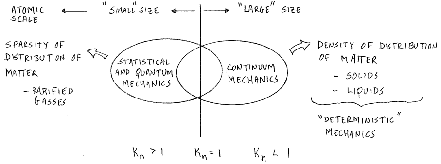

# Knudsen Number

$$\begin{equation}
K_{n} = \frac{\lambda}{D}
\end{equation}$$

Where $\lambda$ is the mean free path (e.g. distance between atoms) and $D$ is the characteristic dimension (e.g. molecular diameter).

