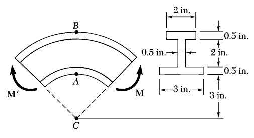
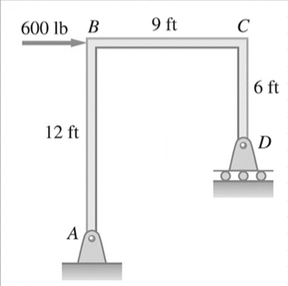

# ENGR 727-001 Advanced Mechanics of Materials
!!! abstract Course Description
    To provide the fundamentals of the theory of stress and strain analysis.
    These principles will be used to derive generalized elastic constitutive relations in engineering materials.
    Prediction of failure of materials as well yielding and failure criteria are incorporated.
    The course provide the background to deal with advanced topics of solid mechanics for the analysis of industrial structural design problems found in applied engineering.
    Most notes adapted from @uguralAdvancedMechanicsMaterials2019.
    **Keywords:** *Stress, strain, #stress-strain relationships, #strain-energy, #failure-theories, curved beams, unsymmetrical bending, #shear-center, torsion of noncircular sections, energy principles, #Castiglianos-Theorem, inelastic behavior*

Table of Contents
- [ENGR 727-001 Advanced Mechanics of Materials](#engr-727-001-advanced-mechanics-of-materials)
  - [Course Introduction](#course-introduction)
  - [Stress Analysis of a State of Plane Stress](#stress-analysis-of-a-state-of-plane-stress)
  - [Three Dimensional Stress Analysis and Equilibrium](#three-dimensional-stress-analysis-and-equilibrium)
  - [Strain, Deformation, and Mechanical Properties](#strain-deformation-and-mechanical-properties)
  - [State of Strain at Point and Strain Transformations](#state-of-strain-at-point-and-strain-transformations)
  - [Fundamentals of Elasticity](#fundamentals-of-elasticity)
  - [Theories of Failure of Materials](#theories-of-failure-of-materials)
  - [Pure Bending of Beams of Symmetrical and Asymmetrical Cross-Section](#pure-bending-of-beams-of-symmetrical-and-asymmetrical-cross-section)
  - [Torsion in Prismatic Bars](#torsion-in-prismatic-bars)
  - [Energy Methods](#energy-methods)

---

*Lecture: January 11, 2022*
## Course Introduction
We will be looking at 3 underlying principles throughout this course:
1. #equilibrium-equations: all forces balanced
2. Mechanical Behavior ( #constitutive-equations ): use #stress-strain and force relationships that satisfy certain materials
3. Geometry of Deformation ( #compatibility-equations ): information throughout the body must fit together with other portions of the body

!!! attention Final Exam
    Final exam for graduate students is **open notes**.

Dr. Lugo will be assigning the Final Project based on Teams.
Design of Final Project should be validated with experiment.

## [Stress Analysis of a State of Plane Stress](engr-727-001-advanced-mechanics-of-materials/stress-analysis-of-a-state-of-plane-stress.md)

---

*Lecture: January 18, 2022*

!!! quote <cite> Dr. Lugo
    Mechanics of Materials is the study of [internal forces](engr-727-001-advanced-mechanics-of-materials/internal-forces.md) of a body within a structure.

---

*Lecture: January 20, 2022*
## [Three Dimensional Stress Analysis and Equilibrium](engr-727-001-advanced-mechanics-of-materials/three-dimensional-stress-analysis-and-equilibrium.md)

---

*Lecture: January 25, 2022*

!!! attention Regarding codes in homeworks
    Upload any codes used in solving the homework problems.
    Restrict coding language to **MATLAB**.

## [Strain, Deformation, and Mechanical Properties](engr-727-001-advanced-mechanics-of-materials/strain-deformation-and-mechanical-properties.md)

---

*Lecture: February 03, 2022*
## [State of Strain at Point and Strain Transformations](engr-727-001-advanced-mechanics-of-materials/state-of-strain-at-point-and-strain-transformations.md)

!!! warning Equations of Displacement
    The textbook gives the equations of displacement; however, one must find these equations in the real because no one will simply give one the appropriate equations.

---

*Lecture: February 10, 2022*

---

*Lecture: February 17, 2022*

!!! attention Exam Details
    Five problems will be released about 10:30 or 11:00 to Canvas.
    Each problem will vary in point value.
    Open book and open notes.
    Due tomorrow @ midnight.
    Email Dr. Lugo for any questions/problems.
      - 2 from Ch1:
        - Stresses at some point.
        - 3D stress #invariant and transformation.
      - 3 from Ch2:
        - #statically-indeterminate
        - [strain tensor](engr-727-001-advanced-mechanics-of-materials/strain-tensor.md), [transformation](engr-727-001-advanced-mechanics-of-materials/state-of-strain-at-point-and-strain-transformations.md), and [shear strain](engr-727-001-advanced-mechanics-of-materials/shear-strain-between-line-segments.md).
        - General [Hooke’s Law](engr-727-001-advanced-mechanics-of-materials/hookes-law.md) to determine #compliance-matrix to calculate the [stress/strain tensor](engr-727-001-advanced-mechanics-of-materials/strain-tensor.md).

## [Fundamentals of Elasticity](engr-727-001-advanced-mechanics-of-materials/fundamentals-of-elasticity.md)

---

*Lecture: February 22, 2022*
## [Theories of Failure of Materials](engr-727-001-advanced-mechanics-of-materials/theories-of-failure-of-materials.md)

!!! warning Conservative
    Be wary that others may define **[Tresca](engr-727-001-advanced-mechanics-of-materials/maximum-shear-stress-theory-tresca.md)** as more *conservative* than **[von Mises](engr-727-001-advanced-mechanics-of-materials/distortion-energy-theory-von-mises.md)**.

---

*Lecture: March 01, 2022*

!!! example Problem Set: 4-2
    **Problem 1**: A shaft that is part of a machine is shown.
    Compute #factor-of-safety, based upon the [distortion energy theory](engr-727-001-advanced-mechanics-of-materials/distortion-energy-theory-von-mises.md), for stress elements at $A$ and $B$ of the member.
    This bar is made of AISI 1006 cold-drawn steel and is loaded by $F = 0.75 kN$, $P = 4.0 kN$, and $T = 25 N-m$.

    |  |
    |:--:|
    | Adapted from handout. |

    Equilibrium of the shaft can be found by #compatibility-equations in a cross-section of the shaft.
    By this, $M_{y} = F*(100~mm) = 0.075 kN-m$.
    The stress components at point *A*: $\sigma = \frac{P}{A} = 362.1659149468907 MPa$, no bending effect from $F$, $\tau_{F} = \frac{4}{3}\frac{V}{A} = 90.54147873672268 MPa$, $\tau_{T} = \frac{Tr}{J} = 8488.263631567752 MPa$.
    The stress state at $A$: $\sigma = \begin{bmatrix}22.64 & 32.07 \\ 32.07 & 0\end{bmatrix}~MPa$.
    Therefore, $\sigma_{eq} = \sqrt{\frac{1}{2}(\sigma_{x}^{2} + \sigma_{x}^{2}) + 3\tau_{xy}^{2}} = 59.98353357380674 MPa$ which yields $n = 280$.

    For point $B$: $\sigma = \frac{P}{A} = 22.64~MPa$, $\sigma_{F} = \frac{Mc}{I_{G}} = 0.00040240657216321195 MPa$, %\tau = 37.73 MPa$.
    $\sigma_{x} = 248.99 MPa$, $\tau_{xy} = 37.73 MPa$, and $\sigma_{eq} = 257.42 MPa$, and $n = 1.0877165721389168$.

    ---

    **Problem 2**

    |  |
    |:--:|
    | Change the $200 N$ load to $90 N$. |

    |  |
    |:--:|
    | #free-body-diagram. |

    $$\begin{split}
    \sum M_{z} = 0 &:= 1290*2 - D_{y}*0.55 \\
    \implies D_{y} &= 469.09090909090907 N \\
    \sum F_{y} = 0 &:= -A_{y} - D_{y} + 1290 \\
    \implies A_{y} &= 820.9~N \\
    \sum M_{y} = 0 &:= -1720*0.4 + D_{z}*0.55 \\
    \implies D_{z} = 1250.9~N \\
    \sum F_{z} = 0 &\implies A_{z} = 469.1~N
    \end{split}$$

    |  |
    |:--:|
    | Critical points exist at $B$ and $C$ because of the greatest moments being applied there coupled with shear forces. |

    |  |
    |:--:|
    | Cross-section at point $B$. |

    Resultant #bending moment at point $B$: $M_{B} = \sqrt{M_{Bz}^{2} + M_{By}^{2}} = \sqrt{(164.18)^{2} + (93.82)^{2}} = 189.1~N-m$ At point $C$: $M_{C} = \sqrt{(70.365)^{2} + (187.64)^{2}} = 200.5~N-m$

    We ignore shear forces in plane to determine the load plane angle.
    At the end, if shear stresses are significant, then we go back and recalculate.

    |  |
    |:--:|
    | The maximum bending stresses and shear stresses occur at the outside surface. |

    We find the normal and shear forces with $I = \frac{\pi}{64}d^{4}$ and $J = \frac{\pi}{32}d^{4}$ by **[Maximum Shear Stress Theory](engr-727-001-advanced-mechanics-of-materials/maximum-shear-stress-theory-tresca.md)**, $\tau_{max} = \frac{\sigma_{x} + \sigma_{y}}{2} \pm \sqrt{(\frac{\sigma_{x} - \sigma_{y}}{2})^{2} + \tau_{xy}^{2}}$:

    $$\begin{split}
    \sigma &= \frac{M(\frac{d}{2})}{I} \\
    \tau &= \frac{T(\frac{d}{2})}{J} \\
    \tau_{max} &= \frac{16}{\pi d^{3}}\sqrt{M^{2} + T^{2}} \\
    \implies n = \frac{\sigma_{yp}}{2\tau_{max}} &:= d = 20.4~mm
    \end{split}$$

    ---

    **Problem 3**: The beam shown carries steady loads $P$ and $F$ equal to $2500 lb$ and $5000 lb$, respectively.
    Evaluate the design factor that would result if the beam were made from a gray cast iron ASTM No. 25 ($\sigma_{UT} = 26 ksi$ and $\sigma_{UC} = 97 ksi$).
    Consider a thickness of $t = 0.75 in$.

    The selection of material greatly matters when stress concentrations are involved.
    In this case, special notice must be given to these stress concentrations because the requested material is generally *brittle*.

---

*Lecture: March 08, 2022*
## [Pure Bending of Beams of Symmetrical and Asymmetrical Cross-Section](engr-727-001-advanced-mechanics-of-materials/pure-bending-of-beams-of-symmetrical-and-asymmetrical-cross-section.md)

!!! attention Final Project
    Considering we have 8 students, we can split into 2 teams.
    Dr. Lugo has already posted the instructions.

---

*Lecture: March 10, 2022*

!!! attention Final Project
    Teams will be comprised of teams of 3.
    We may form our own teams.
    There will be one team of 2.
    Dr. Lugo has posted the final project which a project of design that may be studied with any MoM tools necessary.
    If we need to perform mechanical testing, then do it! Validate our designs.
    Any MoM analysis outside the scope of this class is welcomed.

!!! attention Research Paper
    Individual assignment over some topic that requires a literature review.
    Inelasticity and Advanced MoM are good journals to reference.

---

*Lecture: March 22, 2022*

We have reached the halfway point in the course, and students appears to be understanding the material.

!!! attention Research Paper
    Dr. Lugo would like those teams working on the Final Project to also work together on the Research Paper.
    If we desire to work alone, then let Dr. Lugo know, specifically.
    The paper is to be related to the course material; therefore, inform Dr. Lugo of the topic of choice by next week.

---

*Lecture: March 24, 2022*

!!! example Problem Set: 5-2
    **Problem 1**: A composite beam is constructed from a wood beam and a steel reinforcing plate.
    The wood and steel are securely fastened to act as a single beam.
    The beam is subjected to a positive bending moment, $M = 6.8 kN-m$.
    Calculate the largest tensile and compressive stresses in the wood (Material 1) and the maximum and minimum tensile stresses in the steel (Material 2) if $E_{1} = 10 GPa$ and $E_{2} = 200 GPa$.

    **Solution**

    Determine the location of the N.A.

    $$\begin{split}
    E_{1}\int_{1}ydA + E_{2}\int_{2}ydA &= 0 \\
    E_{1}A_{1}d_{1} - E_{2}A_{2}d_{2} &= 0 \\
    A_{1} &= 15000~mm^{2} \quad A_{2} = 1200~mm^{2}
    \end{split}$$

    Solving $10(15000)(162 − \bar{y} − 75) − 200(1200)(\bar{y} − 6) = 0$ for $\bar{y}$ yields $\bar{y} = 37.15 mm$.
    The moments of inertia with respect to N.A:

    $$\begin{split}
    I_{1} &= \frac{1}{12}(100)(150)^{3} + 1500(49.85)^{2} = 65.4e6~mm^{4} \\
    I_{2} &= \frac{1}{12}(100)(12)^{3} + 1200(31.15)^{2} = 1.178e6~mm^{4}
    \end{split}$$

    The maximum stresses are: $\sigma_{x1} = \frac{MyE_{1}}{E_{1}I_{1} + E_{2}I_{2}} = \frac{(16.8e6~kN-m)(162 - \bar{y})}{10(65.4e6) + 200(1.178e6)} = -6.65~MPa$.
    $\sigma_{x1c} = \frac{(6.8e6)(25.15)(10)}{E_{1}I_{1} + E_{2}I_{2}} = 1.92~MPa$ at the contact surface.
    $\sigma_{x2} = \frac{(6.8e6)(37.15)(200)}{E_{1}I_{1} + E_{2}I_{2}} = 56.78~MPa$.

    ---

    **Problem 3**

    The cross-section of a composite beam made of aluminum and steel is shown in the figure.
    The moduli of elasticity are $E_{a} = 75 GPa$ and $E_{s} = 200 GPa$.
    Under the action of a bending moment that produces a maximum stress of $50 MPa$ in the aluminum, what is the maximum stresses in the steel?

---

*Lecture: March 29, 2022*

---

*Lecture: March 31, 2022*

---

*Lecture: April 05, 2022*

---

*Lecture: April 12, 2022*

!!! example Problem Set: 5-4
    **Problem 1**: The curved portion of the bar shown has an inner radius of $20 mm$.
    Knowing that the line of action of the $3 kN$ force is located a distance $a = 60 mm$ from the vertical plane containing the center of curvature of the bar, determine the largest compressive stress in the bar.

    |  |
    |:--:|
    | caption |

    $$\begin{split}
    P &= 3~kN \\
    \implies M &= P(60 + 32.5)~mm = 277.5~kN-mm
    \end{split}$$

    By [Winkler’s Method](engr-727-001-advanced-mechanics-of-materials/curved-beam-formula-winklers-theory.md):

    $$\begin{split}
    R &= \frac{h}{\ln(\frac{r_{o}}{{r_{i}}})} = \frac{25~mm}{\ln(\frac{45}{20})} = 30.83~mm \\
    \sigma_{\theta} &= \frac{M(R - r)}{Aer} \\
    e &= \bar{r} - R = (32.5 - 30.83)~mm = 1.67~mm \\
    r &= r_{i} = 20~mm \\
    A &= (25~mm)^{2} = 625~mm^{2} \\
    \implies \sigma_{\theta} &= \frac{(277.5~kN-mm)(30.83-20)~mm}{(625~mm^{2})(1.67~mm)(20~mm)} = 143.96766467065865 kPa
    \end{split}$$

    ---

    **Problem 2**: Three plates are welded together to form the curved beam shown.
    For $M = 8 kip-in$, determine the stress at (a) point $A$ and (b) point $B$.

    |  |
    |:--:|
    | caption |

    We must, first, find the neutral radius: $R = \frac{\int dA}{\int \frac{dA}{r}} = \frac{\sum A_{i}}{\sum b_{i}\ln(\frac{r_{i + 1}}{r_{i}})}$.

    | **Segment ($i$)** | $b_{i}$ | $h_{i}$ | $A_{i}$ | $b_{i}\ln(\frac{r_{i + 1}}{r_{i}})$ | $\bar{r_{i}}$ | $A_{i}\bar{r_{i}}$ |
    | --- | --- | --- | --- | --- | --- | --- |
    | 1 | 3 | 0.5 | 1.5 | $3\ln(3.56)$ | 3.25 | 4.875 |
    | 2 | 65 | 2 | 1.0 | 0.266 | 4.5 | 4.5 |
    | 3 | 2 | 0.5 | 1.0 | 0.174 | 5.75 | 5.75 |

    $\bar{r} = \frac{\sum A_{i}\bar{r_{i}}}{\sum A} = \frac{15.125}{3.5} = 4.321~in$ and $R = \frac{\sum A_{i}}{\sum b_{i}\ln(\frac{r_{i + 1}}{r_{i}})} = \frac{3.5}{0.86246} = 4.058~in$.
    $e = \bar{r} - R = 4.321 − 4.058 = 0.263 in$.
    For point $A$, $r = 3 in$ and $\sigma_{\theta} = \frac{M(R - r)}{Aer} = \frac{8000~lb-in(4.058 - 3)~in}{3.5~in^{2}(0.263~in)(3~in)} = 3.06~ksi$.

---

*Lecture: April 14, 2022*

!!! attention Final Project
    Final Project and Presentation will during the Final Exam time (per the Registrar) because the Final Exam will be a take home examination.

## [Torsion in Prismatic Bars](engr-727-001-advanced-mechanics-of-materials/torsion-in-prismatic-bars.md)

---

*Lecture: April 19, 2022*

---

*Lecture: April 21, 2022*
## [Energy Methods](engr-727-001-advanced-mechanics-of-materials/energy-methods.md)

!!! attention Final Project and Exam
    Final Project presented during the Final Exam time (according to Registrar) and the Final Exam itself will be take home and will emphasize the topics since the last exam but will include some older topics.
    ***The Final Exam will be released Sunday afternoon and is due Friday morning @ 10 AM!***

---

*Lecture: April 26, 2022*

!!! attention Final Thoughts
    Dr. Lugo will be posting the exam after today’s final lecture.

!!! example Problem Set: 7-1
    **Problem 1**
    |  |
    |:--:|
    | The bent steel rod, $ABC$ of diameter, $d$ is build into a rigid wall at $C$ and rests on a support at $A$. Segment $AB$ carries…​ |

    |  |
    |:--:|
    | FBD |

    $$\begin{split}
    M_{AB} &= Rx - 80x*\frac{x}{2} = Rx - 40x^{2} \\
    \frac{\partial M_{AB}}{\partial R} &= x \\
    M_{BC} &= Rx - 80(3)x = Rx - 240x \\
    \frac{\partial M_{BC}}{\partial R} &= x
    \end{split}$$

    By #Castiglianos-Theorem:

    $$\begin{split}
    \delta_{A} &= \frac{\partial U}{\partial R} = 0 \\
    0 &= \int_{0}^{3}\frac{1}{EI}\Bigl(Rx - 40x^{2}\Bigr)xdx + \int_{0}^{4}\frac{1}{EI}\Bigl(Rx - 240x\Bigr)dx + \int_{0}^{4}\frac{1}{GJ}\Bigl(3R - 360\Bigr)3dx \\
    &= \frac{1}{EI}\Bigl[\frac{Rx^{3}}{3}\Bigr]_{0}^{3} - \frac{40x^{3}}{4EI}\Bigr]_{0}^{3} + \frac{Rx^{3}}{3EI}\Bigr]_{0}^{4} - \frac{240x^{3}}{3EI}\Bigr]_{0}^{4} + \frac{9Rx}{GJ}\Bigr]_{0}^{4} - \frac{1080x}{GJ}\Bigr]_{0}^{4} \\
    &= \frac{9R}{3EI} - \frac{810}{EI} + \frac{64R}{3EI} - \frac{64(240)}{3EI} + \frac{36R}{G(2I)} - \frac{4320}{G(2I)} \\
    \frac{E}{G} &= 2.5 \\
    0 &= 30.333R - 5930 + 18\frac{E}{G}R - 2160\frac{E}{G} \\
    75.33R &= 11330 \\
    R &= 150.4~lb
    \end{split}$$

    ---

    **Problem 2**

    |  |
    |:--:|
    | The shown in the figure has a constant #bending rigidity, $EI$, and carries a $600 lb$, horizontal load at $B$. Considering only bending deformation; determine the horizontal displacement of the roller support at $D$. |

    We want to minimize the #bending in the frame to allow for rolling motion at $D$.