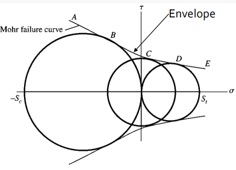

# Failure Criterion

When applying a yield criterion, the resistance of a material is given by its yield strength, $\sigma_{yp}$, for **#ductile materials**.
For **#brittle materials**, the typical failure criterion, $\sigma_{ut}$ and $\sigma_{uc}$, is used.
Therefore, a function of these stresses could be made: $f(\sigma_{1}, \sigma_{2}, \sigma_{3}) = \sigma_{f}$ wherein the failure function, $f$ can be related to the failure strength, $\sigma_{f}$.
If $f = \sigma_{f}$, then failure will occur.
A factor of safety can scale down the stress state by emphasizing (restricting) the allowed stress state: $\sigma_{eq}n = \sigma_{f}$.
In general, a complete plasticity theory has three components:
1. Yield criterion: yield function.
2. A #flow-rule that relates the plastic strain increments to the stress increments after initiation of yielding.
3. A #hardening-rule that predicts changes in the yield surface.

**[Maximum Shear Stress Theory (MSS): Tresca](maximum-shear-stress-theory-tresca.md)**
: Yielding begins when the *maximum #shear-stress* in a stress element exceeds the maximum #shear-stress in a tension test specimen of the same material.

[Tresca Failure Criterion](tresca-failure-criterion.md)
: ~$$\begin{equation}
f(\sigma_{1}, \sigma_{2}, \sigma_{3}) = max\{|\frac{\sigma_{1} - \sigma_{2}}{2}|, |\frac{\sigma_{1} - \sigma_{3}}{2}|, |\frac{\sigma_{2} - \sigma_{3}}{2}|\}
\end{equation}$$

|  |
|:--:|
| This can be visualized in **[Mohr's Circle](mohrs-circle.md)**. |

**[Distortion Energy Theory: von Mises](distortion-energy-theory-von-mises.md)**
: Yielding occurs when the *distortion strain energy* per unit volume reaches the distortion strain energy per unit volume for yield in simple tension or compression of the same material.

[von Mises Failure Criterion](von-mises-failure-criterion.md)
: ~$$\begin{equation}
f(\sigma_{1}, \sigma_{2}, \sigma_{3}) = \frac{1}{6}[(\sigma_{1} - \sigma_{2})^{2} + (\sigma_{2} - \sigma_{3})^{2} + (\sigma_{1} - \sigma_{3})^{2}] = \frac{1}{3}\sigma_{yp}^{2}
\end{equation}$$

If $\sigma_{eq} = \sqrt{\frac{1}{2}(\sigma_{1} - \sigma_{2})^{2} + (\sigma_{2} - \sigma_{3})^{2} + (\sigma_{2} - \sigma_{3})^{2}} > \sigma_{yp}$, then yielding is predicted.

**[Maximum Normal Stress Theory: Rankine](maximum-normal-stress-theory-rankine.md)**
: Yielding will occur whenever the greatest #tensile-stress tends to exceed the uniaxial tensile strength, or whenever the largest #compressive-stress tends to exceed the uniaxial compressive strength.

[Rankine Failure Criterion](rankine-failure-criterion.md)
: ~$$\begin{equation}
\begin{split}
n &= \frac{S_{ut}}{\sigma_{1}} \\
 &=
\end{split}
\end{equation}$$

**[Coulomb-Mohr Theory: Coulomb-Mohr](coulomb-mohr-theory.md)**
: Three simple tests—​tension, compression, and shear—​define the stress in the body.
Failure occurs when one of the circles becomes tangent to the envelope.

|  |
|:--:|
| This theory is suggested for brittle materials for which the compressive strength far exceeds the tensile strength. |

[Coulomb-Mohr Failure Criterion](coulomb-mohr-failure-criterion.md)
: ~$$\begin{equation}
n = \frac{\sigma_{ut}|\sigma_{uc}|}{\sigma_{1}|\sigma_{uc}| - \sigma_{ut}(\sigma_{1} + \sigma_{3})}
\end{equation}$$

!!! example Problem Set: 4-1
    **Problem 1**: A bar made of AISI 1020, hot-rolled steel ($\sigma_{yp} = 350 MPa$) is subjected to the following [plane stress state](plane-stress.md): $\sigma_{x} = 100 MPa$, $\sigma_{y} = 20 MPa$, and $\tau_{xy} = -20 MPa$.
    (a) Determine the equivalent stress and the #factor-of-safety using the **[Maximum Shear Stress Theory](maximum-shear-stress-theory-tresca.md)** and (b) using the **[Distortion Energy Theory](distortion-energy-theory-von-mises.md)**.

    We solve the [principal stresses](principal-stress.md):
    $$\begin{split}
    \sigma_{1, 2} &= \frac{\sigma_{x} + \sigma_{y}}{2} \pm \sqrt{(\frac{\sigma_{x} - \sigma_{y}}{2})^{2} + \tau_{xy}^{2}} \\
    &= \frac{100 + 20}{2} \pm \sqrt{(\frac{100 - 20}{2})^{2} + (-20)^{2}} \\
    &= 60 \pm 44.72135955 MPa
    \end{split}$$

    1. Using the **[Tresca Criterion](tresca-failure-criterion.md)**, the equivalent stress, $\sigma_{eq} := |\sigma_{1} - \sigma_{3}| = 104.7213595499958 MPa$. By **[Tresca Criterion](tresca-failure-criterion.md)**, the factor of safety is $n = 3.34220259843842$.
    
    2. Using the **[von Mises Criterion](von-mises-failure-criterion.md)**, the equivalent stress, $\sigma_{eq} := \sqrt{\frac{1}{2}[(\sigma_{1} - \sigma_{2})^{2} + (\sigma_{1} - \sigma_{3})^{2} + (\sigma_{2} - \sigma_{3})^{2}]} = 97.9825039024825 MPa$. From this, the factor of safety, $n = 3.5720662981662414$.

    Conclusion, **von Mises** is the most conservative criterion by definition which can be seen by having the larger factor of safety.

    ---

    **Problem 2**: Determine the equivalent stress and the factor of safety (a) suing the **[Tresca Criterion](tresca-failure-criterion.md)**, and (b) using the **[von Mises Criterion](von-mises-failure-criterion.md)**.
    The material is an SAE 1045 CD steel alloy.

    $$\sigma_{prob} = \begin{bmatrix}12 & 60 & 60 \\
    60 & 12 & -60 \\
    60 & -60 & 10\end{bmatrix}~ksi$$

    The stress #invariant and [principal stresses](principal-stress.md):
    $$\begin{split}
    I_{1} &= 34~ksi \\
    I_{2} &= -10,460~ksi^{2} \\
    I_{3} &= -336,960 ksi^{3} \\
    \implies \sigma_{p} := \sigma_{p}^{3} - I_{1}\sigma_{p}^{2} + I_{2}\sigma_{p} - I_{3} = 0 \rightarrow \sigma_{p} = -108.67~ksi
    \end{split}$$

    Assume the $\sigma_{yp} = 91 ksi$.
    Therefore, the #factor-of-safety, $n = 0.5037$ implies the material will yield.
    If this is unacceptable, then we can play with the geometry or processing and treatment of the material.

    By **von Mises**, the equivalent stress, $\sigma_{eq} = \sqrt{\frac{1}{2}\bigl[(\sigma_{1} - \sigma_{2})^{2} + (\sigma_{1} - \sigma_{3})^{2} + (\sigma_{2} - \sigma_{3})^{2}\bigr]} = 164.98542026494343 ksi$.
    This implies the #factor-of-safety, $n_{Mises} = asdf$.
    This means the material will still yield just as found by **Tresca** criterion.

    ---

    **Problem 3**: A #brittle material has the properties $S_{ut} = 30 ksi$ and $S_{uc} = 90 ksi$.
    Using the brittle **Coulomb-Mohr** and **Modified-Mohr** theories, determine the factor of safety for the following state of plane stress: $\sigma_{x} = -35 ksi$, $\sigma_{y} = 13 ksi$, and $\tau_{xy} = -10 ksi$.

    The [principal stresses](principal-stress.md) $\sigma_{1, 2} := \frac{\sigma_{x} + \sigma_{y}}{2} \pm \sqrt{\Bigl(\frac{\sigma_{x} - \sigma_{y}}{2}\Bigr)^{2} + (\tau_{xy})^{2}} = -11 \pm 26 ksi$.
    By **Modified-Mohr**, $n = -1.2476894639556377$.