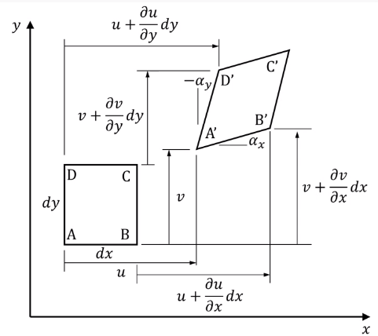

# Green Strain

An alternative definition for large strains. This is the application of **#Greens-Theorem** from calculus.

Equation
: ~$$\begin{equation}
\begin{split}
\epsilon_{x} &= \frac{(A'B')^{2} - (AB)^{2}}{2(AB)^{2}} \\
 &= \frac{(dx + \frac{\partial u}{\partial x}dx)^{2} + (\frac{\partial v}{\partial x}dx)^{2} - (dx)^{2}}{2(dx)^{2}} \\
 &= \frac{\partial u}{\partial x} + \frac{1}{2}\biggl[ \Bigl(\frac{\partial u}{\partial x}\Bigr)^{2} + \Bigl(\frac{\partial v}{\partial x}\Bigr)^{2} \biggr] \\
 &= \frac{A'B' - AB}{AB} \\
\implies \epsilon_{y} &= \frac{\partial v}{\partial y} + \frac{1}{2}\biggl[ \Bigl(\frac{\partial u}{\partial y}\Bigr)^{2} + \Bigl(\frac{\partial v}{\partial y}\Bigr)^{2} \biggr] \\
\gamma_{xy} &= \frac{\partial v}{\partial x} + \frac{\partial u}{\partial y} + \dots
\end{split}
\end{equation}$$

The last equation for $\epsilon_{x}$ is *#engineering-strain*.