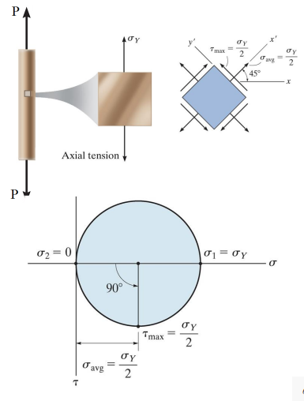

# Maximum Shear Stress Theory: Tresca
Yielding begins when the *maximum #shear-stress* in a stress element exceeds the maximum #shear-stress in a tension test specimen of the same material.

[Tresca Failure Criterion](tresca-failure-criterion.md)
: ~$$\begin{equation}
f(\sigma_{1}, \sigma_{2}, \sigma_{3}) = max\{|\frac{\sigma_{1} - \sigma_{2}}{2}|, |\frac{\sigma_{1} - \sigma_{3}}{2}|, |\frac{\sigma_{2} - \sigma_{3}}{2}|\}
\end{equation}$$

|  |
|:--:|
| This can be visualized in **[Mohr's Circle](mohrs-circle.md)**. |