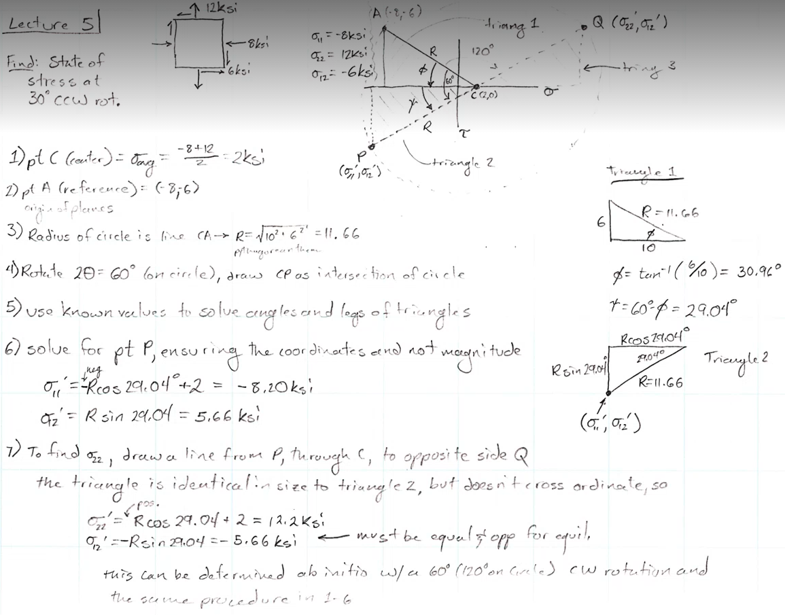

# Mohrs-Circle

1. Assumes a #homogeneous material.
2. Maximum #principal-stress, $\sigma_{1}$ where $\tau = 0$: no shearing!
3. Can move from any #stress-state, but there is still a **maximum principal plane with no shearing**.

- A graphical way to represent stress #transformation to alternative orientations.
- These are set of equations that describe stress #transformation, but a graphical solution is often useful.

- #principal-stress: maximum/minimum #normal-stresses (no shear)

- $R = \sqrt{(\frac{\sigma_{11} - \sigma_{22}}{2})^{2} + \tau_{12}^{2}}$
- $\sigma_{11}' = \frac{\sigma_{11} + \sigma_{22}}{2} + \frac{\sigma_{11} - \sigma_{22}}{2}cos(2\theta) + \sigma_{12}sin(2\theta)$
- $\sigma_{12}' = -\frac{\sigma_{11} - \sigma_{22}}{2}sin(2\theta) + \sigma_{12}cos(2\theta)$

!!! example What is the #stress-state if rotated $30\degree$ CCW?
    

    *Given: $\sigma_{11} = -8 ksi, \sigma_{22} = 12 ksi, \sigma_{12} = -6 ksi$*
    Center point, $C = \sigma_{avg} = \frac{\sigma_{11} + \sigma_{22}}{2} = \frac{-8 + 12}{2} = 2 ksi$

    

    $R = \sqrt{10^{2} + 6^{2}} = 11.66$

    

    Use trig to find $\phi$ and $\psi$: $\phi = tan^{-1}(\frac{6}{10}) = 30.96\degree, \psi = 60 - \phi = 29.04\degree$
    $\sigma_{11}' = 2 - 11.66cos(29.04) = -8.2 ksi$
    $\sigma_{12}' = -11.66sin(29.04) = 5.66 ksi$

    |  |
    |:--:|
    | Slight drop increase of #normal-stress and slight decrease of #shear-stress. |
    |  |
    | Basic steps to find all stresses and strains at orientations relative to what you start with. |