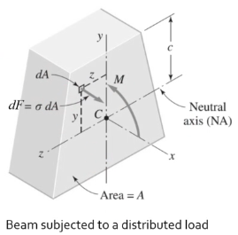
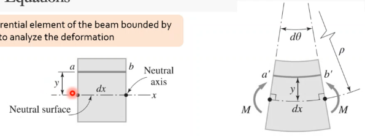
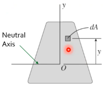
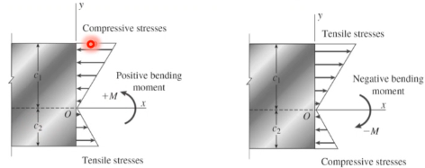
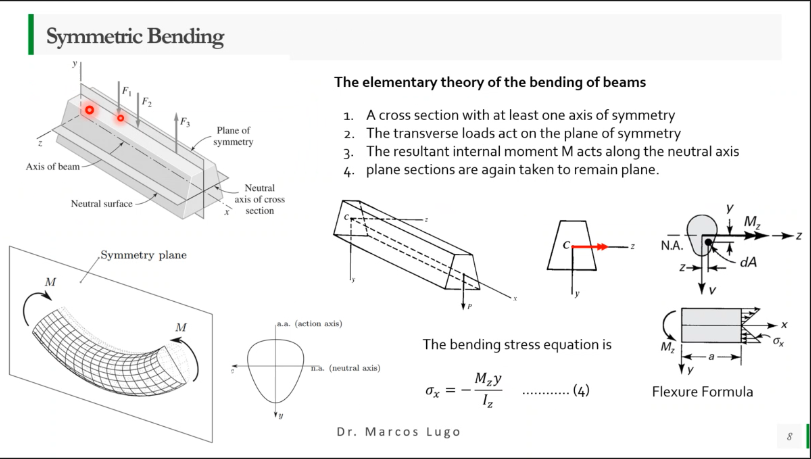
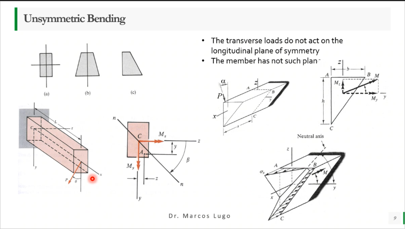
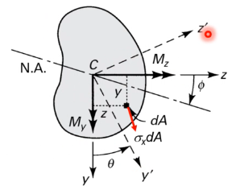
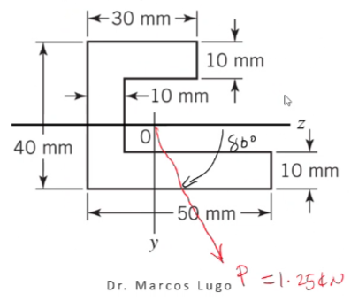
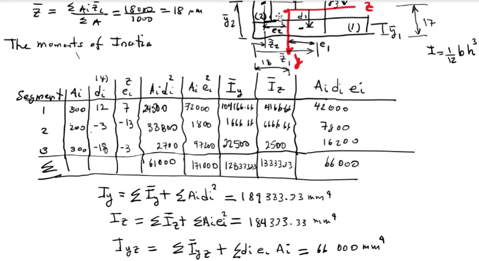
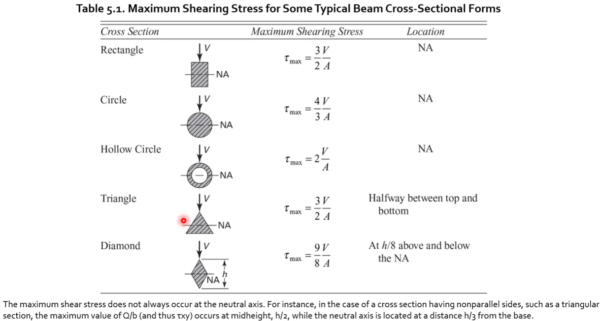

# Pure Bending of Beams of Symmetrical and Asymmetrical Cross-Section

Developed by Euler and some other dude many years ago.
The idea is to quantify how transverse loads affect a body via #bending and #shear-stress.
Typically, we consider a prismatic, symmetric beam.
**Most imperative is to assume planes remain plane.** We apply the same methodologies to solve these *#statically-indeterminate* problems:

1. #equilibrium equations
2. #compatibility equations
3. #constitutive equations

**Equilibrium**

|  |
|:--:|
| If we pass a section through the member $AB$, the conditions of #equilibrium can be applied. |

**Compatibility**

|  |
|:--:|
| We consider a differential element of the beam bounded by two cross-sections to analyze the deformation which warps due to the moments at either end. |

Be sure to remember to assign some convention for positive and negative directions.
Typically, #bending is assumed positive if bent as shown in [Fig. 8-2](#fig-compatibility_cross-section).

**Constitutive**

It is assumed that the material behaves elastically, and the yield strength is not exceeded.
==The #neutral-axis must pass through the centroid of the area.==

**#Flexure-Formula**

|  |
|:--:|
| It shows that the stresses are directly proportional to the #bending moment $M$ and inversely proportional to the moment of inertia, $I$ of the cross-section. Also, the stresses vary linearly with the distance y from the #neutral-axis. |

**Maximum Stresses at a Cross-Section**

|  |
|:--:|
| The maximum tensile and compressive #bending stresses acting at any given cross-section occur at points located farthest from the #neutral-axis. |

**Symmetric Bending**

**Unsymmetric Bending**

|  |
|:--:|
| Transverse loads do not act on the longitudinal plane of symmetry. |

**#pure-bending of Beams of Asymmetrical Cross-Section**

|  |
|:--:|
| Now it is considered the general case in which a beam of arbitrary cross-section is subjected to end couples $M_{y}$ and $M_{z}$ about the $y$ and $z$ axes. |

Assume:
- Plane section remain plane.
- Normal stresses, $\sigma_{x}$ acting at a point within $dA$ is a linear function of the y and z coordinates of the point.
- The remaining stresses are zero.

**Equilibrium Equations**

*Stress Distribution*

Referring to [Fig. 8-6](../../../attachments/engr-727-001-advanced-mechanics-of-materials/pure_bending_in_asymmetrical_cross-section_220308_135153_EST.png), we can apply the **#Law-of-Superposition** to find moments of inertias about reference axes with respect to the #neutral-axis.

!!! example Problem Set: 4-3
    **Problem 1**: A timber member…​ $M_{z} = -59.08 kN-m$ and $m_{y} = -10.42 kN-m$
    $\tan(\theta) = \frac{M_{y}I_{z} + M_{z}I_{yz}}{M_{y}I_{y} + M_{z}I_{y}} = \frac{M_{y}I_{z}}{M_{z}I_{y}} = 14.25^{\circ}$

    There exist critical points at the upper right and lower left corners of the elemental cross-section.
    $\sigma_{xa} = \frac{M_{y}I_{z}z_{a} - M_{z}I_{y}y_{a}}{I_{y}I_{z}} =-10.034 MPa$ Hunter got $-19.09 MPa$.

    ---

    **Problem 4**

    |  |
    |:--:|
    |  |

## Bending in Composite Beams

These beams are fabricated of more than one material, but these beams still adhere to the methodologies postulated thus far.

**Strains and Stresses**

We assume the cross-sections remain plain during #bending, regardless of the nature of the material.

**#neutral-axis**

The position of the #neutral-axis is found from the condition that the resultant axial force acting on the cross-section is zero.
Since the curvature is a constant at any given cross-section, thus, the equation for locating the #neutral-axis becomes: $E_{1}\int_{1}ydA + E_{2}\int_{2}ydA = 0$.

**#Moment-Curvature-Relationship**

The #Moment-Curvature-Relationship for a composite beam of two materials may be determined from the condition that the moment resultant of the behind stresses is equal to the bending moment, $M$ acting at the cross-section.

$$\begin{split}
M &= -\int_{A}\sigma_{x}ydA = -\int_{1}\sigma_{x1}ydA - \int_{2}\sigma_{x2}ydA \\
 &= kE_{i}\int_{1}y^{2}dA + kE_{2}\int_{2}y^{2}dA
\end{split}$$

This last equation relates the second moments of the area (the moments of inertia) with respect to the #neutral-axis.

**Normal Stresses (#Flexure-Formula)**

Normal stresses in the beam are obtained by substituting the expression for curvature into the expressions for $\sigma_{x1}$ and $\sigma_{x2}$:

\eqalign_sans

These expressions are known as the #Flexure-Formula for a composite beam.
While these expressions are direct and straightforward, civil and aerospace engineers typically use the transform.

### #Transformed-Section-Method
The method consists of transforming the cross-section of a composite beam into an equivalent cross-section of an imaginary beam that is composed of only one material.
If the transformed beam is to be equivalent to the original beam, its #neutral-axis must be located in the same place, and its moment-resisting capacity must be the same.

**Normal Stresses**

The moment of inertia of the transformed section is related to the moment

### Reinforced Concrete Beams
- Concrete is very susceptible to cracking when it is in tension, thus, by itself is not suitable for resisting a #bending moment.
- When subjected to negative #bending moments, are reinforced by steel rods placed a short distance above their lower face.
- In the transformed section of a reinforced concrete beam, it is replaced the total cross-sectional area of the steel bars be an equivalent area.
- Only the portion of the cross-section located above the #neutral-axis should be used in the transformed section.
- To obtain $h$, it is required that the centroid $C$ of the cross-sectional area of the transformed section to lie on the #neutral-axis: solve the following system of equations for $h$.

$$\begin{split}
bh(\frac{h}{2}) - nA_{s}(d - h) &= 0 \\
\frac{b}{2}h^{2} + nA_{s}h - nA_{s}d &= 0
\end{split}$$

## #shear-stress in Thin-Walled Members and #shear-center in Beams
**Shear Stress Formula: Rectangular Section**
$$\begin{split}
\tau &= \frac{VQ}{It} \\
\tau_{max} &= \frac{3}{2}\frac{V}{A}
\end{split}$$

**Shear Stress in a Circular Cross-Section**

When a beam has a circular cross-section, we can no longer assume that the #shear-stress act parallel to the $y$-axis.
**Theory of Elasticity** explains that there exists #shear-stress parallel to the surface instead of perpendicular.

$$\tau_{max} = \frac{4V}{3A}$$

|  |
|:--:|
| foo |

**Shear Stress in the Webs of Beams with Flanges**

When a beam of wide-flange shape is subjected to shear forces as well as #bending moments, both normal and #shear-stress are developed on the cross-sections.

$$\begin{split}
\tau &= \frac{V}{8It}[b(h^{2} - h_{1}^{2}) + t(h_{1}^{2} - 4y_{1}^{2})] \\
\tau_{max} &= \frac{V}{8It}(bh^{2} - bh_{1}^{2} + th_{1}^{2}) \\
\tau_{min} &= \frac{Vb}{8It}(h^{2} - h_{1}^{2}) \\
\tau &= \frac{V}{A_{web}}
\end{split}$$

**Shearing Stresses in Thin-Walled Members**

Now we consider that the flanges of an I-beam are thin.
An infinitesimal segment of a wide-flange beam is isolated for #equilibrium analysis.

**The Concept of #shear-flow**

For thin-walled members, the concept of **#shear-flow** is used because this refers to a force per unit length.
In terms of the #shear-stress, $\tau$ and wall thickness, $t$, the #shear-flow is: $q = \tau t = \frac{VQ}{I}$.
The #shear-flow distribution in the flanges of wide-flange and channel sections can be determined: $q = \frac{VQ}{I} = \frac{V(\frac{d}{2})(\frac{b}{2} - x)t}{I} = \frac{Vt}{2I}(\frac{b}{2} - x)$.

**#shear-center**

To prevent twisting, the load $P$ must be located at an eccentric distance, $e$ from the web of the cross-section.

### #shear-center in Thin-Walled Members: General

**Moments of Inertia for an Area about Inclined Axes**

It is sometimes necessary to calculate the moments and product of inertia $I_{u}$, $I_{v}$, and $I_{uv}$ when the values for $\theta$, $I_{x}$, $I_{y}$, and $I_{xy}$ are known.
#equilibrium equations transformation equations or tensors to relate the $x$, $y$, $u$, and $v$ axes.
Principal moments of inertia equations are similar to those for principal stresses/strains.

**The Procedure for Locating #shear-center**
1. Determine the principal axes of inertia.
2. Evaluate the #shear-flow acting on the cross-section when #bending occurs about one of the principal axes.
3. Determine the resultant of those forces.
4. The #shear-center is located on the line of action of the resultant. Take the summation of moments with respect to a convenient point.
5. Repeat the process for the other axis.

## Bending of Curved Beams

!!! question What happens when a beam is curved? <cite> 
    Many of the same things that happen in a straight beam.

**[Curved Beam Formula: Winkler's Theory](curved-beam-formula-winklers-theory.md)**
: Stress distribution is non-linear because the #neutral-axis is non-linear.
The centroid is not the #neutral-axis in a curved beam as was true in a straight beam.
We make the following assumptions:
   1. All cross-sections possess a vertical axis of symmetry lying in the plane of the centroidal axis passing through $C$.
   2. The beam is subjected to end couples, $M$. The #bending moment vector if everywhere normal to the plane of symmetry of the beam. Sections originally plane and perpendicular to the centroidal beam axis remain so subsequent to #bending.
   3. The influence of transverse shear on beam deformation is not taken into account.
      1. Lines $bc$ and $ef$ represent the plane sections before…​.