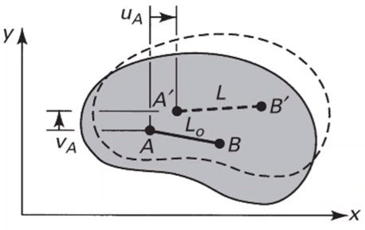
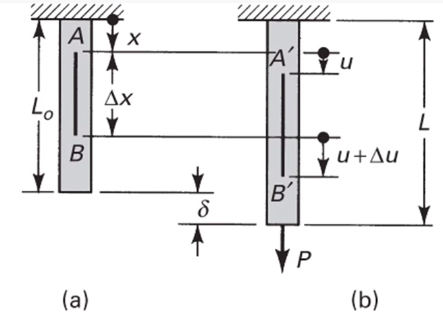
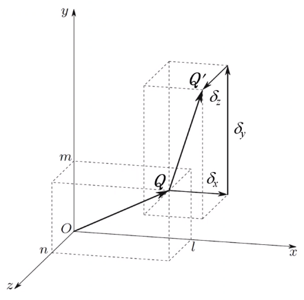
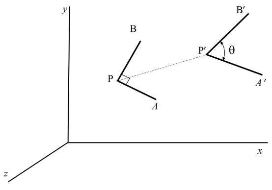
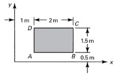
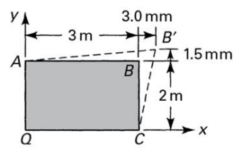
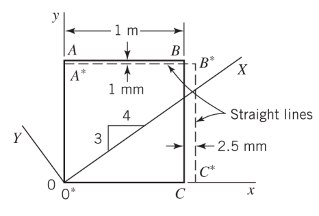
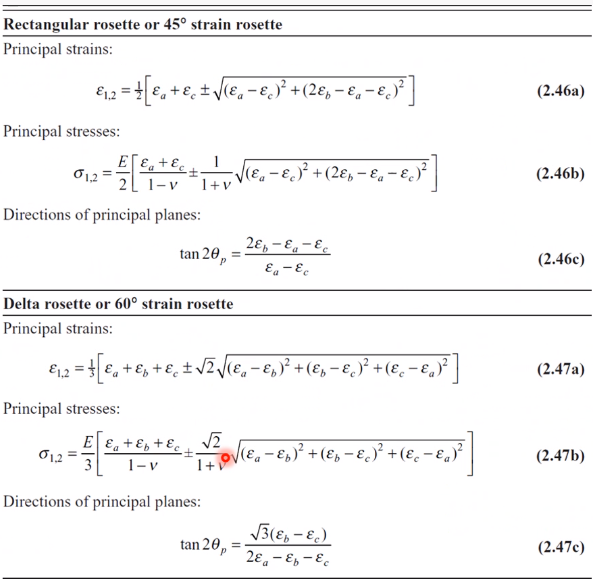

# State of Strain at Point and Strain Transformations
**Deformation**

|  |
|:--:|
| Consider body subjected to external loading that has been translated and rotated which can be measured as displacement. |

The percentage of this displacement with respect to the body’s original position is strain.
There are two methods to measure this displacement: **Lagrangian** and **Eulerian**.

|  |
|:--:|
| Normal strain, the unit change in length, is defined as: $\epsilon_{x} = \frac{\Delta L}{L_{0}}$. |

**Plane Strain**

A 2D case in which all points in the body, before and after loading, remain in the same plane: $\epsilon_{z} = 0$, $\gamma_{xz} = \gamma_{yz} = 0$.
We assume that the strains in the 3rd direction are infinitesimally small.
Normal and longitudinal strains are given by:

$$\begin{split}
\epsilon_{x} &= \frac{\partial u}{\partial x} \\
\epsilon_{y} &= \frac{\partial v}{\partial y}
\end{split}$$

By making a *small angles assumption*, the angle, $\alpha_{x}$ between $AB$ and $A'B'$ is so small that $AB \approx A'B'$:

$$\begin{split}
\alpha_{x} &\approx \tan\dots \\
 &=
\end{split}$$

**Three-Dimensional Strain**

The same principles from 2D are applied 3D but now includes the 3rd component.

!!! note FEA Codes
    Most commercial softwares rely on *small angle assumptions* for their codes
    While this assumption is suitable for most engineering problems, the codes do also include logic to handle those case with substantial strain.

Similar to [???](#eq-stress_tensor), a tensor for the strains can also be made:

[Strain Tensor](strain-tensor.md)
: ~$$\begin{equation}
[\epsilon_{ij}] = \begin{bmatrix}
\epsilon_{x} & \frac{1}{2}\gamma_{xy} & \frac{1}{2}\gamma_{xz} \\
\frac{1}{2}\gamma_{xy} & \epsilon_{y} & \frac{1}{2}\gamma_{xz} \\
\epsilon_{z} & \frac{1}{2}\gamma_{xy} & \frac{1}{2}\gamma_{xz}
\end{bmatrix}
\end{equation}$$

**[Large Strains](green-strain.md)**

**Equations of #compatibility**

Mathematically, it means that the displacements *u*, *v*, and *w* satisfy the boundary conditions, are single-valued, and are continuous functions of position.
Physically, this means that the body must be pieced together: no voids are created in the deformed body.
In the tensor notation, we have 3 strain components from 2 displacements (in 2D); therefore, we need a third equation to consider these effects separately.
Kinematic equations connect six components of strain to only three components of displacement.
We cannot, therefore, arbitrarily specify all the strains as functions of $x$, $y$, and $z$.
In 2D strain, differentiation of $\epsilon_{x}$ twice wrt $y$, …​

#eq-strain_compatibility
$$\begin{equation}
\begin{split}
\frac{\partial^{2}\epsilon_{x}}{\partial y^{2}} &= \frac{\partial^{3}u}{\partial x \partial y^{2}} \\
\frac{}{} &= \dots
\end{split}
\end{equation}$$

This relation is the condition of #compatibility of the 2D problem, expressed in terms of strain.
The equations can be expanded to 3D:

**Deformation in Any Direction**

|  |
|:--:|
| A line segment with infinitesimal unit length is considered, whose orientation in relation to the coordinate axes is defined by the #Direction-of-Cosines: $l$, $m$, and $n$. |

The components in directions $x$ and $y$ of the displacement vector may be obtained directly.
In tensor notation, $\begin{bmatrix}\delta_{x} \\ \delta_{y} \\ \delta_{z}\end{bmatrix} = {\delta} = \begin{bmatrix} \epsilon_{x} \dots \end{bmatrix}\begin{bmatrix}l \\ m \\ n\end{bmatrix}$.
This reduces to ${\delta} = [\epsilon_{ij}]\begin{bmatrix}l \\ m \\ n\end{bmatrix}$.
Since $\vec{OQ}$ has unit length and inly infinitesimal deformations, the longitudinal strain in its direction is obtained by the projection of $\delta$ in the direction $\hat{n}$: $\epsilon = [\delta] \cdot \hat{n} = \begin{bmatrix}\delta_{x} \\ \delta_{y} \\ \delta_{z}\end{bmatrix}\begin{bmatrix}l & m & n\end{bmatrix}^{T}$.

**Rotation Between Two Line Elements (Shear Strain)**

|  |
|:--:|
| Consider two infinitesimal lines segments $PA$ and $PB$ of length emanating from point $P$. This #Direction-of-Cosines between lines $PA$ and $PB$ are () and (), respectively. |

Here, the calculations for the dot product between these vectors becomes quite cumbersome:

[Shear Strain Between Line Segments](shear-strain-between-line-segments.md)
: ~$$\begin{equation}
\begin{split}
\gamma_{12} &= 2l_{1}l_{2}\epsilon_{x} + 2m_{1}m_{2}\epsilon_{y} + 2n_{1}n_{2}\epsilon_{z} \\
    &\quad+ 2(l_{1}m_{2} + l_{2}m_{1})\epsilon_{xy} + 2(m_{1}n_{2} + m_{2}n_{1})\epsilon_{yz} \\
    &\quad+ 2(l_{1}n_{2} + l_{2}n_{1})\epsilon_{xz}
\end{split}
\end{equation}$$

**Transformation of Three-Dimensional Strain**

The reference axes of the strain tensor may be transposed by means of the matrix operation.
Using the corresponding stress relation by replacing $\sigma$ by $\epsilon$ and $\tau$ by $\frac{\gamma}{2}$.

|  | $x$ | $y$ | $z$ |
| --- | --- | --- | --- |
| $x'$ | $l_{1}$ | $m_{1}$ | $n_{1}$ |
| $y'$ | $l_{2}$ | $m_{2}$ | $n_{2}$ |
| $z'$ | $l_{3}$ | $m_{3}$ | $n_{3}$ |

$$l_{1} = \cos(x', x)$$

**Transformation of Two-Dimensional Strain**

**Principal Strains in Three Dimensions**

These are *#eigenvalue* problems.
They are determined in a similar manner as principal stresses.

**Principal Strains in Two Dimensions**

…​

!!! example Problem Set: 2-2
    **Problem 1**: Determine whether the following strain fields are possible in a continuous material.
    Here $c$ is a small constant.
    1. Determine something

    We check for #compatibility:

    $$\begin{split}
    \epsilon_{x} &= c(x^{2} + y^{2}) \\
    \epsilon_{y} &= y^{2} \\
    \epsilon_{xy} &= cxy + \frac{1}{2}\gamma_{xy} \\
    \implies \gamma_{xy} &= 2cxy \\
    \frac{\partial\epsilon_{x}}{\partial y} &= 2cy \\
    \frac{\partial^{2}\epsilon_{x}}{\partial y^{2}} &= 2c \\
    \frac{\partial\epsilon_{y}}{\partial x} &= 0 \\
    \frac{\partial^{2}\epsilon_{y}}{\partial x^{2}} &= 0 \\
    \frac{\partial^{2}\epsilon_{y}}{\partial y^{2}}\dots
    \end{split}$$

    ---

    |  |
    |:--:|
    | Problem 2: Rectangle $ABCD$ is inscribed on the surface of a member prior to loading. Following the application of the load, the displacement field is expressed by: $u = c(2x + y^{2})$ and $v = c(x^{2} - 3y^{2})$ |

    We are given $c = 10^{-4}$, and we must find $u$ and $v$.

    $$\begin{split}
    \epsilon_{x} &= \frac{\partial u}{\partial x} = 2c = 2e-4 \\
    \epsilon_{y} &= \frac{\partial v}{\partial y} = -6cy = -(6e-4)(0.5) \\
    \gamma_{xy} &= \frac{\partial u}{\partial y} + \frac{\partial v}{\partial x} = 2cy + 2cx \\
    &= (2e-4)(3 + 0.5) = 0.0007 \frac{m}{m}
    \end{split}$$

    ---

    |  |
    |:--:|
    | A $3 m$ by $2 m$ rectangular, thin plate is deformed by the movement of the $B$ to $B'$ as shown by the dashed lines. Assuming a displacement field of the form $u = c_{1}xy$ and $v = c_{2}xy$, wherein $c_{1}$ and $c_{2}$ are constants, determine (a) expressions for displacements $u$ and $v$; (b) strain components $\epsilon_{x}$, $\epsilon_{y}$, and $\gamma_{xy}$ at point $B$; and, (c) the normal strain $\epsilon_{x}$ in the direction of line $QB$. Verify that the strain field is possible. |

    From the initial conditions, we find that the constants are given by:

    $$\begin{split}
    0.003 &= c_{1}(3)(3) \\
    \implies c_{1} &= 2,000 \\
    0.0015 &= c_{2}(3)(6) \\
    \implies c_{2} &= 12,000
    \end{split}$$

    Therefore, the strain components can be found:

    $$\begin{split}
    \epsilon_{x} &= \frac{\partial u}{\partial x} = 0.005y = 0.001 \\
    \epsilon_{y} &= \frac{\partial v}{\partial y} = 0.00025x = 0.00075 \\
    \gamma_{xy} &= \frac{\partial u}{\partial y} + \frac{\partial v}{\partial x} = 0.002
    \end{split}$$

    By this, the strain tensor is:

    $$\epsilon_{ij} = \begin{bmatrix}0.001 & 0.001 \\ 0.001 & 0.00075\end{bmatrix}$$

    The normal strain, $\epsilon_{x}$ in the direction of line $QB$ is:

    $$\begin{split}
    \hat{n} &= \frac{3\hat{i} + 2\hat{j}}{\sqrt{13}} \\
    \delta = [\epsilon_{ij}][n] &= \begin{bmatrix}0.001 & 0.001 \\ 0.001 & 0.00075\end{bmatrix}\begin{bmatrix}\frac{3}{\sqrt{13}} \\ \frac{2}{\sqrt{13}}\end{bmatrix} = \begin{bmatrix}0.00138175 \\ 0.00124808\end{bmatrix} \\
    \epsilon_{QB} = \delta \cdot \hat{n} &= \begin{bmatrix}0.00138175 \\ 0.00124808\end{bmatrix} \cdot \begin{bmatrix}\frac{3}{\sqrt{13}} \\ \frac{2}{\sqrt{13}}\end{bmatrix} = 0.001846
    \end{split}$$

    ---

    **Problem 5**: At a point in a stressed body, the strain, related to the coordinate set $xyz$, are given by: $\begin{bmatrix} 200 & 300 & 200 \\ 300 & -100 & 500 \\ 200 & 500 & -400 \end{bmatrix}\mu$. Determine (a) the strain invariants; (b) the normal strain in the $x'$-direction, which is directed at angle $\theta = 30^{\circ}$ from the $x$-axis; (c) the principal strain $\epsilon_{1}$, $\epsilon_{2}$, and $\epsilon_{3}$; and, (d) the maximum shear strain.

    $$\begin{split}
    J_{1} &= \epsilon_{x} + \epsilon_{y} + \epsilon_{z} = -300 \\
    J_{2} &= \epsilon_{x}\epsilon_{y} + \epsilon_{x}\epsilon_{z} + \epsilon_{y}\epsilon_{z} - \frac{1}{4}(\dots) \\
    &= 200(-100) + 200(-400) + (-100)(-400) + \frac{1}{4}(400^{2} + 600^{2} + 1000^{2}) = -4.4e5 \\
    J_{3} &= \begin{vmatrix}\epsilon_{x} & \frac{1}{2}\gamma_{xy} & \frac{1}{2}\gamma_{xz} \\ \frac{1}{2}\gamma_{xy} & \epsilon_{y} & \frac{1}{2}\gamma_{yz} \\ \frac{1}{2}\gamma_{xz} & \frac{1}{2}\gamma_{yz} & \epsilon_{z}\end{vmatrix} = 5.8e7
    \end{split}$$

    | | $x$ | $y$ | $z$ |
    | --- | --- | --- | --- |
    | $x'$ | $\frac{\sqrt{3}}{2}$ | $\frac{1}{2}$ | $0$ |
    | $y'$ | $-\frac{1}{2}$ | $\frac{\sqrt{3}}{2}$ | $0$ |
    | $z'$ | $0$ | $0$ | $1$ |

    To answer the strain in $x'$ direction, we do a strain transformation.

    From [???](#tab-problem_set_2-2-5_strain_transformation), the strain in the $x'$ direction is:

    $$\begin{split}
    \epsilon_{ij}' &= [T][\epsilon_{ij}][T]^{T} \\
    &= \begin{bmatrix}\frac{\sqrt{3}}{2} & \frac{1}{2} & 0 \\ -\frac{1}{2} & \frac{\sqrt{3}}{2} & 0 \\ 0 & 0 & 1\end{bmatrix}\begin{bmatrix}200 & 300 & 200 \\ 300 & -100 & 500 \\ 200 & 500 & -400\end{bmatrix}[T]^{T} \\
    &= \begin{bmatrix}384.8 & -175 & 423.2 \\ -175 & -134.8 & 76.8 \\ 425.2 & 76.8 & -400\end{bmatrix}
    \end{split}$$

    ---

    |  |
    |:--:|
    | Problem 7: A square panel in the side of a ship is loaded so that the panel is in a state of plane strain ($\epsilon_{zz} = \epsilon_{zx} = \epsilon_{zy} = 0$). Determine the displacements for the panel given the deformations shown and the strain components for the $(x, y)$ coordinate axes. Determine the strain components for the $(x', y')$ axes. |

### Stress-Strain Relationships and Behavior [Hooke's-Law](hookes-law.md)

**Elastic Deformation: [Hooke's-Law](hookes-law.md)**

We like elastic behaviors because of the linear relationship.
If the strains are small, then plastic deformation is not a major concern.
Most materials exhibit this initial region of elasticity.

[Hooke's-Law](hookes-law.md)
: ~$$\begin{equation}
\sigma_{x} = E\epsilon_{x}
\end{equation}$$

where $E$ is Young’s Modulus of Elasticity.
Similarly for shear stresses:

[Hooke's Law (Shear)](hookes-law.md#shear)
: ~$$\begin{equation}
\tau_{xy} = G\gamma_{xy}
\end{equation}$$

**[Hooke's-Law](hookes-law.md) and [Poisson's Ratio](poissons-ratio.md)**

A body, upon being pulled in tension, tends to contract laterally.
Ergo, there is transverse deformation with longitudinal strain which is defined by [Poisson's Ratio](poissons-ratio.md), $\nu$:

#eq-poissons_ratio
$$\begin{equation}
\nu = \frac{\text{lateral strain}}{\text{axial strain}} = -\frac{\epsilon_{y}}{\epsilon_{x}}
\end{equation}$$

!!! note Common [Poisson's Ratio](poissons-ratio.md)
    Most metal [Poisson's Ratio](poissons-ratio.md) are approximate to each other: $\nu \approx 0.3$.

**Volume Change**

By **#Conservation-of-Mass**, there is also a volume change associated with [Poisson's Ratio](poissons-ratio.md).

$$\begin{split}
V_{f} &= (1 + \epsilon_{x})dx(1 - \nu\epsilon_{x})dy(1 - \nu\epsilon_{x}dz) \\
 &= [1 + (\epsilon_{x} - 2\nu\epsilon_{x}\dots)]
\end{split}$$

**Elastic Deformation under Multiaxial Loads**

In the one-dimensional case, [Hooke's-Law](hookes-law.md) is very simple, and applied loads case linear changes in normal and transverse strains: $\sigma = E\epsilon$ and $\tau = G\gamma$.
However, these relationships can be expanded into tensor notation:

$$\begin{bmatrix}\sigma_{x} \\ \sigma_{y} \\ \sigma_{z} \\ \tau_{xy} \\ \tau_{yz} \\ \tau_{zx}\end{bmatrix} = \begin{bmatrix}
S_{11} & S_{12} & S_{13} & S_{14} & S_{15} & S_{16} \\
S_{21} & S_{22} & S_{23} & S_{24} & S_{25} & S_{26} \\
S_{31} & S_{32} & S_{33} & S_{34} & S_{35} & S_{36} \\
S_{41} & S_{42} & S_{43} & S_{44} & S_{45} & S_{46} \\
S_{51} & S_{52} & S_{53} & S_{54} & S_{55} & S_{56} \\
S_{61} & S_{62} & S_{63} & S_{64} & S_{65} & S_{66}
\end{bmatrix}\begin{bmatrix}\end{bmatrix}$$

Similarly, a compliance matrix can also be made for the multiaxial strains.

!!! attention Stress-Strain Tensor Notations
    These tensor define the stress or strain state at that point in the material
    Typically, we like to assume materials exhibit *isotropic* deformation; however, real materials exhibit *anisotropically*.

**Isotropic Elastic Materials**

A materials mechanically *isotropic* if all of its mechanical properties are the same in all spatial directions.
In the isotropic case, the constants do not depend on the orientation of the coordinate axes, and most of the constants are either zero or have the same values as other ones.
In a two-dimensional case: $\epsilon_{x} = \frac{\sigma_{x}}{E} - \dots$

**Relationship Between Elastic Constants**

If two of the constants $\nu$, $E$, and $G$ are determined experimentally, the third may be found by:

[Shear Modulus](shear-modulus.md)
$$\begin{equation}
G = \frac{E}{2(1 + \nu)}
\end{equation}$$

Alternatively, $\lambda = \frac{\nu E}{(1 + \nu)(1 - 2\nu)}$.

**Measurement of Strain: Strain Rosette of Three Gages**

**Principal Strains for Rectangular and Delta Strain Rosettes**

|  |
|:--:|
| foo |

!!! example Problem Set: 2-3
    **Problem 1**: Strains are measured on the surface of a brass alloy part as follows: $\epsilon_{x} = 1600e-6$, $\epsilon_{y} = 1300e-6$, and $\gamma_{xy} = 1500e-6$.
    Estimate the in-plane stresses $\sigma_{x}$, $\sigma_{y}$, and $\tau_{xy}$, and also the strain, $\epsilon_{z}$ normal to the surface.
    Assume that the gages were bonded to the metal when there was no load on the part, that there has been no yielding, and that no loading is applied directly to the surface so that $\sigma_{z} = \tau_{yz} = \tau_{zx} = 0$.

    We are given the strain state and are asked to assume plane-strain conditions.
    Before we begin solving the stress state, we must find the material properties for typical brass alloys.
    Therefore, if we assume that $E = 110 GPa$ and $\nu = 0.3$, then $G := \frac{E}{2(1 + \nu)} = 42307692307.69231 Pa$.
    The compliance matrix:

    $$\begin{split}
    S_{ij} &= \begin{bmatrix}\frac{1}{E} & -\frac{\nu}{E} & 0 \\ -\frac{\nu}{E} & \frac{1}{E} & 0 \\ 0 & 0 & \frac{1}{G}\end{bmatrix} \\
    &= \begin{bmatrix}9.091 & -2.727 & 0 \\ -2.727 & 9.091 & 0 \\ 0 & 0 & 0.2364\end{bmatrix}e-6
    \end{split}$$

    The strain vector:

    $$\begin{split}
    \epsilon &= \begin{bmatrix}\epsilon_{x} \\ \epsilon_{y} \\ \gamma_{xy}\end{bmatrix} \\
    &= \begin{bmatrix}1600 \\ 1300 \\ 1500\end{bmatrix}e-6
    \end{split}$$

    From these matrices, the stress state is:

    $$\begin{split}
    \sigma &= \vec{c_{ij}}\vec{\epsilon} \\
    &=
    \end{split}$$