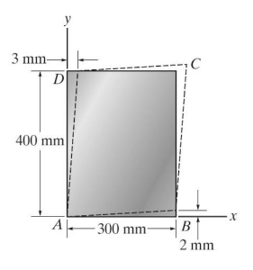
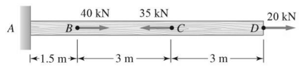
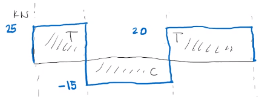
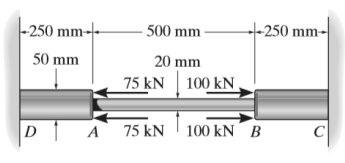
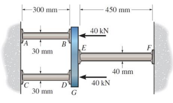
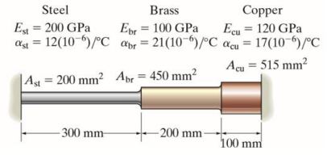

# Strain Deformation and Mechanical Properties

**Introduction**
Most bodies undergo some amount of elastic deformation under some external loading.

Strain
: A geometric quantity that measures the deformation of a body.

This is one of the most important topics in solid mechanics because strain quantifies the changes in geometry during deformation from applied stresses.

Normal Strain, $\epsilon_{x}$
: In a direction $\hat{n}$, this is defined as the change in length per unit length of the fibers oriented in the $\hat{n}$-direction.

[Strain (Average)](strain-average.md)
: ~$$\begin{equation}
\epsilon_{\text{avg}} = \frac{\Delta s' - \Delta s}{\Delta s}
\end{equation}$$

In solid mechanics, if we consider the deformation of a prismatic bar, then we represent average strain as $\epsilon_{\text{avg}} = \frac{L - L_{0}}{L_{0}} = \frac{\delta}{L_{0}}$.

**Pure Shear**
Shear strain is allowed by the shear forces balancing each other out on each face of differential elements.

Shear Strain, $\gamma$
: The change in angles between two originally perpendicular line segments.

!!! question Why are there two different notations for normal strain? <cite>#Daniel-Kenney
    If you do not have enough information to perform the integral, then you assume the average strain.

**Tension Testing: Mechanical Properties of Materials**
This is most important test for us.
Slowly applying axial loads unto a cylindrical bar, the specimen, the strain can be measure for some #strain-rate.
Typically, the yield point of a specimen is determined the 0.2%-offset Method.

!!! question How do we know the difference between brittle and ductile materials? <cite> Dr. Lugo
    This distinction is subjective, but in general, ductile materials undergo much more #plastic-strain (absorb more energy) before failure than "brittle" materials.
    Typically, this defining limit is held as 5% strain.

If we unload the specimen before the applied stress exceeds the yield point, then the material will elastically return to its original length.
This holds true to #viscoelastic materials; however, "visco-" connotes some time-dependence, but, ultimately, the specimen does return to its original geometry.

**Linear Elasticity and [Hooke’s Law](hookes-law.md)**
Most engineering materials have an initially, linear elastic region on the stress-strain diagram.
This linear relationship between stress and strain for a material in simple tension can be expressed by:

[Hooke's Law](hookes-law.md)
: ~$$\begin{equation}
\sigma = E\epsilon
\end{equation}$$

This #constitutive relationship is to us what #Newtons-Second-Law-of-Motion is to physics.

**True Stress-Strain Curve**
This differs from #engineering-strain, which considers that the cross-sectional area remains constant, by considering that the cross-sectional area changes with changes in overall length.

[Engineering Stress](engineering-stress.md)
: ~$$\begin{equation}
s = \frac{F}{A_{0}}
\end{equation}$$

[True Stress](true-stress.md)
: ~$$\begin{equation}
\sigma = \frac{F}{A}
\end{equation}$$

In Advanced Mechanics of Materials, we consider only the elastic region; therefore, $s$ and $\sigma$ are considered equivalent which is true until sufficient plastic deformation.
$s$ and $\sigma$ are related by:

$$\begin{split}
\sigma &= s(1 + e) \\
\epsilon &= \ln(1 + e)
\end{split}$$

#strain-hardening
: True stress increases continuously until sufficient #plastic-strain allows for the material to begin #necking.

**Axially Loaded Members**
Axial Deformation
: When axial loads are applied to a member.

We must make key assumptions:

- asdf

By these, we get an equilibrium equation: $\delta = \frac{PL}{AE}$.
If the member has regions of different cross-sectional areas and loads applied not only at the ends of the body, then the #Law-of-Superposition can be applied to find total elongation: $\delta = \sum\frac{PL}{AE}$.

**#statically-indeterminate Structures**

|  |
|:--:|
| Considering these two structures, we can solve the left-hand figure by summation of the forces to find the overall deformation. However, the right-hand figure is *#statically-indeterminate*. |

Reactions for the left-hand can be calculated from #equilibrium-equations, but left-hand cannot be solved this way.
We must also include compatibility equations.

- #equilibrium-equations: $\sum F_{x} = R_{A} + R_{C}$
- #constitutive-equations: $\delta = \frac{PL}{AE}$
- #compatibility-equations: $\delta_{T} = 0$

|  |
|:--:|
| We can also use #Law-of-Superposition. We temporarily remove one of the fixed points and consider each region of the body separately with constitutive equations that are coupled together with equilibrium and compatibility equations. |

**Thermal Effects on Axial Deformation**
Considering a homogeneous bar $\bar{AB}$ of uniform cross-section on a smooth, horizontal surface, there is a change in length with change in temperature.

Thermal Effects
: ~$$\begin{equation}
\begin{split}
\delta &=  \\
 &=
\end{split}
\end{equation}$$

!!! example Problem Set: 2-1
    |  |
    |:--:|
    | The rigid beam is supported by a pin at $A$ and wires $\bar{BD}$ and $\bar{CE}$. If the load P on the beam causes the end $C$ to be displaced $10 mm$ downward, determine the normal strain developed in wires $\bar{CE}$ and $\bar{BD}$. |

    We are given $\delta_{c} = 10 mm$, and we want to find $\epsilon_{BD}$ and $\epsilon_{CE}$.
    Using a #Law-of-Similar-Triangles:

    $$\begin{split}
    \frac{\delta_{B}}{3} &= \frac{\delta_{c}}{7} \\
    \delta_{B} &= \frac{3}{7}(10~mm) = 4.285714 mm
    \end{split}$$

    The length of each cable is $L = 4 m$.
    To find $\epsilon_{BD} = \frac{\delta_{B}}{L} = 0.001071 \frac{mm}{mm}$.
    To find $\epsilon_{CE} = \frac{\delta_{C}}{L} = 0.0025 \frac{mm}{mm}$.

    ---

    |  |
    |:--:|
    | The 2014-T6 aluminum rod of $\varnothing 20 mm$ is subjected to the uniform distributed axial load. Determine the displacement of end $A$. |

    We are given $d = 20 mm$ and that the rod is 2014-T6 aluminum.

    $$\begin{split}
    \delta &= \int\frac{P(x)dx}{A(x)E} \\
    &= \frac{1}{AE}\int_{0}^{0.9}30xdx \\
    &= \frac{30}{AE}\frac{x^{2}}{2}\biggr]_{0}^{0.9} \\
    &= 0.000552 m
    \end{split}$$

    ---

    |  |
    |:--:|
    | The piece of rubber is originally rectangular. Determine the average shear strain, $\gamma_{xy}$ at $A$ if the corners $B$ and $D$ are subjected to the displacements that cause the rubber to distort as shown by the dashed lines. |

    We are given the displacements and we want to find $\gamma_{xy}$; therefore, we must find $\theta_{1} = \angle AB$ and $\theta_{2} = \angle AD$.

    $$\begin{split}
    \theta_{1} &= \tan^{-1}\Bigl(\frac{u_{B}}{L_{AB}}\Bigr) = \tan^{-1}\Bigl(\frac{2~mm}{300~mm}\Bigr) = 0.006667 rad \\
    \theta_{2} &= \tan^{-1}\Bigl(\frac{u_{D}}{L_{AD}}\Bigr) = \tan^{-1}\Bigl(\frac{3~mm}{400~mm}\Bigr) = 0.007500 rad
    \end{split}$$

    Thus the shear strain at $A$ is the sum of these two angles: $\gamma_{xy} = 0.014166 rad$

    ---

    |  |
    |:--:|
    | The timber member has a cross-sectional area of $1750 mm^{2}$ and its modulus of elasticity, $Y = 12 GPa$. Compute the change in the total length of the member after the loads shown are applied. |

    We are given the area and elastic modulus, and we want to find the total deformation, $\delta_{T}$.
    We must apply the equilibrium equations to find the reaction force at point $A$, $R_{A}$:

    $$\begin{split}
    \rightarrow\sum F_{x} = 0 := -R_{A} + 40 - 35 + 20 &= 0 \\
    \implies R_{A} &= 25~kN \\
    \end{split}$$

    |  |
    |:--:|
    | Force diagram of beam. |

    By examining #Shear-and-Moment-Diagram, we can find the total deformation, $\delta_{T} = \sum_{i} \frac{P_{i}L_{i}}{A_{i}E_{i}}$:

    ---

    |  |
    |:--:|
    | The composite bar consists of a $\varnothing 20 mm$ A-36 steel segment, $AB$ and $\varnothing 50 mm$ red brass C83400 end segments $DA$ and $CB$. Determine the average normal stress in each segment due to the applied load. |

    We are given the diameter and length of each segment of the bar.
    The elastic modulus of steel is commonly $200 GPa$ and for brass is $101 GPa$.
    We need to find $\sigma_{st}$ and $\sigma_{br}$, but this problem is *#statically-indeterminate*.
    We can use the **#Law-of-Superposition** with #compatibility-equations and #constitutive-equations to find the reaction forces at points $C$ and $D$.

    $$\begin{split}
    \delta_{P_{1}} &= \frac{P_{1}L_{AD}}{A_{AD}E_{br}} + \frac{P_{1}L_{AB}}{A_{AB}E_{st}} \\
    &= \frac{(200~kN)(250~mm)}{(\frac{1}{4}\pi(50~mm)^{2})(101~GPa)} + \frac{(200~kN)(500~mm)}{(\frac{1}{4}\pi(20~mm)^{2})(200~GPa)} \\
    \implies \delta_{P_{1}} &= 0.001271 m \\
    \delta_{P_{2}} &= \frac{P_{2}L_{AD}}{A_{AD}E_{br}} \\
    &= 0.00018909~m \\
    \delta_{R_{C}} &= 2\Bigl(\frac{R_{C}L_{AD}}{A_{AD}E_{br}}\Bigr) + \frac{R_{C}L_{AB}}{A_{AB}E_{st}} \\
    &= 0.00000001048 R_{C}
    \end{split}$$

    By the #compatibility-equations, $\delta_{T} = 0$, because both ends of the bar are fixed which is *#statically-indeterminate*.

    $$\begin{split}
    \therefore \delta_{T} = 0 := \delta_{P_{1}} + \delta_{P_{2}} + \delta_{R_{C}} &= 0 \\
    0.0018436 - 0.00018909 + 0.00000001048 R_{c} &= 0 \\
    \implies R_{C} &= 157.88~kN
    \end{split}$$

    By sum of the forces, we can find $R_{D} = 107.88 kN$.
    Therefore, ${\sigma_{AD}, \sigma_{AB}, \sigma_{BC}} = {54.96, 134.025, 80.4} MPa$.

    ---

    |  |
    |:--:|
    | The assembly consists of two red brass C83400 copper rods $AB$ and $CD$ of diameter, $\varnothing 30 mm$, a stainless 304 steel alloy rod $EF$ of diameter, $\varnothing 40 mm$, and a rigid gap, $G$. If the supports at $A$, $C$, and $F$ are rigid, then determine the average, normal stress developed in the rods. |

    ---

    |  |
    |:--:|
    | Three bars each made of different…​ |

    The temperature differences affects each bar segment differently: i.e. each bar will deform a certain length.
    However, this problem is *#statically-indeterminate*, so we can use the **#Law-of-Superposition**.
    Recall: $\delta = \alpha \Delta TL$.

    $$\begin{split}
    \delta_{T} &= \sum_{i}\delta_{T_{i}} \\
    &= \alpha_{st}\Delta TL_{st} + \alpha_{br}\Delta TL{br} \\
    &\qquad + \alpha_{cu}\Delta TL_{cu}
    \end{split}$$

    By the compatibility equations: $\delta _{T} = \delta_{FC}$.

    $$\begin{split}
    F_{C} &= 4.2~kN \\
    \sigma_{st} &= 21.01~MPa \\
    \sigma_{br} &= 9.3~MPa \\
    \sigma_{cu} &= 8.16~MPa
    \end{split}$$