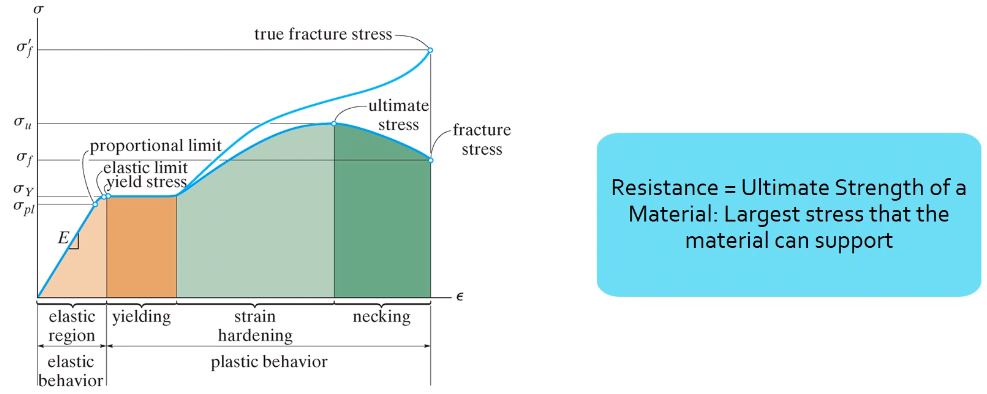
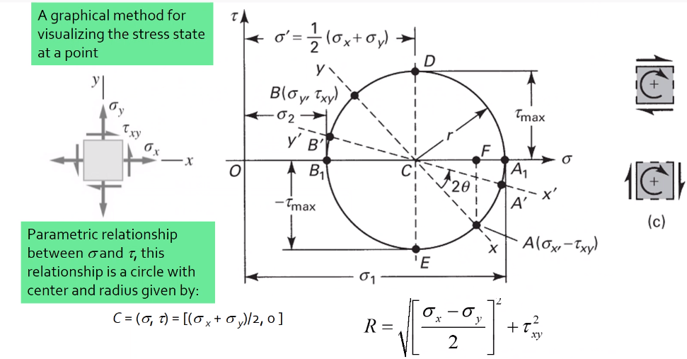
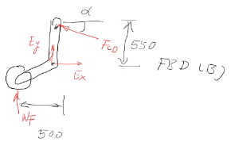
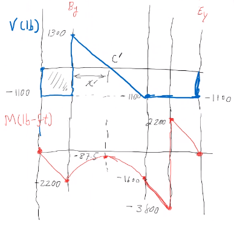
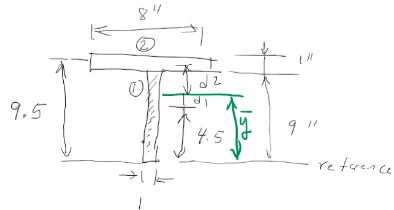
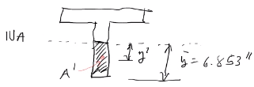
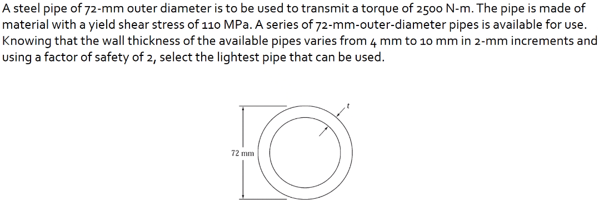
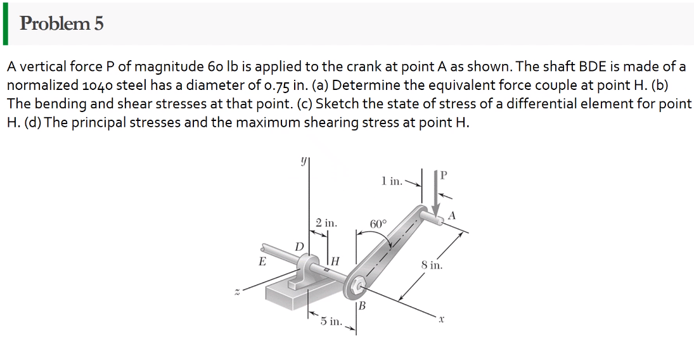
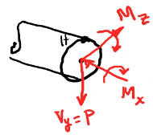
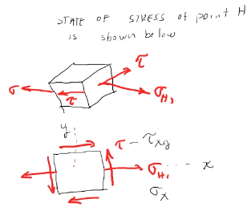

# Stress Analysis of a State of Plane Stress

**Resistance of a Material**

|  |
|:--:|
| Usually we design for the *yield stress* of a material because we like linear. Failure depends on your criterion. |

**Allowable Stress and Factor of Safety**

For example, a home is a multi-physics problem with many design constraints and variables to accomplish the objectives and satisfy the goals that allow one to live in the home.

The **nuclear industry** uses a factor of safety, $FOS = 5$.

**[Internal Forces](internal-forces.md)**

**General State of Stress**

The #stress-state of a point is defined by the stress components acting on this sides of a differential volume that encloses the point.
- The faces of the element are designated by the directions of their normal.
- The single subscript on the normal stress indicates the face on which it acts.

|  |
|:--:|
| The stresses are acting on one plane. In this state, two faces are of stress. |

[Transformation Equations](stress-transformation-equations.md)
: ~$$\begin{equation}
\begin{split}
\sigma_{x}' &= \frac{\sigma_{x} + \sigma_{y}}{2} + \frac{\sigma_{x} + \sigma_{y}}{2}\cos(2\theta) + \tau_{xy}\sin(2\theta) \\
\sigma_{y}' &= \frac{\sigma_{x} + \sigma_{y}}{2} + \frac{\sigma_{x} - \sigma_{y}}{2}\cos(2\theta) - \tau_{xy}\sin(2\theta) \\
\tau_{xy}' &= -\frac{\sigma_{x} + \sigma_{y}}{2}\sin(2\theta) + \tau_{xy}\cos(2\theta) \\
\tan(2\theta_{p}) &= \frac{\tau_{xy}}{\frac{\sigma_{x} - \sigma_{y}}{2}} \\
\tan(2\theta_{s}) &= \frac{\frac{\sigma_{x} - \sigma_{y}}{2}}{\tau_{xy}}
\end{split}
\end{equation}$$

These lead to **#principal-stress** which are $180^{\circ}$ apart (see [Fig. 2-4](#fig-mohrs_circle)):

[Principal Stresses](principal-stress.md)
: ~$$\begin{equation}
\begin{split}
\sigma_{1, 2} &= \frac{\sigma_{x} + \sigma_{y}}{2} \pm \sqrt{\bigg( \frac{\sigma_{x} - \sigma_{y}}{2} \bigg)^{2} + \tau_{xy}^{2}} \\
\tau_{xy} &= \sqrt{\bigg( \frac{\sigma_{x} - \sigma_{y}}{2} \bigg)^{2} + \tau_{xy}^{2}} \\
\sigma_{avg} &= \frac{\sigma_{x} + \sigma_{y}}{2}
\end{split}
\end{equation}$$

|  |
|:--:|
| Mohr’s Circle is a common way to represent these transformation equations. The center point, $C = (\sigma, \tau) = (\sigma_{avg}, 0)$ and the radius, $R = \sqrt{[ \frac{\sigma_{x} - \sigma_{y}}{2} ]^{2} + \tau_{xy}^{2}}$. |

!!! example Problem Set: 1-1
    **Problem 1**
    |  |
    |:--:|
    | Problem 1: What kind of stresses act on the depicted bar? |

    |  |
    |:--:|
    | FBD-A |

    **Solution of FBD-A**
    $$\begin{split}
    \sum F_{x} = 0 := A_{x} &= 0 \\
    \implies A_{x} &= 0 \\
    \sum \mathcal{M}_{A} = 0 := N_{F}*r_{A-N} - W*r_{A-W} &= 0 \\
    N_{F}*850 - 200*9.81*1150 &= 0 \\
    \implies N_{f} &= 2654.47~N \\
    \sum F_{y} = 0 := A_{y} + N_{F} - W &= 0 \\
    \implies A_{y} &= asdf~MPa
    \end{split}$$

    |  |
    |:--:|
    | FBD-B |

    **Solution of FBD-B**
    $$\begin{split}
    \alpha = \tan^{-1}(\frac{100}{675}) &= 8.43^{\circ} \\
    \sum \mathcal{M}_{E} = 0 := -N_{F}*r_{E-N} + F_{CD}*r_{E-CD} &= 0 \\
    \implies F_{CD} &= 2439.5~N
    \end{split}$$

    Because the bar $\bar{CD}$ is subjected to compressive stresses: $\sigma_{CD} = \frac{F_{CD}}{A} = \frac{2439.5 N}{\frac{\pi}{4}(25 mm)^{2}} = 4.96 MPa$.
    The factor of safety, $FOS = \frac{\sigma_{y}}{\sigma_{CD}} = \frac{220 MPa}{4.96 MPa} = 44.35$ is well above the typical $FOS = 2$; therefore, this piston $\bar{CD}$ is over-designed.

    ---

    **Problem 2**

    

    |  |
    |:--:|
    | FBD |

    **Solution of FBD**
    $$\begin{split}
    \sum \mathcal{M}_{B} = 0 := 1100(2) - 400(6)(2) - 6000 + E_{y}(10) &= 0 \\
    \implies E_{y} &= 1160~lb \\
    \sum F_{y} = 0 := -1100 - 400(6) + E_{y} + B_{y} &= 0
    \end{split}$$

    We draw the #Shear-and-Moment-Diagram: $\frac{x'}{1300} = \frac{6}{2400} \implies x' = 3.25'$.

    $$\begin{split}
    \Delta M &= \frac{1}{2}(3.25)(1300) \\
    M_{C'} &= -2200 + \frac{1}{2}(3.25)(1300) \\
    &= -87.5~lb-ft \\
    M_{C} &= M_{C'} + \Delta M = -87.5 - \frac{1}{2}(2.75)(1100) \\
    &= -1600~lb-ft \\
    M_{D} &= -1600 - 1100(2) \\
    &= -3800~lb-ft
    \end{split}$$

    |  |
    |:--:|
    | Shear and Moment Diagram |

    |  |
    |:--:|
    | Finding the centroid and moment of inertia of cross-section. |

    The **centroid** and **Moment of Inertia** is determined by:

    $$\begin{split}
    \bar{y} &= \frac{A_{1}\bar{y_{1}} + A_{2}\bar{y_{2}}}{A_{1} + A_{2}} \\
    &= \frac{1(9)(4.5) + 8(1)(9.5)}{9 + 8} \\
    &= 6.853~in \\
    I &= \frac{1}{12}bh^{3} + Ad^{2} \\
    &= \frac{1}{12}(1)(9)^{3} + 9(6.853 - 4.5)^{2} + \frac{1}{12}(8)(1)^{3} + 8(9.5 - 6.853)^{2} \\
    &= 167.3~in^{4}
    \end{split}$$

    Next, we find the **Bending** stresses:
    - Point B
      - Top: $\sigma_{B} = \frac{M_{B}C_{1}}{I} = \frac{(2200~lb-ft)(10 - 6.853)~in (12~\frac{in}{ft})}{167.3~in^{4}} = 496.6~psi$
      - Bottom: $\sigma_{D} = \frac{M_{D}{C_{2}}}{I} = \frac{(2200~lb-ft)(12~\frac{in}{ft})(6.583~in)}{167.3~in^{4}} = 1081.4~psi$
    - Point D
      - Top: $\sigma = \frac{M_{D}c_{1}}{I} = \frac{(3800~lb-ft)(12~\frac{in}{ft})(10 - 6.853)~in}{167.3~in^{4}} = 0.858~ksi$
      - Bottom: $\sigma = \frac{M_{D}c_{2}}{I} = \frac{(3800~lb-ft)(12~\frac{in}{ft})(6.853~in)}{167.3~in^{4}} = 1.868~ksi$

    Finally, we find the **Shear** stresses:

    |  |
    |:--:|
    | The maximum shear stress occurs at the distance furthest from the centroid. We will use the lower part of the cross-section for simpler calculations. |

    **Point B**
    $$\begin{split}
    \tau &= \frac{VQ}{It} \\
    \text{where, } Q &= A'\bar{y}' = (1)(6.853)~in^{2}(\frac{6.853}{2}~in^{2}) \\
    &= 23.48~in^{4} \\
    \implies \tau &= \frac{(1300~lb)(23.48~in^{3})}{167.3~in^{4}} \\
    &= 0.182~ksi
    \end{split}$$

    ---

    **Problem 3**

    |  |
    |:--:|
    | Problem 3: Using the given forces, solve either by equilibrium equations or the transformation equations [Eq. 1](stress-transformation-equations.md) |

    ---

    **Problem 4**

    |  |
    |:--:|
    | Problem 4: Simply use hoop stress equations. |

    ---

    **Problem 5**

    |  |
    |:--:|
    | Problem 5: What are the critical points in the components, and what are the Principal Stresses at point $H$? |

    |  |
    |:--:|
    | By drawing a cross-sectional element from along bar $\bar{DHB}$ of section $\bar{DH}$, we see two internal moments and one shear force about the shaft. |

    $$\begin{split}
    V_{y} &= P = 60~lb \\
    M_{x} &= (60~lb)(8~in \sin(60^{\circ})) \\
    &= 415.642~lb-in \\
    M_{z} &= (60~lb)(4~in) \\
    &= 240~lb-in
    \end{split}$$

    From these moments and shear, we can find the principal stresses at point, $H$.
    We need the moment of inertia, $I = \frac{\pi d^{4}}{64} = \frac{\pi (0.75~in)^{4}}{64} = 0.0155~in^{4}$.
    We need, also, the polar moment of inertia, $J = \frac{\pi d^{4}}{32} = 2I = 0.03106~in^{4}$.
    Therefore, the following applies:
    - Bending: $\sigma_{H_{1}} = \frac{M_{z}r}{I} = \frac{(240~lb-in)(\frac{0.75}{2}~in)}{0.0155~in^{4}} = 5.795~ksi$
    - Shear: $\tau = \frac{M_{x}r}{J} = \frac{(415.642~lb-in)(\frac{0.75}{2}~in)}{0.03106~in^{4}} = 5.018~ksi$

    |  |
    |:--:|
    | We must apply the **Method of Superposition** to find $M_{z}$ which completes the #stress-state in the cross-section of point $H$. |

    |  |
    |:--:|
    | The #stress-state of point $H$ can be described by finding the in-plane principal stresses. |

    $$\begin{split}
    \sigma_{1, 2} &= \frac{\sigma_{x} + \sigma_{y}}{2} \pm \sqrt{(\frac{\sigma_{x} - \sigma_{y}}{2})^{2} + \tau_{xy}^{2}} \\
    &= \frac{5.715}{2} \pm \sqrt{(\frac{5.745}{2})^{2} + (5.018)^{2}} \\
    &= 8.692~ksi, -2.897~ksi \\
    \tau_{max} &= \sqrt{(\frac{\sigma_{x} - \sigma_{y}}{2})^{2} + \tau_{xy}^{2}} \\
    &= \sqrt{(\frac{5.745}{2})^{2} + (5.018)^{2}} \\
    &= 5.782~ksi
    \end{split}$$