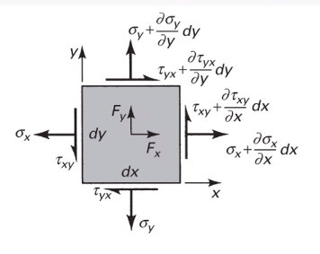
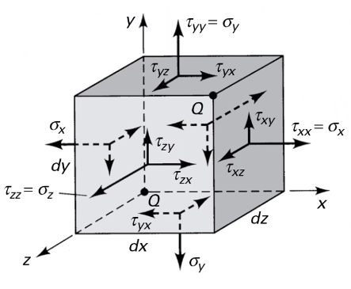
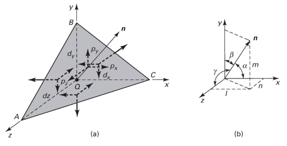
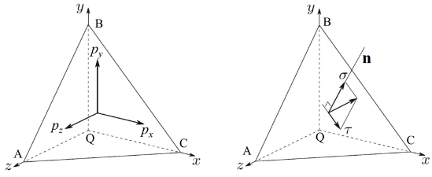
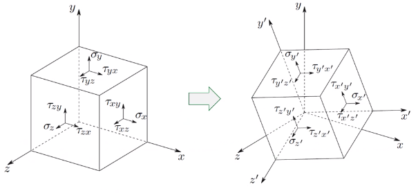
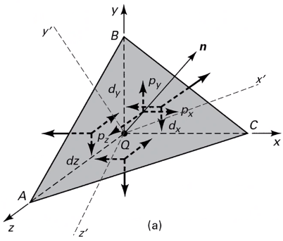
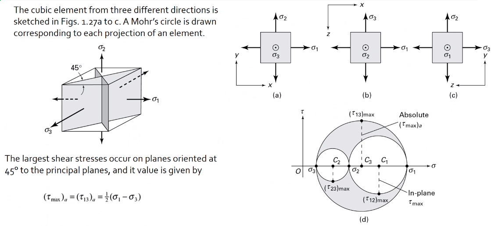
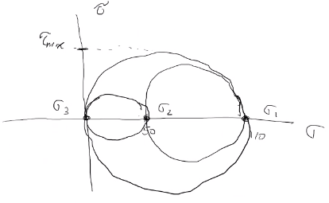

# Three Dimensional Stress Analysis and Equilibrium

**Stress #equilibrium Equations**

|  |
|:--:|
| Consider an element of sides $dx$ and $dy$ of some unit thickness. It is assumed that $\sigma_{x}$, $\sigma_{y}$, $\tau_{xy}$, and $\tau_{yx}$ are functions of $x$ and $y$. Assume that the $x$ and $y$ components of the body forces per unit volume, $F_{x}$ and $F_{y}$. |

In mechanics, there are 2 types of forces: external and internal loads.
We often describe these as body forces and remote forces ([Fig. 3-1](../../../attachments/engr-727-001-advanced-mechanics-of-materials/stress_equilibrium_equations_2d_220120_133143_EST.png)).
If we take the sum of the moments about the lower-left corner, then $\sum M_{z} = 0 := (\frac{\partial\sigma_{y}}{\partial y}dxdy)\frac{dx}{2} - (\frac{\partial\sigma_{x}}{\partial x}dxdy)\frac{dy}{2} + (\tau_{xy} + \frac{\partial\tau_{xy}}{\partial x}dx)dxdy - (\tau_{yx} + \frac{\partial\tau_{yx}}{\partial y}dy)dxdy + F_{y}dxdy\frac{dx}{2} - F_{x}dxdy\frac{dy}{2} = 0$.
This reduces to $\tau_{xy} = \tau_{yx}$.
Similarly, in 3 dimensions, the following can be found $\tau_{yz} = \tau_{zy}$ and $\tau_{xz} = \tau_{zx}$.
From sum of the $x$ forces: $\sum F_{x} = 0 := (\sigma_{x} + \frac{\partial\sigma_{x}\tau_{x}}dx)dy - \sigma_{x}dy + (\tau_{xy} + \frac{\partial\tau_{xy}}{\partial y}dy)dx + \tau_{xy}dx - F_{x}dxdy = 0$.
This simplifies to: $(\frac{\partial\sigma_{x}}{\partial x} + \frac{\partial\sigma_{x}}{\partial y} + F_{x})dxdy = 0$.
Because $dx$ and $dy$ are non-zero:

$$\begin{split}
\frac{\partial\sigma_{x}}{\partial x} + \frac{\partial\sigma_{x}}{\partial y} + F_{x} &= 0 \\
\frac{\partial\sigma_{y}}{\partial y} + \frac{\partial\sigma_{y}}{\partial x} + F_{y} &= 0
\end{split}$$

By expanding to 3 dimensions:

$$\begin{split}
\frac{\partial\sigma_{x}}{\partial x} + \frac{\partial\tau_{xy}}{\partial y} + \frac{\partial\tau_{xz}}{\partial z} + F_{x} &= 0 \\
\frac{\partial\sigma_{y}}{\partial x} + \frac{\partial\tau_{xy}}{\partial y} + \frac{\partial\tau_{xz}}{\partial z} + F_{x} &= 0 \\
\frac{\partial\sigma_{z}}{\partial x} + \frac{\partial\tau_{xy}}{\partial y} + \frac{\partial\tau_{xz}}{\partial z} + F_{x} &= 0
\end{split}$$

**General State of Stress of a Point**

|  |
|:--:|
| The #stress-state of a point is defined by the stress components acting on the sides of a differential volume that encloses the point which requires 9 forces in total. |

Often times, we use a matrix to represent these 9 forces: $[\sigma_{ij}] = [\tau_{ij}] = \mathbf{\tau}_{ij} = \begin{bmatrix}\sigma_{x} & \tau_{xy} & \tau_{xz} \\ \tau_{yx} & \sigma_{y} & \tau_{yz} \\ \tau_{zx} & \tau_{zy} & \sigma_{z}\end{bmatrix}$.
However, we must remember that this matrix is *symmetric*.

**Stress Acting on Arbitrary Planes**

|  |
|:--:|
| The equations governing the transformation of the stress in 3D are obtained using a similar approach to that applied to the 2D case. Therefore, we can follow a similar manner to consider a tetrahedron isolated from a continuous medium subjected to a general state of stress. |

The orientation of plane $ABC$ is defined in terms of angles between a unit normal, $n$ to the plane and the $x$, $y$, and $z$ directions.
The #Direction-of-Cosines associated with these angles are:

$$\begin{split}
\cos(\alpha) &= \cos(\mathbf{n}, ) \\
 &=
\end{split}$$

The #equilibrium forces can be obtained after canceling the area, $A$.
The areas of perpendicular planes $QAB$, $QAC$, and $QBC$ can be expressed in terms of $A$, the area of $ABC$ and the #Direction-of-Cosines:

$$\begin{split}
A_{AQB} &= A_{x} = \mathbf{A} \cdot \mathbf{i} = A(l\mathbf{i} + m\mathbf{j} + n\mathbf{k}) \cdot \mathbf{i} = Al \\
 &= Al \\
\implies A_{QAC} &= Am \\
\implies A_{QBC} &= An
\end{split}$$

Using the stress tensor, we can represent these #equilibrium equations by:

$$\begin{split}
p_{x} &= \sigma_{x}l + \tau_{xy}m + \tau_{xz}n \\
 &=
\end{split}$$

Using matrix notation:

$$\begin{bmatrix}p_{x} \\ p_{y} \\ p_{z}\end{bmatrix} = {\mathbf{p}} = \begin{bmatrix} \dots \end{bmatrix}$$

**Normal and Shear Stresses on an Oblique Plane**

|  |
|:--:|
| The normal stress, $\sigma$ is the projection of the vector, $\vec{p}$ in the direction of $n$. |

$$\begin{split}
\sigma &= \vec{p} \cdot \mathbf{n} = \vec{p} \cdot \vec{n} \\
\sigma &= p_{x}l + p_{y}m + p_{z}n \\
\sigma &= \sigma_{x}l^{2} + \sigma_{y}m^{2} + \sigma_{z} + n^{2} + 2(\tau_{xy}lm + \tau_{yz}mn + \tau_{xz}ln)
\end{split}$$

The magnitude of the shear stress, $\tau$ on plane $ABC$ can be computed by geometry:

$$\begin{split}
\tau &= \sqrt{p^{2} - \sigma^{2}} \\
\tau &= \sqrt{p_{x}^{2} + p_{y}^{2} + p_{z}^{2} - \sigma^{2}} \\
\tau &= \sqrt{(\sigma_{x}l + \tau_{xy}m + \tau_{xz}n)^{2} + (\tau_{xy}l + \sigma_{y}m + \tau_{yz}n)^{2} + (\tau_{xz}l + \tau_{yz}m + \sigma_{z}n)^{2} - \sigma^{2}}
\end{split}$$

**#stress-transformation: Stress in a Cartesian Coordinate System $x'$, $y'$, and $z'$**

|  |
|:--:|
| The variance of the stress with respect to surface orientation. |

The transformation matrix is composed by the #Direction-of-Cosines: $l_{1} = \cos(x′, x)$, $m_{1} = \cos(x′, y)$, and so on.
The complete set of #Direction-of-Cosines is:

|  | $x$ | $y$ | $z$ |
| --- | --- | --- | --- |
| $x'$ | $l_{1}$ | $m_{1}$ | $n_{1}$ |
| $y'$ | $l_{2}$ | $m_{2}$ | $n_{2}$ |
| $z'$ | $l_{3}$ | $m_{3}$ | $n_{3}$ |

In tensor notation: …​

|  |
|:--:|
| Using these transformation equations for stresses acting on a new axis, $\vec{p} = [\tau_{ij}]\vec{n}$ on an oblique plane in this new coordinate system becomes $\vec{p'} = [\tau_{ij}']\vec{n'}$. |

These vectors can be related by: $\vec{p'} = \vec{T} \cdot \vec{p}$.
This can be combined with the transformed stress tensor into: $[\tau_{ij}']\vec{n'} = \vec{T}[\tau_{ij}]\vec{n}$.
The relationship between $\vec{n}$ and $\vec{n'}$ can be obtained by the inversion of $\vec{n'} = \vec{T}\vec{n}$ which is $\vec{n} = \vec{T}^{T}\vec{n'}$.

$$\begin{split}
\vec{T_{ij}}\vec{n}' &= \ \\
 &=
\end{split}$$

The book performs the same derivations with different notation.
Ultimately, these two expressions are equivalent, but the book’s notation is longer and more expressive.

**Principal Stress in 3D**

Planes with zero shear stress are mutually perpendicular and have a (min)maximum which are called **#principal-stress**.
Therefore, the stress vector on principal planes is given by $\vec{p} = \sigma_{p}\vec{n}$ where $\sigma_{p}$ is the magnitude of the stress vector, $\vec{p}$ and $\hat{n} = l\hat{i} + m\hat{j} + n\hat{k}$ is the unit normal to a principal plane.
By projecting $\vec{p}$ along each axis and substituting into $\vec{p} = \vec{\tau_{ij}}\hat{n}$, we arrive to the identity matrix:

…​

This becomes an #eigenvalue *problem*.
A non-trivial solution for the #Direction-of-Cosines requires that the characteristics stress determinant vanish; therefore, we set this equal to zero.

…​

This gives the characteristic equation: $\sigma_{p}^{3} - I_{1}\sigma_{p}^{2} + I_{2}\sigma_{p} - I_{3} = 0$; wherein, $I_{1}$, $I_{2}$, $I_{3}$ are the stress invariants.

$$\begin{split}
I_{1} &= \sigma_{x} + \sigma_{y} + \sigma_{z} \\
I_{2} &= \sigma_{x}\sigma_{y} + \sigma_{x}\sigma_{z} + \sigma_{y}\sigma_{z} - \tau_{xy}^{2} - \tau_{yz}^{2} - \tau_{xz}^{2} \\
I_{3} &= \dots
\end{split}$$

**#Mohrs-Circle for Triaxial Stress**

|  |
|:--:|
| In general, using **#Mohrs-Circle** is not helpful for 3D analyses but can be helpful to double check work. |

!!! example Problem Set: 1-2
    **Problem 1:** The following describes the stress distribution in a body (in $MPa$).
    Determine the body force distribution required for #equilibrium and the magnitude of its resultant at the point: $(x, y, z) = (-10, 30, 60) mm$.

    $$\begin{split}
    \sigma_{x} &= x^{2} + 2y \\
    \sigma_{y} &= xy - y^{2}z \\
    \sigma_{z} &= x^{2} - z^{2} \\
    \tau_{xy} &= -xy^{2} + 1 \\
    \tau_{yz} &= 0 \\
    \tau_{xz} &= xz - 2x^{2}y
    \end{split}$$

    !!! note Concerning the resulting forces
        These forces are body, not surface forces; therefore, we are findings forces per volume.

    1. First, we find the partials.

        $$\begin{align*}
        \frac{\sigma_{x}}{\partial x} &= 2x &\quad \frac{\tau_{xy}}{\partial x} &= -y^{2} &\quad \frac{\tau_{xz}}{\partial x} &= z - 4xy \\
        \frac{\tau_{xy}}{\partial y} &= -2xy &\quad \frac{\sigma_{y}}{\partial y} &= z - 2yz &\quad \frac{\tau_{yz}}{\partial y} &= 0 \\
        \frac{\tau_{xz}}{\partial z} &= x &\quad \frac{\tau_{yz}}{\partial z} & = 0 &\quad \frac{\sigma_{z}}{\partial z} &= -2z
        \end{align*}$$

    2. Next, with these derivations and summing the forces in the $x$-direction, we find: $F_{x} := 2(-10) + (-2)(-10)(30) + (-10) + F_{x} = 0 \\ \implies F_{x} = 570~\frac{N}{m^{3}}$ Similarly: $F_{y} = 14.5~\frac{kN}{m^{3}}$ and $F_{z} = 50.8~\frac{N}{m^{3}}$.

    ---

    **Problem 2**: The stress components at a point in a plate are $\sigma_{x} = 80 MPa$, $\sigma_{y} = 60 MPa$, $\sigma_{z} = \tau_{xy} = 20 MPa$, $\tau_{xx} = 40 MPa$, and $\tau_{yz} = 10 MPa$.
    (a) Determine the stress vector on a plane normal to the vector $<i, 2j, k>$.
    (b) Determine the principal stresses $\sigma_{1} \geq \sigma_{2} \geq \sigma_{3}$.
    (c) Determine the maximum shear stress.
    (d) Determine the octahedral shear stress.

    1. To find the solution vector, $\vec{n}$:

    $$\begin{split} \vec{n} &= \frac{1}{\sqrt{i^{2} + j^{2} + k^{2}}}(\hat{i} + 2\hat{j} + \hat{k}) \\ &= \frac{1}{\sqrt{6}}(\hat{i} + 2\hat{j} + \hat{k}) \end{split}$$

    Find $\vec{p}$ according to appropriate equations…​

    1. Principal Stresses

    We find the stress invariants to be $I_{1} = 160 MPa$, $I_{2} = 5500 MPa^{2}$, and $I_{3} = 0 MPa^{3}$.
    $\therefore$, we plug these into the characteristic, cubic equations.
    $\sigma_{p}^{3} - 160\sigma_{p}^{2} + 5500\sigma_{p} - 0 = 0 \\ \implies \sigma_{p} = \{0, 110, 50\}~MPa$.
    We check that $\sigma_{1} \geq \sigma_{2} \geq \sigma_{3}$ which maps $\vec{\sigma_{p}}$ to {110, 50, 0} $MPa$.

    1. From these, we can draw #Mohrs-Circle.

    |  |
    |:--:|
    | Therefore, $\tau_{max} = 55 MPa$. |

    ---

    **Problem 3**: The following stress array relative to axes $(x, y, z)$ is given where the stress components are in $MPa$.
    (a) Determine the stress invariants of $T$.
    (b) Consider a rotation of the $(x, y)$ axes by $45^{\circ}$ counter-clockwise in the $(x, y)$ plane to form axes $(x', y')$.
    Let the $z$-axis and the $z'$-axis coincide.
    Calculate the stress components relative to the $(x', y', z')$ axes.
    (c) With the results of part (b), determine the stress invariants relative to axes $(x', y', z')$, and show that they are the same as the invariants of part (a).
    $$\tau_{ij} = \begin{bmatrix} 4 & 1 & 2 \\ 1 & 6 & 0 \\ 2 & 0 & 8 \end{bmatrix} MPa$$

    1. Invariants of $T$

    $$\begin{split} I_{1} &= 18~MPa \\ I_{2} &= 99~MPa^{2} \\ I_{3} &= 160~MPa^{3} \end{split}$$

    1. Finding the stress components in the new coordinate system. We must build the table of cosines.

    | asdf | $x$ | $y$ | $z$ |
    | --- | --- | --- | --- |
    | $x'$ | $\frac{\sqrt{2}}{2}$ | $\frac{\sqrt{2}}{2}$ | $0$ |
    | $y'$ | $\frac{\sqrt{2}}{2}$ | $-\frac{\sqrt{2}}{2}$ | $0$ |
    | $z'$ | $0$ | $0$ | $1$ |

    Therefore, the stress tensor in the new coordinate system can be found by: $[\tau_{ij}] = [T][\tau_{ij}][T]^{T}$.
    This yields, $[\tau_{ij}'] = \begin{bmatrix}6 & 1 & \sqrt{2} \\ 1 & 4 & -\sqrt{2} \\ \sqrt{2} & -\sqrt{2} & 8\end{bmatrix}~MPa$.