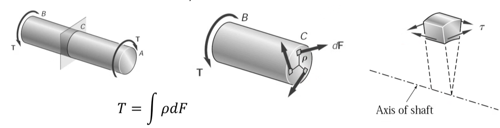
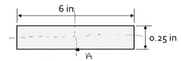
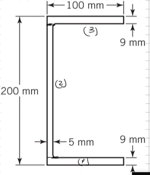

# Torsion in Prismatic Bars

**Introduction**
#torsion is usually carried through circular, structural members called shafts.
These are #statically-indeterminate problems.

|  |
|:--:|
| Examining a shaft under a torque couple along some cross-section reveals that shear forces acting perpendicular to the surface counteract the applied torque(s). |

**#compatibility-equations: Deformation**
To obtain the rotation of the circular shaft, several assumptions are made:
1. Every cross-section remains plane and undistorted
2. Section remain circular
3. Radial lines remain straight

**#constitutive-equations**
Assuming that the material behaves in the elastic region, then **[Hooke's Law](hookes-law.md)** applies.

**#Saint-Venants-Theory-for-Torsion**
The theory of #torsion is due to [[Saint Venant's Solution by Inversion]] and was presented in 1885.
The assumption for deformation was
$$\begin{split}
u &= -(r) \\
 &=
\end{split}$$

**Relationships Between Strains and Displacements**

**#Prandtl-Stress-Function**

!!! example Solution for an Elliptical #torsion Bar
    For a solid bar of elliptical cross-section, the following stress function is chosen.

    $$\phi = k\Biggl( \frac{x^{2}}{a^{2}} + \frac{y^{2}}{b^{2}} - 1 \Biggr)$$

    where $k$ is a constant.
    With substitutions from Eq. 4 and 6:

    $$\begin{split}
    T &= \frac{a^{2}b^{2}H}{a^{2} + b^{2}}\Biggl( \frac{1}{a^{2}}\iint x^{2}dxdy + ) \\
    &=
    \end{split}$$

**#maximum-shear-stress and #angle-of-twist**
The maximum, resultant, shearing stress occurs on the minor axis of the ellipse.

!!! example Problem Set: 6-1
    |  |
    |:--:|
    | A steel bar of slender, rectangular cross-section ($0.25 in \times 6 in$) is subjected to twisting moments of $180 lb-ft$ at the ends. Calculate the maximum shearing stress and the #angle-of-twist per unit length. Take $G = 11,500 ksi$. |

### #torsion of #thin-walled-members and Multiply Connected Cross-Sections
!!! example Problem Set: 6-2
    |  |
    |:--:|
    | Find the #maximum-shear-stress and unit #angle-of-twist of the bar having the cross-section shown when subjected to a torque at its ends of $600 N-m$. The bar is made of a steel for which $G = 77.5 GPa$. |

    The equivalent, polar #moment-of-inertia is calculated as: $J_{e} = \frac{1}{3}\sum_{i} b_{i}t_{i}^{3} = 56183.33~mm^{4}$.
    The #maximum-shear-stress: $\tau_{max} = \frac{Tt_{i}}{J_{e}} = 96.11~MPa$.
    The unit #angle-of-twist: $\theta = \frac{T}{6 J_{e}} = 0.1737~\frac{rad}{m}$.