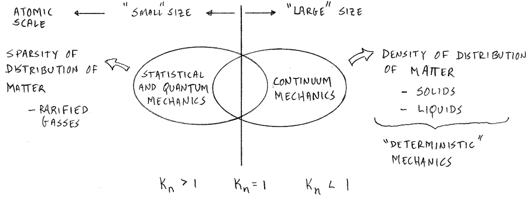

<!-- 20230117T13:41 -->
# Lecture 1: A Review of Continuum Mechanics
We assume that materials are continuous without defects.
Inelasticity expands on this but focuses on the viscoplasticity of the material [^ContinuumCourse].

[^ContinuumCourse]: Refer to the [course notes](../engr-725-001-continuum-mechanics.md) on *ENGR 725: Continuum Mechanics* for more details.

|  |
|:--:|
| $K_{n} = \frac{\lambda}{D}$ where $D$ is the length-scale parameter. So if what you are measuring is larger than the inspected length-scale (i.e. $K_{n} > 1$), then continuum mechanics can be applied. |

We refer to matrices representing physical quantities as "tensors".
The rank of that tensor is the number of free indices in that tensor.
- 0: scalar
- 1: vector
- 2: matrix
- 4: stiffness matrix

