<!-- 20230216T12:47 -->
# Lecture 10: Creep of Crystals - High Temperature Deformation in Crystalline Materials
Orowan is considered the father of dislocations because of his 1938 quote comparing the complexity of understanding how a watch worked by subjecting it to compression tests.

!!! question How does one measure creep? <cite> Cho
    Measure strain under constant stress.

If one were to apply a load of constant strain, the stress relaxation is a measure of creep.
This relaxation comes from recovery: microstructural re-adjustment; dislocation glide, climb, annihilation; grain growth; etcetera.

## What is Creep?
Creep generally occurs at elevated temperatures.
Thermally-activated processes are major mechanisms causing creep behavior.
Strength strongly depends on strain rate and time.
Many engineering problems are involved with high temperatures over long periods of time: e.g. turbine blades, gas turbines, power plants, etcetera.
Creep is time dependent permanent deformation which generally occurs at high temperatures (T > 0.4Tm) under load.
Creep can also take place at lower temperature for soft metals.
Creep has three major regimes:
1. Primary
2. Secondary
3. Tertiary

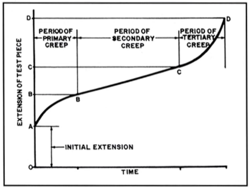

### Primary
- Initial, transient stage.
- Strain rate gradually decreases with time.
- Involved with strain hardening.
- Primary creep regime was first described by Andrade (1910) and he suggested the following phenomenological equation: $$\begin{equation}
l = l_{0}(1 + \beta t^{1/3})\exp(kt)
\end{equation}$$
Where $l$ is the elongated length of sample at time, $t$; $l_{0}$ is the initial length of the sample, and $\beta$ and $k$ are material constants.
- Andrade's Law for Primary Creep [^AndradesLawForPrimaryCreep]: $$\begin{equation}
\epsilon \approx \epsilon_{0} + \beta t^{1/3} + kt
\end{equation}$$

[^AndradesLawForPrimaryCreep]: Unfortunately, is only empirical and includes no physical effects.

### Secondary
- Steady-state stage.
- Strain-rate is minimum and constant.
- Strain-hardening and softening (recovery) rates are balanced.
- Generally, the secondary creep shows the following power-law relation: $$\begin{equation}
\dot{\epsilon} = A\sigma^{n}
\end{equation}$$
where $n$ is the stress exponent; $\sigma$ is the applied stress; and $A$ is a temperature dependent material constant.
- Typically, $n_{\text{metals}} \in [3, 5]$.

### Tertiary
- Strain-rate increases.
- Characterized by failure and rupture.
- Damage mechanism induced failure.
- Void growth and coalescence into local strain.
- The cross-sectional area of the specimen is rapidly reduced.
- Transient behavior.

## Temperature and Stress Effects
| 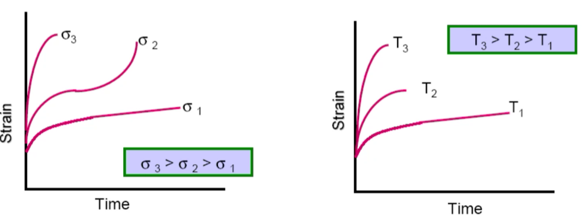 |
|:--:|
| As stress and temperature increases, creep-rate increases. |

Stress and temperature dependence of steady-state creep: $\dot{\epsilon} = A\sigma^{n}\exp\Bigg( \frac{-Q}{RT} \Bigg)$ where $Q$ is the activation enthalpy.

!!! note Activation Energy versus Enthalpy
    Dr. Cho prefers the term "enthalpy" because this includes the barrier stress component; whereas, entropy does not.

## Important Creep Mechanisms
- Dislocation creep
- Diffusion creep
- Grain boundary slider and super-plasticity

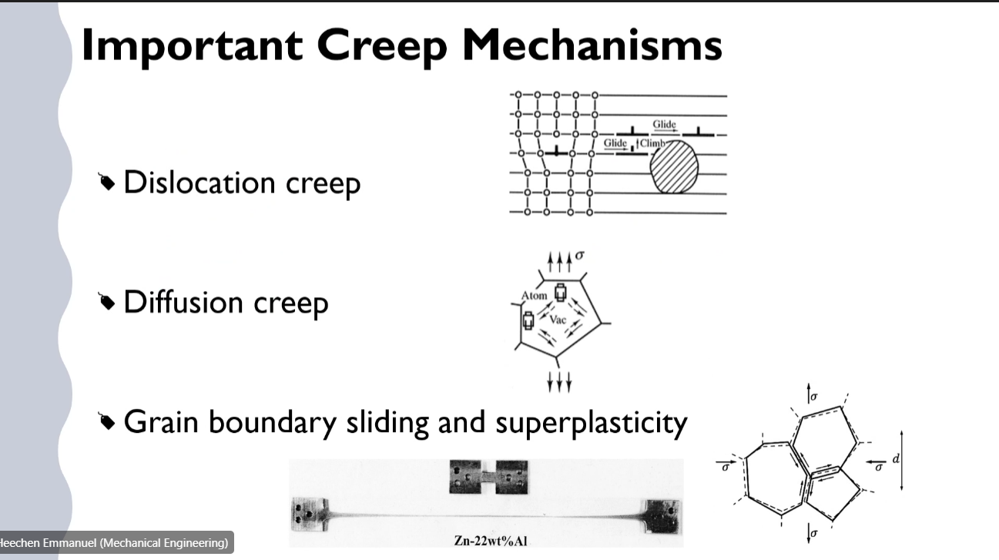

## Agents of Plastic Deformation
Plastic deformation of crystals is carried by lattice defects:
- The migration of _vacancies_ is responsible for deformation by transport of matter.
- The propagation of _dislocation_ is responsible for deformation by slip.
- In polycrystals, _grain boundary_ motion may also be a source of deformation.

Deformation 'carriers': vacancies, dislocations, and grain boundaries.
- Vacancies (point defects) can migrate by exchanging atoms with neighboring sites. Given stress state, vacancy concentration gradient is generated, and vacancies move following the gradient. This is the main cause of diffusion creep.
- Dislocations (line defects) can move under stress 'dislocating' atomic lattice. A main cause of dislocation creep.
- In certain conditions, grains' shear strength can be relaxed by sliding along grain boundaries, which leads to straining with little deformation within the grains. An intergranular deformation.

## Vacancies and Diffusion
### Vacancies
Free energy change due to vacancy formation, $\Delta G$.
- Volume of formation of a vacancy (different from the volume of an atom because local bonding interaction): $\Delta V_{f}$.
- Energy of formation of a vacancy (due to bond breaking): $\Delta E_{f}$.
- Entropy of formation (corresponds to changes in the vibration atomic frequencies in the vicinity of the vacancy): $\Delta S_{f}$.
- Enthalpy and Gibbs free energy: $$\begin{split}
\Delta H_{f} &= \Delta E_{f} + P\Delta V_{f} \\
\Delta G_{f} &= \Delta H_{f} - T\Delta S_{f}
\end{split}$$
- If $n_{v}$ vacancies are formed, the change in free energy of the crystal is: $\Delta G = n_{v}\Delta G_{f}$.

**Equilibrium vacancy concentration**
Considering possible ways of vacancy distributions, we get the following free energy change due to vacancy formation: $$\begin{equation}
\Delta G = n_{v}\Delta G_{f} - kTn_{v}\Bigg( 1 + \ln\bigg( \frac{n}{n_{v}} \bigg) \Bigg)
\end{equation}$$
At equilibrium state (equilibrium vacancy concentration), $n_{v}$ is related to a minimum in free energy, so $\partial \Delta G_{f}/\partial n_{v} = 0$.
Consequently, the equilibrium vacancy concentration is written: $$\begin{equation}
N_{v} = \frac{n_{v}}{n} = \exp\Bigg( -\frac{\Delta G_{f}}{kT} \Bigg)
\end{equation}$$

### Diffusion
Diffusion of vacancies by exchange with atoms is a random-walk process described by Einstein's relation: $$\begin{equation}
<R^{2}> = \Gamma t(\delta l)^{2}
\end{equation}$$
Diffusion coefficient of vacancies: $$\begin{equation}
D_{v} = \frac{<R^{2}>}{6t} = \frac{\Gamma}{6}(\delta l)^{2}
\end{equation}$$
Atomic jump is a thermally activated process, and it is proportional to the probability that an atom succeeds in overcoming the potential barrier.
In general, the vacancy diffusion is written: $$\begin{equation}
D_{v} = (D_{v})_{0}\exp\Bigg( -\frac{\Delta H_{m}}{kT} \Bigg)
\end{equation}$$
where $\Delta H_{m}$...

Self-diffusion coefficient is not equal to the diffusion coefficient of the vacancies, since vacancies has higher probability of migration to neighboring atomic sites than atom itself.
Generally, self-diffusion coefficient is equal to: $$\begin{equation}
\begin{split}
D_{sd} &= D_{v}N_{v} \\
D_{sd} &= D_{0}\exp\Bigg( -\frac{\Delta E_{sd} + P\Delta V_{sd}}{kt} \Bigg)
\end{split}
\end{equation}$$

<!-- 20230221T13:21 -->

### Fick's Laws
Vacancy diffusion obeys the two laws (equivalent to Fourier's laws in the case of heat conduction), namely Fick's Laws:
$$\begin{equation}
\begin{align*}
\text{First}:& J &= -D_{v}\nabla c \\
\text{Second}:& \frac{dc}{dt} &= D_{v}\nabla^{2}c
\end{align*}
\end{equation}$$
where $c$ is vacancy concentration: $c = N_{v}/\Omega$, the number of vacancies per atomic volume.
$J$ is the flux of vacancies (number per second flowing through unit area) flowing down the concentration gradient, which represents the driving force for diffusion.

### Diffusion Creep
Applied stress at the surface is putting energy into the body (because of the stress power term relating stress-strain energy which is work) affords vacancy diffusion.
Under constant stress--i.e. constant input of work--vacancies will diffuse to minimize their local energies.

### Short-Circuit Diffusion Paths
Vacancies are point defects, so they may migrate along the highly imperfect cores of linear or two-dimensional crystalline defects (dislocations and grain boundaries) more rapidly than in the lattice of the crystal.

Pipe Diffusion
: Self-diffusion coefficient in dislocations are orders of magnitude larger than in the lattice.
E.g., pipe-diffusion coefficient of oxygen is five orders of magnitude larger than bulk (Yund et al. 1981).

\equa...

Grain-Buondary Diffusion
: Diffusivity along grain boundaries is considerably...

## Dislocations and Slip
A dislocation loop as the line that bounds a closed area over which slip has taken place.
As the loop expands under stress, the slipped area increases and so does the shear strain.

Edge Dislocation
: Dislocation segment is perpendicular to the Burger's vector (slip direction).

Screw Dislocation
: Dislocation segment is parallel to the Burger's vector (slip direction).

A dislocation is a linear defect, it distorts the atomic planes in the crystal; thereby, introducing internal strain (internal strain)...

A stress field exerts a force on a dislocation, normal to the line, causing a loop to expand (thus producing strain) if the force has a component in the glide (slip) plane.
As a simple case, when shear stress is parallel to the Burger's vector of a straight edge dislocation, the force on the dislocation is parallel to the Burger's vector and the magnitude of force vector can be related to the work done by the shear stress during slip over a distance $b$.

| 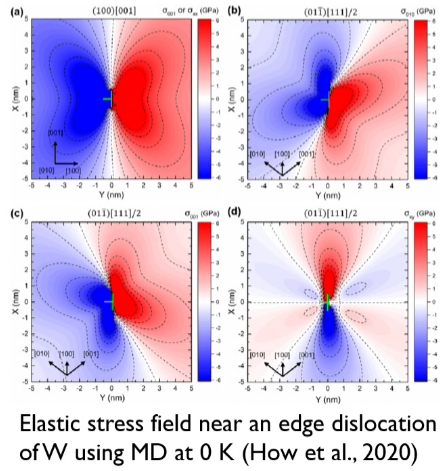 |
|:--:|
| Elastic stress field near an edge dislocation of W using MD at 0K (How et al., 2020). |

When a dislocation segment is pinned at its extremities, it bows out under stress if the segment length is longer than a critical length.
The critical length:
$$\begin{equation}
l_{c} = \frac{2\mu b}{K\sigma}
\end{equation}$$
The dislocation can go through the semi-circular, unstable configuration and be emitted by expanding the loops.
The segment starts with initial position to bow out again and so forth.
This is called _Frank-Read sources_ of dislocations which is the principal process of dislocation generation and renewal during plastic deformation within crystals.

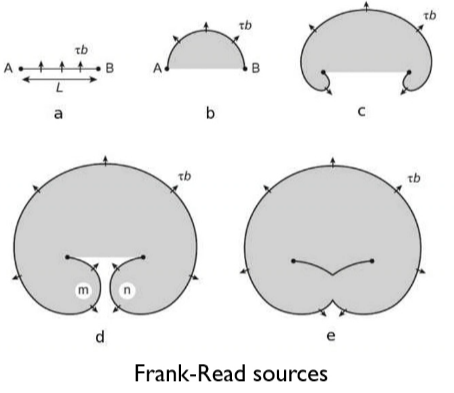

!!! question How does a dislocation get pinned? <cite> Cameron
    Dislocations are an empty defect.
    To propagate to the next lattice position, the atom lattice must exist to diffuse into.
    Therefore, if there is a break in the lattice--e.g. impurities or immobile dislocations--can pin dislocations.

Dislocation moving through the crystal interact elastically forming:
1. *dislocation walls*
2. stable *junctions*, and
3. jogs (kinks)

Dislocation Walls
: If the dislocations attract but lies in parallel glide planes, then they tend to form walls.

Junctions
: If the dislocations cross, they react to form a stable junction.
The sum of all three Burger's vectors equals zero.

Jogs (Kinks)
: If the dislocations repel but are forced together by the applied stress, they can cross, each leaving on the other a jog equal in length and direction to its own Burger's vector.
Kinks are #glissile and occur in-plane; conversely, jogs are #sessile and out-of-plane.
Kinks need to climb.

Jogs
: Steps of a dislocation line that are not in the glide plane of a crystal structure.
Because jogs are out of the glide plane, under shear they cannot move by glide (movement along the glide plane).
They instead must rely on vacancy diffusion facilitated climb to move through the lattice.
Since vacancy diffusion is a slow process, jogs act as immobile barriers at room temperature for most metals.
The presence of jogs in a material increaes its yield strength by preventing easy glide of dislocations.
A pair of immobile jogs in a dislocation will as a Frank-Read source under shear.

Kinks
: Steps in a dislocation line parallel to glide planes.
Unlike jogs, they facilitate glide.
the laterial spreading of a king allows for forward propagation of the dislocation, reducing the overall energy barrier to slip.

| 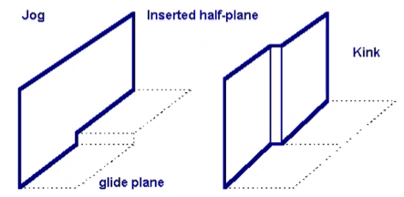 |
|:--:|
| Dislocation interactions lead to tangling of dislocation, impeding glide of others which cause strain hardening. |

Sessile
: Immobile dislocations work as obstacles: Frank partial dislocations and Lomer-Cottrell locks.

Frank partial dislocation
: Formed by inserting or partly removing slip plane (closed-pack layer of atoms) (e.g. {111} for FCC).
This is a sessile dislocation because Burger's vector becomes non-slip plane (for FCC [111], which is normal to slip plane).

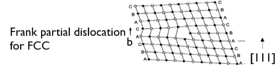

Lomer-Cottrell Locks
: Two partial dislocations (Shockley) interact and create non-slip plane Burger's vector.
This creates a sessile dislocation junction ("stair-rod dislocation").

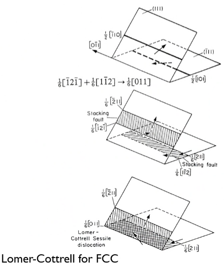

### Dislocation Cores and Peierls Stress
Dislocation core is the region close to the dislocation line, where bonds are broken.
For the dislocation to move, it must overcome an energy hill to move into the beighboring potential trough.
Stress (lattice friction stress) necessary to move the dislocation over the hills, _Peierls stress_, can be calculated in the framework of a dislocation model in a periodic lattice:
$$\begin{equation}
\sigma_{p} = \frac{2\mu}{K}\exp\Bigg( -\frac{4\pi \zeta}{b} \Bigg)
\end{equation}$$
where $\zeta$ is the width of dislocation core (an imaginary cylinder).
In the close-packed plane, the planar spacing is large, thus the width of the core is large.
So, the stress is lower, meaning lower lattice friction or easy glide.

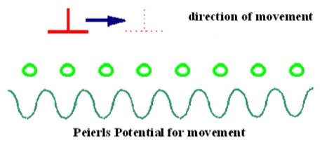

!!! quote <cite> Cho
    This Peierls stress is lower in the close-packed plane, so motion in that direction is much easier.
    Technically, this stress is defined at $0~K$: i.e. no thermal effects.
    However, the principal still applies at higher temperatures: e.g. room temperature.

### Dislocation Disassociation (Splitting)
A perfect dislocation may disassociate into two partial dislocations to lower the energy.
Motion of a dislocation whose Burger's vector is not a lattice vector leaves behind an imperfect crystal containing a stacking fault.
The stacking fault plane boundary is a partial dislocation.
Two important partial dislocations occur in FCC are *Shockley* and *Frank* partials.

To illustrate the dislocation splitting, we use FCC as an example.
The atomic planes are stacking in ABCABC...
The perfect dislocation's Burger's vector is $b_{1}$ (1/2<110>).
However, this motion requires large energy.
Rather it takes a path with vector $b_{2}$ (1/6<112>) and next $b_{3}$ (1/6<112>), which is a lower energy path.
But this path forms a stacking fault at position C.
Dislocation glides as two partials.

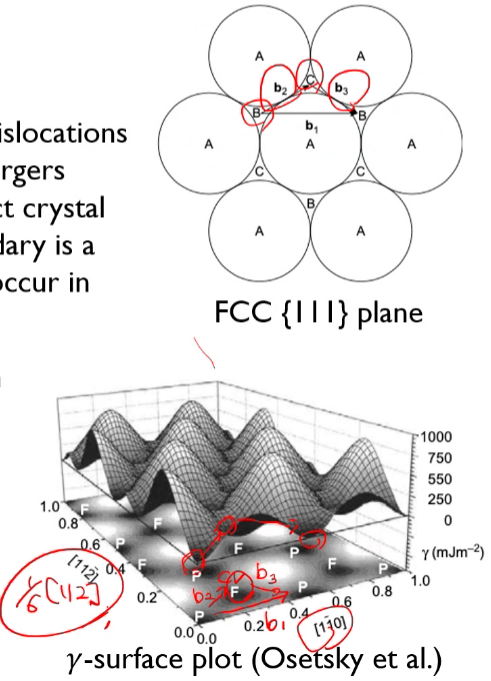

### Cross-Slip of Screw Dislocations
Cross-slip can only occur in screw dislocations and can play an important role in overcoming obstacles.
Since screw dislocation's Burger's vector and dislocation line are parallel, it has an infinite number of possible slip planes unlike edge and mixed dislocations.
Screw dislocations can glide along any plane that contains Burger's vector.
Cross-slip allows screw dislocations to bypass obstacles.
This is a conservative (without requiring atomic diffusion) unlike edge dislocations which must climb to move around obstacles.
Cross-slip:
- Cannot occur in edge dislocations.
- Promotes dislocation annihilations and rearrangement (dynamic recovery).

| 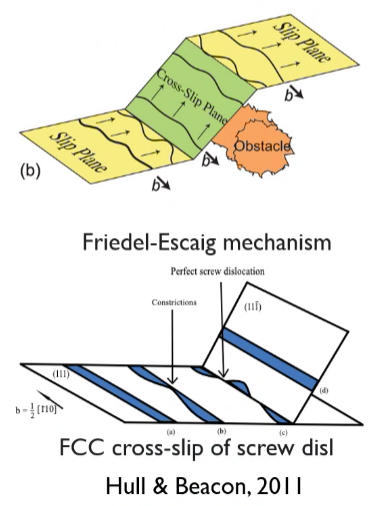 |
|:--:|
| FCC cross-slip of screw dislocation (Hull & Beacon, 2011). |

### Climb of Edge Dislocations
An edge dislocation can move in the plane normal to its glide plane (climb) assisted by a slow vacancy diffusion.
Climb occurs progressively by migration of jogs on the dislocation line through emission or absorption of vacancies.
Dislocation line climbs with a velocity:
$$\begin{equation}
v_{c} \approx \frac{2\pi}{\lambda}D_{sd}\frac{\sigma\Omega}{kT}
\end{equation}$$
where $\lambda$ is the distance from dislocation where concentration of vacancy in bulk is determined; $D_{sd}$ is the self-diffusion coefficient; $\sigma$ is the applied stress on sample; and $\Omega$ is the atomic volume.

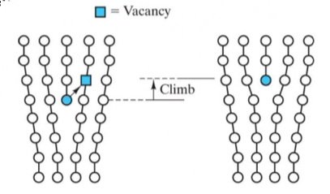

!!! quote <cite> Cho
    Climb is faster at higher temperatures.
    In part, the diffusion coefficient will be lower at lower temperatures so glide will be faster.
    Plasticity and creep are often differentiated on which mechanism is dominant: plasticity is driven by climb and creep is glide.

    <!-- Come back to this slide (20230223T13:43) -->

### Orowan's Equation
Orowan's equation relates the strain rate cause dby clide or climb of dislocation so t the density, strength and velcoity of the mobile dislocation.s
It is a microscopic, constitutive equation which lieas at the bassis of equations for various deformation mechansims.
$$\begin{equation}
\dot{\epsilon} = \rho b v
\end{equation}$$
Orowan's is only applicable to steady-state (quasi-steady-state) deformation.
For transient behavior, such as early stage of strain, it cannot be applied due to sudden change in dislocation density.
Orowan's equation is valid whetehter dislocation move glide or climb.

!!! question This strain rate is not the global strain rate applied to the body but the average local strain rate of the grain, right? <cite> JMA3
    Yes.

!!! question Which dislocation density is this? <cite> DK
    Two definitions exist: whether number density or length.
    Either applies.

## Grain Boundaries
A grain boundary is a two-dimensional lattice defect that introduces a misorientation in the lattice with nor long-range stress field.
- High-angle grain boundary (>15) is a clear grain boundary.
- Low-angle grain boundary is seen as a defect in a single crystal.

A grain boundary is characterized by three parameters describing the relative orientation of the lattices on each side of it (as the result of a rotation about an axis).

### Grain Boundary Dislocations
The lattice misorientation can be expressed as the misorientation introduced by a planar array of dislocation.s
Indeed, low-angle grain boundaries (or sub-grain boundaries) are dislocation walls.

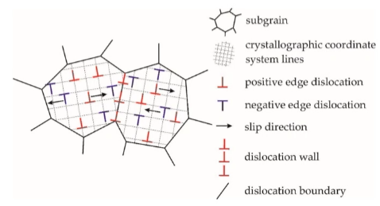

Tilt Boundary
: Rotatoin axis is parallel to the boundary plane.
The nergy associated with the elastic bending of the lattice can be reduced by inserting a dislocation (half plane).
In this way, dislocations are inserted to accommodate straining and this leads to dislocation wall which is a low-angle grain boundary.
...

When dislocation in the boundary remain isloated...

energy of grain boundary...

grain boundary motion...

<!-- 20230228T13:05 -->

## Dislocation Creep
Broken down into 2 categories:
1. Glide-controlled creep: The obstacles to dislocation motion, similar size of dislocation core, are overcome by thermal agitation helped by applied stress.
2. Recovery-controlled creep (diffusion-controlled recovery process):
   1. The obstacles are too large to be overcome by thermal agitation, but they may disappear by diffusion-controlled recovery.
   2. Dislocation motion (climb) is not directly thermally activated.
   3. It is controlled by a thermally activated process.

### Generalities
In general, the purpose of dislocation creep modeling is to express the average dislocation velocity in Orowan's equation ($\dot{\epsilon} = \rho bv$) in terms of temperature and stress dependent processes.
Two different cases may be considered:
1. The obstacles to dislocation motion have dimensions on the scale of the dislocation core (i.e. a few interatomic distances) they can be overcome by thermal agitation helped by an effective stress:
   1. Dislocation motion is thermally-activated and the activation enthalpy is stress-dependent.
   2. Dislocations glide rapidly after overcoming obstacles.
   3. When the controlled and strain-producing process is gliding itself, and the obstacle is being Peierls-Hill, is *glide-controlled creep*.
   4. This situation arises at relatively low-intermediate temperatures.
2. The obstacles to dislocation motion are too wide to be overcome by thermal agitation; however, they may disappear through the operation of a thermally activated process:
   1. When obstacles are created by other dislocations (fluctuating, internal stress field or localized tangles or barriers formed by mutually locked-up dislocations).
   2. These obstacles can dissolve away by climb-controlled mutual _annihilation_ of the edge dislocations.
   3. Climb is controlled by diffusion which is thermally activated.
   4. Obstacles disappear and release dislocations.
   5. This process is not directly dependent on dislocation motion itself but migration of diffusing vacancies.
   6. Activation enthalpy is not dependent on applied stress.
   7. This is considered *recovery-controlled creep*.

### Thermally-Activated Dislocation Motion
Localized obstacles:
- Cross-slip of screw dislocations can play an important role in overcoming obstacles.
- Since screw dislocation's Burger's vector and dislocation line are parallel, it has an infinite number of possible slip planes unlike edge and mixed dislocations.
- Screw dislocation can glide along any plane that contains Burger's vector.
- Cross-slip allows screw dislocations to bypass obstacles.
- This is a conservative (without requiring atomic diffusion) unlike edge dislocations which must climb to move around obstacles.
- Cross-slip

### Low-Temperature Creep
Dominated by glide-controlled (Peierl's) creep.
- Dislocation glide is controlled by the thermally activated overcoming of the Peierls Hills.
- The macroscopic elastic limit corresponds to the temperature-independent stress at which straight and sessile screw dislocations begin to move (Escaig, 1967).
- The activation energy is function of applied stress.
- At low applied stresses, the creep rate follows a power law with a stress exponent ($n$), while it follows an exponential dependence on the stress at the high applied stress (Weertman, 1957).
- At low temperatures, diffusion is slow, so the diffusion effect on flow is negligible.
- Deformation is controlled by dislocation glide: $$\begin{equation}
\dot{\epsilon} = A\sigma^{2.5}\exp\Bigg( -\frac{Q(\sigma)}{kT} \Bigg)
\end{equation}$$

!!! note
    The exponent on $\sigma$ does not need to $2.5$.
    Some people put other values: e.g. $2$.

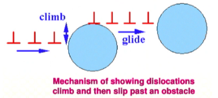

#### Power-Law Breakdown
At the high applied stress, the activation energy for glide-controlled dislocation creep is stress dependent.
The resultant stress exponent, $n$, becomes large.
When plotting $\log(\sigma) - \log(\dot{\epsilon})$ curve, the curve becomes exponential from linear.
This is oftentimes shown at low temperatures and high stresses.

!!! attention On the exam...
    The transition from Orowan creep to low-temperature creep is the power-law breakdown when the log-log plot is no longer linear.

| 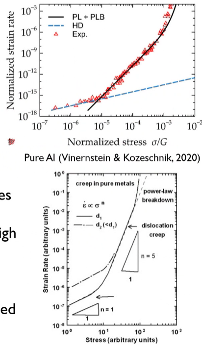 |
|:--:|
| The deformation mechanism is mainly through dislocation glide overcoming Peierls barriers by applied stress. |

## High-Temperature Creep
### Bailey-Orowan equation
- Regarding steady-state creep, a constitutive equation determining strain-rate-stress relation is used as power-law creep equation ($\dot{\epsilon} \propto \sigma^{n}$).
- Power-law creep is indirectly controlled by diffusion (recovery through mostly dislocation climb process; it is also called "static/thermal recovery").
- At high temperatures, obstacles can be easily overcome by thermally-activated dislocations because thermal agitation provides ability to overcome the activation barrier for gliding.
- At high temperatures, _only obstacles that remain to dislocation motion are the long-period, smooth undulations of the internal stress field and these have to be overcome by the applied stress alone_.
- Therefore, the activation enthalpy of the plastic flow rate can be written with the internal stress increment ($\Delta \sigma$): $$\begin{equation}
\dot{\epsilon} = \dot{\epsilon_{0}}\exp\Bigg( -\frac{\Delta \sigma b \Delta A}{kT} \Bigg)
\end{equation}$$
where $\Delta A$ is the activation area.

It is well known that the crystals harden when strained and soften when annealed at high temperatures.
Therefore, the internal stress change can be expressed by strain hardening ($h\epsilon$) minus softening (recovery) ($rt$).
$$\begin{equation}
\dot{\epsilon} = \dot{\epsilon_{0}}\exp\Bigg( -\frac{(h\epsilon - rt)b\Delta A}{kT} \Bigg)
\end{equation}$$
where $h$ is the strain-hardening coefficient; $r$ is the recovery coefficient; and $t$ is time.
This type of model is also called the "Unified Creep-Plasticity".
When the equation is integrated from $t = 0$ to $t$, we find the following (McLean, 1966):
$$\begin{equation}
\epsilon = \frac{kT}{\Delta Abh}\ln\Bigg( \frac{\dot{\epsilon_{0}}h}{r} \Bigg) + \frac{r}{h}t
\end{equation}$$
The first term represents the transient creep behavior.
The second term is for steady-state creep (power-law creep).

The steady-state part can be re-written: $$\begin{equation}
\dot{\epsilon_{s}} = \frac{r}{h}
\end{equation}$$
This equation is known as the Bailey-Orowan equation.
Note this equation works for steady-state creep.
In the recovery-controlled creep, the recovery coefficient ($r$) has a power-law stress dependence.
Recovery is done by annihilations or rearrangement of dislocations so it reduces dislocation density within the crystals.

<!-- 20230302T12:50 -->

### Bailey-Orowan vs. Orowan's Equation
Orowan's equation ($\dot{\epsilon} = \rho bv$) can also be obtained by using Bailey-Orowan's equation (at steady-state creep).
Internal stress increase with dislocation density (creating dislocation networks: forest dislocations).
$$\begin{split}
h &= \frac{d\sigma}{d\epsilon} = \frac{d\sigma}{d\rho}\frac{d\rho}{d\epsilon} \\
r &= \frac{d\sigma}{dt} = \frac{d\sigma}{d\rho}\frac{d\rho}{dt}
\end{split}$$
where $h = \frac{d\sigma}{d\rho}\frac{1}{b\Delta L}$ with $\Delta L$ being the average distance travelled in slip or climb of dislocations since $\epsilon = \rho b\Delta...$.
$d\rho/dt$ is rate of annihilation of dislocations.
Using a first-order dislocation annihilation kinetics:
$$\begin{equation}
\frac{d\rho}{dt} = \frac{\rho}{\tau} = \rho\frac{v_{c}}{d}
\end{equation}$$
where $\tau$ is the lifetime of dislocation; $v_{c}$ is the dislocation climb velocity ($\approx \frac{2\pi}{\lambda}D_{sd}\frac{\sigma\Omega}{kT}$); and $d$ is the height of obstacle.
This reduces $r = \frac{d\sigma}{d\rho}\rho\frac{v_{c}}{d}$ which yields $\dot{\epsilon} = \frac{r}{h} = \rho b\frac{\Delta L}{d}v_{c}$ which is equivalent to Orowan's equation.

In general, the stress-dependence of climb-controlled recovery creep is a power law with stress exponent, $n = 3$.
$$\dot{\epsilon} \propto D_{sd}\sigma^{3}$$
where $D_{sd}$ is the self-diffusion coefficient and $n$ can range up to 5 in some cases.

### Weertman's Model
Dislocations are produced from some sources in parallel slip planes (Weertman, 1968).
Gliding dislocations can be immobile when two dislocation on neighboring planes interact to make pair of dislocations (dipoles).
These locked part of dislocation annihilated by dislocation climb, then the dislocations can glide.
==Therefore, the flow rate is controlled by climb and hence by diffusion==: $$\begin{equation}
\dot{\epsilon} = \alpha\frac{D_{sd}}{b^{3.5}M^{0.5}}\Bigg( \frac{\sigma}{\mu} \Bigg)^{4.5}\frac{\mu\Omega}{kT}
\end{equation}$$
where $M$ is the number density of dislocation source times the number of dipoles per source and is assumed to be stress-independent, so $n = 4.5$; however, if $M$ is stress-dependent, then $n = 3$.

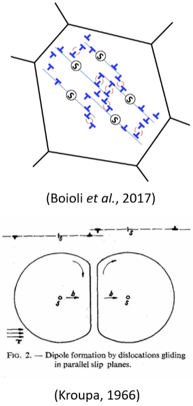

### Harper-Dorn Creep Model
Highly pure aluminum with large grain sizes showed steady-state creep increased linearly with the applied stress and the activation energy of creep was similar to one of self-diffusion at low stress and high temperatures (Harper & Dorn, 1957).
It is difficult to attribute it to Nabarro-Herring's diffusion creep (stress exponent is one) because the creep rate was much faster than the diffusion creep.
Also, some primary (transient) creep was observed which is not typical in diffusion creep.
The steady-state stress was independent of grain size as well, so they concluded that creep is involved with dislocation motion (climb) than diffusion creep.
$$\begin{equation}
\dot{\epsilon} = \rho_{0}\frac{D\mu b^{3}}{kT}\Bigg( \frac{\sigma}{\mu} \Bigg)^{1}
\end{equation}$$
where $\rho_{0}$ is dislocation density.

HD creep has been controversial because it is not well observed in most experiments.
Mohamed et al. (1982) showed HD creep is observed only when the initial dislocation density is very low.
When the dislocation density is high, then high stress exponent is observed.
Ginter et al. (2001) confirmed HD creep in #Al with 99.9995% purity (but not in #Al with 99.99% purity) at very low strain rate.
HD creep can be observed at a low-stress creep.
HD creep is grain-size independent.
In this creep, the dislocation density is being stress independent (insensitive) where dislocation density does not change with the stress.
Climb velocity is only one dependent on the stress (giving stress exponent of 1).

!!! note Dependence on Grain-Size
    At lower temperatures, grain-size is important (Hall-Petch relation); however, at elevated temperatures, dislocation creep is dominant and grain-size does not matter.

!!! question How does this relate to dynamic recrystallization? <cite> DK
    Recovery happens at lower temperatures than recrystallization, but both can happen at the same time at sufficient temperatures.