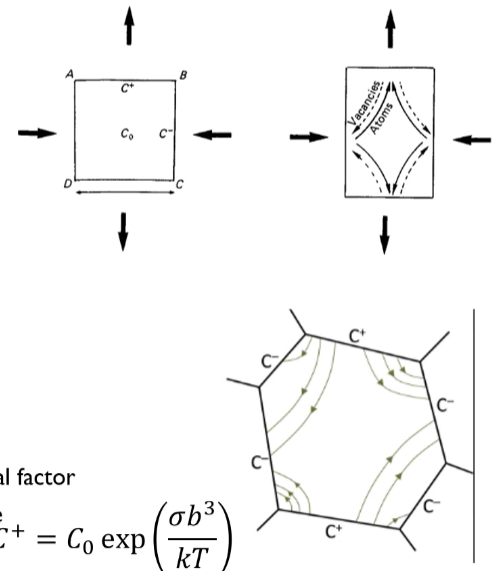

<!-- 20230302T13:37 -->
# Lecture 11: Diffusion Creep and Grain Boundary Sliding - High Temperature Deformation in Crystalline Materials
Intragranular creep by dislocation motion is not the only high temperature deformation mode of crystals.
Strain can be achieved by transport of matter by diffusion or by intergranular sliding along the grain boundaries.
Deformation by slip may not be uniform, and the plastic incompatibility is usually relieved by geometrically necessary dislocations which can rearrange into polygonization walls.
Diffusion creep creates voids or overlaps that must be accommodated by Grain Boundary Sliding (GBS).
Also, GBS creates voids or overlaps and these must be accommodated by diffusion creep.
Both mechanisms are, therefore, strongly coupled and mutually accommodating.

## Diffusion Creep
Non-hydrostatic stress field gives rise to different vacancy concentration on surfaces of a crystal with different orientations.
This causes a flux of vacancies between surface and a flux of atoms in the opposite direction.
The matter is transported, so the applied stress do work on the sample.
Diffusion creep would be important if the flux of vacancies is large (if there are enough grain boundaries, and if the vacancy mobility is high).
As a result, the diffusion creep would be significant at very high temperatures and for materials with very small grain sizes.

### Lattice diffusion creep

By tensile stress, vacancies are created on AB face.
Crystal is not in global equilibrium of vacancy concentration, so vacancies will flow following its concentration gradient.
The flux of vacancies is given by Fick's equation:
$$\begin{equation}
J = -D_{v}\nabla c \approx \alpha D_{v}\frac{C^{+} - C^{-}}{d}
\end{equation}$$
where $\alpha$ is a geometric factor and $d$ is the crystal size.
$$\begin{split}
C^{+} &= C_{0}\exp\Bigg( \frac{\sigma b^{3}}{kT} \Bigg) \\
C^{-} &= C_{0}\exp\Bigg( -\frac{\sigma b^{3}}{kT} \Bigg)
\end{split}$$
The number of vacancies transported through a face area $d^{2}$ per second: $\phi = Jd^{2}$.

A flow of atom is in opposite direction.
With diffusion, a layer thickness $\phi b^{3}/d^{2}$ will be added per second, and the sample will be elongated with a strain rate: $$\dot{\epsilon} = \frac{1}{d}\frac{\phi b^{3}}{d^{2}} = \phi\Bigg( \frac{b}{d} \Bigg)^{3}$$
Combining with the flux equation and vacancy concentration equation, we find: $$\begin{equation}
\dot{\epsilon} = \alpha\frac{D_{v}C_{0}b^{3}}{d^{2}}\sinh\Bigg( \frac{\sigma b^{3}}{kT} \Bigg)
\end{equation}$$
For small stresses, $\sigma b^{3} << kT$.
So we write: $$\begin{equation}
\dot{\epsilon} = \alpha\frac{D_{v}C_{0}b^{3}}{d^{2}}\frac{\sigma b^{3}}{kT} = \alpha\frac{D_{sd}\sigma\Omega}{d^{2}kT}
\end{equation}$$
where $\Omega$ is the atomic volume.

Herring (1950, 1951) rigorously formalized this "lattice diffusion" creep problem, so this creep is named "Nabarro-Herring creep".
Stress-strain rate relationship is linear (Newtonian viscosity).
Grain size is important in the diffusion creep.

### Grain boundary diffusion creep
this is faster than lattice diffusion