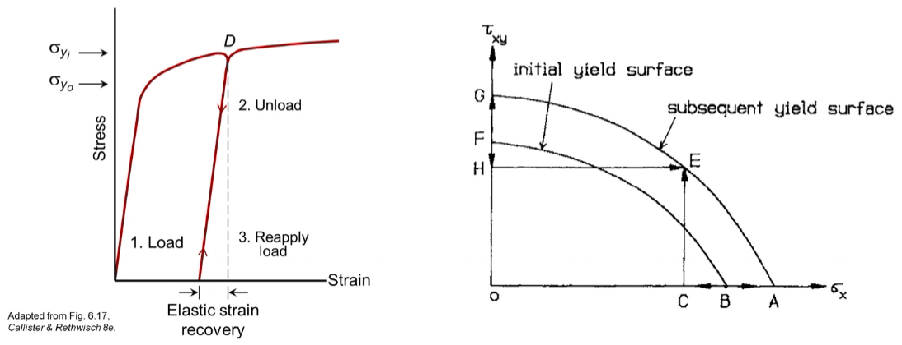
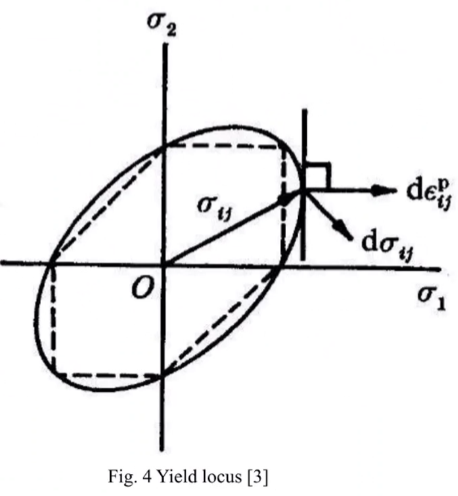
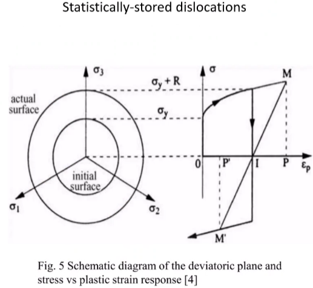
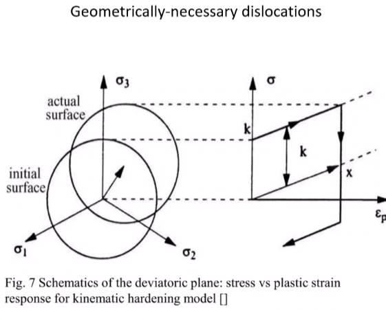

<!-- 20230307T12:48 -->
# Lecture 15: Introduction to Plasticity
## Generality and Plasticity Modeling
- Yield point: distinguish elastic and plastic deformation.
- Elastic region: stress-strain relationship is linear.
- Plastic region: stress-strain relationship is non-linear and complicated.

Main goal of continuum plasticity models: to obtain stress-strain and load-deflection relationships.
The stress-strain response depends on temperature...

## History Dependence of Plastic Deformation
|  |
|:--:|
| In the plastic region, it can be seen that some quantity increases: e.g. dislocation density. In (un)loading cycles, some strain-hardening locally processes the material to have different properties with each new cycle. |

## Yield Criterion
In uniaxial loading, plastic flow begins when $\sigma = \sigma_{y}$, the tensile yield stress.
Pure hydrostatic pressure or mean stress tensor, $\underset{\sim}{p}$ doesn't cause yielding in metals.
Only the deviatory stress, $\underset{\sim}{S}$ which represents the shear stresses, causes plastic flow.
Yielding surface separate the elastic and plastic domains.
Yield criterion: determine the onset of the plastic deformation.
Yield criterion must be some function of the invariants ($J$ and $J'$ represents the invariant of stress tensor, $\underset{\sim}{\sigma}$ and deviatoric stress, $\underset{\sim}{S}$)...

### von Mises
Yielding would occur when the second invariant, $J'_{2}$ of the deviatoric stress tensor, $\underset{\sim}{S}$ reaches a critical value, $k^{2}$.
...

### Tresca
Yielding would occur when the maximum shear stress ($\tau_{\text{max}}$) reaches the critical value, $k$ of the material.
...

### Yield Criteria in Plane Surface
...

### Yield Surface
...

## Normality/Convexity of Yield Surface
!!! quote <cite> Drucker (1951)
    The total plastic strain vector, must be normal to the yield surface.

Net work has to be expended during plastic deformation of body.
So the rate of energy dissipation is non-negative: $\sigma_{ij}d\epsilon_{ij}^{(p)} \geq 0$.
The $d\epsilon_{ij}^{(p)}$ is the incremental, plastic strain vector and must be normal to the yield surface, especially the plastic potential.
Because of the normality rule, the yield locus is always convex.
$$\begin{equation}
\dot{\epsilon}^{(p)} = \dot{\lambda}\frac{\partial F}{\partial \underset{\sim}{\sigma}}
\end{equation}$$

## Isotropic Hardening
The yield surface expands uniformly, but with a fixed shape and center.
Area inside yield surface represents elastic region.
The circumference of yield surface denotes elasto-plastic region.
The yield function ($F$) for isotropic hardening of pressure-insensitive materials represented as: $$\begin{equation}
F = f(J'_{2}, J'_{3}) - k(\epsilon_{e}^{(p)}) = 0
\end{equation}$$
Where $J'_{2}$ and $J'_{3}$ are the second and third invariants of the deviatory stress tensor, $\underset{\sim}{S}$, $k$ is a function of equivalent or effective plastic strain, $\epsilon_{e}^{(p)}$.

|  |
|:--:|
| The initial radius is the yield strength of the material. The change in radius has associated with it the isotropic hardening of the material. |

## Kinematic Hardening
The yield surface does not change its shape and size, but simply translates in the stress space in the direction of its normal.
It is used to represent the Bauschinger effect.
The initial yield surface is described by: $$\begin{equation}
F = F(\underset{\sim}{\sigma}) - k = 0
\end{equation}$$
After kinematic hardening, subsequent yield surface takes the form: $$\begin{equation}
f(\underset{\sim}{\sigma} - \underset{\sim}{\alpha}) - k = 0
\end{equation}$$
where $F$ is a yield function, $\underset{\sim}{\alpha}$ is a tensorial hardening parameter, generally called as back stress is center of the yield surface in the stress space, k represents size of the yield surface.

### Prager's Kinematic Hardening Model (1955)
...

### Ziegler's Kinematic Hardening Model

## Plasticity Theory
The plastic deformation is history or path-dependent process because of its dissipation feature.
According to the history dependent nature of the total $\epsilon^{(p)}$, it should....

Two general categories of plastic stress-strain relationships...

<!-- 20230309T12:49 -->

### Incremental Plasticity Theory
Saint-Venant

LEvy and von Mises
- Does not account for elastic strains

Prandtl and Reuss
- Includes elastic strains

