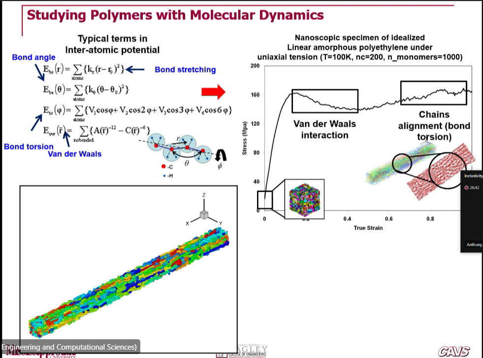

<!-- 20230425T12:50 -->
# Multiscale Modeling of Polymers
Dr. Mark F. Horstemeyer

Two base equations:
$$\begin{split}
\sigma &= E\epsilon(1 - \phi) \\
d\sigma/dt &= 
\end{split}$$

2. Materials Modeled by MSU ISV Plasticity-Damage

* We have done 70 metal alloys to incorporate damage ISV.
* Calibrate for lower and high temperatures and strain rates.

3. Macroscale
4. ISV man for Multiscale Modeling
5. Multiscale experiments
   1. You don't konw the equations at first.
   2. Do some exploratory experiments and construct equations.
   3. Validate these equations against other experiments.
6. Design Optimization (Multi-objective)
   1. We can run optimization with uncertainties
   2. Think of an Abrams tank running at 2 or 60 mph in Alaska or the desert.

8. GM Cadillac control arm
   1. This is the first example of applying this model to public sector products.
   2. Classic FEA principles showed that arm would fail at point A having the maximum von mises stress (which is deviatoric and includes no volumetric effects).
   3. Predictable design is not sufficient for engineering designs.
   4. Lighter weight components makes the car more efficient, overall.

Let's map from metals to polymers...
how does this model relate to polymers?

Length scale modeling are not mutually exclusive interatcions.

Initial stress-strain curves show the kinematics being measured from the material.
Broken down into so many regimes, there exist equations to map this behavior.

|  |
|:--:|
| The nergy calculations from the each type of contribution (bond length, torsion, total, van der Waals) give indication to where the 3 ISVs should describe. |

!!! question Are the same parameters the same from each test to another? <cite> DK
    A parameter is different form a constant.
    A parameter changes from material to materials.
    Constants stays constant for different conditions of the same material.

**form of...**
The determinant of the deformation gradient (the kinematics of the continuum body) creates a volumetric term which accounts for Conservation of Mass.
The implementation of this model accounts for Conservation of Mass, even if a void nucleates and grows.

**a multipohase iISV model with rate equations ofr preidcitin elastthermoviscoplasticiyt and damage of finer-reinforced polymer componsites.**
$\pi$ acts like HDI stress.
This is the first paper to include rate forms of ISV for composites.

!!! question What is the next stage? <cite> Dr. Cho
    Applying it and showing validation in design optimization with uncertainties.
