# ENGR 743: Damage and Fracture
**Instructor: Dr. Mark Horstemeyer**

_Semester: Spring '21_

- [ENGR 743: Damage and Fracture](#engr-743-damage-and-fracture)
	- [[[lesson-1-multiscale-introduction.md]]](#lesson-1-multiscale-introductionmd)
		- [Introductions](#introductions)
		- [Prerequisites](#prerequisites)
		- [Textbooks](#textbooks)
		- [Group Activities](#group-activities)
		- [Goals and Objectives](#goals-and-objectives)
		- [What is Failure?](#what-is-failure)
		- [What is Analysis?](#what-is-analysis)
		- [How Do Materials Break?](#how-do-materials-break)
		- [Engineering Materials](#engineering-materials)
		- [Ideal vs. Real Materials](#ideal-vs-real-materials)
		- [What is Failure Prevention?](#what-is-failure-prevention)
		- [How Do We Make Our Design Come Alive?](#how-do-we-make-our-design-come-alive)
		- [Selection of Materials](#selection-of-materials)
		- [Case Study: Tin Can](#case-study-tin-can)
			- [Summary](#summary)
			- [Expectations](#expectations)
	- [[[lesson-2-multiscale-aspects-of-materials.md]]](#lesson-2-multiscale-aspects-of-materialsmd)
		- [What can cause material failure in product?](#what-can-cause-material-failure-in-product)
		- [Microstructure and Property Relation](#microstructure-and-property-relation)
		- [Structure](#structure)
		- [Scale of Things](#scale-of-things)
		- [Atomic Scale](#atomic-scale)
		- [Primary Structure](#primary-structure)
		- [Project](#project)
	- [[[lesson-3-microscopy.md]]](#lesson-3-microscopymd)
	- [[[lesson-4-mechanics-of-materials.md]]](#lesson-4-mechanics-of-materialsmd)
	- [Lesson 5: Material Failure Analysis Process](#lesson-5-material-failure-analysis-process)
		- [12 Steps](#12-steps)
		- [Case Study: World Trade Center "Twin Towers"](#case-study-world-trade-center-twin-towers)
			- [Analysis](#analysis)
			- [Eye Witness Account: a guy went down, against the flow of everyone else going up to a "proverbial helicopter".](#eye-witness-account-a-guy-went-down-against-the-flow-of-everyone-else-going-up-to-a-proverbial-helicopter)
			- [NTSB: Uses the 12 Step Method outlined here to perform their analysis.](#ntsb-uses-the-12-step-method-outlined-here-to-perform-their-analysis)
		- [Failure Analysis of Mountaineering Rope](#failure-analysis-of-mountaineering-rope)
		- [Dynamic Mountaineering Ropes](#dynamic-mountaineering-ropes)
		- [Background](#background)
		- [Mechanics of the Loading](#mechanics-of-the-loading)
		- [Steps](#steps)
	- [### What properties are examined?](#-what-properties-are-examined)
	- [- If a fork is applied at either end of a mass of spaghetti strands, the noodles align to the direction of force applied.](#--if-a-fork-is-applied-at-either-end-of-a-mass-of-spaghetti-strands-the-noodles-align-to-the-direction-of-force-applied)
		- [Which property is important?](#which-property-is-important)
		- [What gage rope?](#what-gage-rope)
		- [How many falls?](#how-many-falls)
	- [QUIZ 1](#quiz-1)
	- [Adam and Julian Comments](#adam-and-julian-comments)
	- [[[lesson-10-columbia-space-shuttle.md]]](#lesson-10-columbia-space-shuttlemd)
	- [[[lesson-11-ductile-fracture.md]]](#lesson-11-ductile-fracturemd)
		- [Why is a temperature increase showing failure strain in opposite directions for ductile metals?](#why-is-a-temperature-increase-showing-failure-strain-in-opposite-directions-for-ductile-metals)
	- [Adriel and Micah Comments](#adriel-and-micah-comments)
	- [[[lesson-12-truck-steering-shaft.md]]](#lesson-12-truck-steering-shaftmd)
	- [- FEA may be difficult for mesh profiles.](#--fea-may-be-difficult-for-mesh-profiles)
		- [Failure Analysis of a Bidet](#failure-analysis-of-a-bidet)
	- [[[lesson-15-stress-concentration.md]]](#lesson-15-stress-concentrationmd)
	- [[[lesson-16-fracture-mechanics.md]]](#lesson-16-fracture-mechanicsmd)
		- [Stress Tensor](#stress-tensor)
	- [[[lesson-17-fracture-mechanics-applications.md]]](#lesson-17-fracture-mechanics-applicationsmd)
		- [Tangent](#tangent)
	- [- None include electro(magneto)-plasticity.](#--none-include-electromagneto-plasticity)
	- [[[lesson-18-fatigue.md]]](#lesson-18-fatiguemd)
	- [Integrity: the condition that exists when a structure is sound and unimpaired in providing the desired level of safety, performance, durability, and supportability.](#integrity-the-condition-that-exists-when-a-structure-is-sound-and-unimpaired-in-providing-the-desired-level-of-safety-performance-durability-and-supportability)
		- [Tangent: Post-Doc's Granddad](#tangent-post-docs-granddad)
	- [- The German who shot him down, saw him, and reported him.](#--the-german-who-shot-him-down-saw-him-and-reported-him)
	- [For the Quiz 2](#for-the-quiz-2)
	- [[[lesson-19-multi-stage-fatigue-msf.md]]](#lesson-19-multi-stage-fatigue-msfmd)
	- [[[lesson-20-fatigue-general-concepts.md]]](#lesson-20-fatigue-general-conceptsmd)
	- [[[lesson-21-more-fatigue.md]]](#lesson-21-more-fatiguemd)
	- [[[lesson-22-even-more-fatigue.md]]](#lesson-22-even-more-fatiguemd)
	- [Lesson 24: Failure of Engineering Materials](#lesson-24-failure-of-engineering-materials)
		- [Case Study: Failed C-130 Wheel Flange](#case-study-failed-c-130-wheel-flange)
	- [3. It is not the whole story.](#3-it-is-not-the-whole-story)
		- [Howitzer Gun:](#howitzer-gun)
	- [Comments for Final Projects](#comments-for-final-projects)
	- [Quiz 3 Recap](#quiz-3-recap)
	- [High-Rate Events](#high-rate-events)
	- [Atomistic Simulations](#atomistic-simulations)
		- [Polyethylene](#polyethylene)
		- [Car Crash](#car-crash)
		- [Genesis Flood](#genesis-flood)
		- [Ram's Horn](#rams-horn)
	- [Lesson 27: Failure of Engineering Materials - High Rate Phenomena](#lesson-27-failure-of-engineering-materials---high-rate-phenomena)
		- [Comments](#comments)
	- [Lesson 29: Corrosion Failures](#lesson-29-corrosion-failures)
	- [Lesson 29: High-Temperature Corrosion](#lesson-29-high-temperature-corrosion)
	- [Lesson 31: Elevated Temperature Failures: Creep](#lesson-31-elevated-temperature-failures-creep)
	- [Final Presentations](#final-presentations)
		- [Rod Specimen Notes](#rod-specimen-notes)
			- [Chronology](#chronology)
		- [Pliers](#pliers)
			- [Slides](#slides)
			- [Questions](#questions)
		- [Overall comments](#overall-comments)
			- [Comments](#comments-1)
	- [Final Exam Discussion](#final-exam-discussion)
	- [Lesson 32: Creep Fatigue](#lesson-32-creep-fatigue)

---

## [[lesson-1-multiscale-introduction.md]]

### Introductions
- This course will include failures of materials (sometimes desirous); although, this study can extend to other materials beyond solid mechanics
- Why study? Because solid bodies experience failure, which we can represent from an elastic equation.
- From a Creationeering perspective, if failure occurs in (6), (7), or (8) occurs to early, then we step back to (2) to reevaluate.
- We will become experts by the end of this course to analyze material failure.

### Prerequisites
Need to know stress-strain relationships.

### Textbooks
We do NOT need to buy these, as this course is entirely from Dr. H's collected knowledge.

### Group Activities
- 2 is a group. 5 is a team.
- We will choose a famous event to study & write a report of analysis and present the findings. This is for group projects.
- The Team Project, we will give the client (Dr. H) to analyze a supplied broken part.
- Of the 10 times Dr. H has taught, 5 have produced journal articles from these case studies.
- Dr. H will create these after Add/Drop.

### Goals and Objectives
- Each student will be able to explain common phenomenological failure events and synthesize an argument for why failure occurs using the proper application of the process.
- Financial costs of car accidents is equivalent to cancer/heart attacks; however, we spend on our money researching medical causes.

### What is Failure?
Examples:
- Ford designs for yield and GM goes to fracture
- However, it could be environmental
- Fracture
- Excessive Yielding
- Environmental
  - Corrosion
  - UV Attack
  - Oxygenation
- Discoloration
- >"It is the inability of a component to function as intended." <cite> Dr. Mark Horstemeyer

### What is Analysis?
- Asking questions:
  - What caused it?
    - Poor initial design
    - Inadequate design info
    - Change in use
  - How many affected?
  - Can it be tolerated until repair?
  - How can it be fixed?
- Doing analysis.
- Observation
- Simulation is for insight.
- Sometimes, just do nothing except sit back through forensic study.

### How Do Materials Break?
- Ductile-Brittle fracture
- Principles of fracture mechanics
- Fatigue (Cyclic stresses)
  - Cyclic stresses, S-N curve
  - Crack initiation/propagation
  - Factors to affect fatigue behavior
- Creep (time dependent deformation)
  - Stress/Temperature effects 
    - More temperature -> More creep
    - Like old, glass windows
  - Alloys for high-temperature use
- Must understand material structures and phase transitions.
  - Based on structure from chemistry
  - Can be categorized as some basic properties

### Engineering Materials
- Metals and Alloys
  - Metallic or crystalline
  - Strong, ductile, conductive
  - Fracture and fatigue
- Ceramics, Glass, and Glass-Ceramic
  - Ionic and covalent bonds
  - Crystalline and amorphous
  - Strong/Hard which resists corrosion/temperature
  - Brittle
- Polymers
  - Covalent or chain molecules
  - Cheap, lightweight and corrosion resistant
  - Weak and creep
- Composites
  - Various materials
  - Matrix fibers
  - Strong and lightweight
  - Expensive and delamination

### Ideal vs. Real Materials
- Every material has behavior according to its constitution
- Stress-strain for physical, solid materials
  - Davinci studied this (500 yrs. ago) with wire:
    - The longer wire failed at smaller loads than shorter wire of equal gage
    - **More volume = More possible void locations and growth**
  - _insert image later_

### What is Failure Prevention?
- Learning from mistakes. >"Failure is success if learned from." <cite> MH
- Key to design

### How Do We Make Our Design Come Alive?
- Design
  - Performance/Economy
  - Safety/Durability
  - **Know the Boundary conditions. Know the normal and extreme environments.**
- Complexity
  - State of stress: uni(bi)(tri)-axial
    - More loading directions = Higher void growth rate
    - >_**Opposite to [von Mises](https://en.wikipedia.org/wiki/Von_Mises_yield_criterion)**_ <cite>DK :=
      - Scalar value (average) of all loading directions
      - Yield point is failure criterion
      - **Failure is often past yield point**
Failure is not exclusively von Mises
Failure occurs when a component no longer functions as intended, which usually occurs at fracture.
  - Flaws and cracks exist initially
  - Period of applied loads
  - Cyclic loadings
- Objective
  - _Know the modes of failure for materials_
  - Relationship between mechanical behaviors

### Selection of Materials
>"Never assume a material behaves as intended." <cite> MH
- Classification
- Merits
  - Cost
  - Strength
- Case Studies (fancy name for a _report_)
  - Summary of events
  - Documentation/Analysis
  - Ramifications

### Case Study: Tin Can
1795. Napoleon to preserve food
1809. Nicolas Appert
1810. Peter Durand got patent from King George III by adding tin for corrosion resistance
1824. William Perry's Arctic Expedition
1866. E. M. Lang got patent
1876. Hume "Floater"
1890. _asdf_
Materials: originally tin, but not recyclable
1891. Coors made recyclable aluminum cans
Mechanics of opening used an old "church key"
1963. Pop Top invented, but litter and hazard
1975. It is what it is today

#### Summary
- Pop top must fail, on demand, in a certain way
- Form followed function as developed
- Inherent problems still exist
- Failures advanced design

#### Expectations
1. Be honest
2. Be neat
3. Be attentive
4. Be prepared
5. Be articulate
6. Be respectful
7. Be responsive
8. Be professional

---

## [[lesson-2-multiscale-aspects-of-materials.md]]

### What can cause material failure in product?

What | %
-|-
Improper Material Selection | 38
Fabrication Defects | 15
Faulty Heat Treatment | 15
Mechanical Design Failure | 11
Unforeseen Operating Conditions | 8
Inadequate Environmental Control | 6
Crack of Inspection/Quality Control | 5
Wrong Material | 2

### Microstructure and Property Relation
- To predict/avoid failure

### Structure
- Sub-atomic: electrons
- A

### Scale of Things
_insert image later_

### Atomic Scale
- Basic crystal structures

### Primary Structure

Nucleation occurs more rapidly in the cold.
Coalescence dominates in higher temperatures.
For single void, it is independent of temperature.
More voids allows for more coalescence, which dominates at a higher rate than nucleation growth for single voids

### Project
- Team 2
  - Jaton
  - Micah
  - Joby
  - Jared
  - Sharisha
  - David Glenn
- We will be using material much the same size as what was in the box
- Present a journal article similar to that found in research 
- [Engineering Failure Analysis](https://www.journals.elsevier.com/engineering-failure-analysis)

---

## [[lesson-3-microscopy.md]]

- Material Microstructure Characterization Techniques
  - Optical Microscope (OM)
    - This will be used for Final Project
  - Scanning Electron Microscope (SEM)
    - We are getting one
    - Will also be using for FP
    - Polish before scanning
  - Transmission Electron Microscope (TEM)
    - Do not have one...yet
    - Polish before scanning
  - Atomic Force Microscope (AFM)
    - Also trying to get
  - **Confocal Microscopy**
    - More like an OM
  - Before destroying something, look at it to know what broke
    - X-rays or OM
    - **DO NOT PUT BROKEN PIECES BACK TOGETHER!!!**
      - This ruins the damage surface
- Depth of Field
  - Longitudinal distance between two points measured from the POV
- Resolution
  - Ability to distinguish separate objects as distinct
- Light v Electron Microscope
- Optical Microscope
  - Put a scale bar in images
  - Denoting the scale "100X" is NOT helpful to the reader
  - 100X is only helpful to the guy doing the study; however, it can be included during discussion of the experimentation process
  - You want to find a representative volume element: an element that represents a typical volume of space within specimen
    - May not be first "picture" you take
    - May need to stitch pieces together
    - Bio-materials are really difficult to get good resolution
  - The Effect of Etching
    - Chemical process to enhance certain features of a material
  - Electron Microscope
    - Essentially x-rays being transmitted toward material
    - X-rays help identify a particular section of material as specific chemical elements, because of detection of the number of electrons
    - No one believes the analysis, except the analyst
      - Because he followed the scientific method
    - Everyone believes the experiment, except the experimentalist
      - He can see all the errors
  - SEM
    - Start with the largest length scale and incrementally zoom in
    - This instantly creates publication worthy images
    - This is the point: to write a journal article of the findings
    - Casting pores--point inclusions--are initiators of damage
      - Hydrogen does not allow metal to bond to other things, because it cools too quickly
    - > "Twinning is a change in the crystal lattice structure to accommodate deformation from loading. But it acts as a grain boundary." <cite> Daniel Kenney
    - Magnesium is like swiss cheese, because the front interacts with oxygen first, which is very reactive
      - $MgS_{2}$--magnesium sulfide--solid precipitates from this process
  - TEM
    - Can get into the $\text{\AA}$ length scale of a material
    - Primarily worried about oxides in steels
      - Forms an inhibition layer
      - Use zinc to prevent rusting
      - The inhibition layer can be $<2 nm$ thin, which will affect the stuctural integrity of the whole steel part.
      - Can also depict "texture" which is the crystal lattice structure
  - Is Materials Processing a Deterministic Cause-Effect World or Statistical?
    - Einstien said cause-effect
    - Neils Bohr said statistical
    - Horstemeyer says it is both
    - Materials processing changes structures to produce mechancial properties
      - History of the material--through its materials processing--is important to know, because point of failure is statistically determined from the current point

---

## [[lesson-4-mechanics-of-materials.md]]

- Analytical solutions use rough guess approximations, because there are uncertainties
  - Analytical
  - FEA
- Mechanical Properties
  - How do materials respond?
    - Stress-Strain
      - Tension
      - Compression
      - Shear
      - Torsion
    - Elastic/Plastic Deformation
      - Yield Strength
      - Tensile Strength
      - Ductility
      - Toughness
      - Hardness
- Stress-Strain
  - Simple geometries allow for analytical solutions
  - Complex geometries require more complex solutions: FEA
- Types of Loading
  - Tension
  - Compression
  - Shear
    - Simple: only two faces in shear
    - Pure: all four faces are in shear
  - Torsion
- Questions
  - _What is relative measure of how much force a material experiences?_ **Stress**
  - _What is the relative measure of how much deformation a material experiences?_ **Strain**
- Concepts of Stress-Strain
  - $\sigma = \frac{F}{A_{0}}$ 
    - $A_{0}$: original area of material **(aka engineering)**
    - $A$: instantaneous area of material **(aka true)**
  - $\epsilon = \frac{\Delta l}{l_{0}}$
    - Change in length divided by original length
    - Ratio/Percentage of deformation
  - _Why is rock best in compression?_ Its structure is very complex and anisotropic.
  - _Why does a rockfish explode when it surface?_ Its internal equilibrium is in tension in all 3 directions, which is the worst loading case.
- Concepts of Shear and Torsion
  - $\tau = \frac{F}{A_{0}}$
  - $\gamma = tan(\theta)$
- _Is Young's Modulus based on loading or unloading of a material?_
  - Compliance in machines may cause errors in material response.
  - Therefore, unloading is more characteristic because it is the material is itself.
  - The machine causes much more damage in the material than the deformities within the material when loaded
  - We define plastic deformation as the amount of to which the material comes to within in its $\epsilon$-domain. Elastic strain can recover in the material, but it is not at 0.
    - Think of plastic as thermodynamic entropy. Some mechanical losses go to temperature.
    - **QUIZ QUESTION**
- Stress-Strain Behavior
  - Yield stress is a defintion. **Know this definition.**
  - ISV uses proportional limits. Handbooks use 0.2% offset.
  - $\sigma = E\epsilon$ 
    - Moment of Inertia, $I = bh^{3}$: Stiffness in bending
    - Young's Modulus is stiffness in tension/compression
    - Yielding could be because of geometry
  - Plastic Deformation
    - Stress-strain is no longer proportional
    - Deformation is no longer reversible
    - Poisson's ratio shows proportion of change in cross-sectional area for some change in length in the direction of loading.
      - Tension: necking occurs
      - Compression: barreling occurs
      - Shear bands occurs transverse to the direction of loading:
        - failure occurs along these from void growth in tension
- **Modeling is done in true stress-strain**

---

## Lesson 5: Material Failure Analysis Process

- 12 Step Method of Failure Analysis
  - A: Failure Analysis Method
  - Case Study: Hartford Civic Center
    - Structure built in 1972 ($70 million) for 12.5k seats
    - 2.5 acres and roof weighed 1400 tons
    - With flat profile and 4-pt support with steel space truss
    - January 1978 with 4.8" of wet snow
    - Space frame were bolted together, not welded
    - What happened?
      - 1973: computerized design
      - Problem during construction
        - Sags (2X design)
        - Hole misalignment: welded instead of bolted
      - Weight of roof was 25% over spec
      - Buckling of longest span under weight of snow...BUT...weight of roof + snow < maximum load
      - "House of cards" effect
        - Usually not a single point of failure, but several
        - Need redundancies to counteract these
      - Impact
        - Loss of location
        - Loss of money
        - 2 years to rebuild
        - Greatly, adversely affected the community
    - This process does not blame people, but the process which was used.
      - Even if you blame yourself for something, do not blame yourself. Blame the process you used.
      - This is the secret of management and leading.
    - Why study failure?

Commercial Industry | % | Aircraft Industry | %
--- | --- | --- | ---
Stress Corrosion

### 12 Steps
**KNOW THESE FOR THE FINAL**
- 0) Do nothing! Observe.
- 1) Collect background information
  - Service history: need to know everything
  - Any abnormal conditions
  - Begin to compile photo record
  - Any missing parts? 
- 2) Preliminary Visual Examination and Record Keeping
  - Low magnification or no mag photos
  - Observation skills are crucial: is there...
    - Chemical attack
    - Mechanical damage
    - Excessive deformation
    - No gross deformation
    - Cracking patterns
  - Boundary conditions
- 3) Non-destructive Evaluation
  - Stress analysis
  - X-ray (radiography)
  - Ultrasound
    - Best way to get materials Young's Modulus
  - Magnetic particle
    - Best way to find crack or void growth
  - Liquid penetrant
- 4) Mechanical Testing. BE JUDICIOUS!
  - Are standards up to spec? ASTM, ASME, etcetera
  - How is it loaded? Tensile, hardness, etcetera
- 5) Selection/Preservation of Fracture Surfaces
  - Avoid cleaning and touching
  - **DO NOT PUT MATING PIECES BACK TOGETHER!!!**
  - Beware of heat generated by cutting
- 6) Macroscopic Examination
  - OM
  - Look for deformations
  - Crack directions
  - Textures
- 7) Looking for local failure mode
  - Smaller features
    - Fatigue striations
    - Inclusions
- 8) Metallography
  - Cut and polish
  - Show grain growth and heat treatment
  - correct etchants are critical
  - Take samples from various areas
  - Is the material microstructure correct?
  - Is bad heat treatment, wrong material?
- 9) Determine Failure Mechanism
  - Ductile
  - Brittle
  - Wear
  - Fatigue
  - Cant it be re-located?
- 10) Chemical Analysis
  - What material do we have?
  - Use SEM for x-ray scattering
- 11) Mechanical Failure Analysis
  - Back-of-envolope calculations
  - Look for notches and stress concentrations
- 12) Test Under Simulation Service Conditions
  - Useful, but time and money act against you
  - Be careful to accurately simulate situation
- 13) Final Analysis and Report
  - Your audience is typically a lawyer, which will criticize everything you do.
- Principles
  - Different methods: this a guide, not a laundry list
  - Be reasonable as some steps are impossible, but do them in order when available.
  - First, DO NOTHING! Observe!
  - Tolerances stack up!
  - Fracture and failure modes
  - Objectives
    - 1) Distinguish between the shear and cleavage modes of fracture
    - 2) REview the five basic stress systems that cause failure
    - 3) Indentify distringuishing visible features of stress states in brittle/ductile materials

### Case Study: World Trade Center "Twin Towers"
Observations
- Buildings collapsed vertically
- Buildings did not cantilever onto neighboring buildings

#### Analysis
- 2 days after:
  - Envelope math
    - Tower initially hit low enough that above weight, upon collapse, acted as a bomb when combined with jet fuel
    - 135k BTU - jet fuel
    - 24k gallons
    - Kinetic energy, two planes: 9e9 J ~= 2 tons TNT
    - Collapse energy

#### Eye Witness Account: a guy went down, against the flow of everyone else going up to a "proverbial helicopter".

#### [NTSB](https://www.ntsb.gov/Pages/default.aspx): Uses the 12 Step Method outlined here to perform their analysis.
- Very small group < 40 people.
- Rely on experts around country depending on accident.
  - Consulting fees applies.
- They focus on large-scale, national events
  - WTC
  - Plane reconstructions
- Boundary conditions are very complex.
  - 1. At SNL: >"Any scientist can give you the correct answer with all the information. An engineer provides the answer with the information given." <cite>MH
  - 2. Uncertainties are involved and is the core of **[ICME](https://onlinelibrary.wiley.com/doi/pdf/10.1002/9781119018377)**
    - Statistics cannot capture all uncertainties of what the root cause is.
    - Process utilizes reverse cause-effect analysis to determine root cause, first. After, statistics use the uncertainties involved at root cause. _[Weibull](https://en.wikipedia.org/wiki/Weibull_distribution)_ for "shotgun" data.

**Find root cause of failure event, then use statistical uncertainty to find failure mechanism**
  - As the consultant, answers can be provided based on the desired quality of analysis = time and cost of analysis.

---

### Failure Analysis of Mountaineering Rope
### Dynamic Mountaineering Ropes
- Often called "Dynamic Mountaineering Ropes (DMR)", because of the falling motion. So the rope stretches to absorb falling energy.
- This implies that impact forces could exceed loading rating of gear, which is a static rating.

### Background
- Fall Factor, $F = \frac{fall~length}{active~length~of~rope}$
  - The ratio of available distance to travel to available length to arrest fall.
- Human body can withstand up to 15x its weight
- Sheave Effect
  - The "last point of protection" (the carabiner) must withstand 160% of the falling climber.
  - $W_{fall} + W_{belay} + f_{carabiner}$

### Mechanics of the Loading
- Overloading
  - Increase in temperature when viscoelastic material is under tension
  - Viscoelastic vs elastic
    - Viscoelastic: strain-rate dependent in forward loading, but does not _necessarily_ follow along the path of forward loading.
    - Elastic: strain-rate independent and unloading path _exactly_ follows forward loading.
- DMR is **viscoelastic**

### Steps
- Review of application and condition of use
- Identify wear mechanisms
- Condition of rope
  - At point of failure.
  - In general.
  - In high-wear locations.
- Tensile testing of rope and strands.
- Tensile testing of _yarns_.
- Yarn examination and types of failure
  - foo
  - bar

### What properties are examined?
---
Example: Spaghetti
- Spaghetti is a polymer
- If a fork is applied at either end of a mass of spaghetti strands, the noodles align to the direction of force applied.
---
- Absorption energy: $U = \frac{1}{2}\sigma\epsilon$
  - This assumes **linear elasticity**.
  - Typically no _yield_ in polymers; therefore, linear elasticity occurs at end of loading, because fibers are aligned.
  - Very rough, envelope math, but close compared to the highly non-linear nature of plasticity: e.g. metals.

### Which property is important?
- Failure stress
- Failure strain
- Young's modulus
- Density

Is this a force or strain-controlled failure? In the lab, experimental modeling can control either the force or the strain-rate, but the curves are not necessarily equal. Which controls is determined by application.
- Finite element codes rely on displacement: strain-rate.
- Riddell (NFL football manufacturer): lost a lawsuit ($14 million), because design was with strain and not stress.
- Not cut-and-dry. Think through each application.

**Spider-line rope has greatest absorption energy.**

### What gage rope?
If worst case is $2L$, then assume that belayer is not helping.
- $U\frac{L\pi d^{2}}{4} = mg2L$
- $d > 2\sqrt{\frac{2mg}{U\pi}}$

### How many falls?
- Fatigue problem.
- Young's modulus changes with each fall.
- You have to know the strain-life curve, because the answer is not straightforward. Young's modulus is a means to an end, not design parameter: e.g. car crashes are impact energy absorption events and not high-strain rate viscoplastic nor rapid fatigue.
- Certain parameters are desired to be restricted, but ultimately it depends.

---

## QUIZ 1

Elasticity: strain-rate independent $\rightarrow$ equal forward/reverse loading behavior
Viscoelasticity: strain-rate dependent $\rightarrow$ reverse loading of elastic region does not follow forward loading
Viscoplasticity: inconstant strain-rate $\rightarrow$ reverse loading of plastic region does not follow forward loading

---

---

## Adam and Julian Comments
- Titles are wordy or not?
  - If you can, use a picture.
  - Wordy is okay in the caption at the top.
  - The body of the slide should contain pictures before written information.
  - Years ago at Sandia National Labs (SNL): a protocol changed how he had done his first slide presentation for SNL from university style.
- Transfer of information lacked and showed how a basic strength of materials problem caused failure.
  - To resolve this, proact and document learned processes.
- The Holy Spirit does not pressure us into decisions. Allow yourself to think through a decision and pray through it.

---

## [[lesson-10-columbia-space-shuttle.md]]

1. _STS-107 In-Flight Damage Assessment Process Review_
- Orbiter Element Analyses
- Background
  - The driving failure of this design was that decision were based on money

2.  Debris Assessment Team Make-Up
- This is described as an "out-of-family" problem
- Dr. H was part of the external analysis team

3. Chronology
- Someone had noticed an issue on video cameras
- CRATER was an analytical code (based on Apollo I) and evaluated the failure possibility
  - The guy that designed it had just retired
  - A new guy, fresh out of college, performed the analysis
- Video footage at the time was very much not usable; therefore, EVERYTHING is documented now
- Accident investigation looked at bounding studies: lowest-highest possible speeds, areas of interest

15. Theoretical Basis for Crater

$$
p = \frac{0.0195(\frac{L}{d})^{0.45}(d)(\rho_{p})^{0.27}(V - V*)^{\frac{2}{3}}}{(S_{t})^{\frac{1}{4}}(\rho_{T})^{\frac{1}{6}}}
$$

17. Crater Can Be Used to Assess Debris Impact Issues Prelaunch, In-Flight, and Post-Flight
- Crater uses this equation from Boeing and always used day of launches to determine damage incurred during launch.
- However, when things were outside its scope, it was disregarded

28. Evaluated data was reported by a quiet, analytical, new graduate; his analysis was brushed off

Q&A article
- Did you believe the analysts answers?
  - They were "out-of-family", so it was outside the bounds of Crater
  - Later blamed Crater...and claimed too difficult to perform FEA
- >NASA is "overconfident and engages in self-deception" <cite> MH
- NASA blamed the model: Crater
  - The code was designed around impacts with ice, not large chunks of foam
  - Ignored the views of "low-level engineers"
  - NASA did not call the guy who wrote Crater, because he talked too much
    - Gather external analyses
    - Consult the resident field experts (referring to Adam and Julian asking Dr. Atwater)
- Crater versus Dyna
  - Crater is energy based and Dyna is dynamic force based
- What could they have done?
  - Could have gone to the ISS; however, it could not handle the situation at the time.
  - ISS _NOW_ can because of this issue.

Q: _So what happened?_

A: High velocity impact--high strain-rate event--on a brittle material.

## [[lesson-11-ductile-fracture.md]]

2. Brittle vs. Ductile Fracture
- Ductile - extensive plastic deformation and energy absorption (toughness) before fracture
- Brittle materials - little plastic deformation and low energy absorption before fracture
- The difference between these: "It depends."
  - _Always ask what it means to the person speaking._
  - Definitions can mean different things to different people. _Dr. H's story of stress for materials scientist, physicist, and solid mechanics guy._

3. Brittle vs. Ductile Fracture
- Things usually become more brittle the colder they are (A36 is an exception: common structural steel).

4. Ductile Fracture (Dislocation Mediated)
- Necking requires void nucleation or coalescence to occur; therefore, necking does not always occur before failure.
- Dr. H's continuum model can capture all this

5. Ductile Fracture
- Voids and pores are synonymous in materials science, but "pores" are preferred because "void" usually refers to astronomical events.
- Cup-Cone interaction forces pore growth in the dead center, and a shear band at $45^{\circ}$ in uni-axial loading. 
  - Stress state divided by von Mises.
  - Tensile pressure applies here, which applies uni-axially in this particular scenario.

6. Ductile Fracture 
- Like in medicine, some definitions are labelled differently depending on the scenario and observer.
- Today, we are bridging the materials science and physics, because the constitutive physics are the same.

### Why is a temperature increase showing failure strain in opposite directions for ductile metals?
- Suggested working hypothesis:
  - Nucleation decreases in elevated temperatures and coalescence increases
  - Inverse for lower temperatures
- Failure is not "ductile-brittle" dominated, but nucleation-coalescence.
  - Left coalesced faster at higher temperature.
  - Right nucleated faster at lower temperatures.
  - Strain-rate and temperature are inversely related and inverse effects.

**T/F when strain-rate increases in ductile failure, does nucleation or coalescence dominate?*- _It depends._

  - If **coalescence*- increases with increased temperature, then it inversely decreases if strain-rate increases; therefore, greater elongation at failure.
  - **Nucleation*- increases at lower temperatures, but if strain-rate also decreases, then nucleation will decrease.

>"If you understand this paradigm, you have solved the general behavior of all materials." <cite> MH

>"There is no material that violates this _law_: the inverse relation of temperature and strain-rate." <cite> MH (from DK's question if this held for _odd_ materials: A36 steel becoming harder at elevated temperatures)

- Q: >"Does void growth not affect damage?" <cite> JD
- A: It is involved, but not dominating.

_insert image of drawing_
- Q: If the infinite radius notch simplifies to uniaxial loading, where the gradient of tri-axiality > 0.66, is this why the void nucleates at the center and not the edges?
- A: YES!

---

## Adriel and Micah Comments

- Never put citations at the end, because this violates SEC.
- What was the point of failure for the Hartford Civic Center? All of the above.
  - Design: chose cross instead of I-beams.
  - Analysis: incomplete with excluded members; the engineers even said that doubled deflection was acceptable.
  - Procurement: built the roof on the ground and not in-place, which placed residual stresses at connection points.
    - Distortions are inherent to construction.
    - They are removed, either by constrained deflections, which imbues residual stresses that creates a mean stress: halving the fatigue life.
- A tolerance study could have shown likelihood and locations of failure within design: if a range of tolerances are known, then if an issue arises during Procurement, Assembly, and Service Life, its impact could be determined as catastrophic or mild.
- A designer must design for the Procurement, Assembly, Service Life, Sustainability, and Death/Life Cycling.
- Design for normal AND abnormal environments; because customers look at normal environments, but we want them to be able to handle abnormal environments as well.
- There is rarely only one point of failure: it usually dominos from one to another.
- The problem was in the systems approach: not any single point or component.
  - Objectives
  - Constraints
  - Variables

---

## [[lesson-12-truck-steering-shaft.md]]

- Failure occurred in the bearings, but was blamed as torsional overload.
- What material is it?
  - You have to verify that the material you got was the material you asked for.
  - Material selection is the most common point of failure in a systems design.
- It was designed to be hardest at the outer-most edge, because that outer edge was experience the greatest loading.
- Spline was observed at $45^{\circ}$: which is common for a shear plane.
- Grain phases--martensite, bainite, ferrite, or pearlite--can change during applied strain.
  - Steels exhibit more martensite when strained.
  - Then, there is a correlation to how much strain the metal has experienced based on how much martensite is present.
- Remember that $\tau(r); \therefore, \tau(r=0) = 0$
- $\sigma_{TS}(MPa) = 3.2 HV$
  - Common equation to correlate _Vickers_ hardness to stress.
  - Fig. 11 shows a clue that outer edge of shaft could be another phase or chemical material altogether.
- Concluded as axial torque fracture by a ductile mechanism: which would have left dimples (though possible in fatigue, which is still dominated by fatigue striations).
  - A small fraction of the impact force from collision could have caused failure.
  - Q: What if that small fraction was the applied force to steer the vehicle out of the way of the accident, which subsequently failed and further failed to re-direct the car.
  - A: Human nature. This paper is not good, because it lacks contextual information and analysis. Though, it did go through the 12 step method. The drawback here is begging the question.

---
**Breakout Questions for our Specimens**
- No idea how it is broke or if in a corrosive environment.
- Stephen knows the BC, timelines, and where it broke.
- Q: What was it for? Cross-threading was present.
- A: Stephen, big notch root radius in there.
- Q: Material, loading, chemicals, location, manufacturer?
- A: Stephen.
- FEA may be difficult for mesh profiles.
---

### Failure Analysis of a Bidet
1. Why do we need different analyses when material contains mesoscale defects: notches, cracks, and voids?
- Stress is concentrated by local defects.
- A handbook by _Peterson_--before FEA and before computers--includes stress concentration formulas
2. 100 stitches and severe subsequent trauma
- Amorphous ceramic.
- Total flaw size 21-32 mm with some discoloration: who's fault is it?
- What happens to a rock when it hits a windshield?
  - It delaminates, because it is a composite.
  - Weird residual stresses form when the layers cool and become solid: cracks are never straight.
  - Windshields are designed for the abnormal environment like this.
  - Ceramics shatter.
3. User was $135 lbs (0.6 kN)$.
- Proof testing: an attempt to replicate the failure event.
  - Showed a max load of 12 kN
  - Fracture toughness, $k_{f} = 1~MPa\sqrt{mm}$ is a material property. This is not stress concentration.
4. Non-destructive testing
- Weight of person.
- Impact loads.
- Residual stresses from glaze.
- Put a strain gage on the toilet.
  - Yields with no plasticity.
  - Static weight causes $0.4-0.65~MPa$
  - Dynamic impacts
5. Property testing
- Fracture toughness was found to be $k_{f} = 1.3~MPa\sqrt{mm}$ when the book value was $1$.
6. Residual stresses near defect
- $4 MPa$ near defect
- Total stress, $3*0.4 + 4 = 5.2 MPa$
  - The $3$ is the stress concentration factor of a hole.
  - How big a flow can be with $5.2 MPa$?
7. If $(k_{1} = \sigma\sqrt{a\pi}Y) > k_{ic}$, then the crack will grow. $$k_{1} = \sigma\sqrt{a\pi}Y$$
- $\sigma$ is applied stress
- $a$ is flaw size
- $Y$ is a geometric factor
- This is an elastic solution, because ceramics experience little to no plasticity before failure.
8. $k_{1} = 62.6~MPa\sqrt{mm} >> 1.3 MPa\sqrt{mm}$
- Unfortunately, there is no inclusion of chemical corrosion here.
- However, including a corrosion factor would only increase the applied load, which does not change the result that this catastrophically failed.
- FEA could be used here to utilize von Mises, because there is no plasticity, which von Mises does not account for anyway.
9. Conclusion
- Cyclic stresses. Fatigue of brittle material.
10. Failure modes
- This was a manufacturing defect, which is common in brittle materials.
- Failure occurs not when something breaks, but when it fails to perform its intended function (unexpectedly). 
  - Fracture.
  - Yield.
  - Rust/Corrosion.
  - Fatigue.
  - Failure to fail.
- Failure mode depends on at least 3 critical combinations.
  - Material.
  - Overall load situation.
  - Details of the real structure.

---

## [[lesson-15-stress-concentration.md]]

3. Failure Modes
   1. Historical Perspective
      1. Fracture of molasses tank in Boston 1919.
      2. 2 million gallons.
      3. 12 dead, 40 injured, many horses shot.
      4. Litigation.
      5. Much technical disagreement on cause.
   2. Why do some structures fracture when others yield?
      1. Material selection.
      2. Overall load situation.
      3. Details.
4. Stress Concentrations
   1. When a "perfect" solid is loaded in tension, the normal stress is the same in an part of the specimen.
   2. If a flaw exists inside the specimen, then the free surface cannot transmit any load.
   3. The material adjacent to the crack must carry the load.
   4. The stress is **concentrated**.
5. Stress concentration
   1. Bending: $\sigma_{nom} = \frac{Md}{I}$.
      1. $\sigma_{max} = K_{t}(\frac{Md}{I})$.
      2. $K_{t}$ is the geometric stress concentration factor on the normal stress.
   2. Shear: $\tau_{nom}$
      1. $\tau_{max} = K_{ts}\tau_{nom}$.
      2. $K_{ts}$ is the geometric stress concentration factor on the shear stress.
   3. **Unitless*- **<<<<-------- _QUIZ!!!_**
6. The stress concentration factor, $K_{t}$
   1. Inglis showed the state of stress of a plate with an elliptical hole to be: $$\sigma_{max} = \sigma_{gross}(1 + \frac{2a}{b})$$
   3. When $a$ increases, $\sigma_{max}$ increases. More crack like.
   4. If $b$ increases, $K_{t}$ decreases to $1$. More void like.
   5. If $a = b$, $K_{t} = 3$.
7. cont...
   1. Radius of curvature, $\rho = \frac{b^{2}}{a}$.
   2. This can be combined to show, $\sigma_{max} = \sigma_{gross}(1 + 2\sqrt{1 + \frac{a}{\rho}}$),
   3. where $K_{t} = (1 + 2\sqrt{1 + \frac{a}{\rho}})$
8. Typical Stress Concentrations

$\frac{a}{b}$ | $K_{t}$
-|-
$\frac{1}{1}$ | 3.0
$\frac{1}{4}$ | 1.5
$\frac{4}{1}$ | 9.0
$\frac{10}{1}$ | 21
$\frac{100}{1}$ | 201

9. Stress Concentration: Hole
   1. Discontinuities of cross-section may result in high localized or _concentrated_ stresses.
   2. $K = \frac{\sigma_{max}}{\sigma_{avg}}$
   3. $\sigma_{avg}$ is that internal stress reacting to the remote force. 
   4. $\sigma_{max}$ is an increase of $\sigma_{avg}$ when a void is included within the cross-section, because there is less area to apply the internal stress load over and the increase of radius of curvature.
10. Stress Concentration: Fillet
    1.  Notch roots of fillets
11. cont...
    1.  $K_{t}$ is only geometry dependent, not the boundary conditions.
12. Designing to minimize notch roots
13. Stress intensity factor, $K_{I}$
    1.  Background
    2.  Griffith: F-111 Wing Pivot Fitting
14. Case Study
    1.  River marks at the dimple point to the location of failure.
    2.  Fatigue shows beach striations at the microstructure level.
    3.  However, river marks at the naked eye points to the initiation point.
15. Damage tolerance concept
    1.  All materials have flaws, so we'll live with it.
    2.  Largest flaw is just smaller than you can detect.
    3.  Inspection intervals set by smallest detectable flaw and crack growth rate expected based on flight loading
16. What this mean for failure analysis?
    1.  Brittle or mostly elastic materials
17. Ductile materials
    1.  Failure stress goes down, because it would have been elastic.
        1.  Notch facilitates growth of voids (triaxiality).
        2.  Locally increases stress.
    2.  Yield stress can go up (notch root strengthening).
        1.  When is "yield"? GM says failure, Ford says elastic yield.
    3.  In practice, notches are always bad since fatigue life always worsens with notches.

---

## [[lesson-16-fracture-mechanics.md]]

1. Ship-cyclic loading - waves and cargo
   1. Conflict of design objectives between businessmen and engineers.
      1. Businessmen want to minimize costs.
      2. Engineers want to keep things safe.
2. Ideal versus Real behavior
   1. $TS_{eng} << TS_{ideal}$
   2. Real strength of material is always less than ideal, because flaws exist.
   3. Flaws cause premature failures.
   4. Larger samples are more flawed.
3. Fracture Toughness, $K_{ic}$
   1. Four uses of variable, $K$ that are intimately related:
      1. $K_{t}$ - stress concentration factor
      2. $K$ - stress intensity factor
      3. $K_{c}$ - critical stress intensity factor
      4. $K_{IC}$ - plane strain fracture toughness
4. Fracture Mechanics
   1. Now on analysis for cracks.
      1. Elastic analysis.
      2. Works for brittle materials excellently.
      3. Ductile materials not as good.
5. Why not good for ductile materials?
   1. There is a plastic zone.
   2. Crack tip blunting.
   3. Plastic deformation.
6. Crack deformation modes
   1. Mode I: opening.
   2. Mode II: in-plane (simple) shear.
   3. Mode III: out-of-plane (tearing) shear.
7. Mode I and II surface cracks
   1. mode-mixing is a linear, superposition of failure modes.
   2. Mohr's circle:
      1. Lets you move from one plane to another to see how the stress changes.
      2. By Mohr's circle, we see that Mode II dominates, because it is pure shear.
   3. This bridges material science and mechanics by convolving internal flaws and boundary conditions.
8. Mode 1
   1. Zigzagging photo has local shearing (Mode II) at another length scale down.
   2. But at naked eye, it's Mode I.
   3. **The length-scale you choose is important!**
   4. _Q: Does that mean brittle fracture is always Mode I?_
      1. Different audience ask different things, because context matters: >"It depends." <cite> MH
      2. These modes are independent of the material, because they are mechanics terms.
      3. These modes can happen for any material.

---
### Stress Tensor
_1, 2, 3 = x, y, z_

The first number is the face. The second number is the direction.

$\sigma = [[\sigma_{11}, \sigma_{12}, \sigma_{13}], [\sigma_{21}, \sigma_{22}, \sigma_{23}], [\sigma_{31}, \sigma_{32}, \sigma_{33}]]$

If a 2x2 sub-matrix applies $\longrightarrow$ in-plane.

If more than 2x2 $\longrightarrow$ out-of-plane.

---

9.  Mode II
   5.  We see striations (kind of like fatigue).
   6.  Simple shear (torsion) produces a straining of the element, but the diagonal angle remains constant.
       1.  2 faces of the element.
       2.  It does not look like it, but momentum is conserved.
   7.  Pure shear
       1.  4 faces of the element.
       2.  Plane strain compression produces this exact same thing.
       3.  Conserves angular momentum.
   8.  This conservation of momentum is _plastic spin_ (continuum).
10. Theoretical strength
    1.  If no defects were present, what is the strength?
    2.  $\sigma_{th} = \frac{E}{2\pi} \approx \frac{E}{10}$.
    3.  Theoretical strengths are far greater than real values!
    4.  Fracture doesn't occur like this.
    5.  $\sigma_{th} = \sqrt{\frac{\gamma E}{a_{0}}}$
        1.  $\gamma$ is an energy term which includes strain.
        2.  "Strain" here is the distance of atoms, which is the crystal structure parameter!
11. Critical stress for crack propagation
    1.  Stress at which crack propagates
    2.  $\sigma_{c} = \sqrt{\frac{2E(\gamma_{s} + \gamma_{p})}{\pi a}}$
        1.  $\gamma_{s}$ dominates if ductile.
        2.  $\gamma_{p}$ dominates if brittle.
12. Fracture toughness
    1.  measure of material's resistance to brittle fracture.
    2.  Depends on:
        1.  Material size & geometry (Y),
        2.  Crack dimension & orientation (a),
        3.  Manner in which the load is applied.
    3.  Inglis tried to solve a boundary value problem.
        1.  This could not be solved until 1920 in Pittsburg, PA.
    4.  Fast-Fracture condition: $K = \sigma_{c}\sqrt{\pi a_{0}} = \sqrt{EG_{c}} = constant$! Where $G_{c} = 2(\gamma_{s} + \gamma_{p})$.
    5.  Back to Mohr's
        1.  Assumes a homogeneous material.
        2.  Maximum principal stress, $\sigma_{1}$ where $\tau = 0$: no shearing!
        3.  Can move from any stress-state, but there is still a **maximum principal plane with no shearing**.
    6. In the lab, you are forcing the material to (transformation tensor from continuum) find a the plane of maximum principal stress.

---

## [[lesson-17-fracture-mechanics-applications.md]]

1. Fracture Application
   1. We usually think of fracture as a bad thing.
   2. Egyptian Pharaohs actually use fracture to cut the limestones to build the pyramids.
   3. Ice is actually rather plastic:
      1. HCP like magnesium and titanium.
      2. Crystallographic structure.
   4. Used to cut glass sheets.
   5. Can be seen around man hole covers and window frames.
2. Design Concepts
   1. Applied stresses < Tensile strength
   2. Applied stresses < Endurance limit
   3. 20th century disaster
      1. Titanic (1912) _DTBT_
      2. Molasses tank (1912)
      3. Liberty ships (1940s) _temperatures_
      4. Aloha Airline (1988) _corrosive environment_
      5. United-Sioux city crash (1989)
3. Famous Failures
   1. Sewer mains in:
      1. Atlanta, Georgia
      2. Hickory, NC
      3. Whitehouse, Yukon Territory
      4. Hunt Valley
4. Fracture (Terminology)
   1. Crack initiation and propagation or crack formation and growth.
   2. We used nucleation and coalescence.
   3. Ductile
      1. Extensive plastic deformation.
      2. Slow crack growth: "stable"
   4. Brittle
      1. Almost no plastic deformation.
      2. Very rapid crack growth: "unstable"
   5. Driving force versus resisting material
      1. Driving force relates to crack size.
      2. Remember the equation: $K_{1} = \sigma\sqrt{\pi a}$. **Dependent on $a$**.
      3. San Andreas Fault is Mode II: sliding
         1. A movie played off the idea that it was Mode I.
5. Fracture Mechanics
   1. Often use $2a$, because lab tests start with edge cracks.
      1. It is confusing, but we use $a$.
   2. Ductile materials can still undergo fast fracture when the crack size is large enough.
      1. There is such a thing as the $J-integral$.
6. Recall from Last Class
   1. $K_{ic} = \sigma\sqrt{\pi a}Y$.
7. Example 1: Nuclear Pressure Vessels
   1. Material is chosen for certain properties (corrosion resistance, etcetera)
      1. This fixes $K_{ic}$.
   2. In the component, allow for the presence of large flaw since these are detectable and correctable
   3. Boundary Conditions:
      1. Chemical
      2. Pressure
      3. Temperature
      4. Nuclear
      5. Mechanical
---
### Tangent
- Many tests perform mechanical.
- Some include temperature.
- Few include corrosion.
- **None*- include nuclear.
- None include electro(magneto)-plasticity.
---
8. Example 2: Aircraft Wing
   1. Two designs to consider:
      1. Design A:
         1. Largest flaw is 9mm
         2. Failure stress = 112 MPa
      2. Design B:
         1. Use same material
         2. Largest flaw is 4mm
         3. What is failure stress?
   2. Use $\sigma_{c} = \frac{a}{b}$
9. Example 3: Aerospace Application
   1. Material is chosen for certain properties
   2. In the component, fix the design stress
12. Designing Against Crack Growth
    1. Crack growth condition: $(K_{ic} = \sigma\sqrt{\pi a}Y) \geq K_{c}$.
    2. Largest, most stressed cracks grow first!
    3. Result 1: $\sigma_{design} < \frac{K_{c}}{Y\sqrt{\pi a_{max}}}$
    1. Result 2:
    2. $a_{max} < \frac{1}{\pi}(\frac{K_{c}}{Y\sigma_{design}})^{2}$

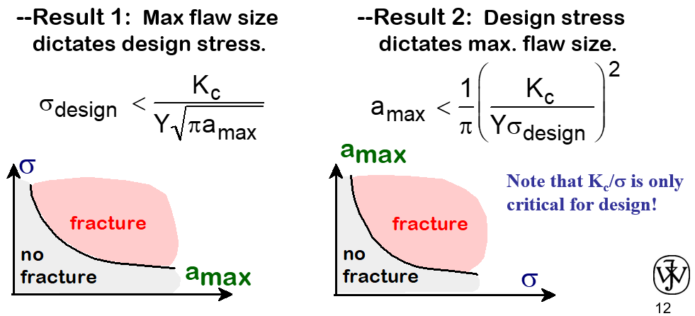

13.  Fracture Toughness: Example 1
    1. _Q: Is the remote stress still the applied, even if there is a hole?_
    2. **A: What is the maximum principal stress, because that is the applied stress. This is also used in FEA.**
       1. Superposition only works for linear elastic for ceramics in FEA.
       2. FEA codes implement plasticity automatically. 
       3. Inclusion of these calculations are only necessary if the lower length-scale is important, but not included in the mesh.
2.  Fracture Toughness: Example 2

---

## [[lesson-18-fatigue.md]]

1. U.S. Air Force's Aircraft Structural Integrity Program
   1. Presented at the 9th International Fatigue Congress.
2. Background
   1. "To ensure the design level of structural safety, performance, durability, and supportability with the least possible economic burden throughout an aircrafts design service life.
   2. Objectives:
      1. Maximize safety.
      2. Minimize costs.
3. Applicability
   1. 3 Components
4. Definitions
   1. Structure: any component that performs a structural function and includes wings, landing gear, engine, and weapon mounts, etcetera
      1. Excludes engines, avionics, hydraulics, crew system, fuel system, etcetera.
   Integrity: the condition that exists when a structure is sound and unimpaired in providing the desired level of safety, performance, durability, and supportability.
---
### Tangent: Post-Doc's Granddad
- Gets shot down over Siberia in WWII.
- Jumps out the plane, but his parachute doesn't deploy.
- Lands perfectly in a deep, deep pool of snow.
  - Snow sinters.
  - Heats
- The German who shot him down, saw him, and reported him.
---
5. History
   1. 1958:
      1. Multiple planes lost in flight.
      2. All had <2,500 flight hours per craft.
      3. Cause:
         1. **Fatigue*- failures of critical wing, fuselage, and wing-to-fuselage attach structures
         2. Ramification

_Formulations of fatigue from trains did not extend to planes and cars for 50 years._

   2. 1969
       1. F-111 lost over Nevada
       2. ~107 hours of flight time
       3. Cause:
          1. **Fatigue*- failure of a critical wing pivot fitting
6. Safe Life and Damage Tolerance
   1. Safe-Life
      1. Assumed initially flawless material
      2. End-of-service: cracks initiate
   2. Damage Tolerance
      1. Assumed some flaw size
      2. End-of-service: Fatigue Life cut in half
      3. Inspections are periodic and required.
      4. US Air Force, post-'69
7. Objectives
   1. Definitions for each 
8. Task Process
   1. Design
   2. Analyze
   3. Full-Scale Testing
   4. Certification
   5. Force Management Execution
9. Fatigue Testing
   1. Starting in '69 fatigue took off
   2. FEA began to gain ground
10. Risk Analysis
    1. Quantify benefits
    2. Quantify risks
    3. They are exclusive to each other.
    4. Quantify the probability of them occuring. 
    5. Then make a decision.
11. New Aerial Systems
    1. Composites were always thought as the answer.
    2. Cost is high and hard to quantify benefits.

---

## For the Quiz 2
- Know the difference between safe-life and service life
- Also know when the transition occured.
- _Q: Do all the armed forces employing ICME?_
- **A: The US. Air Force is the furthest adopter and uses much FEA. Navy and NASA are resistant.**

---

---

## [[lesson-19-multi-stage-fatigue-msf.md]]

1. Bring in the boundary conditions.
   1. Fatigue uses the microstructure to predict fatigue life.
2. Flaws are assumed inclusions.
   1. Because oxides at the front of molten metals nucleate faster, they become ceramic pores. 
   2. Gases gather here and pores can become migger.
   3. Notch root, edge effects are pores near the surface.
   4. Eutectic regions the last to form.
   5. Very complex defect sizes.
   6. "What if each these causes the failure?"
      1. Pregnancy: incubation of pores
      2. Smaller the crack, it incubates quicker and grows.
      3. Bigger pores take longer to become a crack.
      4. Cracks incubate faster at a smaller pores, but its crack is smaller.
      5. Bigger pores incubate slower, but the crack is bigger.
      6. This means the driving force of bigger pores is greater: the greater the growth.
   7. _Q: What is the underlying physics that drive smaller cracks to grow faster than large ones?_ 
   8. **A: only the spring constant between atoms resists the crack growth. Easier to grow at smaller distances than larger.**
   9. _Q: Is this where energy comes in (Gibb's or Holden's)?_
   10. **A: Yes. Dr. H thinks in dissipation of increasing free surfaces that identifies new ISV. Baumann thinks of energy states.**
   11. _Q: Would a wrought or sintered metal incubate faster?_
   12. **A: Wrought will incubate sooner, but can live much longer with the crack. A sintered material can survive orders of magnitude more cycles (>possibly because of local plasticity <cite> JD), but will fail instantly with initiation of a single crack. The incubation time is longer in sintered, but fatigue life is longer for wrought. This follows the process-structure-properties logic.**
3. There is a transition point from short to long-crack growth.
   1. After a critical crack length, the slopes are equivalent for various sized specimens, because they entered the long-crack regime (fatigue).
4. Rely on local, plastic shear strain ranges.
   1. Because, the inclusions move along glide/shear planes back and forth.
   2. Mode II/III deformation.
5. Fatigue Indicators
   1. The beach striations are mesoscale indicators of slip plane (ex)intrusions.
   2. Switches to Mode I when long-crack.
6. MSC versus LC
   1. Multi-site small cracks go around the particles: $K_{max, elastic} < 6~MPa\sqrt{m}$.
   2. Long cracks go straight through the particles: $K_{max, elastic} > 6~MPa\sqrt{m}$.
   3. The edge cracks can give a clue.
7. The size of the specimen dictates if particles or pores drive crack growth.
8. Cast metals have smooth, shiny pores. Cracks begin from here. 
   1. Wrought materials still exhibit this, sometimes, because the billet was cast.
   2. The thumbnail will have river marks that point to where the fatigue crack nucleated.
   3. Cracks move orthogonal to striations.
   4. Relies on geometry (strain) considerations, but some people will ask about load (stress) considerations with stress intensity and such.
9. $\frac{da}{dN}$ mechanics only: no microstructure considerations. Can include Mode-mixing.

---

## [[lesson-20-fatigue-general-concepts.md]]

1. Most fatigue problems (which include thermal) are from vibrations: 1-20,000 Hz
   1. Vehicles are designed not to vibrate between 4-10 Hz, because that is the resonant frequency of the human body
   2. Presented at the 9th International Fatigue Congress.
   3. Early computers would be shipped to customers and not work, because the EE's never had ME's part of the design team.
   4. Ford uses the elastic limit, which means they are more concerned of fatigue, because of a shorter S-N curve.
2. Notch roots affect incubation rates of cracks.
   1. $\frac{da}{dN}$: the longer crack has a steeper slope, because its crack driving force is greater.
3. Long-cracks are visible when cracks no longer more around grain, but straight through. Sometimes labelled as Mode 1, 2, or 3
4. Local dislocations initially make the material harder at that location, but also where damage begins.
   1. Length scales matter, because when the ratio of diameter to length of a dislocation's shape exceeds 0.3, the results were equivalent.
   2. Macro-scale: doesn't matter. If looking for incubation in first few cycles, then yes. But this is all _high-cycle fatigue_.
   3. _High-cycle fatigue_: elastic regimes of material
   4. _Low-cycle fatigue_: all plastic range
   5. $R =\frac{\sigma_{min}}{\sigma_{max}}$ in the cycle. If $R < 0, R=-1$.
   6. Usually good in compression.
>Different phenomenological events require different expressions of math. <cite> MFH
5. Fatigue was thought to be a function of stress (for 80 yrs.); however, found to be **strain life**.
   1. Jim Newman (NASA) bridged the crack people from 1920 and the fatigue people working for 50 years with _stress life_ into using crack growth and strain life.
   2. MFH and Doug Buamann introduced "incubation". Previously, fatigue people called this initiation.
   3. Fatigue load is greater in real materials than ideal.
   4. Monotonic overload in the last half-cycle of a specimen indicated by striations and coupled with dimples.
   5. Fatigue needs a fatigue crack to be considered (necessary and sufficient). It is necessary to see dimples on the fracture surface, but not sufficient.
6. Intrinsic vs. Extrinsic toughening: resistance of a material within the material to deformation
   1. Intrinsic: before crack (internal to the material)
   2. Extrinsic: after (behind) the crack
   3. Also includes _grain bridging_
      1. Frictional effects (dissipative but into the crack tip). All energy transfer.
      2. Oxides are good examples of extrinsic: does formations of oxides on a reactive metal help to impede or increase crack growth?
         1. _It depends_ on the ductile material.
         2. If an already brittle material, no, because it will not yield much anyway.
         3. If a ductile material, it may help impede the crack growth.
      3. Anything that impedes the crack tip propagation, this reduces the crack driving force (can limit the crack tip from opening the material).
   4. Crack closure: 
      1. elastic regime and opening things up
      2. Where is the plastic regime, near the dislocations.
      3. Stress-strain curve: material goes back with "back" stress (kinematic hardening) if in plastic regime.
      4. This back stress will resist the crack wake from opening.
      5. Affected by the direction of dislocations.
   5. Plastic zone around crack tip is _intrinsic toughening_.
      1. Seen by misaligned grains/dislocations
      2. Difference between long-cracks and microstructure cracks is the length scale. If a crack is growing, then at some point (while still creating more intrinsic stresses by back stress) the crack driving force exceeds those back stresses and blows right through the material.
   6. San Andreas fault--super long crack--driven by tectonic plate movement, driven by the mantle, driven by convection currents, created by the Genesis flood.
7. Rob Richie creates "resistance curves", but excludes Jim Newman's wake plasticity (which we know that plasticity is ductile).
   1. Resistance can increase, locally while crack grows.
   2. If resisted by a dislocation/grain, then the crack goes around, which increases the crack length.
8. Stress-time curves
   1. minimum stresses are negative, and if asymmetric, there is a mean stress, ($R \neq -1$). Aka creep fatigue.
   2. Use FFT to move from the time domain to the frequency domain for random vibrations.
9. Cyclic stresses
   1.  Sometimes, these S-N curves are for "2N" for reversals.
   2.  **TEST/QUIZ**
   3.  Stress amplitude is usually what is plotted for S-N curves and stress-time curves.
   4.  $\sigma_{m} = \frac{\sigma_{max} + \sigma_{min}}{2}$
10. Fatigue limit: stress does not change for infinite cycles.
    1.  Dislocations affect the local yielding which will cause failure locally.
    2.  Companies will define these fatigue limits for marketing purposes.
    3.  **The limit at which the material can cycle forever.**
    4.  It can be right, if:
        1.  Single crystal of monolithic material with no defects.
        2.  But they are so small, difficult to test.
        3.  Real engineering includes all the phases of dislocations.
        4.  This, then, becomes a design limit.
11. Fatigue strength: the point at which fracture occurs after specified number of cycles. Not necessarily fatigue limit.
    1.  Fatigue life is how many cycles.
    2.  The termination of the curve is where the specimen will break, period.
    3.  Same shape for high-cycle, low amplitude or the converse.
12. Just use the modulus or cyclic stress-strain curve to move from stress-strain to fatigue life.
    1.  Crack size is associated with strain life curves (these ideas did not come together until MFH in the 90's).
13. Crack initiation/propagation (old terms)
    1.  **Not incubation**:
14. Stage I and II:
    1.  Differ from initiation/propagation
    2.  I is orthogonal to stress and parallel to crack (mechanics people: Mode II)
    3.  II (crack people saw fcc materials create cracks at $45^{\circ}$).
15. Crack gets pinned by hard grains or particles such that $\frac{da}{dN}$ goes to zero, then the crack moves around the resistant point to something else.
    1.  x-axis is cycle.
    2.  y-axis is $\frac{da}{dN}$ increment.
    3.  long-crack growth models cannot capture this propagation, because the increment is up and down
16. History of fatigue: **_Surface-driven failure_**
    1.  It depends.
    2.  There is also free surface from pores/dislocation/impurities
    3.  MFH does not argue with fatigue people, but include the free surfaces from pores, oxides, etcetera. 
    4.  Quality of surface was the main focus.
    5.  Fatigue specimens required 10 0.02" cuts on the gauge section, which makes it more expensive from the standard 0.05"
    6.  Polishing didn't want to induce residual stresses.
        1.  Accomplished by peening, to induce a mean stress by minimizing the max tensile load.
        2.  However, this also hardens the material by inducing more dislocations.
        3.  Case arming: diffusing carbon into the surface of steels to increase the yield strength.
        4.  Smooth, gentle curves in the geometry to minimize the notch root radius and subsequent stress.
17. Environment effects
    1.  Very different from mechanical cycles.
    2.  Nuclear reactors shutdown every 3 months:
        1.  Thermal cycles: expected 120 for a 30 yr. service life.
        2.  However, reactors are now asked to operate 100yrs.
        3.  Can AM induce compressive stresses to help increase fatigue life?
    3.  Corrosion can cause extrinsic forces, but it can also increase crack growth rate.
        1.  MFH's Magnesium specimens formed oxides layers around the whole surface and pushed the incubation point to much later.
        2.  Cracks would be inhibited by the oxide layer.
        3.  Similar to carburizing the surface (oxidizing).
18. Definitions
    1.  First fatigue specimens were in bending, which was found different from uniaxial tension specimens, even if identical materials.
    2.  When in bending, only half the material experiences tension (either above/below the neutral axis)
    3.  Furthermore, the maximum stress (moving radially from the neutral axis) is at the surface: almost no volume to allow failure.
19. Crack propagation rate
    1.  Use $K_{ic} = \sigma\sqrt{\pi a}Y$ (stress intensity factor) for elastic materials.
    2.  If $a$ increases, $K_{ic}$ increases. Long-crack growth if plotted $\frac{da}{dN}|_{K_{ic}}$.
    3.  Slopes are equivalent at the same crack length, but displaced by stress onto microstructure of material.
    4.  MFH's MSF model moves up from strain-like at the lower length scale to stress-like at the higher length scale, which people do not like.
20. $\frac{da}{dN} = A(\Delta K)^{m}, \Delta K = K_{max} - K_{min}$.
21. Crack propagation rate
    1.  Use a math trick with "log" to bring down from an exponential equation.
    2.  This to solve, by integration, to find $N$ to predict cycles to failure.
    3.  Whichever fatigue life is longer, you can save volume there to minimize weight, but may need to put some where the fatigue life is lowest.
22. To improve fatigue life:
    1.  Induce compressive stresses
    2.  Large, uniaxial tension will yield fewer cycles
    3.  Carburizing 
    4.  Polishing

---

## [[lesson-21-more-fatigue.md]]

11. Beach marks tell you changes of environment, because loads shift around that beach mark. Not necessarily fatigue striations.
    1.  May certainly align with fatigue striations.
    2.  Number of marks indicates number of shifts
12. Micro scale (striations)
    1.  Number of striations is the number of cycles.
    2.  Incubation and damage rate is the disparity between (Jares Bernard, 2008) the number of cycles and number of striations.
    3.  Jares measured the $\frac{da}{dN}$ increment, which matched 1:1 with the Repliset method.
    4.  Jim Newman doesn't agree with incubation, but concurred from crack growth after this particular image.
13. Striations can coalesce from two nucleation sites, but only proven if dimples in between.

---

## [[lesson-22-even-more-fatigue.md]]

2. Fatigue failures
   1. Different length scales give different evidence of failure
3. Microscopic can show striations in grains themselves
4. initiation includes: incubation, microstructure crack, and crack tip displacement and its wake
   1. For each defect type, there is a different incubation rate
5. Fatigue in salt water at $90 MPa < 210 MPa$
   1. Focus is a casting pores (smooth surfaces) with hydrogen shrinkage (labyrinth of black dots around casting pore) around it
   2. Ken Gall want to see incubation
   3. Looks like the Cooper picture from before, but with magnesium
   4. This picture showed why energy transfer was not sufficient (MFH, Dave McDowell, and Ken Gall)
      1. Energy dissipation happens at free surface (Thermo II)
      2. Therefore, some energy went into cracks that arrested or branched
      3. Use geometry methods: _strain-life_
6. Different location, same specimen
   1. Persistent slip bands (PSB) within grains along twinning planes, coupled with hydrogen shrinkage
   2. Crack nucleated from interaction of persistent slip bands
7. Within the grain:
   1. More persistent slip bands with more cycles
   2. Eventually, a crack in the grain from the PSB 
9. Crack from PSB starts aligning with the crack in the grain site
   1.  Ultimately coalesce together
   2.  Crack starts earlier for the PSB with a stress field in front of it
10. Multi-Site Fatigue
    1.  All these sites are incubating (babies born)
    2.  Then they coalesce together.
11. White spots are inter-metallics (very brittle)
    1.  Stress corrosion cracking
    2.  No corrosion pits, because the oxidation layers are nanoscale (difficult to see)
12. Magnesium more susceptible to corrosion than aluminum
    1.  Fracture follows the straining from forging
    2.  River marks in the wake of the crack
15. Stress corrosion cracking grounded AC-130's in the 70's
    1.  Fixed by rewinging
    2.  Or bonding
16. Mothballed in '78 by CIA
17. '88: Interior Department buys them: named N-130's
    1.  One crashed in '02
    2.  Amazing it lasted
18. NTSB investigated
    1.  Original design intent: clearly different
    2.  Engineering support
    3.  Know the nominal and abnormal boundary conditions.
    4.  Inspection intervals?
19. Unsafe condition identified likely to exist on other Lockheed C-130's
    1.  Exchange in '88 for museum quality aircraft
    2.  Illegal exchange
    3.  '99 indictments
    4.  C-130's still fly today...
20. USAF Aging problem
    1.  An increase of fleet increases maintenance costs
21. Bonded repairs ('70s)
    1.  Solution to drill a hole in front of crack tip
    2.  Radius is low around crack tip counteracted by the larger notch root radius of the hole
    3.  Maybe swiss cheese is not a good idea
    4.  Bonding...
22. Load spectrum for the C-130
    1.  Unknown service life
    2.  Crack growth is unpredictable
23. Follow the 12 Step Method
    1.  Take pictures and label them
    2.  Can move them to another place to reconstruct the accident
24. Stress intensity factor
    1.  Reduce by gluing on a patch to disperse load by taking some strain from the hole.
    2.  Thermal and traction stresses.
    3.  Tapered to reduces secondary bending and minimize shearing bands
25. Damage tolerance guidelines
    1.  critical cracks cannot be fixed: do not fly the plane
    2.  If no failure at ultimate load, then conservative.
    3.  Better than drilling holes, but what is the efficiency, thermal transfer, how long is it effective, etcetera?
26. Efficiency: Riveted joints to minimize strain along bonding path
28. Repair smaller cracks, because their crack growth rate is less.
    1.  Still allows for damage 
29. Tested two full-scale planes
    1.  One patched
    2.  One unpatched
    3.  Showed patching increased fatigue life with equal, random vibration sessions applied to either specimen
30. -34 Inspection interval halves while crack grows
    1.  Crack follows unpatched trend, but is displaced after each patch.
    2.  Minimizes the slope of the crack growth rate over service life.
    3.  If optimally designed, then planes would failure later, but all fail in the same way.
    4.  _Redundancy_
36. What should have been done?
    1.  Could never have been flown again.
    2.  Or permanently repaired.

Fatigue is obviously a problem, but the Air Force is moving to adopt the damage.

**Q: Why not replace parts in place?**
_A: AM parts hospital to print parts in place. But too much porosity reduces strength compared to wrought/forged materials. All coupled with thermal/mechanical with chemistry for diffusion/solidification processes._

---

## Lesson 24: Failure of Engineering Materials

2. Effect of Overloads
   1. Striations, because of 2 microns length scale.
   2. Transition in size of striations, because the loading condition changed.
   3. Smaller striations implicates smaller loads.
   4. _Ask Stephen if SEM images are publication worthy._
3. Fractography to understand fatigue history.
   1. Gouges at radial edges.
   2. River marks in center point to failure point.
   3. Beach marks: tougher metals make bigger striations.
   4. What are the types of loads, stress levels, cycles?
### Case Study: Failed C-130 Wheel Flange
- Service life of 20 yrs.
- Inspected each time tire changed with no visible cracks prior to failure.
5. Complex structure of flange. Stress concentrations everywhere.
6. Striations.
7. Ductile fracture voids.
   1. debond in monotonic overload and crack incubates there.
   2. Fatigue striations present, but the last half-cycle might be ductile.
   3. It is not the whole story.
---
### Howitzer Gun:
- Tough steel and contained enriched uranium.
- $\frac{1}{2}mv^{2}$ to make high-speed, heavy rods.
- Hardness test to see if material is sufficient for its service conditions.
- A2 tool steel used everywhere: and a manufacture said the hardness was Rc 56.
  - The student found 55-57.
  - Therefore, material was sufficient, and now they had a data sheet.
- Hardness is within spec, and the highest stress was below yield.
- FEA showed 220, but failure would be 270: so no damage.
- SEM showed a lot of white stuff on cross-section; therefore, $t$ is much less and stress would be higher. But is that a manufacturing defect?
- _Conclusion: Material defect within manufactured part._

## Comments for Final Projects
- Connecting Rod:
  - Ready to do destructive testing.
  - Need to redo EDS scan in SEM, because not Beryllium.
  - Confident failure is fatigue.
- Pliers
  - Analytical is going.
    - >Add assumptions to simplify analytical. <cite> MFH.
  - CAD model is difficult to lead into FEA, because of geometry.
  - Not sure what material it is.
    - Before SEM, optical scale might reveal pores if cast metal.
    - Could be carburized surface.
- Write the report as a journal article.
  - Journal article is for reference.
  - And the 12 steps are important.

---

## Quiz 3 Recap
1. False: Theoretical strength from the electron count and lattice structure, which is different for each material; therefore, the theoretical is greater than the real strength, but different for each material.
2. Only for brittle materials and elastic behaviors.
3. It depends on your definition$\therefore$ ask what their definition is or give them. So define it each time this is discussed.
   1. Relationship of the $a$ and $b$.
   2. Not always clear, so define it.
4. Crack-tip blunting?
   1. Being sharp is a pre-condition, but does it cause it?
   2. Traction force outside the body matches internal forces in the direction of applied loading. Lack of extrinsic forces.
   3. (D), but any of them could be acceptable with declared logic.

_Oral or written final exam? Decide this later._

7. Failure mode?
   1. Crazing with fatigue in polymer.
   2. asdf
   3. Mode-mixing.
8. Use yielding.
9. Any of them could be acceptable with presented logic.
10. Crack length, $a = 5 mm$.

---

## High-Rate Events

- Covering high-rate phenomenon.
- Shockwave, stress wave, and pressure wave are synonymous, but fluids people will reject the work, because shockwave relates to speed of sound in a medium.
- Pressure wave is the long-diagonal (first invariant) of the stress tensor.
- In previous classes, we say that stress is seen throughout the whole body, but now we say that is varies through the part, because of the high-rate nature.

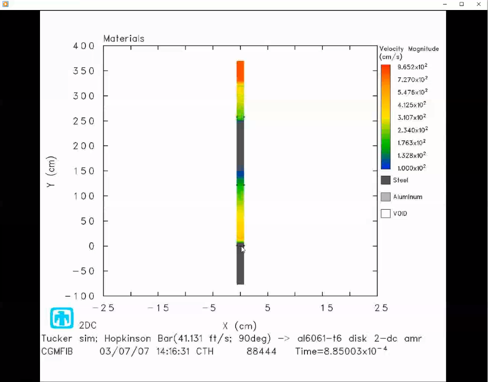

- $\sigma_{xx} = \sigma_{zz} = 0$. This is uniaxial.
- 3 waves in Hoppy Bar
  - Incident: initial contact to hockey puck specimen.
  - Transmitted: through specimen to other side of Hoppy Bar.
  - Reflected: reflection of wave back up Hoppy Bar from specimen.
- The reflected wave is opposite of the sense of the incident wave upon a free surface.
  - Not as simple as the difference of the front and back of a wave.
  - The reflected wave is very sensitive to the time domain.
  - Also extremely sensitive to material geometry.
- _Easy journal paper for high-rate data for your material._
- Can also generate stress-strain curve from video recording, because you know the frame rate.
- Wave speed:
  - $\omega_{s} = \sqrt{\frac{E}{\rho}}$
  - The wave moves through the material faster than it can strain.
    - When an ocean
  - The time domain affects the rate of energy domains through the material.
  - **Is the strain of the material its response to keep conservation of momentum?** _It depends. The time step is very significant. Any dislocation is the material dissipating energy. So modeling assumes piecewise-linear between time points and thermodynamic equilibrium._
- Hoppy Bar of magnesium:
  - Slip plane at $45^{\circ}$. Twin plane?
  - There is no barreling, because the surfaces attempt to remain friction free.
  - Force cannot be found, because the pressure wave has already moved through the material, and we can only see the strain with our eyes.
- MFH became a believer in simulation experiments by validating with physical experiments of high-rate explosions for submarine design in 1990.

- If the reflected wave is opposite in sense to the incident wave from a free surface.
  - If compression, tension would try to open a void.
  - What if we did two voids within a material?
  - Shear occurred in single void, but not for two.
  - Therefore, strain rate dependent. 
- Hydrodynamics:= strength of material does not matter, because the strain rate is so high.
- The strain rate threshold is $10^{5}/s$ when state of material does not matter: hydrodynamics.

---

## Atomistic Simulations

### Polyethylene

- Crystalline structure and amorphous.
- Uniaxial tension.
- Poisson's effect visible.

### Car Crash

- Stress wave triggers airbags. 
- Stress wave moves faster than the material can respond: before the human can move into the steering wheel.

### Genesis Flood

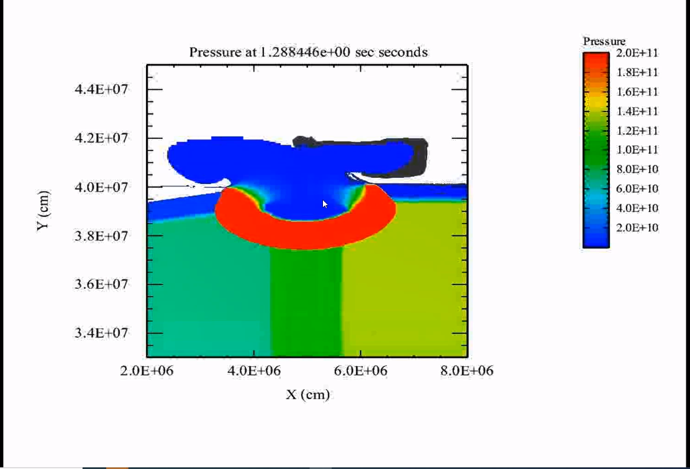

- Belief that Yucatan meteor caused Genesis Flood.
- Is possible.

### Ram's Horn

- Compression wave gets reflected to tension and moves to shear, before wiggling out at the end of the horns.
- Wiggles out in a manner similar to Fibonacci sequence.
- Same for bison horns or woodpecker's tongue.
- Just changing cross-sectional area dissipates to shear. Adding curvature does this even faster.
- Pressure wave onto the brain creates tri-axial tension: **Super bad**.
- Stiffer material--bone--keeps the faster pressure wave contained to the stiffer material to give softer, squishier tissue time to respond to the wave. 

---

## Lesson 27: Failure of Engineering Materials - High Rate Phenomena

1. You want the pressure wave to collapse on the structure.
   1. Wave is faster than material.
   2. Projectile, then pressure wave, and then water jet to sink submarine.
2. High rate events have broad applications.
3. Civil applications in welding or forging.
   1. Archimedes can detect density.
   2. Ultrasound uses wave speed, and you can solve for Young's Modulus.
   3. This actually more accurate than a mechanical machine, because of the error and compliance in the machine.
4. Space is all high rate events.
   1. Do these events hold in a vacuum?
   2. Wave speed of the fabric of space is the transverse shear wave that is the speed of light.
   3. The speed of light is the fastest thing in the universe, because Poisson's ratio is 1 (Ticho).
5. Military projectiles and armor take this into consideration.
6. Types of elastic waves
   1. Longitudinal or irrotational waves
   2. Distortional or shear or transverse waves
   3. Surface or Rayleigh waves
      1. MFH's first paper
7. Hoppy Bar can measure all three stress states: compression, tension, and torsional.
8. Static behavior does not matter.
   1. Grain scale: fractures
   2. Atomistic: dislocations
9. Dynamic Failure
   1.  Bruce Li used this principle to chop through concrete.
   2.  **Spallation: nucleates cracks into fracture from new free surfaces at the back side of the material, because the high compression in a small area gets reflected into tension to create these notch roots.**
   3.  **QUIZ!!**
10. Pressure wave faster than material response.
11. Wave Phenomena
    1.  
    2.  $\frac{\delta x}{\delta t} = \sqrt{\frac{E}{\rho}} = c$, elastic wave speed.
    3.  This is a deformation equation of motion. Similar to rigid-body equations, but not based on vibrations.
    4.  The size of a mesh determines the numerator, and the density affects the time step, because Young's Modulus is fixed.
12. 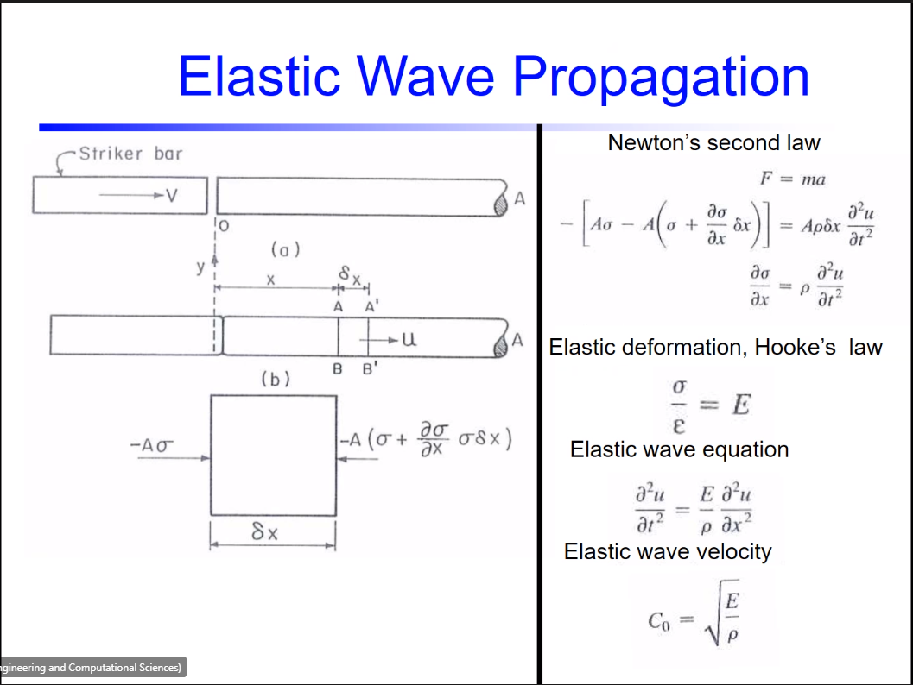
    1.  Newton's Second Law of Motion derives into our equations.
    2.  Coupled with Hooke's Law, we get Young's Modulus.
    3.  These give us space-time equations.
13. Spalling occurs on the reflecting free surface.
    1.  Not an example of momentum.
    2.  _Think back to a particle in an ocean wave._
14. 
15. Can get a stress-strain curve from these waves.
    1.  Vehicles used quasi-static data for design, which is not conservative, because it over-estimates yielding.
    2.  This was solved by factors of safety; however, this makes vehicle heavy, slow, and expensive.
16. Does temperature or strain-rate drive material response? It depends for each material.
    1.  
17. Fracture toughness: material property
    1.  Does not change, but is dependent on thickness of specimen.
    2.  Decreases at some threshold of strain-rate.
    3.  **Higher strain rate, nucleation rate of damage goes up, failure at elongation happens sooner, and then fracture toughness goes down.**
    4.  $K_{IC} = \sigma\sqrt{\pi a}$: 
        1.  $\pi$ does not change.
        2.  $a$ does not change.
        3.  $\sigma$ depends on the amplitude of the pressure wave.
    5.  No such thing as a strain wave.

### Comments

- Spalling occurs because of the sharp change in compression to tension tears the material off.
- Pressure waves _must_ be brought into car accidents.
- We know of ocean waves, light and radio waves, and electromagnetic waves from the sun. Now we are saying there are mechanical waves.
- **Is there a temperature threshold similar to a strain rate threshold?** _The model allows for that and would be a straight forward numerical experiment._

---

## Lesson 29: Corrosion Failures
1. Commonly in the F/A 18 fighter
2. Background
   1. Safe-life uses crack length until failure
   2. US thought it was from static overload
3. Non-destructive evaluation (NDE)
   1. Dye penetrant
   2. Eddy current: measures crack by variations in magnetic waves.
   3. Found pitting and beach marks: the pit reached some length and existed for some time.
4. Chemical analysis revealed $Cl^{1-}$ attracted to $Al^{3+}$.
5. Fractography
   1. Striations indicate fatigue, necessary to it, but not sufficient.
   2. Pits without striations is not the whole story.
   3. Corrosion, fatigue, and stress loads.
6. Mechanical Testing
   1. Crack growth rate increases in corrosive environment for low-frequencies: corrosion fatigue
7. Corrosion and degradation
   1. Why does corrosion occur?
   2. What metals are most likely to corrode?
   3. How do temperatures and environment affect corrosion rate?
   4. How do we suppress corrosion?
8. Businesses do not like preventing corrosion, because of the high upfront costs.

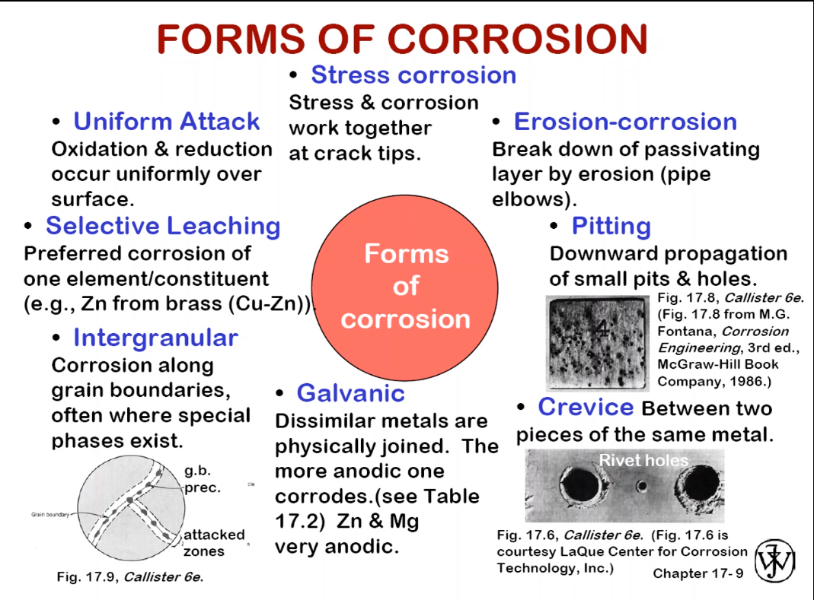

9. Length scales differ.
   1.  Galvanizing: the difference of electronegativity in dissimilar metals.
   2.  Allowed chemical reactions. If in a corrosive environment, chemistry happens quicker.
   3.  Pitting looks like a void the size of a particle, because chemistry happened at that particle.
       1.  This reduces cross-sectional area.
       2.  Also includes a notch root stress concentrator.
       3.  _Mercury Marine_ boat motors made of magnesium (the most anodic element) never corrodes, because they pass electricity through the entire motor. Yes this does sound like an explosion waiting to happen.
       4.  Mechanical types: general/uniform, intergranular, and pitting.

Letter | Energy Domain
-|-
C | Chemistry
O | Optical
M | Magnetic
E | Electrical
T | Thermal
M | Mechanical
A | Acoustic
N | Nuclear

10. Galvanic reactions happen between two dissimilar metals, which corrode at different rates. This does not mean they do not corrode, only at different rates. The electronegativity of a chemical bond is not obvious, but surely a pattern exists.

11. Stress corrosion cracking: not fully understood yet.
    1.   Cracking induced from combined influences of tensile stress and corrosive environment.
    2.   Impact between dry cracking and fatigue threshold.

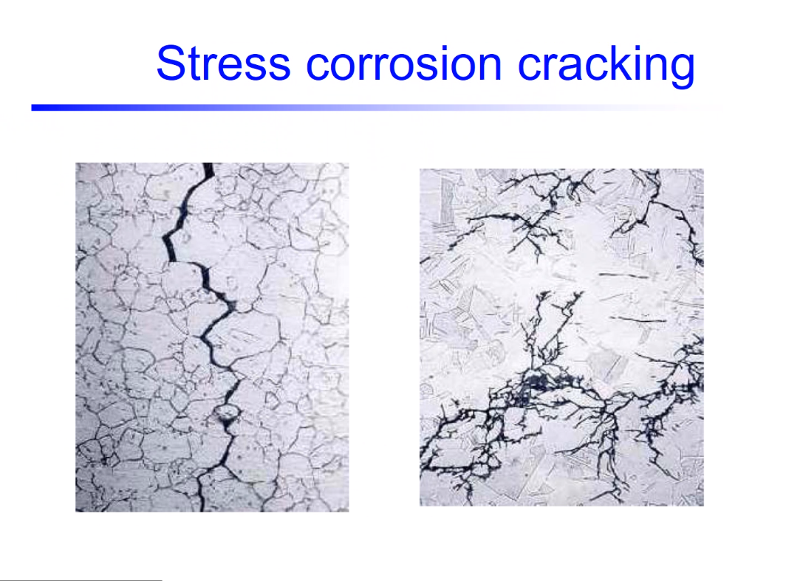

12. Increasing "T-speeds" is stress, where the "T" is triaxiality.

---

## Lesson 29: High-Temperature Corrosion
1. In general, corrosion rate increases with more heat.
2. [[Corrosion]]:= destructive interaction between _material_ and its _operation environment_.

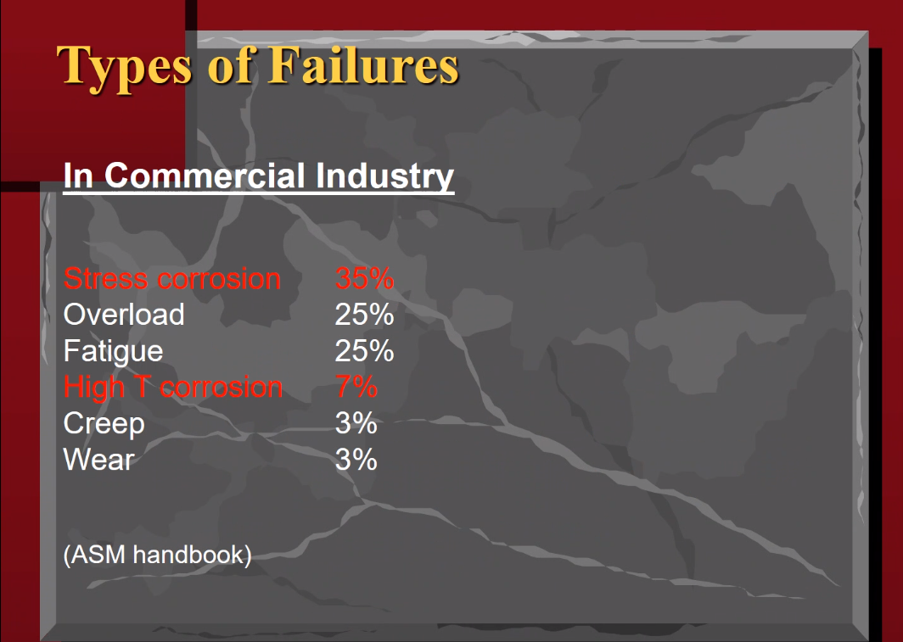

3. Everything is stress-corrosion, because only in a vacuum is there no environment.

Type | Percent
-|-
Stress Corrosion | 35%
Overload | 25%
Fatigue | 25%
High T Corrosion | 7%
Creep | 3%
Wear | 3%

4. Hydrogen embrittlement by hydrogen diffusing into bulk material.
   1. Moves into interstitial spaces in bulk material to nucleate damage.
   2. Not only does hydrogen take up some volume, it thermodynamically wants to bond to the alloying particles.
   3. In MFH's steel ball, it is in triaxial stress without a traction force, because of the hydrogen embrittlement.
   4. The triaxiality increases free volume, locally. So hydrogen moves there. It tries to fill the voids present in the material.
   5. [[nucleation]] increases, governed by _diffusion_. 
   6. **Why does the fracture toughness lower?** _Does affect the stress intensity, but not directly._
   7. Corrosion is thought as an environment problem, but hydrogen is not thought as environment because the mechanism is different.

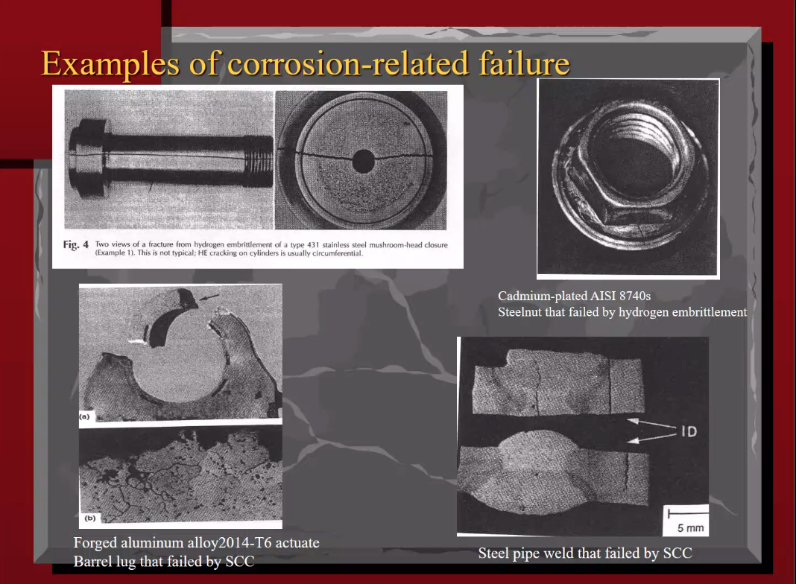

5. Nernst equation depends on the activation energy. $$E = E^{0} + \frac{RT}{nF}ln\frac{a_{ox}}{a_{red}}$$
6. Reduction reactions
   1. Acidic: $2H^{+} + 2e^{-} \rightarrow H_{2}$
   2. Alkalinic: $O_{2} + 2H_{2}O + 4e^{-} \rightarrow 4OH^{-}$

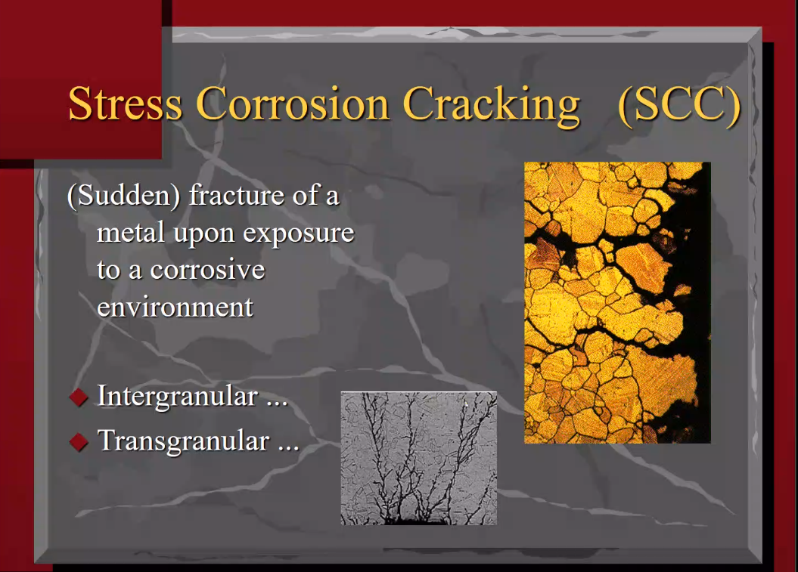

7. Passivation:= oxidation layer formed to prevent chemical reaction, whether created or not by chemical.
   1. Fails locally by brittle fracture.
   2. All depends at what length-scale of reference.

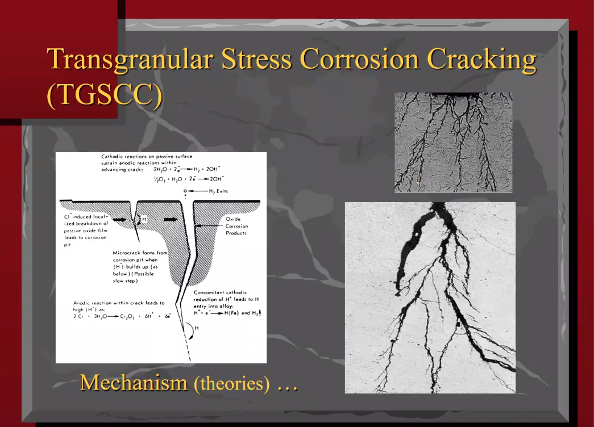

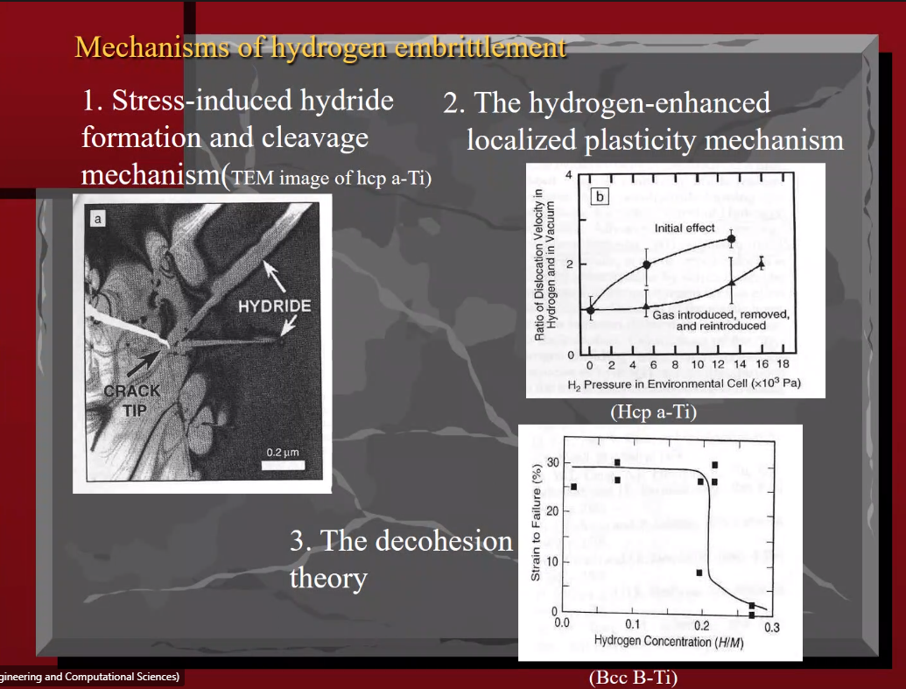

8. Microbiology corrosion could be driven by gas release in microbiological reactions.

---

## Lesson 31: Elevated Temperature Failures: Creep
1. Typically at elevated temperatures some ratio to the melting temperature of the material.
   1. Absolute temperature.
   2. Modeling uses absolute temperature, but reported in scaled temperature for legibility.
2. Tension induces a mean stress, which is worse for fatigue life. 
   1. $R = \frac{\sigma_{min}}{\sigma_{max}}$. 
   2. When less than 1, reported as -1.
   3. Mean stress increases the R-ratio.

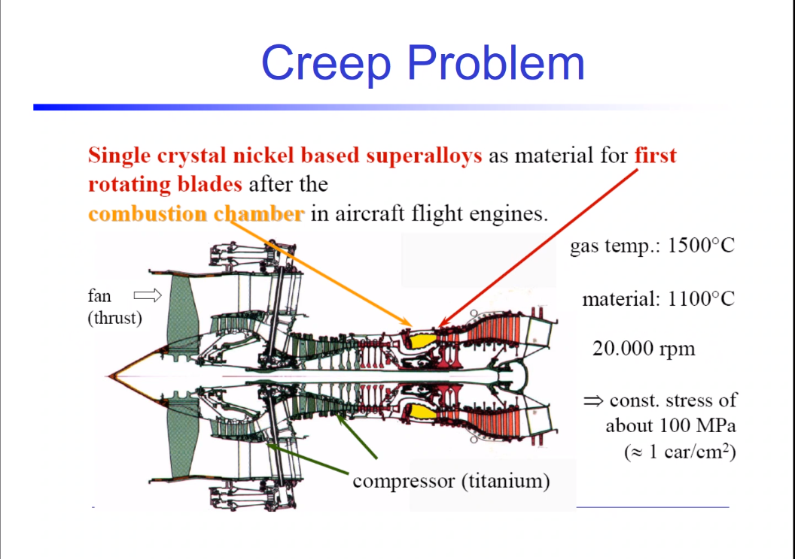

3. Coefficient of efficiency is rather low for most combustion engines. 
4. Creep:= time-dependent strain under constant stress.
   1. Primary: imperfections align. Dominated by nucleation.
   2. Secondary: equilibrium work-hardening.
   3. Tertiary: cracking override, work-hardening. Dominated by coalescence.
   4. Not all stages may occur. Though all stages include nucleation and coalescence.
   5. Unified-Creep Plasticity (UCP): ISV-damage for plasticity maps to the stages of creep.
5. Creep tests can be stress or strain controlled.
   1. **Strain-controlled is a relaxation test.**
   2. Dynamic (glide) and static (climb) recovery in ISV hardening.

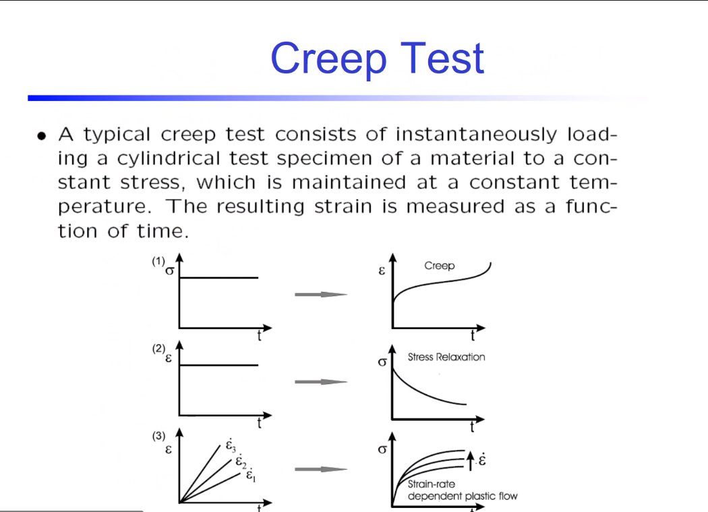

6. Plastic-rate of deformation.
   1. Creep curve changes for different loads.

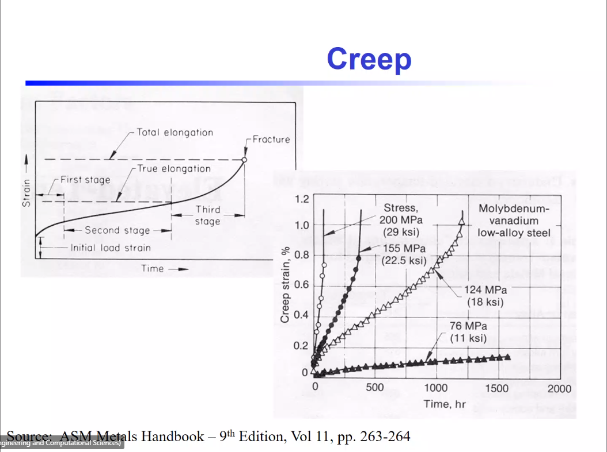

7. Ashby maps creep for shear strain and melting temperature to ascertain dominating mechanism in creep.
   1. Elevated temperatures reduce the activation energy of chemical bonding, which allows plastic flow.
   2. Creep climbs in dislocations, plasticity glides along planes.
   3. Because this chart is quasi-static, increasing strain-rate moves the y-axis down.

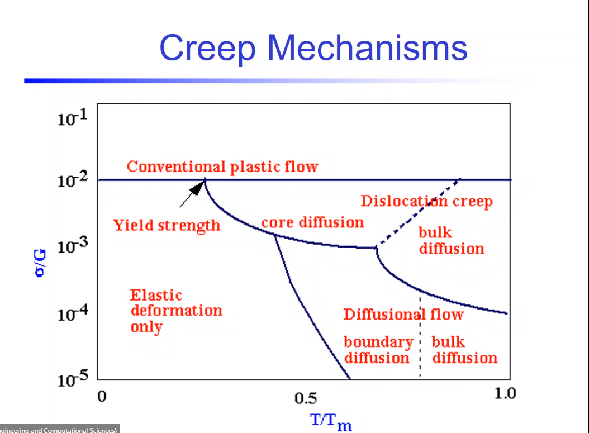

8. Herring-Nabarro: $$\dot{\epsilon} = \frac{D\sigma b^{3}}{kTL^{2}}$$.

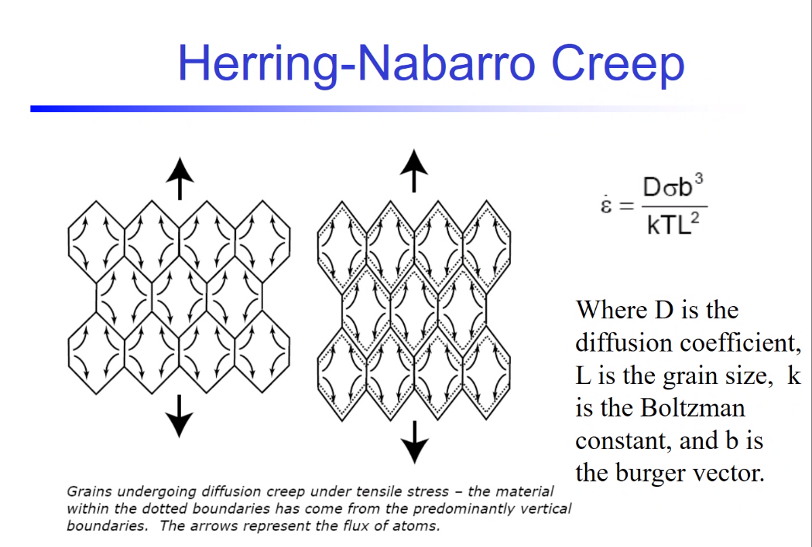

9. Coble Creep: 

10. Idealization of creep: constant applied stress in constant temperature.
    1.  Applied load will cause creep to a point.
    2.  In the strictest sense of the definition, is not fatigue/creep-fatigue, because the load must be constant, not oscillatory as in fatigue.
11. Arrhenius form of dependence on temperature.
    1.  Damage nucleates and coalesces just as with plasticity, fatigue, and corrosion.
12. Stress rupture
    1.  Ultimate failure is fracture, even though stress is constant, because strain is increasing.
    2.  Trans/Intergranular depends on temperature and strain-rate: lower creep rates and temperatures.
    3.  Brittle
        1.  Usually intergranular.
        2.  Initiates at triple-points of grains
        3.  No elongation of grains (even after visible plasticity).
    4.  Ductile
        1.  Transgranular
        2.  Initiated at intergranular cracks.
        3.  Elongated grains.
    5.  Irregular and discontinuous fracture surfaces.
13. Creep model
    1.  Two ISV variables:
        1.  H: hardening
        2.  $R_{d}$: dynamic glide
        3.  $R_{s}$: static climb
    2.  If integrate damage (creep rate), then time becomes important.
    3.  $\dot{\phi}_{pores}$ is the same equation used in the high-rate phenomena. Same underlying mechanism.

---

## Final Presentations
### Rod Specimen Notes
MFH thinks we have a paper.

#### Chronology
- have backup ideas for the order of failure events. 
- What if it was not that order? Does the order matter?
- Assumption: there is an order. Working hypothesis: what we presented.
  - Cross-threading.
  - Uncertainty exists. But engineers work with the uncertainty.
- Up front declaration of mating surfaces not clear.
- On stress-strain curve:
  - Which was literature? And was that the O2 steel?
  - What material did the EDS say? What did the tensile test say? Do they agree?
  - Both materials work-harden; therefore, the yield would have been much higher than reported.
- What material is it?
- What is the effect of colder temperatures on the stress-strain curve? What bridged the ambient test to the cold service environment?
  - Ductile in tensile test.
  - Saw cleavage on fracture surface from cold conditions: brittle.
  - Beach marks indicate different loading conditions, but these could have happened later?
- Chronology
  - Slide 5 includes only 6 ksi tensile pressure.
  - Fatigue alone would not be driving mechanism, but data seems to indicate that fatigue happened first.
  - Use the torque equation to find mean stress and R-ratio for material, and use the material that the EDS indicates to compare altogether.
>**Nickel answer: fatigue, but need all the calculations. Likely the wrong material was sent, even though O2 steel was ordered. Overloading could be brittle or ductile fracture. Cleavage could have been related to temperature or a big particle/goody allow cleavage.** <cite> MFH
- Coalescence on Slide 14.
- Fatigue striations are leading and coalesce to beach marks from varying loading condition due to some transfer function of stress indictive of the geometry.
- Mating surfaces (Side A) seem to indicate shearing between the valley and hill. These could be cleaved surfaces.
- Do the shear lips from the tensile test look like the shearing planes on the fracture surface?
- Shearing could not have cleaved (referring to Slide 8).
- **Q: What are the particles on the highly polished surface (Slide 16)?** _A: Particles were noticeable as the mesoscale: likely dust from wiping the surface prior to placing in SEM._

### Pliers
#### Slides
3. Difficult to see (lighting), but it was heavily corrode from storage in/near chlorine.
4. The pliers themselves were largely unused: not a heavily serviced part.
5. Compression test attempted, but highly unreliable.
   1. Literature and chemical composition determined material later.
   2. Seemed to be iron with high percentage of carbon.
   3. Microstructures greatly change SS curve for graphitic iron.
6. Heat treatments evident, because of high hardness, which varied between handle and teeth.
   1. Handle seemed to be soft.
   2. Teeth were much harder: more heat treatment.
7. Kept in jar to separate from environment to better preserve surface.
8. Corrosion makes identifying direction of failure difficult.
9. Very dimply at $100 \mu m$. 
   1.  Particles were present as well.
10. Getting down to $10 \mu m$, very ductile, but also revealed cleaved surfaces with cracks.
11. More iron oxide corrosion, whether before or after chlorine.
12. asdf
13. Ductile fracture from pearlite iron?
14. Polished surface revealed highly ordered graphite matrix ($100 \mu m$).
    1.  EDS indicates cast iron.
    2.  Chemical etching would have indicate ferrite and pearlite phase, but not possible without etchant.
15. Comparing with literature, polished surface matches the compacted graphite iron percentage of pearlite/ferrite composition.
16. Modulus of elasticity was constant, but Brinell hardness shows wide variance: (100-250).
    1.  Reasonably without range of material of pearlite/ferrite composition.
    2.  Expect a lower percentage of nodularity, because of lower concentrations of pearlite.
17. Cleaved surfaces in the midst of dimply surface indicates (working hypothesis) that ductile fracture was coupled with local, particle shearing.
18. Ductile fracture still main mechanism driving to ultimate failure, but quasi-cleaved is a mixture of these and likely the local mechanism at particles. 
    1.  Common in hydrogen-enhanced steels, but could still apply to our heat-treated material.
    2.  Ductile fracture enhanced by hydrogen inclusions.
19. EDX revealed carbon contamination and heavy chlorination.
20. Percentages indicate much carbon (but likely contamination). Still great at local places of iron.
    1.  Pearlite grains did not reveal chlorine, but oxidation layers.
    2.  Depth of field inhibits data collection.
21. More oxidation on mating surface, but also likely more oxidation due to chlorine.
22. ABAQUS with half-plier.
    1.  Belief of cast metal may have stress concentrators due to geometry and attempt to defeature where necessary.
    2.  Grip strength is only an estimate.
    3.  An area of improvement would be BC's on half-plier.
23. Literature data for 25.8% pearlite and 16.6% nodularity. 
    1.  Belief of main iron matrix, with variability, is largely pearlite.
    2.  Validated with single-element.
24. Mesh refinement--with defeatures--indicated slight dependence on mesh count.
    1.  Could be due to imperfect defeatures.
    2.  Could also be mesh element type.
    3.  Concentration of higher element counts at areas of stress concentration: likely drove overall value up.
25. von Mises stress and max principal verify stress concentration in tension around handle.
26. Max principal strain, $\epsilon_{1} = 2\%$. Preliminary simulation with nominal grip strength could cause failure at stress concentration locations.
27. Future work would include physical testing to simulate service conditions.
28. Conclusions:
    1.  Material = compact graphite iron with pearlite grains.
    2.  Quasi-cleavage failure.
    3.  Significant corrosion potentially sped up failure.

#### Questions
- What about the flat plane? Casting.
- Why did this handle break and not the other? Slightly different thicknesses.
- MFH initially thought this the more difficult because of the corrosion, and liked the thought of hydrogen embrittlement. 
  - Probably a grade cast iron.
  - Most cast steels exhibit quasi-cleavage around hydrogen inclusions.
  - Liquid cools at different rates and forms oxides at the leading surface: these are incubation sites for hydrogen pores or shrinkage.
  - Testing for hydrogen embrittlement would be due buy one of these and putting in chlorine bath to collect hydrogen.
  - No marks on pliers make difficult to buy duplicate, also was MFH's granddad's. So very old. Likely, company does not exist anymore.
- ISV
  - Image-J to get data of ISV.
  - Former PhD student made constants, but did not collect hydrogen embrittlement. 
  - Could easily include in ISV modeling.
- ABAQUS simulation
  - Prelims showed that any man could break it, even without hydrogen embrittlement.
  - What is the thing that happened, not the 50 things that happened?
- River marks versus ABAQUS?
  - River marks did point to where FEA said it would fail.
  - But some marks contradicted.
  - ASM handbook may include images similar to these fracture surfaces.
- Why so much carbon content?
  - Carbon contamination.
  - Difficult to calibrate for smaller specimens.
  - Used carbon concentration to find locations of pearlite or nodularity.
- Hardness? Vickers.
  - 268-304 at handle.
  - 729-1169 at teeth.
  - Variability within bounds of cast iron, but for higher pearlite composition.
  - Most surfaces showed ferritic fracture, not pearlitic. But estimate without etching.
- von Mises versus max principal.
  - Max principal was reached first and at the 400 N load.
  - von Mises failed next, but at 320 N.
  - Indicates Mode I: tension.

### Overall comments
- Number slides.
- Titles should always make a statement of the final conclusion. What is the main point?
- Magnification is useless. What is the length scale?
- Spell check.
- Update these small things before sending in slides.
- Say the nickel answer first. This helps to track the logic through the analysis.

#### Comments
- Jared:
  - Appreciated the confidence to make an engineering decision and move, despite the great uncertainty in data. Good demonstration to show ability to make an assumption, move on, and see where it led.
  - **Q: What concluded to hydrogen embrittlement?** _A: Found that hydrogen embrittlement was common to quasi-cleaved surfaces._

---

## Final Exam Discussion
Relating to the final: MFH will ask the same 10 questions of everyone and we all have 30 min to answer.

Will make a Word doc of questions and we can all write into that.

Questions on Exam:
1. What are the 12 Steps?
2. Does adding creep shorten fatigue life? 
   1. Fatigue cracks incubate at persistent shear bands. These can initiate creep cracks.
   2. Fatigue has three levels incubation, short crack, long crack and creep has three levels. So the interaction between these levels between the two mechanisms reveals their relation.

---

## Lesson 32: Creep Fatigue
1. There are levels to creep under constant stress, but what if fatigue is included?
   1. High temperature and cyclic loadings from turning blades.
   2. Constant thermal loads.
2. Fatigue life shorter in higher temperatures. 3 levels of creep happen within the plastic zone ahead of crack.
   1. Primary is nucleation. Tertiary is dominated by coalescence. This is not to say that the other levels do not include nucleation or coalescence. 
   2. Creep equals plasticity.
   3. Stress and environment are important. Thermal thresholds delineate when something will creep or won't creep. But want to observe smaller variations. These variations may include creep, but does this need another mathematical model to handle the different failure mechanisms.
   4. What are the creep rates? Are they independent of the fatigue cycling?
3. Fatigue crack growth with juxtaposition of holding the stress or strain constant. Is strain=-constant creep? It is stress-relaxation to measure the stress.
   1. The first thought to hearing creep fatigue is: They held stress constant.
   2. Always ask their definition.
   3. Ratcheting present by increase of strain at constant stress.
      1. Ford: Dave McDowell published a lot of ratcheting and reached out to MFH being his student.
      2. Is it stress or strain controlled? 
         1. If strain, no ratcheting, because the geometry constantly grows and volume space changes. 
      3. If load controlled, then things could be added to the volume space: ratcheting.
   4. Creep plays a role into every test, but people misuse the term in their tests.

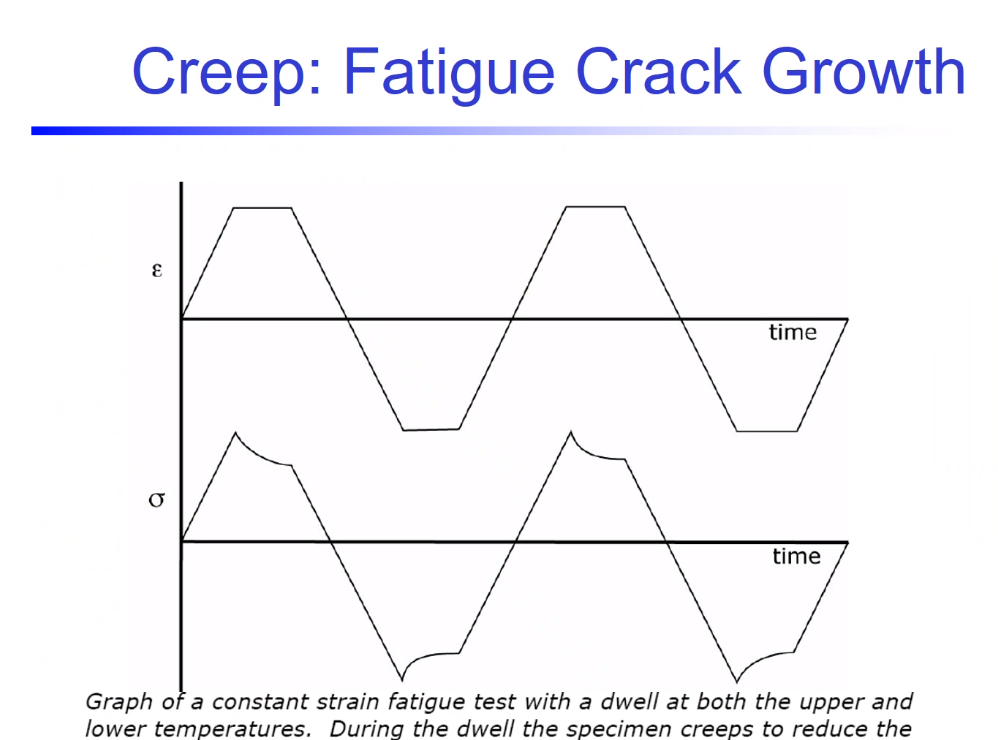

4. History with J-integral to find energy related plasticity in some zone. Creep and plasticity are the same thing. 
   1. The depicted C-star is similar to the J-integral by making an energy argument at the fatigue crack tip.
   2. This has difficulty with multiple failure sites.

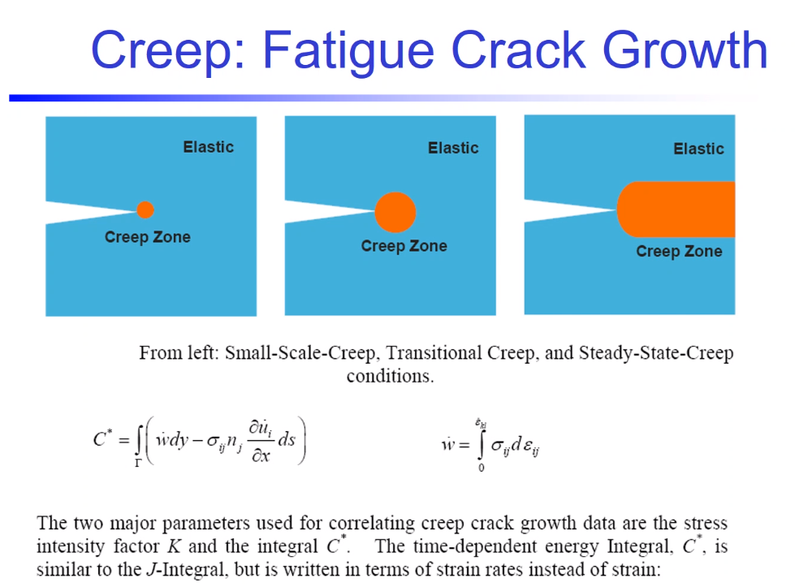

5. Time to rupture comparisons could indicate which mechanism dominates based on number of cycles.
   1. We can add, multiply, exponentiate, or hyperbolic.
   2. This early concept is simply adding. Like adding to damage to corrosion.
   3. If they do interact, multiplicatives and exponentials happen between the hyperbolic interaction. If independent, they add together.
6. Interaction mechanisms can affect each other at any level of creep, because of increased dislocation density by fatigue.
   1. If creep is added to ductile material, does this enhance or shorten the fatigue life?
   2. Adding dislocations harden and prevent crack growth. But persistent shear bands make the grow faster, because of crack initiation serving as incubation sites at the surface.
   3. Fatigue cracks incubate at persistent shear bands. These can initiate creep cracks.
   4. Fatigue has three levels incubation, short crack, long crack and creep has three levels. So the interaction between these levels between the two mechanisms reveals their relation.
   5. Bones exhibit this, because porosity increases with age.
7. High temperature shortens fatigue and tensile strength.
   1. Complex interactions from stress triaxiality.
   2. **Silly putty: creep (coalescence?) dominates, but if made cold enough, fatigue (nucleation?) dominates. YES!!!!!!**
   3. Typically transgranular.
   4. Extrinsic products include corrosion, because of adverse affects from hydrogen in environment.
8. "Hot-tear"--interesting--is similar to casting.
   1. If liquid: hot and larger volume.
   2. Solid: volume shrinks and tears around oxides.
   3. Dependent on humidity, because it leaves in shrinkage to nucleate these cracks.
   4. This could be how the tectonic plates formed between Day 3 of Creation and The Flood: nucleating cracks and then tearing open from some event (meteor or else).
9. asdf
10. Some interaction exists between creep and corrosion.
    1.  What happens in mechanics?
    2.  What happens in materials?
    3.  We are bridging these together.
11. Hot corrosion
    1.  Ceramic hip replacement with high resistance to corrosion.
    2.  Titanium has polyethylene coating, but can have bio-degradation.
    3.  This ceramic uses steel to coat the chromium/cobalt center, which hopefully does not crack.
    4.  Why not titanium? Maybe mating or just not explored yet.
    5.  Corrodes faster when hotter from accelerated chemistry.
12. Liquid metal embrittlement, but not popular.
13. Can fill cracks other materials and can drive crack growth in temperature change.
    1.  Competition between COTE and Young's Modulus.
    2.  This induces shear stresses at boundary or interface of dissimilar metals: alloys included at all length scales.
    3.  Previously, we called this galvanic corrosion, but there, temperature was constant.
14. Thermal fatigue and mechanical fatigue overlap. They dominate the rate of dislocation motion differently.
    1.  Wrought with fracture and failure.
    2.  Fracture Group: Sanford in Pittsburg.
        1.  1700: forces.
        2.  1800: stresses.
        3.  1920's: energy.
            1.  Irwin equation (1923).
            2.  Tim Moshenko

