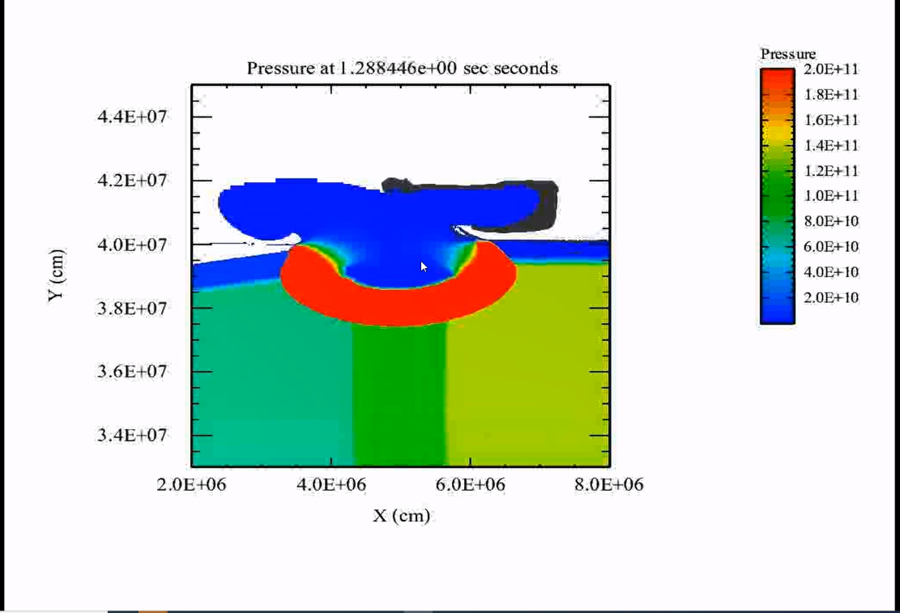

# Atomistic Simulations

## Polyethylene
- Crystalline structure and amorphous.
- Uniaxial tension.
- Poisson's effect visible.

## Car Crash
- #stress-wave triggers airbags. 
- #stress-wave moves faster than the material can respond: before the human can move into the steering wheel.

## Genesis Flood

- Belief that Yucatan meteor caused Genesis Flood.
- Is possible.

## Ram's Horn
- #compression-wave gets reflected to #tension-wave and moves to #shear-wave, before wiggling out at the end of the horns.
- Wiggles out in a manner similar to #Fibonacci-Sequence.
- Same for bison horns or woodpecker's tongue.
- Just changing cross-sectional area dissipates to shear. Adding curvature does this even faster.
- [Pressure wave](pressure-wave.md) onto the brain creates tri-axial tension: **Super bad**.
- Stiffer material--bone--keeps the faster [pressure wave](pressure-wave.md) contained to the stiffer material to give softer, squishier tissue time to respond to the wave.