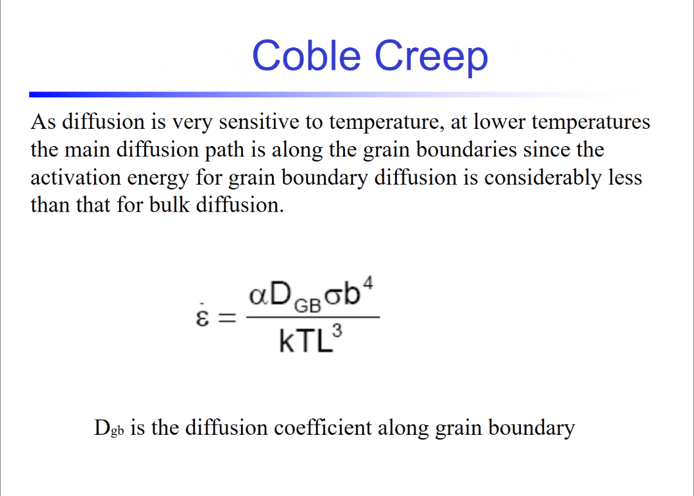

# Creep

Time-dependent strain under constant stress which equals [plasticity](../engr-839-001-mechanical-metallurgy/plasticity.md).
1. #primary-creep: imperfections align. Dominated by #nucleation.
2. #secondary-creep: #equilibrium [work-hardening](deformation-and-work-hardening.md).
3. #tertiary-creep: cracking override, [work-hardening](deformation-and-work-hardening.md). Dominated by #coalescence.

Not all stages may occur.
Though all stages include #nucleation and #coalescence.
Unified-Creep Plasticity ( #UCP ): #ISV -damage for plasticity maps to the stages of creep.

## Herring-Nabarro
$$\dot{\epsilon} = \frac{D\sigma b^{3}}{kTL^{2}}$$

## Coble

## ISV
1. Two #ISV variables:
   1. H: #hardening
   2. $R_{d}$: #dynamic-recovery ( #glide )
   3. $R_{s}$: #static-recovery ( #climb )
2. If integrate damage ( #creep-rate ), then time becomes important.
3. $\dot{\phi}_{pores}$ is the same equation used in the [high-rate phenomena](high-rate-events.md). Same underlying mechanism.

## Tests
Creep tests can be stress (see *[Ratcheting](ratcheting.md)*) or strain controlled.
**Strain-controlled is a relaxation test.**
#dynamic-recovery ( #glide ) and #static-recovery ( #climb ) in #ISV #hardening.
Creep plays a role into every test, but people misuse the term in their tests.