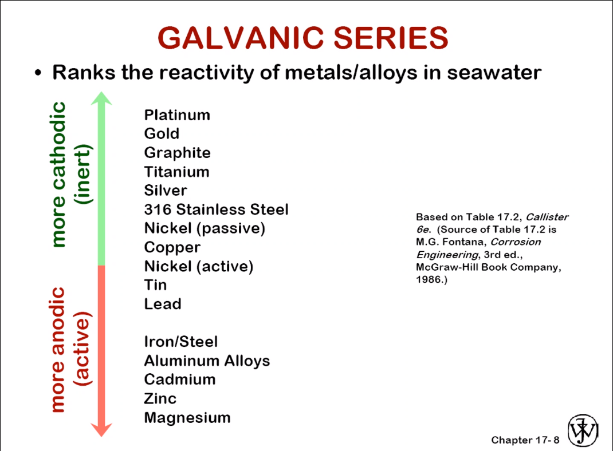
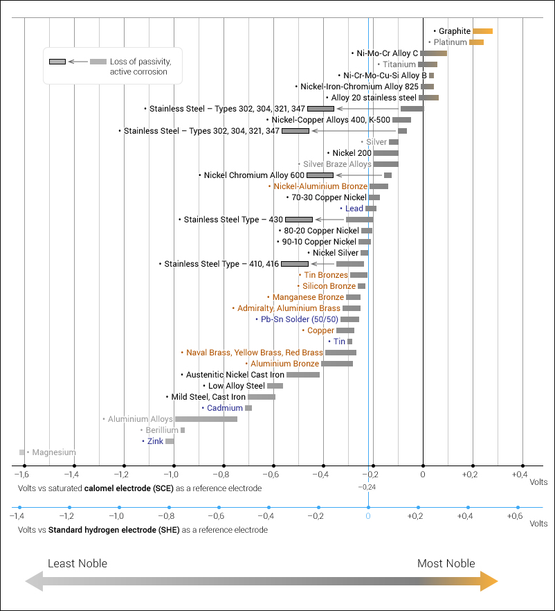

# Galvanizing

The difference of #electronegativity in dissimilar metals wherein the more anodic metal corrodes first.
Galvanic reactions happen between two dissimilar metals, which corrode at different rates.
This does not mean they do not corrode, only at different rates.
The #electronegativity of a chemical bond is not obvious, but surely a pattern exists.

