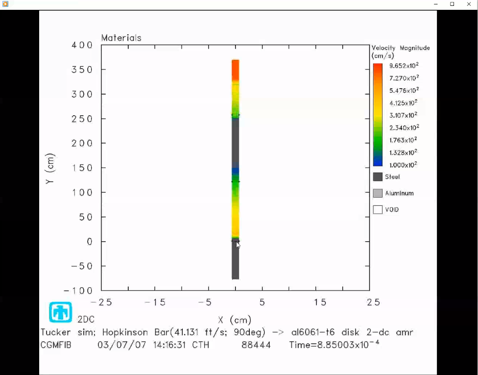
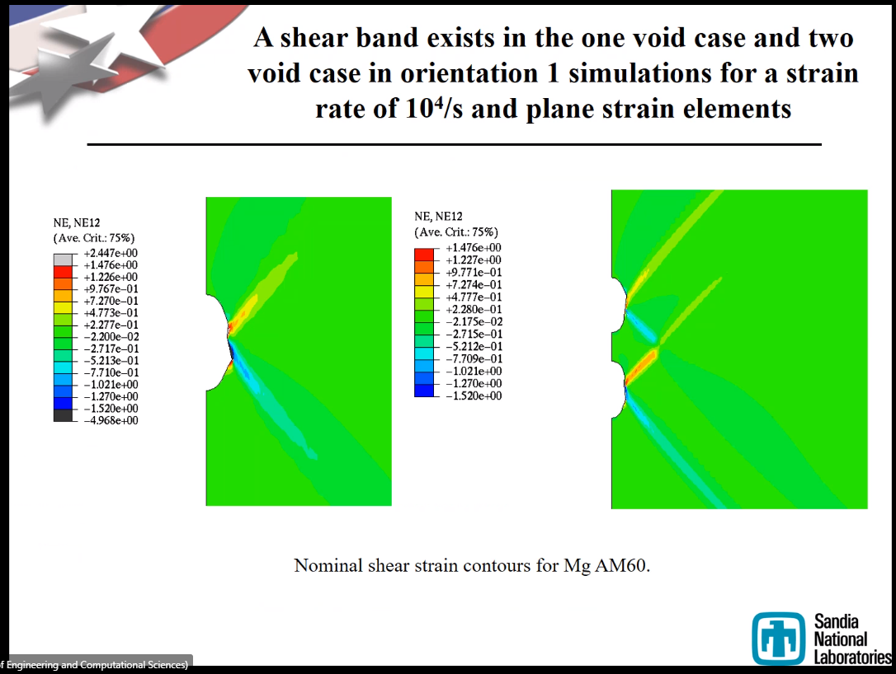

# High-Rate Events

- Covering high-rate phenomenon.
- Shockwave, #stress-wave, and [pressure wave](pressure-wave.md) are synonymous, but fluids people will reject the work, because shockwave relates to speed of sound in a medium.
- [Pressure wave](pressure-wave.md) is the long-diagonal (first #invariant) of the #stress-tensor.
- In previous classes, we say that stress is seen throughout the whole body, but now we say that is varies through the part, because of the high-rate nature.

- $\sigma_{xx} = \sigma_{zz} = 0$. This is uniaxial.
- 3 waves in #Hoppy-Bar
  - [Incident](incident-wave.md): initial contact to hockey puck specimen.
  - [Transmitted](transmitted-wave.md): through specimen to other side of #Hoppy-Bar.
  - [Reflected](reflected-wave.md): reflection of wave back up #Hoppy-Bar from specimen.
- The [reflected wave](reflected-wave.md) is opposite of the sense of the [incident wave](incident-wave.md) upon a #free-surface.
  - Not as simple as the difference of the front and back of a wave.
  - The [reflected wave](reflected-wave.md) is very sensitive to the time domain.
  - Also extremely sensitive to material geometry.
- _Easy journal paper for high-rate data for your material._
- Can also generate stress-strain curve from video recording, because you know the frame rate.
- [Wave speed](wave-speed.md)
- #Hoppy-Bar of #magnesium:
  - #slip-planes at $45\degree$. #twinning-planes?
  - There is no #barreling, because the surfaces attempt to remain friction free.
  - Force cannot be found, because the [pressure wave](pressure-wave.md) has already moved through the material, and we can only see the strain with our eyes.
- #Mark-F-Horstemeyer became a believer in simulation experiments by validating with physical experiments of high-rate explosions for submarine design in 1990.

- If the [reflected wave](reflected-wave.md) is opposite in sense to the [incident wave](incident-wave.md) from a #free-surface.
  - If compression, tension would try to open a void.
  - What if we did two #voids within a material?
  - Shear occurred in single void, but not for two.
  - Therefore, #strain-rate dependent. 

[Hydrodynamics](hydrodynamics.md)
: strength of material does not matter, because the strain rate is so high.

- The strain-rate threshold is $10^{5}/s$ when state of material does not matter: hydrodynamics.