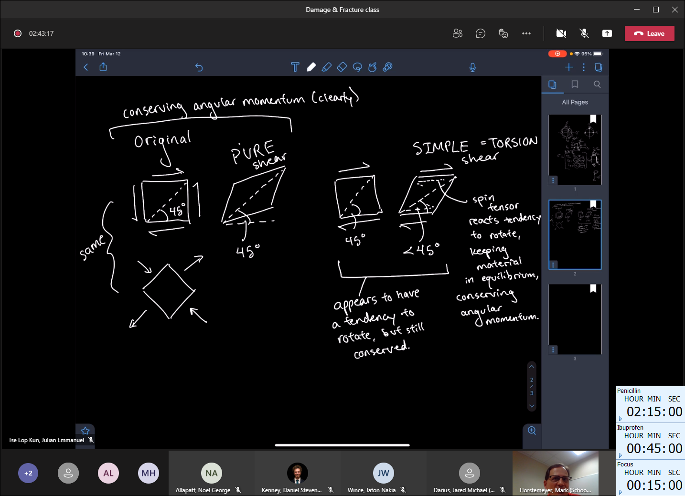

# Lesson 16: Fracture Mechanics

1. Ship-cyclic loading - waves and cargo
   1. Conflict of design objectives between businessmen and engineers.
      1. Businessmen want to minimize costs.
      2. Engineers want to keep things safe.
2. Ideal versus Real behavior
   1. $TS_{eng} << TS_{ideal}$
   2. Real strength of material is always less than ideal, because flaws exist.
   3. Flaws cause premature failures.
   4. Larger samples are more flawed.
3. #fracture-toughness, $K_{ic}$
   1. Four uses of variable, $K$ that are intimately related:
      1. $K_{t}$ - [stress concentration](stress-concentration.md) factor
      2. $K$ - #stress-intensity factor
      3. $K_{c}$ - #critical-stress-intensity factor
      4. $K_{IC}$ - #plane-strain-fracture-toughness
4. #fracture-mechanics
   1. Now on analysis for #cracks.
      1. [Elastic](elasticity.md) analysis.
      2. Works for #brittle materials excellently.
      3. #ductile materials not as good.
5. Why not good for #ductile materials?
   1. There is a #plastic-zone.
   2. #crack-tip-blunting.
   3. #plastic-deformation.
6. #crack-deformation-mode
   1. #Mode-I: opening.
   2. #Mode-II: in-plane ([simple](simple-shear.md)) shear.
   3. #Mode-III: out-of-plane ([tearing/pure](pure-shear.md)) shear.
7. #Mode-I and #Mode-II surface #cracks.
   1. #mode-mixing is a linear, #superposition of #failure-modes .
   2. [Mohr's circle](../engr-727-001-advanced-mechanics-of-materials/mohrs-circle.md):
      1. Lets you move from one plane to another to see how the stress changes.
      2. By [Mohr's circle](../engr-727-001-advanced-mechanics-of-materials/mohrs-circle.md), we see that #Mode-II dominates, because it is [pure shear](pure-shear.md).
   3. This bridges material science and mechanics by convolving internal flaws and #boundary-conditions.
8. #Mode-I
   1. Zigzagging photo has local shearing ( #Mode-II ) at another length scale down.
   2. But at naked eye, it's Mode I.
   3. **The length-scale you choose is important!**
   4. _Q: Does that mean #brittle-fracture is always #Mode-I?_
      1. Different audience ask different things, because context matters: >"It depends." <cite> #Mark-F-Horstemeyer
      2. These modes are independent of the material, because they are mechanics terms.
      3. These modes can happen for any material.

!!! hint Recall what a #stress-tensor is.
    _1, 2, 3 = x, y, z_
    The first number is the face.
    The second number is the direction.
    $$\sigma = \begin{bmatrix}
    \sigma_{11} & \sigma_{12} & \sigma_{13} \\
    \sigma_{21} & \sigma_{22} & \sigma_{23} \\
    \sigma_{31} & \sigma_{32} & \sigma_{33}
    \end{bmatrix}$$
    If a 2x2 sub-matrix applies $\longrightarrow$ in-plane.
    If more than 2x2 $\longrightarrow$ out-of-plane.

9.  #Mode-II
   5.  We see [striations](striations.md) (kind of like #fatigue).
   6.  [Simple shear](simple-shear.md) (torsion) produces a straining of the element, but the diagonal angle remains constant.
       1.  2 faces of the element.
       2.  It does not look like it, but momentum is conserved.
   7.  Pure shear
       1.  4 faces of the element.
       2.  Plane strain compression produces this exact same thing.
       3.  Conserves angular momentum.
   8.  This Conservation of Momentum is plastic-spin (continuum).
10. Theoretical strength
    1.  If no defects were present, what is the strength?
    2.  $\sigma_{th} = \frac{E}{2\pi} \approx \frac{E}{10}$.
    3.  Theoretical strengths are far greater than real values!
    4.  #fracture doesn't occur like this.
    5.  $\sigma_{th} = \sqrt{\frac{\gamma E}{a_{0}}}$
        1.  $\gamma$ is an energy term which includes strain.
        2.  "Strain" here is the distance of atoms, which is the #crystal-structure-parameter!
11. Critical stress for #crack-propagation
    1.  Stress at #crack-propagation
    2.  $\sigma_{c} = \sqrt{\frac{2E(\gamma_{s} + \gamma_{p})}{\pi a}}$
        1.  $\gamma_{s}$ dominates if #ductile.
        2.  $\gamma_{p}$ dominates if #brittle.
12. #fracture-toughness
    1.  measure of material's resistance to #brittle-fracture.
    2.  Depends on:
        1.  Material size & geometry (Y),
        2.  Crack dimension & orientation (a),
        3.  Manner in which the load is applied.
    3.  #Charles-Inglis tried to solve a #BVP.
        1.  This could not be solved until 1920 in Pittsburg, PA.
    4.  [Fast-Fracture condition](fast-fracture-condition.md): $K = \sigma_{c}\sqrt{\pi a_{0}} = \sqrt{EG_{c}} = constant$! Where $G_{c} = 2(\gamma_{s} + \gamma_{p})$.
    5.  Back to [Mohr's](../engr-727-001-advanced-mechanics-of-materials/mohrs-circle.md)
        1.  Assumes a #homogeneous material.
        2.  Maximum #principal-stress, $\sigma_{1}$ where $\tau = 0$: no shearing!
        3.  Can move from any #stress-state, but there is still a **#maximum-principle plane with no shearing**.
    6. In the lab, you are forcing the material to ( #transformation-tensor from #continuum ) find a the plane of #maximum-principle stress.

