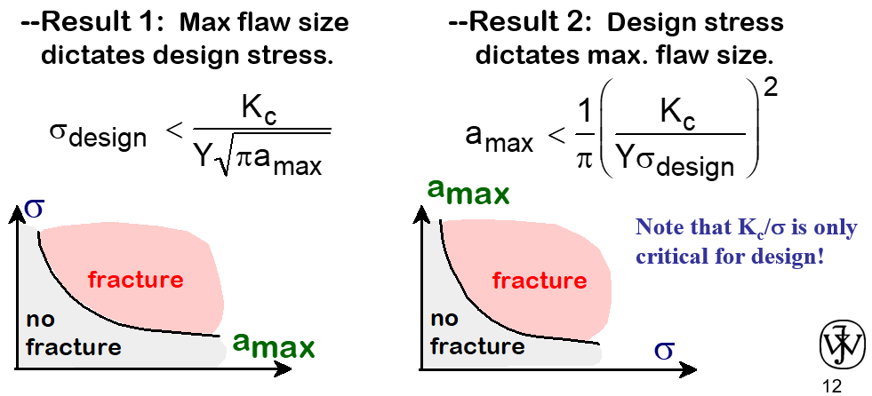

# Lesson 17: Fracture Mechanics Applications

1. #fracture Application
   1. We usually think of #fracture as a bad thing.
   2. Egyptian Pharaohs actually use #fracture to cut the limestones to build the pyramids.
   3. Ice is actually rather plastic:
      1. #HCP like magnesium and titanium.
      2. Crystallographic structure.
   4. Used to cut glass sheets.
   5. Can be seen around man hole covers and window frames.
2. Design Concepts
   1. Applied stresses < Tensile strength
   2. Applied stresses < Endurance limit
   3. 20th century disaster
      1. Titanic (1912) _DTBT_
      2. Molasses tank (1912)
      3. Liberty ships (1940s) _temperatures_
      4. Aloha Airline (1988) _corrosive environment_
      5. United-Sioux city crash (1989)
3. Famous Failures
   1. Sewer mains in:
      1. Atlanta, Georgia
      2. Hickory, NC
      3. Whitehouse, Yukon Territory
      4. Hunt Valley
4. #fracture (Terminology)
   1. #crack-initiation and #crack-propagation or #crack-formation and #crack-growth.
   2. We used #nucleation and #coalescence.
   3. [Ductile](ductile-fracture.md)
      1. Extensive #plastic-deformation.
      2. Slow #crack-growth: "stable"
   4. [Brittle](brittle-fracture.md)
      1. Almost no #plastic-deformation.
      2. Very rapid #crack-growth: "unstable"
   5. Driving force versus resisting material
      1. Driving force relates to crack size.
      2. Remember the equation: $K_{1} = \sigma\sqrt{\pi a}$. **Dependent on $a$**.
      3. San Andreas Fault is #Mode-II: sliding
         1. A movie played off the idea that it was #Mode-I.
5. #fracture-mechanics
   1. Often use $2a$, because lab tests start with edge cracks.
      1. It is confusing, but we use $a$.
   2. #ductile materials can still undergo fast fracture when the crack size is large enough.
      1. There is such a thing as the $J-integral$.
6. Recall from Last Class
   1. $K_{ic} = \sigma\sqrt{\pi a}Y$.
7. Example 1: Nuclear Pressure Vessels
   1. Material is chosen for certain properties (corrosion resistance, etcetera)
      1. This fixes $K_{ic}$.
   2. In the component, allow for the presence of large flaw since these are detectable and correctable
   3. Boundary Conditions:
      1. Chemical
      2. Pressure
      3. Temperature
      4. Nuclear
      5. Mechanical

!!! info Tangent
    - Many tests perform mechanical.
    - Some include temperature.
    - Few include corrosion.
    - **None*- include nuclear.
    - None include electro(magneto)-plasticity.

8. Example 2: Aircraft Wing
   1. Two designs to consider:
      1. Design A:
         1. Largest flaw is 9mm
         2. Failure stress = 112 MPa
      2. Design B:
         1. Use same material
         2. Largest flaw is 4mm
         3. What is failure stress?
   2. Use $\sigma_{c} = \frac{a}{b}$
9. Example 3: Aerospace Application
   1. Material is chosen for certain properties
   2. In the component, fix the design stress
12. Designing Against #crack-growth
    1. #crack-growth condition: $(K_{ic} = \sigma\sqrt{\pi a}Y) \geq K_{c}$.
    2. Largest, most stressed cracks grow first!
    3. Result 1: $\sigma_{design} < \frac{K_{c}}{Y\sqrt{\pi a_{max}}}$
    1. Result 2:
    2. $a_{max} < \frac{1}{\pi}(\frac{K_{c}}{Y\sigma_{design}})^{2}$

13.  #fracture-toughness: Example 1
    1. _Q: Is the remote stress still the applied, even if there is a hole?_
    2. **A: What is the maximum #principal-stress, because that is the applied stress. This is also used in #FEA.**
       1. #superposition only works for linear elastic for ceramics in #FEA.
       2. #FEA codes implement plasticity automatically. 
       3. Inclusion of these calculations are only necessary if the lower length-scale is important, but not included in the mesh.
2.  #fracture-toughness: Example 2

*[HCP]: Hexagonal Close-Packed