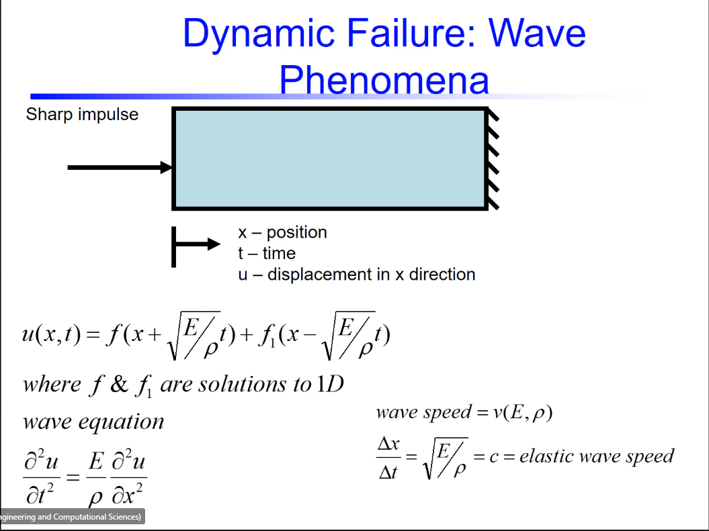
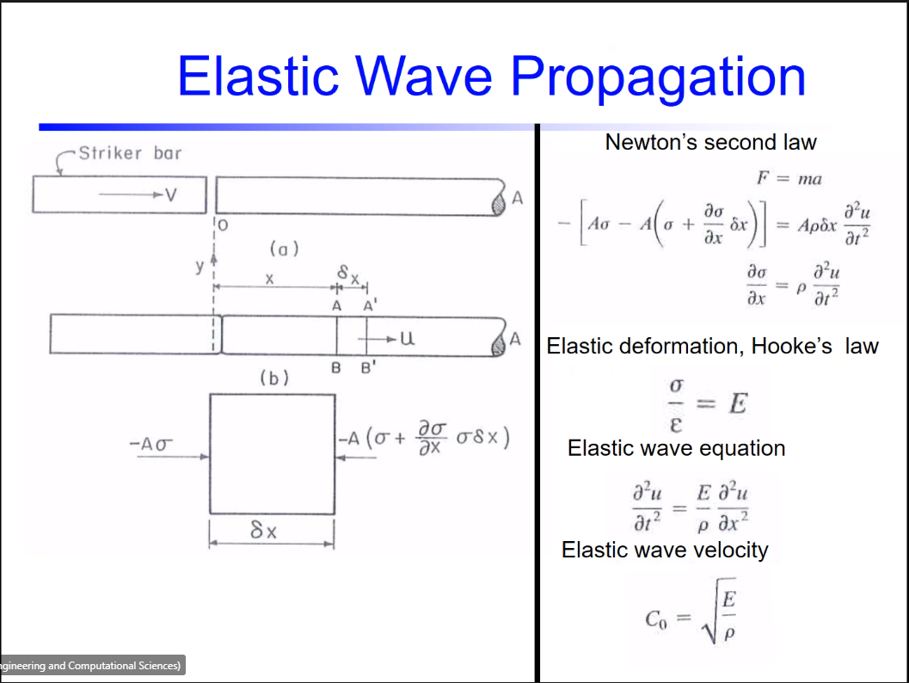
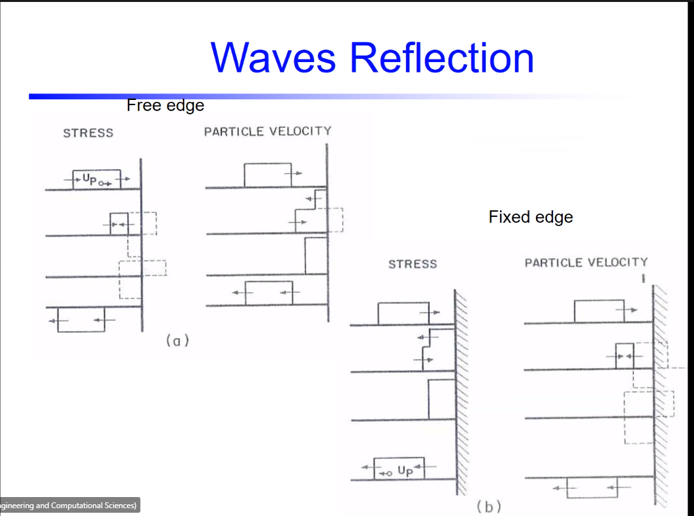
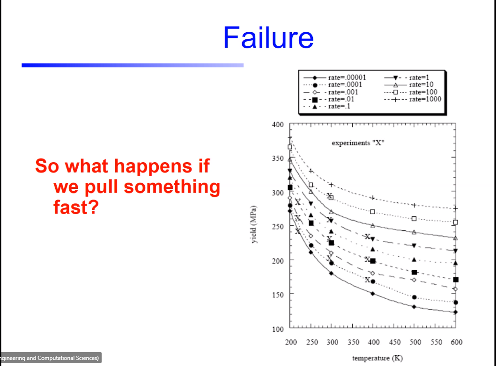

# Lesson 27: Failure of Engineering Materials: High-Rate Phenomena

1. You want the [pressure wave](pressure-wave.md) to collapse on the structure.
   1. Wave is faster than material.
   2. Projectile, then [pressure wave](pressure-wave.md), and then water jet to sink submarine.
2. High rate events have broad applications.
3. Civil applications in welding or forging.
   1. Archimedes can detect density.
   2. Ultrasound uses wave speed, and you can solve for [Young's Modulus](youngs-modulus.md).
   3. This actually more accurate than a mechanical machine, because of the error and compliance in the machine.
4. Space is all high rate events.
   1. Do these events hold in a vacuum?
   2. [Wave speed](wave-speed.md) of the fabric of space is the transverse #shear-wave that is the speed of light.
   3. The speed of light is the fastest thing in the universe, because [Poisson's ratio](../engr-727-001-advanced-mechanics-of-materials/poissons-ratio.md) is 1 (Ticho).
5. Military projectiles and armor take this into consideration.
6. Types of #elastic-wave
   1. #longitudinal-wave or #irrotational-wave
   2. #distortional-wave or #shear-wave or #transverse-wave
   3. #surface-wave or #Rayleigh-wave
      1. #Mark-F-Horstemeyer's first paper
7. #Hoppy-Bar can measure all three stress states: compression, tension, and torsional.
8. Static behavior does not matter.
   1. Grain scale: fractures
   2. #atomistic-length-scale: dislocations
9. Dynamic Failure
   1.  Bruce Li used this principle to chop through concrete.
   2.  **[Spallation](spallation.md): nucleates cracks into fracture from new #free-surface at the back side of the material, because the high compression in a small area gets reflected into tension to create these notch roots.**
   3.  **QUIZ!!**
10. [Pressure wave](pressure-wave.md) faster than material response.
11. Wave Phenomena
    1.  
    2.  $\frac{\delta x}{\delta t} = \sqrt{\frac{E}{\rho}} = c$, elastic wave speed.
    3.  This is a deformation equation of motion. Similar to rigid-body equations, but not based on vibrations.
    4.  The size of a mesh determines the numerator, and the density affects the time step, because [Young's Modulus](youngs-modulus.md) is fixed.
12. 
    1.  #Newtons-Second-Law-of-Motion derives into our equations.
    2.  Coupled with [Hooke's Law](../engr-727-001-advanced-mechanics-of-materials/hookes-law.md), we get [Young's Modulus](youngs-modulus.md).
    3.  These give us space-time equations.
13. [Spalling](spallation.md) occurs on the reflecting #free-surface.
    1.  Not an example of momentum.
    2.  *Think back to a particle in an ocean wave.*
14. 
15. Can get a #stress-strain-curve from these waves.
    1.  Vehicles used quasi-static data for design, which is not conservative, because it over-estimates yielding.
    2.  This was solved by factors of safety; however, this makes vehicle heavy, slow, and expensive.
16. Does temperature or #strain-rate drive material response? It depends for each material.
    1.  
17. #fracture-toughness: material property
    1.  Does not change, but is dependent on thickness of specimen.
    2.  Decreases at some threshold of strain-rate.
    3.  **Higher strain rate, nucleation rate of damage goes up, failure at elongation happens sooner, and then fracture toughness goes down.**
    4.  $K_{IC} = \sigma\sqrt{\pi a}$: 
        1.  $\pi$ does not change.
        2.  $a$ does not change.
        3.  $\sigma$ depends on the amplitude of the pressure wave.
    5.  No such thing as a strain wave.

## Comments

- Spalling occurs because of the sharp change in compression to tension tears the material off.
- Pressure waves _must_ be brought into car accidents.
- We know of ocean waves, light and radio waves, and electromagnetic waves from the sun. Now we are saying there are mechanical waves.
- **Is there a temperature threshold similar to a strain rate threshold?** _The model allows for that and would be a straight forward numerical experiment._