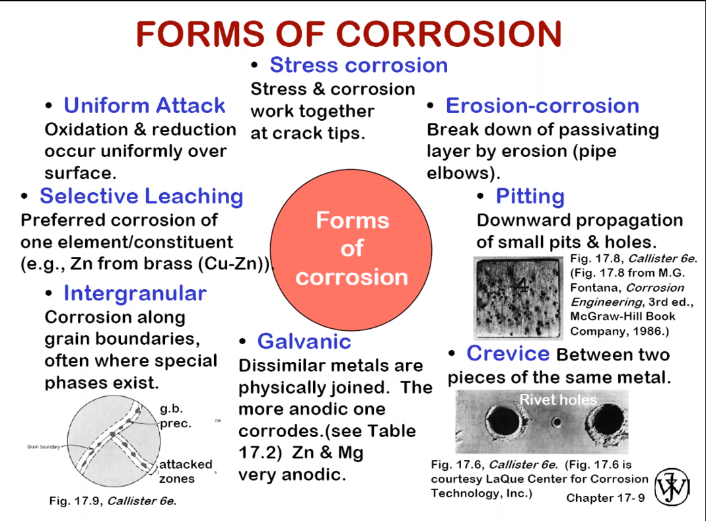
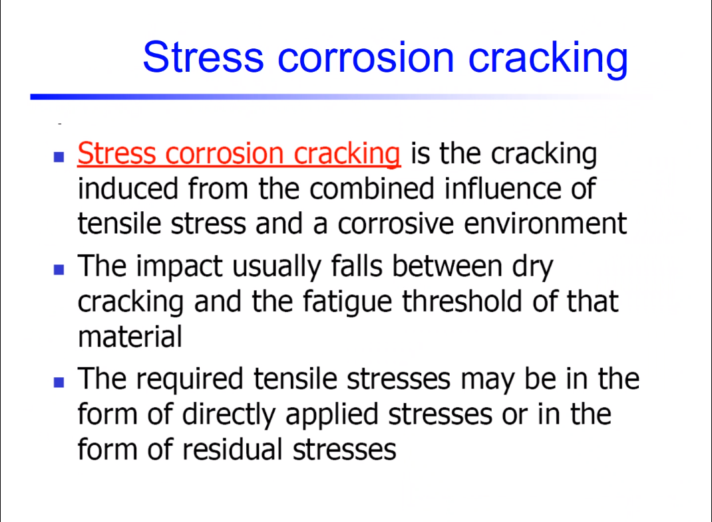

# Lesson 29: Corrosion Failures

1. Commonly in the F/A 18 fighter
2. Background
   1. Safe-life uses #crack-length until #failure
   2. US thought it was from static overload
3. Non-destructive evaluation (NDE)
   1. Dye penetrant
   2. #Eddy-current: measures #cracks by variations in magnetic waves.
   3. Found #pitting and #beach-marks: the #pits reached some length and existed for some time.
4. Chemical analysis revealed $Cl^{1-}$ attracted to $Al^{3+}$.
5. #fractography
   1. [striations](striations.md) indicate [fatigue](fatigue.md), necessary to it, but not sufficient.
   2. #pits without [striations](striations.md) is not the whole story.
   3. [corrosion](../engr-839-001-mechanical-metallurgy/corrosion.md), [fatigue](fatigue.md), and stress loads.
6. Mechanical Testing
   1. #crack-growth-rate increases in corrosive environment for low-frequencies: #corrosion-fatigue
7. [Corrosion and degradation](../engr-839-001-mechanical-metallurgy/corrosion.md)
   1. Why does [corrosion](../engr-839-001-mechanical-metallurgy/corrosion.md) occur?
   2. What metals are most likely to corrode?
   3. How do temperatures and environment affect #corrosion-rate?
   4. How do we suppress [corrosion](../engr-839-001-mechanical-metallurgy/corrosion.md)?
8. Businesses do not like preventing [corrosion](../engr-839-001-mechanical-metallurgy/corrosion.md), because of the high upfront costs.

9. Length scales differ.
   1.  [Galvanizing](galvanizing.md)
   2.  Allowed chemical reactions. If in a corrosive environment, chemistry happens quicker.
   3.  #pitting looks like a void the size of a particle, because chemistry happened at that particle.
       1.  This reduces cross-sectional area.
       2.  Also includes a #notch-root-radius [stress concentrator](stress-concentration.md).
       3.  _Mercury Marine_ boat motors made of #magnesium (the most anodic element) never corrodes, because they pass electricity through the entire motor. Yes this does sound like an explosion waiting to happen.
       4.  Mechanical types: general/uniform, #intergranular, and #pitting.

[COMETMAN](cometman.md)

1.  [Galvanic reactions](galvanizing.md) happen between two dissimilar metals, which corrode at different rates. This does not mean they do not corrode, only at different rates. The electronegativity of a chemical bond is not obvious, but surely a pattern exists.

11. [Stress-corrosion cracking](stress-corrosion-cracking.md): not fully understood yet.
    1.   Cracking induced from combined influences of tensile stress and corrosive environment.
    2.   Impact between dry cracking and fatigue threshold.

12. Increasing "T-speeds" is stress, where the "T" is triaxiality.