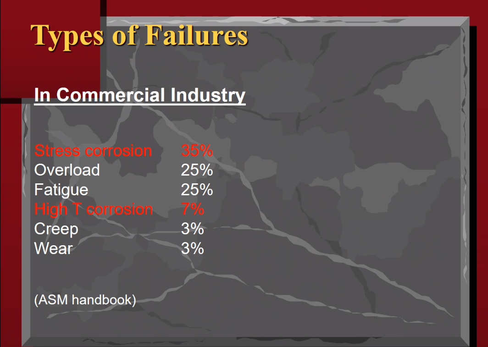
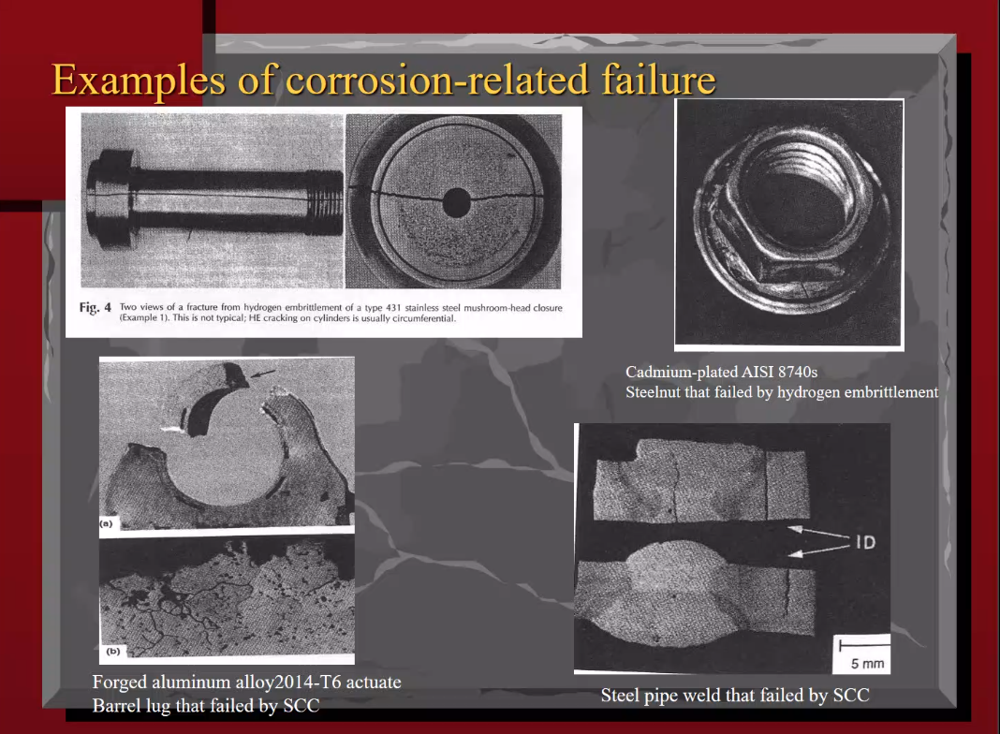
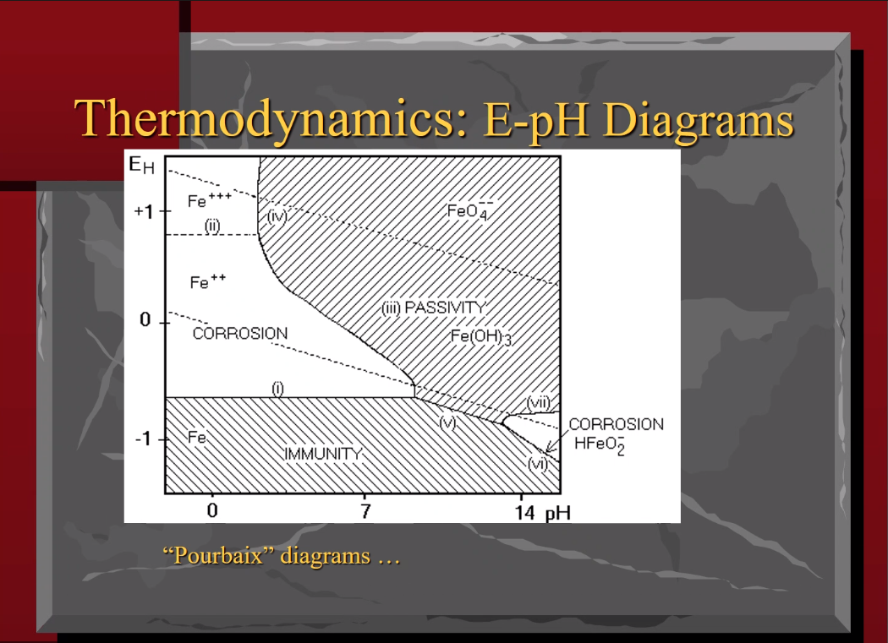
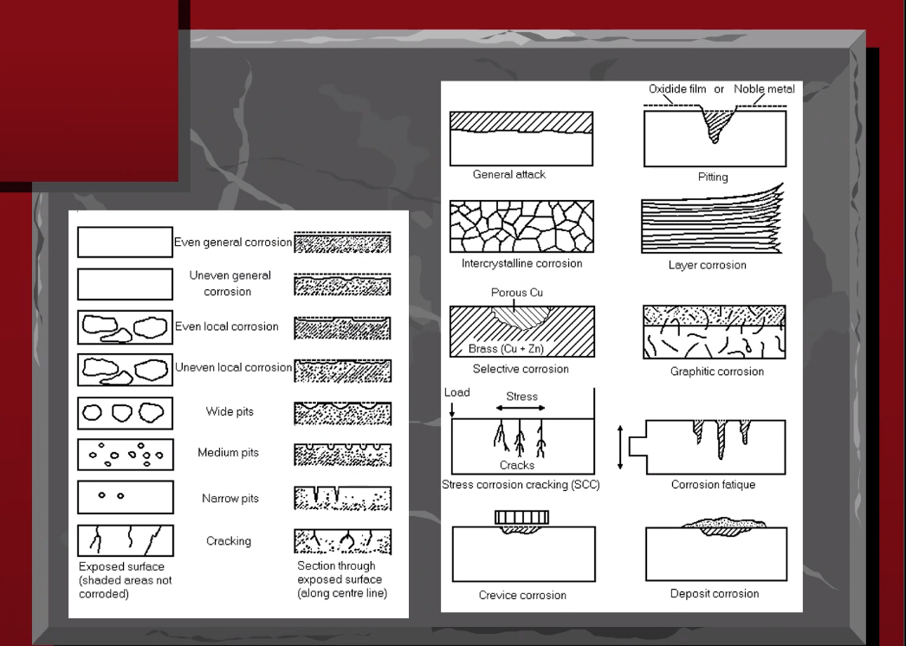
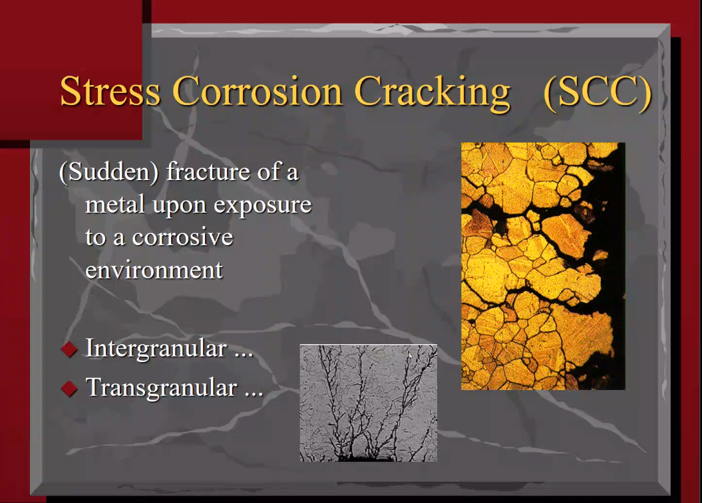
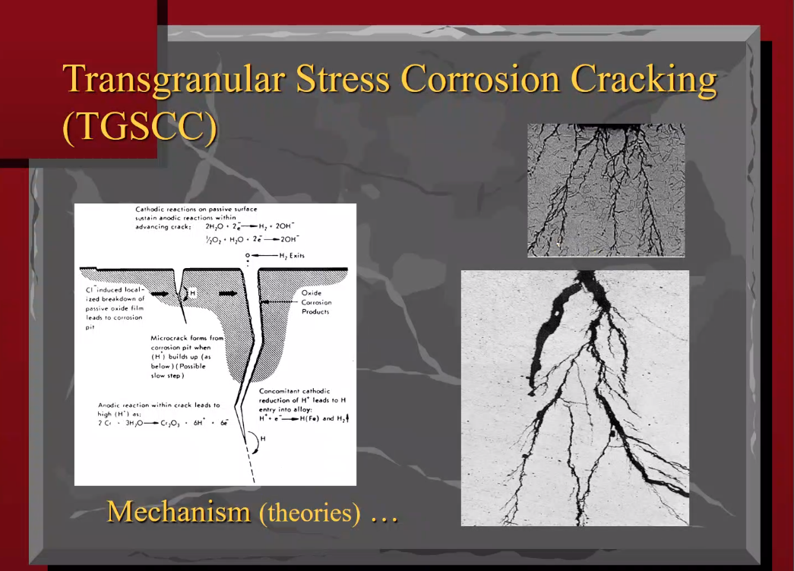
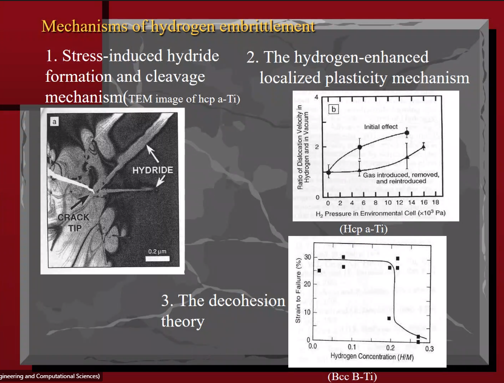

# Lesson 29: High Temperature Corrosion

1. In general, #corrosion-rate increases with more heat.
2. [corrosion](corrosion.md):= destructive interaction between _material_ and its _operation environment_.

3. Everything is #stress-corrosion, because only in a vacuum is there no environment.

Type | Percent
-|-
Stress Corrosion | 35%
Overload | 25%
Fatigue | 25%
High T Corrosion | 7%
Creep | 3%
Wear | 3%

1. #hydrogen-embrittlement by #hydrogen-diffusion into bulk material.
   1. Moves into #interstitial spaces in bulk material for #damage-nucleation.
   2. Not only does hydrogen take up some volume, it thermodynamically wants to bond to the alloying particles.
   3. In #Mark-F-Horstemeyer's steel ball, it is in triaxial stress without a #traction-force, because of the #hydrogen-embrittlement.
   4. The triaxiality increases #free-volume, locally. So hydrogen moves there. It tries to fill the #voids present in the material.
   5. #nucleation increases, governed by #diffusion.
   6. **Why does the #fracture-toughness lower?** _Does affect the #stress-intensity, but not directly._
   7. [corrosion](corrosion.md) is thought as an environment problem, but hydrogen is not thought as environment because the mechanism is different.

5. Nernst equation depends on the #activation-energy. $$E = E^{0} + \frac{RT}{nF}ln(\frac{a_{ox}}{a_{red}})$$
6. Reduction reactions
   1. Acidic: $2H^{+} + 2e^{-} \rightarrow H_{2}$
   2. Alkalinic: $O_{2} + 2H_{2}O + 4e^{-} \rightarrow 4OH^{-}$

7. [Passivation](passivation.md):= oxidation layer formed to prevent chemical reaction, whether created or not by chemical.
1. Fails locally by brittle-fracture.
2. All depends at what length-scale of reference.

8. Microbiology [corrosion](../engr-839-001-mechanical-metallurgy/corrosion.md) could be driven by gas release in microbiological reactions.