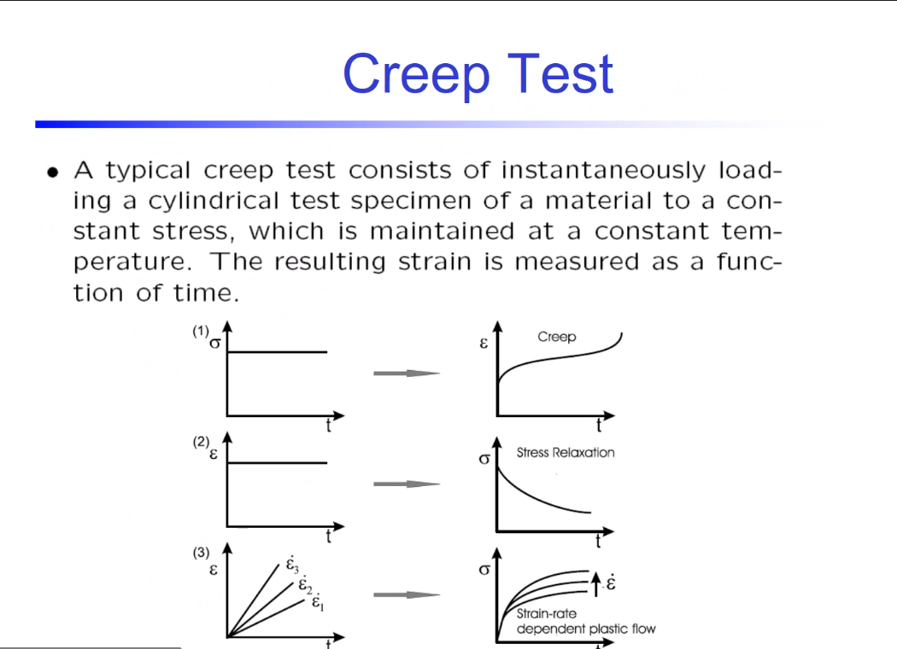
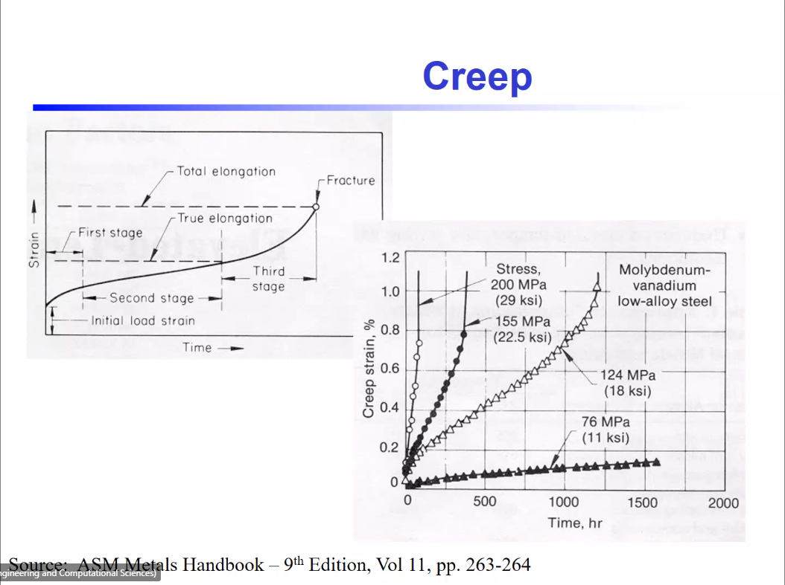
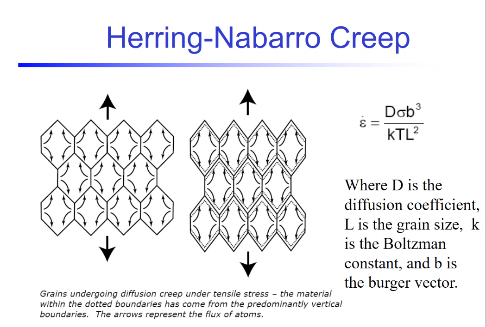

# Lesson 31: Elevated Temperature Failures: Creep

1. Typically at elevated temperatures some ratio to the melting temperature of the material.
   1. Absolute temperature.
   2. Modeling uses absolute temperature, but reported in scaled temperature for legibility.
2. Tension induces a #mean-stress, which is worse for #fatigue-life. 
   1. $R = \frac{\sigma_{min}}{\sigma_{max}}$. 
   2. When less than 1, reported as -1.
   3. #mean-stress increases the R-ratio.

3. Coefficient of efficiency is rather low for most combustion engines. 
4. [Creep](creep.md)
5. [Creep](creep.md) tests can be stress or strain controlled.
   1. **Strain-controlled is a relaxation test.**
   2. #dynamic-recovery ( #glide ) and #static-recovery ( #climb ) in #ISV hardening.

6. Plastic-rate of deformation.
   1. [Creep](creep.md) curve changes for different loads.

7. Ashby maps [creep](creep.md) for shear strain and melting temperature to ascertain dominating mechanism in [creep](creep.md).
   1. Elevated temperatures reduce the #activation-energy of chemical bonding, which allows #plastic-flow.
   2. [Creep](creep.md) #climb in #dislocations, [plasticity](../engr-839-001-mechanical-metallurgy/plasticity.md) #glide along planes.
   3. Because this chart is quasi-static, increasing #strain-rate moves the y-axis down.

8. [Herring-Nabarro](creep.md#herring-nabarro): $$\dot{\epsilon} = \frac{D\sigma b^{3}}{kTL^{2}}$$.

9. [Coble Creep](creep.md#coble):

10. Idealization of [creep](creep.md): constant applied stress in constant temperature.
    1.  Applied load will cause [creep](creep.md) to a point.
    2.  In the strictest sense of the definition, is not #fatigue / #creep-fatigue, because the load must be constant, not oscillatory as in #fatigue.
11. #Arrhenius form of dependence on temperature.
    1.  #damage-nucleation and #damage-coalescence just as with [plasticity](../engr-839-001-mechanical-metallurgy/plasticity.md), #fatigue, and [corrosion](../engr-839-001-mechanical-metallurgy/corrosion.md).
12. [Stress rupture](stress-rupture.md)
13. [Creep model](creep.md#isv) model
    1.  Two ISV variables:
        1.  H: hardening
        2.  $R_{d}$: dynamic recovery (glide)
        3.  $R_{s}$: static recovery (climb)
    2.  If integrate damage (creep-rate), then time becomes important.
    3.  $\dot{\phi}_{pores}$ is the same equation used in the high-rate phenomena. Same underlying mechanism.

