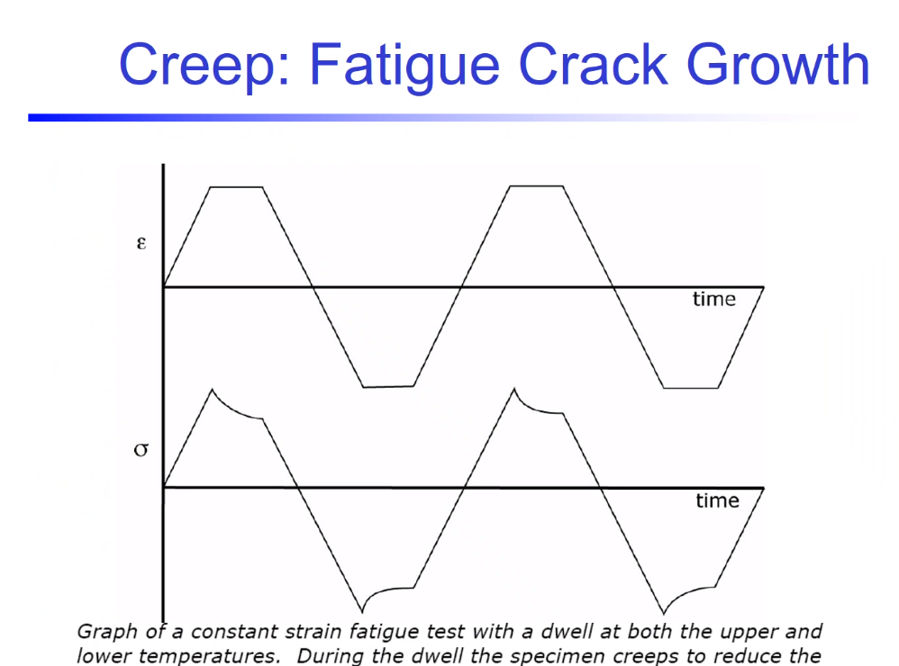
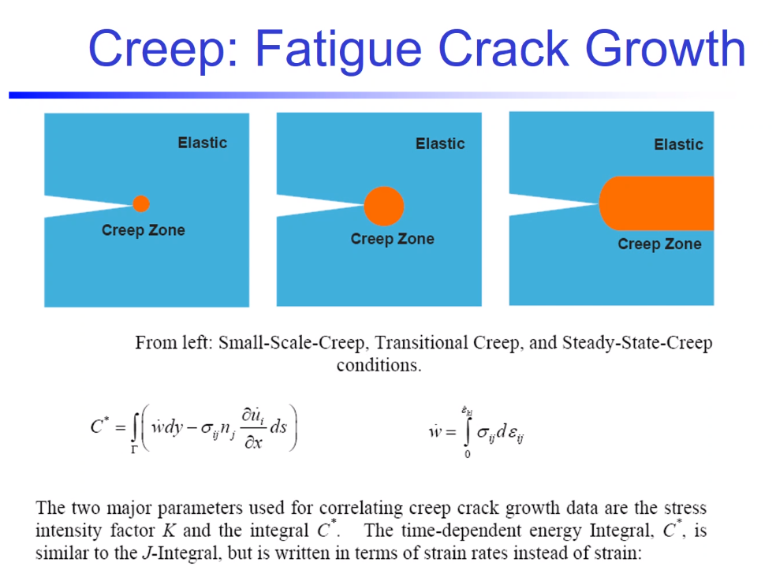

# Lesson 32: Creep Fatigue

1. There are levels to [creep](creep.md) under constant stress, but what if #fatigue is included?
   1. High temperature and cyclic loadings from turning blades.
   2. Constant thermal loads.
2. #fatigue-life shorter in higher temperatures. 3 levels of [creep](creep.md) happen within the #plastic-zone ahead of #crack-tip.
   1. #primary-creep is #nucleation. #tertiary-creep is dominated by #coalescence. This is not to say that the other levels do not include #nucleation or #coalescence. 
   2. [Creep](creep.md) equals plasticity.
   3. Stress and environment are important. Thermal thresholds delineate when something will [creep](creep.md) or won't [creep](creep.md). But want to observe smaller variations. These variations may include [creep](creep.md), but does this need another mathematical model to handle the different #failure-mechanisms.
   4. What are the #creep-rate? Are they independent of the fatigue cycling?
3. #fatigue-crack-growth with juxtaposition of holding the stress or strain constant. Is strain=-constant creep? It is #stress-relaxation to measure the stress.
   1. The first thought to hearing #creep-fatigue is: They held stress constant.
   2. Always ask their definition.
   3. [Ratcheting](ratcheting.md) present.
   4. [Creep](creep.md) plays a role into every test, but people misuse the term in their tests.

4. History with #J-integral to find energy related plasticity in some zone. [Creep](creep.md) and plasticity are the same thing.
   1. The depicted C-star is similar to the #J-integral by making an energy argument at the #fatigue-crack-tip.
   2. This has difficulty with multiple failure sites.

5. Time to rupture comparisons could indicate which mechanism dominates based on number of cycles.
   1. We can add, multiply, exponentiate, or hyperbolic.
   2. This early concept is simply adding. Like adding to #damage to #corrosion.
   3. If they do interact, multiplicatives and exponentials happen between the hyperbolic interaction. If independent, they add together.
6. Interaction mechanisms can affect each other at any level of [creep](creep.md), because of increased #dislocation-density by #fatigue.
   1. If [creep](creep.md) is added to #ductile material, does this enhance or shorten the #fatigue-life?
   2. Adding dislocations harden and prevent #crack-growth. But #persistent-shear-bands make the cracks grow faster, because of #crack-initiation serving as #incubation sites at the surface.
   3. #fatigue-cracks incubate at #persistent-shear-bands. These can initiate #creep-cracks.
   4. [Fatigue](fatigue) has three levels #incubation, #short-crack, #long-crack and creep has three levels. So the interaction between these levels between the two mechanisms reveals their relation.
   5. Bones exhibit this, because porosity increases with age.
7. High temperature shortens #fatigue and tensile strength.
   1. Complex interactions from stress triaxiality.
   2. **Silly putty: creep (coalescence?) dominates, but if made cold enough, fatigue (nucleation?) dominates. YES!!!!!!**
   3. Typically #transgranular.
   4. [Extrinsic](extrinsic-toughening.md) products include #corrosion, because of adverse affects from hydrogen in environment.
8. "Hot-tear"--interesting--is similar to casting.
   1. If liquid: hot and larger volume.
   2. Solid: volume shrinks and tears around oxides.
   3. Dependent on humidity, because it leaves in shrinkage to nucleate these cracks.
   4. This could be how the tectonic plates formed between Day 3 of Creation and The Flood: nucleating cracks and then tearing open from some event (meteor or else).
9. asdf
10. Some interaction exists between [creep](creep.md) and #corrosion.
    1.  What happens in mechanics?
    2.  What happens in materials?
    3.  We are bridging these together.
11. Hot #corrosion
    1.  Ceramic hip replacement with high resistance to #corrosion.
    2.  Titanium has polyethylene coating, but can have bio-degradation.
    3.  This ceramic uses steel to coat the chromium/cobalt center, which hopefully does not crack.
    4.  Why not titanium? Maybe mating or just not explored yet.
    5.  Corrodes faster when hotter from accelerated chemistry.
12. Liquid metal embrittlement, but not popular.
13. Can fill cracks other materials and can drive #crack-growth in temperature change.
    1.  Competition between #Coefficient-of-Thermal-Expansion and [Young's Modulus](youngs-modulus.md).
    2.  This induces shear stresses at boundary or interface of dissimilar metals: alloys included at all length scales.
    3.  Previously, we called this #galvanic-corrosion, but there, temperature was constant.
14. #thermal-fatigue and #mechanical-fatigue overlap. They dominate the rate of #dislocation-motion differently.
    1.  Wrought with fracture and failure.
    2.  Fracture Group: Sanford in Pittsburg.
        1.  1700: forces.
        2.  1800: stresses.
        3.  1920's: energy.
            1.  Irwin equation (1923).
            2.  Tim Moshenko