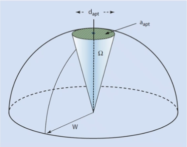

# Resolution

Ability to distinguish separate objects as distinct.
The smallest distance between two points at which they are both distinctly visible.
Reduced with larger #aperture-size.

## Limits
The [Rayleigh Criterion](../engr-837-001-materials-characterization-methods/rayleigh-criterion-for-resolution.md) states that two points are just resolved when the center of the #Airy-disk generated by one point coincides with the first zero of the #Airy-disk generated by the second point: $R = \frac{d}{2} \approx \frac{0.61\lambda}{\mu\sin(\alpha)}$.
$d$ is the #Airy-disk diameter (central spot); $\mu$ is the refractive index of medium between object and lens; $\alpha$ is the half-angle cone of light entering objective; and $\lambda$ is wavelength of light.

|  |
|:--:|
| The #Airy-disk should not severely overlap, or the two points will appear as one. |

## Optimizing in Optical Microscopy
- Use an objective lens with the highest [NA](../engr-837-001-materials-characterization-methods/numerical-aperture.md) possible
- Use high magnification
- Use an eyepiece compatible with the chosen objective lens
- Use the shortest possible wavelength light
- Keep the light system properly centered
- Use oil immersion lenses if available
- Adjust the #field-diaphragm for maximum [contrast](../engr-837-001-materials-characterization-methods/contrast.md) and the #aperture-diaphragm
- For maximum resolution and [contrast](../engr-837-001-materials-characterization-methods/contrast.md)
- Adjust [brightness](../engr-837-001-materials-characterization-methods/brightness.md) for best resolution

## Probe Size in Electron Microscopy
Recall from #optical-microscopy that the wavelength of light determines the resolution for a given [NA](../engr-837-001-materials-characterization-methods/numerical-aperture.md): half the #Airy-disk diameter.
In #electron-microscopy, the #probe-diameter is now the limiting factor, as *it* is scanned across the surface.
The #probe-diameter is related to the #probe-current, $i_{p}$, beam brightness, $\beta$, and #convergence-angle, $\alpha_{f}$.

|  |
|:--:|
| $d_{p} = [(4i_{p})/(\beta(\pi\alpha_{f})^{2})]^{1/2}$ |

!!! question What if we decrease #working-distance and #aperture-size at the same time? How does this affect our [depth of field](../engr-837-001-materials-characterization-methods/depth-of-field.md)? <cite> #Mark-Atwater
    
    |  |
    |:--:|
    | One of the key benefits of #SEM is high [depth of field](../engr-837-001-materials-characterization-methods/depth-of-field.md) for its magnification because the cone is already so narrow. |