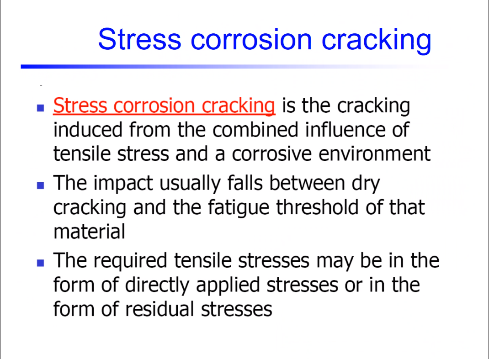
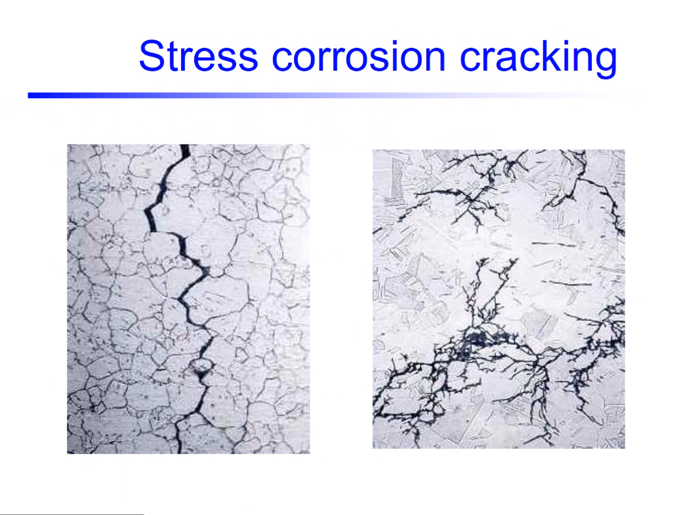

# Stress-Corrosion Cracking

Not fully understood yet.
1. Cracking induced from combined influences of tensile stress and corrosive environment.
2. Impact between dry cracking and #fatigue threshold.
3. No #corrosion-pits, because the #oxide-layers are #nanoscale (difficult to see)

