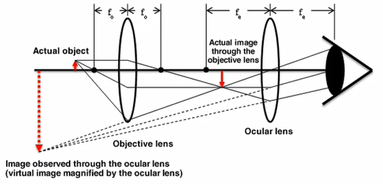
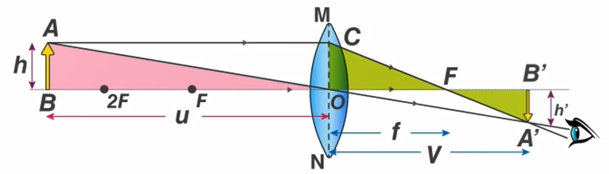
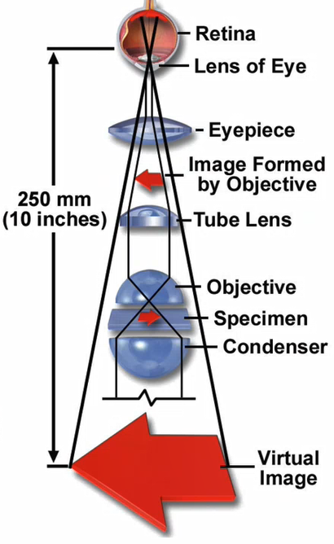

# ENGR 837-001: Materials Characterization Methods
Table of Contents
- [ENGR 837-001: Materials Characterization Methods](#engr-837-001-materials-characterization-methods)
  - [Optical Microscopy Concepts](#optical-microscopy-concepts)
  - [Resolution](#resolution)
  - [Light Microscope Design](#light-microscope-design)

*Lecture (1): August 22, 2022*

***Introduction to Materials Characterization***

We are focusing first on optical and electron microscopy at the beginning of the semester.

***What do you see?***

There are many ways to visualize information from your specimen. The objective of this course is to inform whether or not data presented in work is well-based or not well-founded based on the visual information given.

***Putting it in perspective***

The way a material is analyzed greatly changes the inferences contained therein, and certain techniques or equipments are better suited to glean certain information based on the material. We could see a change at the performance level without a change at the chemistry level. This relationship may be seen in the CPSPP sequence.

*[CPSPP]: CPSPP: Chemistry, Process, Structure, Property, Performance

***Topics this semester***

- Light Microscopy
- Scanning Electron Microscopy
- X-ray Spectroscopy
- Transmission Electron Microscopy
- X-ray Diffractometry
- Thermal Analysis
- Scanning Probe Microscopy
- Electron Spectroscopy

!!! summary Project 1
    - Incorporate a variety of characterization methods applied to common objects
    - The analysis will follow a distinct path and be the same for everyone
    - The work will be done in a group, but each member must be able to…

***Summary***

Characterization adds information, but it does not answer questions without interpretation. Knowing what to look for is half the battle. Figuring out what it looks like and what it means is the rest. There are numerous ways to “look” as a material, and they are often complimentary. Choosing the right combination of techniques will get the most pertinent information with least effort and cost. Not knowing the options…

---

*Lecture (2): August 24, 2022*

## Optical Microscopy Concepts
Objectives
- Introduce concepts and uses of light microscopy
- identify the mechanisms of light focusing and lens design
- Specify the way images are formed and how magnification is calculated

***Basics of Optics***

Light microscopy uses lenses to focus and magnify an object. Some general concepts will be helpful to understand how and why this works. The principle of refraction will be central to lens function. Snell’s law gives us a geometry relationship: $n_{1}\sin(\theta_{1}) = n_{2}\sin(\theta_{2})$.

|  |
|:--:|
| The rate at which light passes through a material differs from material to material. |

!!! example Snell's Law
    |  |
    |:--:|
    | Solve for $\theta_{1}$, $\theta_{2}$, $\theta_{3}$, and $\theta_{4}$. The index of refraction outside prism is $n = 1$ and inside is $n = 1.56$. |

    $$\begin{split}
    \theta_{1} &= 40^{\circ} \\
    \theta_{2} &= \arcsin(\frac{n_{1}}{n_{2}}\sin(\theta_{1})) \\
    \implies \arcsin(\frac{1}{1.56}\sin(40^{\circ})) &\approx 24.3^{\circ} \\
    \implies \theta_{3} &= 30^{\circ} + (30^{\circ} - 24.3^{\circ}) \\
    &= 35.7^{\circ} \\
    \theta_{4} &= \arcsin(\frac{n_{3}}{n_{4}}\sin(\theta_{3})) \\
    \implies \arcsin(\frac{1.56}{1}\sin(35.7^{\circ})) &\approx 65.6^{\circ}
    \end{split}$$

***Convex and Concave Lens***

Refraction Rules for a Converging lens

- Any incident ray traveling parallel to principal axis of converge lens will refract through lens and travel through focal point on opposite side of lens
- Any incident ray traveling through the focal point on the way to the lens will refract through lens and travel parallel

***Imaging***

The purpose of light microscopy is to view an object at increased magnification and/or with some alteration to the light transmitted through or reflected from that object: i.e. to provide information not available with the naked eye. This requires lens and/or filters that manipulate the light. The light must be capture by eye or sensor, and the construction of a microscopy must be suited to the purpose: not all microscopes are the same in quality or capability.

***Vision correction***

Near and far-sightedness are caused by incorrect focusing of incoming light. The “detector” must be within the focal plane of the light to get a clear image. the focal point of most objective lenses (not like a camera) is not variable, so the sample height must be varied.

***Magnification***

|  |
|:--:|
| A simple lens magnifies an object in a *virtual* image that *appears* to be coming from a larger object. The real image will be inverted at the focal point on the side of the lens. |

---

*Lecture (3): August 26, 2022*

***Thin lens equation and magnification***

Magnification depends on the focal length of the lens ($f$) and the distances from the lens to the object ($u$) and image ($V$). Triangles ABO and A’B’O are similar (A’B’/AB = OB’/OB). Triangles A’B’F and OCF are similar (A’B’/OC = FB’/OF). AB = OC, so OB’/OB = FB’/OF = (Ob’ - OF)/OF. Let OB = -u, OB’ = v, and OF = f. $\frac{v}{-u} = \frac{v - f}{f}$ \implies M = \frac{h’}{h}$. Question: What is M at 2F? A: 1.

***Magnification***

The near point of eye focus is conventionally taken as 250 mm (a relaxed focus). The virtual image is what appears to be the object (enlarged and at a greater distance). Higher magnification requires a shorter focal length. Multiple lenses multiply magnification.

***It’s a little more complicated…***

Example: a camera “lens”, which is a compound lens consists of numerous elements. This is similar for microscope objectives.

***Summary***

Light microscopy is a valuable tool to examining a wide rang of objects. Even basic microscopes use complex lens systems to focus and magnify objects.

## Resolution

***Objectives***

- consider the practical performance metrics.
    

***Light diffraction***

light passing through an aperture will be diffracted. the interference pattern created will produce an Airy disk through a round opening. The distribution of light intensity will result a broadening of a point and unavoidable overlap between nearby points.

***Resolution limit***

resolution is the smallest distance between two points at which they are both distinctly visible. The Airy disks should not severely overlap, or the two points will appear as one. The Rayleigh criterion states that two points are just resolved when the center of the Airy disk generated by one point coincides with the first zero of the Airy disk generated by the second point: $R = \frac{d}{2} \approx \frac{0.61\lambda}{\mu\sin(\alpha)}$.

***Numerical aperture***

the numerical aperture (NA) is the gathering ability of the lens and related to the angle acceptance of incoming light: $NA = \mu\sin(\alpha)$. Resolution is wavelength dependent, with visible light having a 400nm minimum. For better resolution, oil immersion (n=1.5) can be used. Why? A: the oil keeps the diffraction down at the boundary of the lens. What is the maximum resolution of light? at alpha = 1, which would be within the lens itself. typically, NA = 1.5 at blue light. M=1000 is the limit of what your human eye can see in an optical microscope. Any better magnification is better for computer analysis.

***Brightness***

magnification does not produce a good image on its own. the image formed can be described in terms of its appearance, and is related to the magnification and NA. Brightness is the intensity of light. Transmission: (NA)^@/M^2; reflection (NA)^4/M^2. At high M, the brightness drops rapidly, so a high NA is important.

***Contrast***

The ability to discern features on a distinction of feature boundaries. the contrast is the difference in light intensity between an object and its background. visibility requires a contrast threshold, and depends on brightness: bright light, contrast can be as as 3%; dim light, contrast must be as much as 200% or more.

***Depth of field***

Df is the range of position over which the sharpness of an object does not change. Outside this range, the object is out of focus. since light is diffraction limited. the resolution will not change across some range of distance. note that R and Df are proportional (high resolution will have a small Df): $D_{f} = \frac{d}{\tan(\alpha)} = \frac{2R}{\tan(\alpha)} = \frac{1.22\lambda}{\mu\sin(\alpha)\tan(\alpha)}$.

***depth of field and depth of focus***

one way to increase depth of field is to decrease alpha. this simultaneous reduces the resolution. features of a significant zheight may benefit from increased Df but only if large enough to sufficiently resolve. The depth of field is the distance from the lens to the object, and the depth of focus is the range of positions at which the detector or eye sees the object as in focus at a single object position (M^@ times larger than Df).

***Aberrations***

light is not focused at a single point, even under the best circumstances. there are numerous contributing factors to the imperfections (aberrations). some of these issues…

***Field of view aberrations***

chromatic aberrations occur because the wavelength of light determine show the light refracts: shorter wavelength refract more strongly (high refractive index). Spherical aberrations is caused by the lens curvature, where the off-axis rays are focused differently than the near axis rays.

***off-axis aberrations***

astigmatism is caused by light rays being focused differently when passing through the horizontal axis versus the vertical axis: caused by lens asymmetry, a circle will appear elliptical. Curvature of field occurs when a focal plane is not planar, but concave (if the detector is planar).

***Summary***

- Light microscopy is versatile and capable, but the use of visible light has real limitations.
- getting an image and getting a good image are very different
- the sources of error are linked to fundamental physical principals and imperfections in design and manufacture.
- knowing the sources of error can help in determine proper use of the optical microscope.

---

*Lecture (4): August 29, 2022*

## Light Microscope Design

**Objectives**

- discuss the design and operation of light microscopes
- identify key components and layout
- detail the light path and critical illumination points

***Microscopy Components***

Components of optical microscope include:

- illumination
- objective lens
- eyepiece
- camera
- specimen stage

***Illumination Source***

The illumination can vary in type and the characteristic wavelength it emits (color, temperature) and the total brightness. (The light source can be very hot, so do not put a cover on a microscopy too quickly!) The choice of illumination source is important as lens may be optimized for chromatic aberrations in that spectrum range or for the excitation of fluorophores. LEW sources can be tuned for a specific wavelength, which is especially useful in flourophore excitation.

***Illumination***

Consists of a collector lens and condenser lens (Koehler system). Collector lens focuses the light at the front focal plane of the condenser lens. Condenser lens focuses light at the sample. Defocuses the filament image at the sample for even illumination.

|  |
|:--:|
| Light that is diverging from the focal plane and incident to the lens, the exiting light is collimated which is perfectly defocused but is helpful to provide light onto the specimen. |

***Conjugate Focal Planes***

In the Koehler system, the same light path has two sets of conjugate focal planes: aperture planes are field planes. The aperture planes are for illumination (filament image). Light rays focused at the focal plane of the condenser are parallel after it. The field planes are for specimen image formation.

|  |
|:--:|
| These two paths are in the same light source and path. These are not two different ways to diagram or map the light rays: this is the same system from the specimen. |

Note: Think of the pinhole effect looking through a pinhole in a piece of paper by limiting the off-axis light.

***Koehler diaphragms***

The #field-diaphragm is placed at the focal plane for image formation rays and determines the illumination area.

|  |
|:--:|
| This diaphragm can be seen in the image when sufficiently closed. Restricts scattering light for improved image quality |

The #aperture-diaphragm is placed at the focal plane for illuminating rays and determines alpha (and thereby resolution and Df). The aperture diaphragm cannot be seen in the image plane.

***Reflected light (epi-illumination) and filters***

Reflected light microscope rely on a beam splitter to transmit light through the objective lens and back to the eyepiece or camera. Light filters can be placed in the light path to regulate intensity or color compensation.

***Objective lens***

most important to image magnification and quality. NA between 0.16-1.4.

Highest dy lens NA ~0.95.

Provide chromatic aberration correction:

- Achromat (good)
- Semi-achromat (fluorite) (better)
- Apochromat (best)

***Aberration Correction Types***

Achromat provide red and blue correction: must be illuminated green for black and white photography (old timey stuff). Semi-achromat has higher NA and better resolution, including some spherical aberration correction. Apochromat lenses have better spherical aberration correction, higher NA, much more complex design.

***lens identification***

***Eyepiece***

|  |
|:--:|
| Provides magnification multiplier. May further correct aberrations. May provide a graticule for measurements of features. May incorporate independent focal adjustment (parfocal) to correspond to a separate camera. May include diopter adjustment. |

***optimizing resolution***
- Use an objective lens with the highest NA possible
- use high magnification
- use an eyepiece compatible with the chosen objective lens
- use the shortest possible wavelength light
- keep the light system properly centered
- use oil immersion lenses if available
- adjust the field diaphragm for maximum contrast and the aperture diaphragm
- for maximum resolution and contrast
- adjust brightness for best resolution

***optimize depth of field***
- reduce Na by closing the aperture diaphragm or use an objective lens with lower NA
- lower the magnification for a given NA
- use a high-powered eyepiece with a low-power, high-NA objective lens
- use the longest possible wavelength light

***Summary***

light microscopes use a complex arrangement so f lens to get quality images.
the lens quality is critical, but the design and adjustment of the microscope must be correct to get the performance from those lenses.
problem illumination and defocused is achieved with the field and aperture diaphragms.