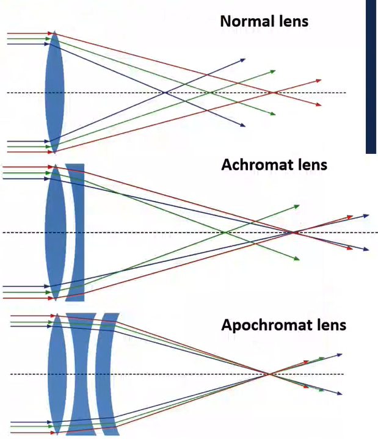

# Aberrations

Light is not focused at a single point, even under the best circumstances.
There are numerous contributing factors to the imperfections (aberrations).
Some of these issues cannot be avoided in general practice.
Lenses, especially affordable ones, will not be perfectly shaped.
White light is composed of many wavelengths.

## Field of view
### Chromatic
Occurs because the wavelength of light determine show the light refracts: shorter wavelength refract more strongly (high refractive index).

### Spherical
...are caused by the lens curvature, where the off-axis rays are focused differently than the near axis rays.

## Off-axis
[Astigmatism](astigmatism.md) is caused by light rays being focused differently when passing through the horizontal axis versus the vertical axis: caused by lens asymmetry, a circle will appear elliptical.
[Curvature of field](curvature-of-field.md) occurs when a focal plane is not planar, but concave (if the detector is planar).

## Correction Types
Achromat provide red and blue correction: must be illuminated green for black and white photography (old timey stuff).
Semi-achromat has higher [NA](numerical-aperture.md) and better resolution, including some [spherical aberrations](#spherical) correction.
Apochromat lenses have better [spherical aberrations](#spherical) correction, higher [NA](numerical-aperture.md), much more complex design.

