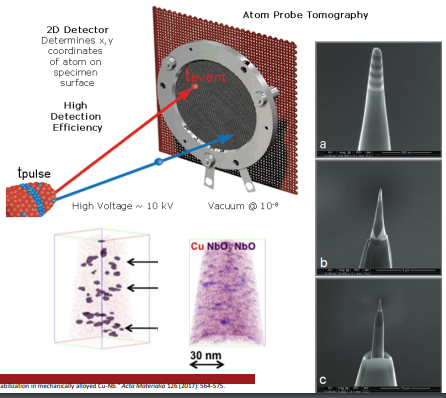

# Atom Probe Tomography

APT allows sub-nanometer spatial resolution of a material by applying a strong voltage to a sharp tip then pulsing with higher voltage or laser to evaporate atoms from it.
The energy, charge, and order of arrival to the detector provides the compositional and topographic information to reconstruct the volume.
[FIB](focused-ion-beam.md) is used to generate the fine needle for examination.

